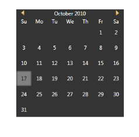
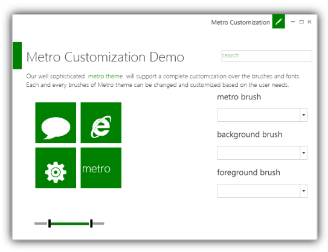

# Overview

The Skin Manager Framework provides a convenient way to give the appealing appearance to the WPF controls as well as the Syncfusion controls.

###Feature Summary

* 9 Built-In skins support for the Syncfusion controls as well as the Microsoft controls.
* Applying Custom color for the WPF controls by setting the Single property.
* Applying styles for dynamically added controls and derived controls.
* Overridden and non-overridden styles can be dynamically switched.
* Styles can be applied and overridden at the application level.

## Built-In Skins

Skins can be applied to the control by setting the VisualStyle property defined in the Skin Storage class. Set the VisualStyle property to the corresponding theme. This property can be set either in XAML or in C#.

Visual Style Property

<table>
<tr>
<th>
Property</th><th>
Description</th><th>
Type</th><th>
Data Type</th><th>
Reference links</th></tr>
<tr>
<td>
VisualStyle</td><td>
Used to set Skins for the controls. The Built-In-Skins are as follows.* Office2003* Office2007Blue* Office2007Black* Office2007Silver* ShinyRed* Blend* ShinyBlue* SyncOrange* VS2010* Office2010Blue* Office2010Black * Office2010Silver* Metro* Transparent</td><td>
 Attached Property</td><td>
String</td><td>
Setting VisualStyle in XAMLSetting VisualStyle in C#</td></tr>
</table>

##Setting VisualStyle in XAML

The following code snippet explains how to set the VisualStyle property in XAML.

1. Add the following namespace in the sample.

         xmlns:syncfusion="http://schemas.syncfusion.com/wpf"

2. Set the VisualStyle property for the control as shown below. 

		   <syncfusion:CalendarEdit syncfusion:SkinStorage.VisualStyle="Blend">
		   </syncfusion:CalendarEdit>  

   {:.prettyprint}

## Setting VisualStyle in C#

You can also set the VisualStyle property in C# using SetVisualStyle.

The following code snippet explains how to set the VisualStyle property in C#.

1. Name the control using the Name attribute.

          <syncfusion:CalendarEdit Name="calendar">
		  </syncfusion:CalendarEdit> 

2. Add the following line in code behind file.

          SkinStorage.SetVisualStyle(calendar, "Blend");

   {:.prettyprint}

The output is displayed as shown below.

Calendar with Blend Style

## Active Color Scheme

You can set the custom color for the WPF controls by using the ActiveColorScheme property defined in the Skin Manager class. This property can be set either in XAML or in C#.

ActiveColorScheme Property

<table>
<tr>
<th>
Property</th><th>
Description</th><th>
Type</th><th>
Data Type</th><th>
Reference links</th></tr>
<tr>
<td>
ActiveColorScheme  </td><td>
Sets the custom color for the controls. </td><td>
Attached Property</td><td>
SolidColorBrush</td><td>
Setting ActiveColorScheme property in XAMLSetting ActiveColorScheme property in C#</td></tr>
</table>

##Setting ActiveColorScheme property in XAML

The following code snippet explains how to set the ActiveColorScheme property in XAML.

1. Add the following namespace in the sample.

            xmlns:syncfusion=http://schemas.syncfusion.com/wpf

2. Set the ActiveColorScheme property for the control as shown below.

          <syncfusion:CalendarEdit Name="calendar" syncfusion:SkinManager.ActiveColorScheme="Red">
		  </syncfusion:CalendarEdit> 

   {:.prettyprint}
   
## Setting ActiveColorScheme property in C#

You can set the custom color for the WPF controls in C# using _SetActiveColorScheme._

The following code snippet explains how to set the ActiveColorScheme property in C#.

1. Name the control using the Name attribute.

				<syncfusion:CalendarEdit Name="calendar">
				</syncfusion:CalendarEdit> 

2. Add the following line in code behind file.

             SkinManager.SetActiveColorScheme(calendar, Brushes.Red);

   The output is displayed as shown below.

   

   {:.prettyprint}

Calendar with Custom Color

## Metro Theme Customization

Our well sophisticated metro theme will support a complete customization over the brushes and fonts. Each and every brushes of Metro Theme can be changed and customized based on the user needs.

The following are the brushes that can be customized in Metro Theme.

* MetroBrush.
* MetroBackgroundBrush.
* MetroPanelBackgroundBrush.
* MetroBorderBrush.
* MetroForegroundBrush.
* MetroFontFamily.
* MetroHoverBrush.
* MetroFocusedBorderBrush.
* MetroHighlightedForegroundBrush.

##Setting MetroBackgroundBrush property in XAML



<syncfusion:ChromelessWindow x:Class="WpfApplication18.MainWindow"       

        Title="Window1" Height="350" Width="525" xmlns:syncfusion="http://schemas.syncfusion.com/wpf" syncfusion:SkinStorage.VisualStyle="Metro" syncfusion:SkinStorage.MetroBackgroundBrush="Green">

</syncfusion:ChromelessWindow>



##Setting MetroBackgroundBrush property in C#



SkinStorage.SetMetroBrush(this, Brushes.Green);



Metro Customization Demo

## ResourceDictionary Path for Syncfusion Themes

Resouce Dictionary path for Syncfusion themes are tabulated below:

Replace “< CurrentVsiualStyle>“  with the  required  Visualstyle name 

Ex:

To merge the Office2010Blue Theming Dictionary for MicrosoftControls  into the application:



<ResourceDictionary>

<ResourceDictionary.MergedDictionaries>

<ResourceDictionary  Source="/Syncfusion.Shared.WPF;Component/SkinManager/                Office2010BlueStyle.xaml"/>

</ResourceDictionary.MergedDictionaries>

</ResourceDictionary>



Controls table

<table>
<tr>
<th>
Control Name</th><th>
Theming Resource Dictionary Path</th></tr>
<tr>
<td>
MSControls</td><td>
/Syncfusion.Shared.WPF;component/SkinManager/<CurrentVisualStyle>.xaml</td></tr>
<tr>
<td>
AutoComplete</td><td>
/Syncfusion.Tools.WPF;component/Controls/AutoComplete/Themes/<CurrentVisualStyle>.xaml</td></tr>
<tr>
<td>
Busy Indicator</td><td>
/Syncfusion.Shared.WPF;component/Controls/BusyIndicator/Themes/<CurrentVisualStyle>.xaml</td></tr>
<tr>
<td>
ButtonAdv</td><td>
/Syncfusion.Shared.WPF;component/Controls/ButtonControls/Button/Themes/<CurrentVisualStyle>.xaml</td></tr>
<tr>
<td>
DropDownButtonAdv</td><td>
/Syncfusion.Shared.WPF;component/Controls/ButtonControls/DropDownButton/Themes/<CurrentVisualStyle>.xaml</td></tr>
<tr>
<td>
SplitButtonAdv</td><td>
/Syncfusion.Shared.WPF;component/Controls/ButtonControls/SplitButton/Themes/<CurrentVisualStyle>.xaml</td></tr>
<tr>
<td>
Calendar</td><td>
/Syncfusion.Shared.WPF;component/Controls/Calendar/Themes/<CurrentVisualStyle>.xaml</td></tr>
<tr>
<td>
CardView</td><td>
/Syncfusion.Tools.WPF;component/Controls/CardView/Themes/<CurrentVisualStyle>.xaml</td></tr>
<tr>
<td>
Clock</td><td>
/Syncfusion.Shared.WPF;component/Controls/Clock/Themes/<CurrentVisualStyle>.xaml</td></tr>
<tr>
<td>
CheckListBox</td><td>
/Syncfusion.Tools.WPF;component/Controls/CheckListBox/Themes/<CurrentVisualStyle>.xaml</td></tr>
<tr>
<td>
ColorPicker</td><td>
/Syncfusion.Shared.WPF;component/Controls/ColorPicker/Themes/<CurrentVisualStyle>.xaml</td></tr>
<tr>
<td>
ColorPickerPalette</td><td>
/Syncfusion.Shared.WPF;component/Controls/ColorPickerPalette/Themes/<CurrentVisualStyle>.xaml</td></tr>
<tr>
<td>
ComboBoxAdv</td><td>
/Syncfusion.Shared.WPF;component/Controls/ComboBoxAdv/Themes/<CurrentVisualStyle>.xaml</td></tr>
<tr>
<td>
ChromelessWindow</td><td>
/Syncfusion.Shared.WPF;component/Controls/ChromeliessWindow/Themes/<CurrentVisualStyle>.xaml</td></tr>
<tr>
<td>
DateTimeEdit</td><td>
/Syncfusion.Shared.WPF;component/Controls/DateTimeEdit/Themes/<CurrentVisualStyle>.xaml</td></tr>
<tr>
<td>
DockingManager</td><td>
/Syncfusion.Tools.WPF;component/Framework/DockingManager/Themes/<CurrentVisualStyle>.xaml</td></tr>
<tr>
<td>
DocumentContainer</td><td>
/Syncfusion.Tools.WPF;component/Framework/DocumentContainer/Themes/<CurrentVisualStyle>.xaml</td></tr>
<tr>
<td>
Editors(for All TextBoxControls)</td><td>
/Syncfusion.Shared.WPF;component/Controls/Editors/Themes/<CurrentVisualStyle>.xaml</td></tr>
<tr>
<td>
FontListBox</td><td>
/Syncfusion.Tools.WPF;component/Controls/FontListBox/Themes/<CurrentVisualStyle>.xaml</td></tr>
<tr>
<td>
FontListComboBox</td><td>
/Syncfusion.Tools.WPF;component/Controls/FontComboBox/Themes/<CurrentVisualStyle>.xaml</td></tr>
<tr>
<td>
Gallery</td><td>
/Syncfusion.Tools.WPF;component/Controls/Gallery/Themes/<CurrentVisualStyle>.xaml</td></tr>
<tr>
<td>
GroupBar</td><td>
/Syncfusion.Tools.WPF;component/Controls/GroupBar/Themes/<CurrentVisualStyle>.xaml</td></tr>
<tr>
<td>
HierarchyNaviagator</td><td>
/Syncfusion.Tools.WPF;component/Controls/HierarchyNavigator/Themes/<CurrentVisualStyle>.xaml</td></tr>
<tr>
<td>
MenuAdv</td><td>
/Syncfusion.Shared.WPF;component/Controls/MenuAdv/Themes/<CurrentVisualStyle>.xaml</td></tr>
<tr>
<td>
NotifyIcon</td><td>
/Syncfusion.Tools.WPF;component/Controls/NotifyIcon/Themes/<CurrentVisualStyle>.xaml</td></tr>
<tr>
<td>
PinnableListBox</td><td>
/Syncfusion.Shared.WPF;component/Controls/PinnableListBox/Themes/<CurrentVisualStyle>.xaml</td></tr>
<tr>
<td>
RangeSlider</td><td>
/Syncfusion.Tools.WPF;component/Controls/RangeSlider/Themes/<CurrentVisualStyle>.xaml</td></tr>
<tr>
<td>
Ribbon</td><td>
/Syncfusion.Tools.WPF;component/Framework/Ribbon/Themes/<CurrentVisualStyle>.xaml</td></tr>
<tr>
<td>
TabControlExt</td><td>
/Syncfusion.Tools.WPF;component/Controls/TabControlExt/Themes/<CurrentVisualStyle>.xaml</td></tr>
<tr>
<td>
TabNavigationControl</td><td>
/Syncfusion.Tools.WPF;component/Controls/TabNavigationControl/Themes/<CurrentVisualStyle>.xaml</td></tr>
<tr>
<td>
TabSplitter</td><td>
/Syncfusion.Tools.WPF;component/Controls/TabSplitter/Themes/<CurrentVisualStyle>.xaml</td></tr>
<tr>
<td>
TaskBar</td><td>
/Syncfusion.Tools.WPF;component/Controls/TaskBar/Themes/<CurrentVisualStyle>.xaml</td></tr>
<tr>
<td>
TileView</td><td>
/Syncfusion.Shared.WPF;component/Controls/TileView/Themes/<CurrentVisualStyle>.xaml</td></tr>
<tr>
<td>
TimeSpanEdit</td><td>
/Syncfusion.Shared.WPF;component/Controls/TimeSpanEdit/Themes/<CurrentVisualStyle>.xaml</td></tr>
<tr>
<td>
ToolBarAdv</td><td>
/Syncfusion.Shared.WPF;component/Controls/ToolBarAdv/Themes/<CurrentVisualStyle>.xaml</td></tr>
<tr>
<td>
TreeViewAdv</td><td>
/Syncfusion.Tools.WPF;component/Controls/TreeViewAdv/Themes/<CurrentVisualStyle>.xaml</td></tr>
<tr>
<td>
UpDown</td><td>
/Syncfusion.Shared.WPF;component/Controls/Updown/Themes/<CurrentVisualStyle>.xaml</td></tr>
<tr>
<td>
WizardControl</td><td>
/Syncfusion.Tools.WPF;component/Controls/WizardControl/Themes/<CurrentVisualStyle>.xaml</td></tr>
</table>

