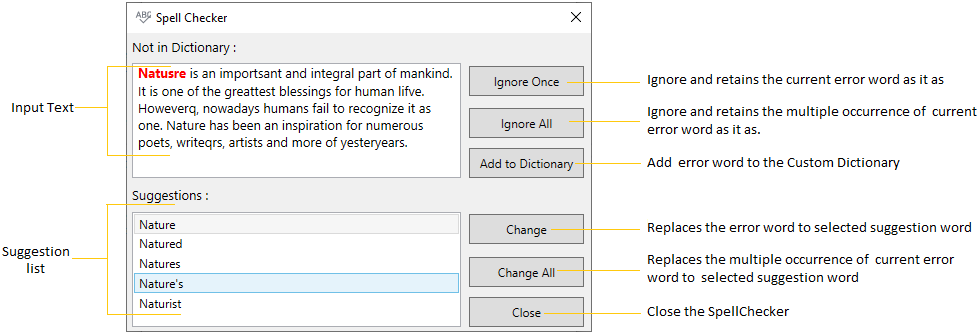
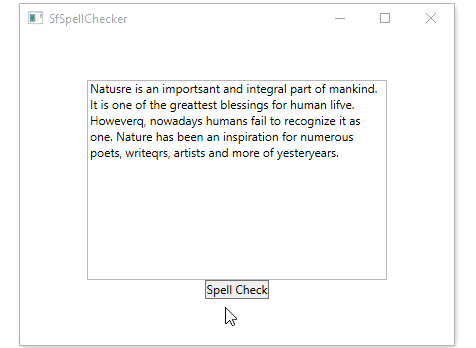
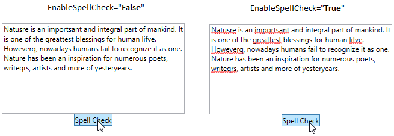

---
layout: post
title: Getting Started with wpf SfSpellChecker control | Syncfusion
description: This section describes about how to create a WPF SfSpellChecker and how to spell check the text using it.
platform: WPF
control: SfSpellChecker
documentation: ug
--- 

# Getting Started with WPF SfSpellChecker

This section explains how to create a WPF [SfSpellChecker](https://help.syncfusion.com/cr/wpf/Syncfusion.Windows.Controls.SfSpellChecker.html) and spell check the text.

## Control Structure

## Assembly deployment

Refer to the [control dependencies](https://help.syncfusion.com/wpf/control-dependencies#sfspellchecker) section to get the list of assemblies or NuGet package that needs to be added as reference to use the control in any application.

You can find more details about installing the NuGet package in a WPF application in the following link: 

[How to install nuget packages](https://help.syncfusion.com/wpf/visual-studio-integration/nuget-packages)

## Adding WPF SfSpellChecker to an application

Spell checking operation can be done on text editor controls through `SfSpellChecker` in WPF application by implementing `IEditorProperties` interface. 

You can add the `SfSpellChecker` to an application by the following steps,

1. Create a WPF project in Visual Studio and include following assembly.

    * Syncfusion.SfSpellChecker.WPF

2. Add `TextBox` control and set `SfSpellChecker.SpellChecker` attached property to perform spell check.




<Grid>
    <StackPanel>
        <TextBox 
            Text="Natusre is an importsant and integral part of mankind. It is one of the greattest blessings for human lifve. Howeverq, nowadays humans fail to recognize it as one. Nature has been an inspiration for numerous poets, writeqrs, artists and more of yesteryears."
            Name="textbox"
            TextWrapping="Wrap">

            <!--Adding Spellchecker to the TextBox-->
            <syncfusion:SfSpellChecker.SpellChecker>
                <syncfusion:SfSpellChecker 
                    x:Name="spellChecker"
                    EnableSpellCheck="True"/>
            </syncfusion:SfSpellChecker.SpellChecker>
        </TextBox>
        <Button 
            Content="Spell Check"
            Click="SpellCheck_ButtonClick"                
            HorizontalAlignment="Center"></Button>
    </StackPanel>
</Grid>




//Creating a spell checker instance
SfSpellChecker spellChecker = new SfSpellChecker();

//Enabling the spell check
spellChecker.EnableSpellCheck = true;

//Assigning a spellchecker to the TextBox
SfSpellChecker.SetSpellChecker(textbox, spellChecker);




3. If you want to open the `SfSpellChecker` while clicking on the `Spell Check button`, call the [PerformSpellCheckUsingDialog](https://help.syncfusion.com/cr/wpf/Syncfusion.Windows.Controls.SfSpellChecker.html#Syncfusion_Windows_Controls_SfSpellChecker_PerformSpellCheckUsingDialog_Syncfusion_Windows_Controls_IEditorProperties_) method inside the `SpellCheck ButtonClick` method.




//Call SpellCheck method to open SpellCheck on button click
private void SpellCheck_ButtonClick(object sender, RoutedEventArgs e) {
    spellChecker.PerformSpellCheckUsingDialog(Editor);
}




N> View [Sample](https://github.com/SyncfusionExamples/WPF-SpellChecker-examples/tree/master/Samples/SfSpellChecker) in GitHub

## Fix spelling mistakes using spell check dialog

1. You can open a `SfSpellChecker` by clicking `Spell Check` button and then `SpellChecker` opened as pop-up with `TextSpellEditor`. 

2. The error words are highlight with `Red` foreground. 

3. You can replace error words with correct words by double click the suitable word listed in the suggestion listbox or select the suggestion word from the listbox and then press the `Change` button.

N> View [Sample](https://github.com/SyncfusionExamples/WPF-SpellChecker-examples/tree/master/Samples/SfSpellChecker) in GitHub

## Fix spelling mistakes using context menu

You can simply correct the spell error words by choosing the correct option from listed suggestions from the ContextMenu. You can get the suggestion words by right click on the error word. The Error words are differentiated by red underlining. You can disable the context menu suggestion by using the `EnableContextMenu` property value as `false`. The default value of `EnableContextMenu` property is `true`.




<Grid>
    <StackPanel>
        <TextBox 
            Text="Natusre is an importsant and integral part of mankind. It is one of the greattest blessings for human lifve. Howeverq, nowadays humans fail to recognize it as one. Nature has been an inspiration for numerous poets, writeqrs, artists and more of yesteryears."
            Name="textbox"
            TextWrapping="Wrap"                
            VerticalContentAlignment="Top">

            <!--Adding Spellchecker to the TextBox-->
            <syncfusion:SfSpellChecker.SpellChecker>
                <syncfusion:SfSpellChecker 
                    x:Name="spellChecker"

                    <!--Enable Contextmenu to spellcheck-->
                    EnableContextMenu="True"
                    EnableSpellCheck="True"/>
            </syncfusion:SfSpellChecker.SpellChecker>
        </TextBox>
        <Button 
            Content="Spell Check"
            Click="SpellCheck_ButtonClick"                
            HorizontalAlignment="Center"></Button>
    </StackPanel>
</Grid>




//Enable Contextmenu to spellcheck
spellChecker.EnableContextMenu = true;
spellChecker.EnableSpellCheck = true;







//Call SpellCheck method to open SpellCheck on button click
private void SpellCheck_ButtonClick(object sender, RoutedEventArgs e) {
    spellChecker.PerformSpellCheckUsingDialog(Editor);
}




N> View [Sample](https://github.com/SyncfusionExamples/WPF-SpellChecker-examples/tree/master/Samples/SfSpellChecker) in GitHub

## Disable spell checking

If you want to disable the spell check operation, use the `EnableSpellCheck` property value as `false`.If the `EnableSpellCheck` property value is `false`, you will not be able to use both the context menu and SpellCheck dialogue to perform spell checking operations. The default value of `EnableSpellCheck` property is `true`.




<Grid>
    <StackPanel>
        <TextBox 
            Text="Natusre is an importsant and integral part of mankind. It is one of the greattest blessings for human lifve. Howeverq, nowadays humans fail to recognize it as one. Nature has been an inspiration for numerous poets, writeqrs, artists and more of yesteryears."
            Name="textbox"
            TextWrapping="Wrap">

            <!--Adding Spellchecker to the TextBox-->
            <syncfusion:SfSpellChecker.SpellChecker>
                <syncfusion:SfSpellChecker 
                    x:Name="spellChecker"

                    <!--Restrict the  spell check operation-->
                    EnableSpellCheck="False"/>
            </syncfusion:SfSpellChecker.SpellChecker>
        </TextBox>
        <Button 
            Content="Spell Check"
            Click="SpellCheck_ButtonClick"                
            HorizontalAlignment="Center"></Button>
    </StackPanel>
</Grid>




//Restrict the  spell check operation
spellChecker.EnableSpellCheck = false;







//Call SpellCheck method to open SpellCheck on button click
private void SpellCheck_ButtonClick(object sender, RoutedEventArgs e) {
    spellChecker.PerformSpellCheckUsingDialog(Editor);
}




N> View [Sample](https://github.com/SyncfusionExamples/WPF-SpellChecker-examples/tree/master/Samples/SfSpellChecker) in GitHub

## Get suggestions for misspelled word

You can get the suggestion list by passing the error word in the below methods.

* [GetSuggestions](https://help.syncfusion.com/cr/wpf/Syncfusion.Windows.Controls.SfSpellChecker.html#Syncfusion_Windows_Controls_SfSpellChecker_GetSuggestions_System_String_) - To get a list of suggestion words for an error word
* [GetPhoneticWords](https://help.syncfusion.com/cr/wpf/Syncfusion.Windows.Controls.SfSpellChecker.html#Syncfusion_Windows_Controls_SfSpellChecker_GetPhoneticWords_System_String_) - To get a list of phonetic words for an error word
* [GetAnagrams](https://help.syncfusion.com/cr/wpf/Syncfusion.Windows.Controls.SfSpellChecker.html#Syncfusion_Windows_Controls_SfSpellChecker_GetAnagrams_System_String_) - To get a list of anagram words for an error word




<Grid>
    <StackPanel>
        <TextBox 
            Text="Natusre is an importsant and integral part of mankind. It is one of the greattest blessings for human lifve. Howeverq, nowadays humans fail to recognize it as one. Nature has been an inspiration for numerous poets, writeqrs, artists and more of yesteryears."
            Name="textbox"
            TextWrapping="Wrap">

            <!--Adding Spellchecker to the TextBox-->
            <syncfusion:SfSpellChecker.SpellChecker>
                <syncfusion:SfSpellChecker 
                    x:Name="spellChecker"

                    <!--Enable Contextmenu to spellcheck-->
                    EnableContextMenu="True"
                    EnableSpellCheck="True"/>
            </syncfusion:SfSpellChecker.SpellChecker>
        </TextBox>
        <Button 
            Content="Spell Check"
            Click="SpellCheck_ButtonClick"                
            HorizontalAlignment="Center"></Button>
    </StackPanel>
</Grid>




//Enable Contextmenu to spellcheck
spellChecker.EnableContextMenu = true;







//Call SpellCheck method to open SpellCheck on button click
private void SpellCheck_ButtonClick(object sender, RoutedEventArgs e) {
    spellChecker.PerformSpellCheckUsingDialog(Editor);
}




## Ignore SpellCheck for particular types of text

If you want to ignore the error words such a format like email id's and link addresses, HTML tags, combination of words and numbers, combination of upper and lower case words, use the respective property value as `true` from the following table,

Property | Description | Example
--- | --- | --- 
IgnoreEmailAddress  | Specifies whether or not to ignore email address during Spell Check. The Default value is False. | Ex: john@abc.com
IgnoreHtmlTags | Specifies whether or not to ignore HTML tags during Spell Check. The Default value is False. | Ex: < html></ html>
IgnoreUrl | Specifies whether or not to ignore Internet address during Spell Check. The Default value is False. | Ex: https://help.syncfusion.com
IgnoreMixedCaseWords | Specifies whether or not to ignore mixed case words during Spell Check. The Default value is False. | Ex: AbCDeFH
IgnoreUpperCaseWords | Specifies whether or not to ignore uppercase words during Spell Check. The Default value is False. | Ex: ABCDE >
IgnoreAlphaNumericWords | Specifies whether or not to Spell Check numbers or words with numbers during Spell Check. The Default value is False.  | Ex: A*&%#9ACe&981




<Grid>
    <StackPanel>
        <TextBox 
            Text="Natusre is an importsant and integral part of mankind. It is one of the greattest blessings for human lifve. Howeverq, nowadays humans fail to recognize it as one. Nature has been an inspiration for numerous poets, writeqrs, artists and more of yesteryears."
            Name="textbox"
            TextWrapping="Wrap">

            <!--Adding Spellchecker to the TextBox-->
            <syncfusion:SfSpellChecker.SpellChecker>
                <syncfusion:SfSpellChecker 
                    x:Name="spellChecker"
                    EnableContextMenu="True"
                    EnableSpellCheck="True"
                    IgnoreUrl="True"
                    IgnoreUpperCaseWords="True"
                    IgnoreAlphaNumericWords="True"
                    IgnoreEmailAddress="True"
                    IgnoreMixedCaseWords="True"
                    IgnoreHtmlTags="True"/>
            </syncfusion:SfSpellChecker.SpellChecker>
        </TextBox>
        <Button 
            Content="Spell Check"
            Click="SpellCheck_ButtonClick"                
            HorizontalAlignment="Center"></Button>
    </StackPanel>
</Grid>




spellChecker.IgnoreUrl = true;
spellChecker.IgnoreUpperCaseWords = true;
spellChecker.IgnoreAlphaNumericWords = true;
spellChecker.IgnoreEmailAddress = true;
spellChecker.IgnoreMixedCaseWords = true;
spellChecker.IgnoreHtmlTags = true;  







//Call SpellCheck method to open SpellCheck on button click
private void SpellCheck_ButtonClick(object sender, RoutedEventArgs e) {
    spellChecker.PerformSpellCheckUsingDialog(Editor);
}




## SpellCheck for any language(culture) 

You can spell check any language(culture) by adding the respective culture to the [SfSpellChecker.Culture](https://help.syncfusion.com/cr/wpf/Syncfusion.Windows.Controls.SfSpellChecker.html#Syncfusion_Windows_Controls_SfSpellChecker_Culture) property and add the dictionaries which contains the basic word file and grammar file to the [SfSpellChecker.Dictionaries](https://help.syncfusion.com/cr/wpf/Syncfusion.Windows.Controls.SfSpellChecker.html#Syncfusion_Windows_Controls_SfSpellChecker_Dictionaries) collection.

The following dictionary types are used for spell-checking,

 * Hunspell
 * Ispell
 * OpenOffice

 N> Refer the [Load your own dictionaries for any language](https://help.syncfusion.com/wpf/spellchecker/custom-dictionary-support#load-your-own-dictionaries-for-any-language) page to know more about how to add and use the Dictionary for any culture to an application.

## Add custom words to dictionary

If you want to add words that is not available in existing dictionary, you can add it using `CustomDictionary`. This dictionary does not has a grammar file, it accepts only dictionary file that contains a list of words. Users can also add words to this custom dictionary by clicking `Add to Dictionary` button available in dialog or context menu.

N> Refer the [Adding Custom Dictionary](https://help.syncfusion.com/wpf/spellchecker/custom-dictionary-support#adding-custom-dictionary) page to know more about how to add and use the custom dictionary to an application.

## Event to notify when spell check is completed

By default, when the spell check is completed, it will be notified by using the message box that showing the `Spell check is completed` message. If you want to restrict that message box, you can handle the [SpellCheckCompleted](https://help.syncfusion.com/cr/wpf/Syncfusion.Windows.Controls.SfSpellChecker.html) event and set the [SpellCheckCompletedEventArgs.ShowMessageBox](https://help.syncfusion.com/cr/wpf/Syncfusion.Windows.Controls.SpellCheckCompletedEventArgs.html#Syncfusion_Windows_Controls_SpellCheckCompletedEventArgs_ShowMessageBox) to `false`.




<Grid>
    <StackPanel>
        <TextBox 
            Text="Natusre is an importsant and integral part of mankind. It is one of the greattest blessings for human lifve. Howeverq, nowadays humans fail to recognize it as one. Nature has been an inspiration for numerous poets, writeqrs, artists and more of yesteryears."
            Name="textbox"
            TextWrapping="Wrap">

            <!--Adding Spellchecker to the TextBox-->
            <syncfusion:SfSpellChecker.SpellChecker>
                <syncfusion:SfSpellChecker 
                    x:Name="spellChecker"
                    SpellCheckCompleted="SpellChecker_SpellCheckCompleted"
                    EnableContextMenu="True"
                    EnableSpellCheck="True"/>
            </syncfusion:SfSpellChecker.SpellChecker>
        </TextBox>
        <Button 
            Content="Spell Check"
            Click="SpellCheck_ButtonClick"                
            HorizontalAlignment="Center"></Button>
    </StackPanel>
</Grid>




spellChecker.SpellCheckCompleted += SpellChecker_SpellCheckCompleted;







//Call SpellCheck method to open SpellCheck on button click
private void SpellCheck_ButtonClick(object sender, RoutedEventArgs e) {
    spellChecker.PerformSpellCheckUsingDialog(Editor);
}

private void SpellChecker_SpellCheckCompleted(object sender, EventArgs e) {
        //Restrict the message box showing
        (e as SpellCheckCompletedEventArgs).ShowMessageBox = false;
    }




N> View [Sample](https://github.com/SyncfusionExamples/WPF-SpellChecker-examples/tree/master/Samples/SfSpellChecker) in GitHub

