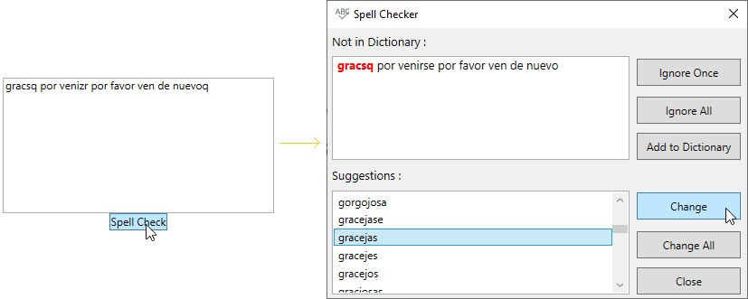
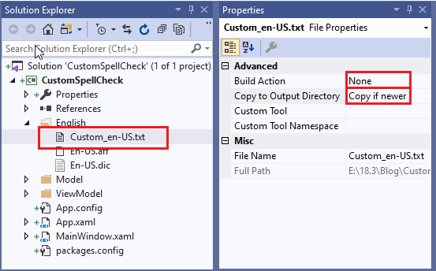
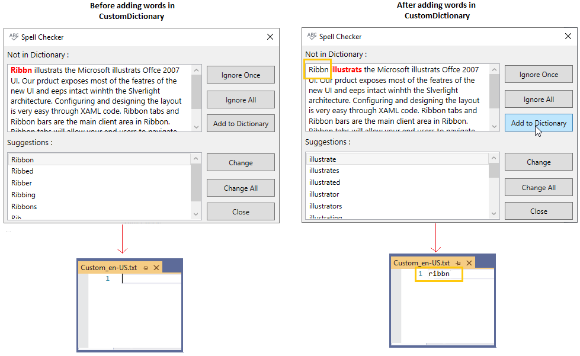

# Dictionaries for SpellCheck

You can use a default and custom dictionaries to spell check the document based on your need. You can also spell check for any culture and languages using various dictionaries.

## Default SpellCheck Dictionary

[SfSpellChecker](https://help.syncfusion.com/cr/wpf/Syncfusion.SfSpellChecker.WPF~Syncfusion.Windows.Controls.SfSpellChecker.html) provides built-in dictionary for `English` language and it provides  suitable suggestion of the error words.

## Load your own dictionaries for any language

You can add your own dictionary to [SfSpellChecker.Dictionaries](https://help.syncfusion.com/cr/cref_files/wpf/Syncfusion.SfSpellChecker.WPF~Syncfusion.Windows.Controls.SfSpellChecker~Dictionaries.html) collection. `SfSpellChecker` support 3 standard dictionary file format:

 * 1.Hunspell
 * 2.Ispell
 * 3.OpenOffice
 
## SpellCheck using Hunspell dictionary

You can check spelling mistakes using `Hunspell` dictionary format. This format contains files as follows,

* Affix file with grammar rules- `*.aff`, 
* Basic Words file - `*.dic` file.

### Adding Hunspell Dictionary

1. Add your `HunspellDictionary`'s required culture `*.aff` and `*.dic` files and add them as `Resource` into the application.

2. Create a `HunspellDictionary` instance and add the basic word & grammar file path to the `HunspellDictionary.DictionaryUri` & `HunspellDictionary.GrammarUri` properties and add the culture to the `HunspellDictionary.Culture` property.

3. Add the  `HunspellDictionary` into the `SfSpellChecker.Dictionaries` collection

4. Setting the required culture to the `SfSpellChecker.Culture` property.

N> The following code snippets shows how to add Hunspell dictionary to the `SpellChecker`. Please refer [Adding SfSpellChecker to an application](https://help.syncfusion.com/windowsforms/spell-checker/getting-started#adding-wpf-sfspellchecker-to-an-application) to know how to configure SfSpellChecker.




//Creating a culture instance
CultureInfo culture = new CultureInfo("fr-FR");

SfSpellChecker SpellChecker = new SfSpellChecker();

// Adding Hunspell dictonaries in Dictionaries collection
SpellChecker.Dictionaries = new DictionaryCollection();

//Add French culture Hunspell dictionary
SpellChecker.Dictionaries.Add(
    new HunspellDictionary()
    {
        Culture = culture,
        GrammarUri = new Uri("/HunSpellCheck;component//French/fr-FR.aff", UriKind.Relative),
        DictionaryUri = new Uri("/HunSpellCheck;component//French/fr-FR.dic", UriKind.Relative)
    }
);

//Setting a French culture for SpellChecker
SpellChecker.Culture = culture;




N> You can add multiple `HunspellDictionary` with various culture files into the `SfSpellChecker.Dictionaries` collection. Based on the `SfSpellChecker.Culture` respective `HunspellDictionary` is used for spell check.

## SpellCheck using Ispell dictionary

You can check spelling mistakes using `Ispell` dictionary format. This format contains files as follows,

`Ispell` dictionary contains two files as follows,

* Affix file with grammar rules- `*.aff`, 
* Basic Words file - `*.xlg` or `*.dic` file.

### Adding Ispell Dictionary

1. Add your `IspellDictionary`'s required culture `*.aff` and `*.dic` files and add them as `Resource` into the application.

2. Create a `IspellDictionary` instance and add the basic word & grammar file path to the `IspellDictionary.DictionaryUri` & `IspellDictionary.GrammarUri` properties and add the culture to the `IspellDictionary.Culture` property.

3. Add the  `IspellDictionary` into the `SfSpellChecker.Dictionaries` collection

4. Setting the required culture to the `SfSpellChecker.Culture` property.

N> The following code snippets only explain the insertion of the Ispell dictionary to the `SpellChecker`. You can get code snippets to add a `SpellChecker`, from [Adding SfSpellChecker to an application](https://help.syncfusion.com/windowsforms/spell-checker/getting-started#adding-wpf-sfspellchecker-to-an-application) topic.




//Creating a culture instance
CultureInfo culture = new CultureInfo("es-ES");

SfSpellChecker SpellChecker = new SfSpellChecker();

// Adding Ispell dictonaries in Dictionaries collection
SpellChecker.Dictionaries = new DictionaryCollection();

//Add Spanish culture Ispell dictionary
SpellChecker.Dictionaries.Add(
    new IspellDictionary()
    {
        Culture = culture,
        GrammarUri = new Uri("/IspellCheck;component//Spanish/es-ES.aff", UriKind.Relative),
        DictionaryUri = new Uri("/IspellCheck;component//Spanish/es-ES.dic", UriKind.Relative)
    }
);

//Setting a Spanish culture for SpellChecker
SpellChecker.Culture = culture;




N> You can add multiple `IspellDictionary` with various culture files into the `SfSpellChecker.Dictionaries` collection. Based on the `SfSpellChecker.Culture` respective `IspellDictionary` is used for spell check.

## SpellCheck using OpenOffice dictionary

You can check spelling mistakes using `OpenOffice` dictionary format. This format contains files as follows,

`OpenOffice` dictionary contains two files as follows,

* Affix file with grammar rules- `*.aff`, 
* Basic Words file - `*.dic` file.

N> `Ispell` have different rules in the Affix files, so you can't use the `OpenOffice` & `Hunspell` Affix files to the `Ispell` dictionary.

### Adding OpenOffice Dictionary

1. Add your `OpenOfficeDictionary`'s required culture `*.aff` and `*.dic` files and add them as `Resource` into the application.

2. Create a `OpenOfficeDictionary` instance and add the basic word & grammar file path to the `OpenOfficeDictionary.DictionaryUri` & `OpenOfficeDictionary.GrammarUri` properties and add the culture to the `OpenOfficeDictionary.Culture` property.

3. Add the  `OpenOfficeDictionary` into the `SfSpellChecker.Dictionaries` collection

4. Setting the required culture to the `SfSpellChecker.Culture` property.

N> The following code snippets only explain the insertion of the OpenOffice dictionary to the `SpellChecker`. You can get code snippets to add a `SpellChecker`, from [Adding SfSpellChecker to an application](https://help.syncfusion.com/windowsforms/spell-checker/getting-started#adding-wpf-sfspellchecker-to-an-application) topic.




//Creating a Spanish culture instance
CultureInfo culture = new CultureInfo("es-ES");

SfSpellChecker SpellChecker = new SfSpellChecker();

// Adding OpenOffice dictonaries in Dictionaries collection
SpellChecker.Dictionaries = new DictionaryCollection();

//Add Spanish culture OpenOffice dictionary
SpellChecker.Dictionaries.Add(
    new OpenOfficeDictionary()
    {
        Culture = culture,
        GrammarUri = new Uri("/OpenOfficeSpellCheck;component//Spanish/es-ES.aff", UriKind.Relative),
        DictionaryUri = new Uri("/OpenOfficeSpellCheck;component//Spanish/es-ES.dic", UriKind.Relative)
    }
);

//Setting a French culture for SpellChecker
SpellChecker.Culture = culture;




N> You can add multiple `OpenOfficeDictionary` with various culture files into the `SfSpellChecker.Dictionaries` collection. Based on the `SfSpellChecker.Culture` respective `OpenOfficeDictionary` is used for spell check.

## Add custom words to dictionary

If you want to skip or make the error or custom word as correct word, add that word into the custom dictionary text file. You can add that word on before perform spell check by directly adding that words into the custom dictionary text file and also can add the error word into the custom dictionary text file at runtime by clicking the `Add to Dictionary` button. Then, while performing next spell check, Custom dictionary text file contained words are considered as a correct words.  

### Adding Custom Dictionary

1. Create a custom dictionary text file as `Resource` into the application

2. Create a `CustomDictionary` instance and add the custom word file path to the `CustomDictionary.DictionaryUri` property and add the culture to the `CustomDictionary.Culture` property.

3. Add the  `CustomDictionary` into the `SfSpellChecker.Dictionaries` collection

4. Setting the required culture to the `SfSpellChecker.Culture` property.

N> The following code snippets only explain the insertion of the custom dictionary to the `SpellChecker`. You can get code snippets to add a `SpellChecker`, from [Adding SfSpellChecker to an application](https://help.syncfusion.com/windowsforms/spell-checker/getting-started#adding-wpf-sfspellchecker-to-an-application) topic.




//Creating a culture instance
CultureInfo culture = new CultureInfo("en-US");

SfSpellChecker SpellChecker = new SfSpellChecker();

// Get the current PROJECT directory
string projectDirectory = Directory.GetParent(Environment.CurrentDirectory).Parent.FullName;

//Add US culture Custom dictionary
SpellChecker.Dictionaries.Add(
    new CustomDictionary()
    {
        Culture = culture,
        DictionaryUri = new Uri(projectDirectory + @"\English\Custom_en-US.txt", UriKind.Absolute)
    }
);

//Setting a US culture for SpellChecker
SpellChecker.Culture = culture;




N> You can add multiple `CustomDictionary` with various culture word files into the `SfSpellChecker.Dictionaries` collection. Based on the `SfSpellChecker.Culture` respective `CustomDictionary` is used for spell check.

N> View [Sample](https://github.com/SyncfusionExamples/WPF-SpellChecker-examples/tree/master/Samples/CustomSpellCheck) in GitHub

## Switch language(Culture) at runtime

You can add `Hunspell`, `Ispell`, or `OpenOffice` dictionaries one or more times with various culture into the `SfSpellChecker.Dictionaries` collection. You can change the spell check culture at runtime by changing the `SfSpellChecker.Culture` property. Based on the current `SfSpellChecker.Culture` respective dictionary is used to spell check.




//Creating a culture instance
CultureInfo culture = new CultureInfo("fr-FR");

SfSpellChecker SpellChecker = new SfSpellChecker();

// Adding Hunspell dictonaries in Dictionaries collection
SpellChecker.Dictionaries = new DictionaryCollection();

//Add French culture Hunspell dictionary
SpellChecker.Dictionaries.Add(
    new HunspellDictionary()
    {
        Culture = culture,
        GrammarUri = new Uri("/HunSpellCheck;component//French/fr-FR.aff", UriKind.Relative),
        DictionaryUri = new Uri("/HunSpellCheck;component//French/fr-FR.dic", UriKind.Relative)
    }
);

//Add Spanish culture Hunspell dictionary
SpellChecker.Dictionaries.Add(
    new HunspellDictionary()
    {
        Culture = new CultureInfo("es-ES"),
        GrammarUri = new Uri("/HunSpellCheck;component//Spanish/es-ES.aff", UriKind.Relative),
        DictionaryUri = new Uri("/HunSpellCheck;component//Spanish/es-ES.dic", UriKind.Relative)
    }
);

//Add US culture Hunspell dictionary
SpellChecker.Dictionaries.Add(
    new HunspellDictionary()
    {
        Culture = new CultureInfo("en-US"),
        GrammarUri = new Uri("/HunSpellCheck;component//Spanish/en-US.aff", UriKind.Relative),
        DictionaryUri = new Uri("/HunSpellCheck;component//Spanish/en-US.dic", UriKind.Relative)
    }
);

//Setting a French culture for SpellChecker
SpellChecker.Culture = culture;




Here, `SpellChecker.Culture` is `fr-FR` culture. So, `fr-FR` cultured `Hunspell` dictionary is used as speck check dictionary.

