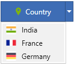

# Data Binding in WPF Split Button (SplitButtonAdv)

Data binding provides an easier way to assign, visualize and interact with the collection of predefined data. The data binding can be achieved by populating the [DropDownMenuGroup.ItemsSource](https://docs.microsoft.com/en-us/dotnet/api/system.windows.controls.itemscontrol.itemssource?redirectedfrom=MSDN&view=netframework-4.8#System_Windows_Controls_ItemsControl_ItemsSource) property.

## Creating model

Create a class that holds the model properties of the menu items. For example, `Country` class has been created with properties `Name` and `Flag`.




    class Country
    {
        private string name;

        public string Name
        {
            get
            {       
                return name;
            }
            set
            {
                name = value;
            }
        }
        private string flag;
        public string Flag
        {
            get
            {
                return flag;
            }
            set
            {
                flag = value;
            }
        }
    }




## Creating view model

Create a class that populates the list of model object representing dropdown menu items. For example, `CountryViewModel` class has been created with property [DropDownItems](https://help.syncfusion.com/cr/cref_files/file-formats/Syncfusion.DocIO.Base~Syncfusion.DocIO.DLS.WDropDownFormField~DropDownItems.html) with return type `List<Country>`.




    class CountryViewModel
    {
        private List<Country> dropDownItems;

        public List<Country> DropDownItems
        {
            get
            {
                return dropDownItems;
            }
            set
            {
                dropDownItems = value;
            }
        }

        public CountryViewModel()
        {
            DropDownItems = new List<Country>();  
            DropDownItems.Add(new Country() { Name = "India",
            Flag = "Images\india.png"});
            DropDownItems.Add(new Country() { Name = "France",
            Flag = "Images\france.png"});
            DropDownItems.Add(new Country() { Name = "Germany", 
            Flag = "Images\germany.png"});
        }
    }




## Bind data from view model

Bind the list of menu items to [DropDownMenuGroup.ItemsSource](https://docs.microsoft.com/en-us/dotnet/api/system.windows.controls.itemscontrol.itemssource?redirectedfrom=MSDN&view=netframework-4.8#System_Windows_Controls_ItemsControl_ItemsSource) property of [DropDownMenuGroup](https://help.syncfusion.com/cr/cref_files/wpf/Syncfusion.Shared.Wpf~Syncfusion.Windows.Tools.Controls.DropDownMenuGroup.html) and also set the `DataContext` with ViewModel instance. For example, `CountryViewModel` instance has been set as DataContext.
 



     <syncfusion:SplitButtonAdv Label="Country" SmallIcon="Images/images.png" >
        <syncfusion:DropDownMenuGroup ItemsSource="{Binding DropDownItems}">
            <syncfusion:DropDownMenuGroup.ItemTemplate>
                <DataTemplate>
                    <syncfusion:DropDownMenuItem Header="{Binding Name}">
                        <syncfusion:DropDownMenuItem.Icon>
                            <Image Source="{Binding Flag}"/>
                        </syncfusion:DropDownMenuItem.Icon>
                    </syncfusion:DropDownMenuItem>
                 </DataTemplate>
            </syncfusion:DropDownMenuGroup.ItemTemplate>
        </syncfusion:DropDownMenuGroup>
    </syncfusion:SplitButtonAdv> 




    public partial class MainWindow:Window
    {
        public MainWindow()
        {
            InitializeComponent();
            this.DataContext = new CountryViewModel();
        }
    }




