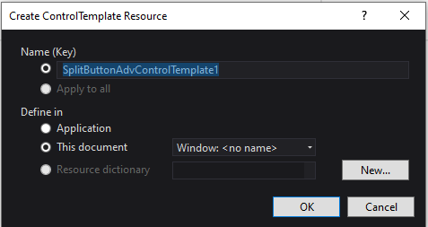
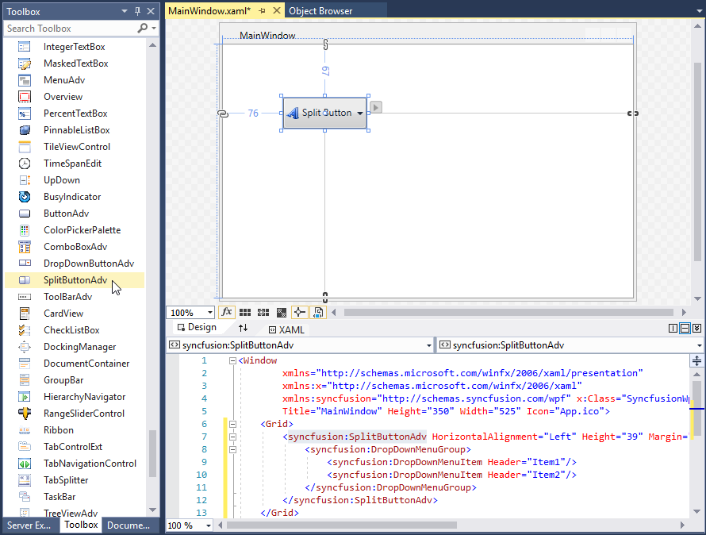
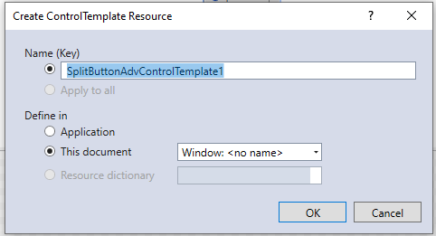

# Styles and templates in WPF Split Button (SplitButtonAdv)

WPF styles and templates is a suite of features that allow developers and designers to create visual compelling effects and consistent appearance of the products. 

This document provides information to change the visual appearance of the Split Button control. In addition, one can edit the structure of the Split Button control by using Blend and Visual Studio that helps to customize their appearances.

## Edit appearance in Expression Blend

* Open the application in Expression Blend.
* Select the Split Button control from the window.

    

* Right click on the Split Button control and choose the menu option **Edit Template**. It will comprise of following two options.
    * **Edit a Copy...** – Edit a copy of the default style. When selecting this option, a new dialog opens as follows.

    

    

   The **Create ControlTemplate Resource** dialog allows to enter the name or change the control template name, as well as choose the location for the template. When **OK** is pressed, the Split Button control template is generated by the Expression Blend in the **Resource** section. The generated XAML can be edited in XAML view or in Visual Studio.

    * **Create Empty...** - Creates an empty Split Button template. Selecting this option will open the **Create ControlTemplate Resource** dialog which allows the user to enter the name or change the control template name, as well as choose the location for the template.

All resources will be displayed on the XAML file of the application after performing above steps. These resources can be edited to create a new Style.

Split Button control edited in Expression Blend
{:.caption}

## Edit appearance in Visual Studio

* Open the application in Visual Studio.
* Open design view and select the Split Button control. Now right Click on the Split Button control and you can see some menu options showing up.

    

* On choosing menu option **Edit Template**, it further comprise of following two options.
    * **Edit a Copy...** – Edit a copy of the default style. When selecting this option, a new dialog opens as follows.

    

    

    The **Create ControlTemplate Resource** dialog allows to enter the name or change the control template name, as well as choose the location for the template. When **OK** is pressed, the Split Button control template is generated in the **Resource** section. The generated XAML can be edited in XAML view.

   * **Create Empty...** - Creates an empty Split Button style. Selecting this option will open the **Create ControlTemplate Resource** dialog which allows the user to enter the name or change the control template name, as well as choose the location for the template.

All resources will be displayed on the XAML file of the application after performing above steps. These resources can be edited to create a new Style.

Split Button control edited in Visual Studio
{:.caption}

