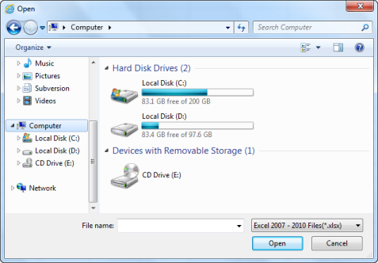
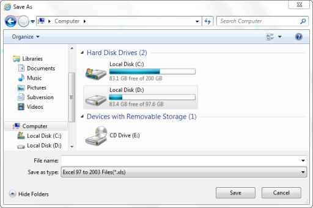

# Open and Save Excel Document

You can open and save the Excel document that is compatible with following Excel versions:

* Excel 97 (.xls)
* Excel 2000 (.xls)
* Excel 2002 (.xls)
* Excel 2003 (.xls)
* Excel 2007 (.xlsx)
* Excel 2010 (.xlsx)

## Open Excel Document

You can open the Excel document using the one of the following override methods:

The following code illustrates how to open Spreadsheet control with file stream:



spreadsheet.ImportFromExcel(stream);




 spreadsheet.ImportFromExcel(stream)


The following code illustrates how to open Spreadsheet control with file stream and ExcelOpenType:



spreadsheet.ImportFromExcel(stream, Syncfusion.XlsIO.ExcelOpenType.Automatic);



spreadsheet.ImportFromExcel(stream, Syncfusion.XlsIO.ExcelOpenType.Automatic)


The following code illustrates how to open Spreadsheet control with file stream and Excel Version:



spreadsheet.ImportFromExcel(stream, Syncfusion.XlsIO.ExcelVersion.Excel2010);




spreadsheet.ImportFromExcel(stream, Syncfusion.XlsIO.ExcelVersion.Excel2010)


The following code illustrates how to open Spreadsheet control with file stream, ExcelOpenType and Excel Version:



spreadsheet.ImportFromExcel(stream, Syncfusion.XlsIO.ExcelOpenType.Automatic, Syncfusion.XlsIO.ExcelVersion.Excel2010);





spreadsheet.ImportFromExcel(stream, Syncfusion.XlsIO.ExcelVersion.Excel2010)



### Using Command 

You can also open the Excel document by using the ImportFromExcelCommand_._ When you execute the ImportFromExcelCommand it will open the Open dialog box. Using that dialog you can open the Excel document. 

The following code illustrates how to bind the ImportFromExcelCommand__to a button: 



<Button Command="{Binding Path= ImportFromExcelCommand}"/>



## Save Excel Documents

To save the current Workbook, call the _SaveAs_ method as given in the following code:



spreadControl.SaveAs();





spreadControl.SaveAs()



Save As dialog box will open. Save the document at the required location.  

### Using Command

You can save the Excel document using the ExportToExcelCommand_._ When you execute the ExportToExcelCommand_,_ it will open the SaveAs__dialog box. Save the content of the Spreadsheet control as Excel document.

The following code illustrates how to bind the ExportToExcelCommand__to a button: 



<Button Command="{Binding Path= ExportToExcelCommand}"/>



