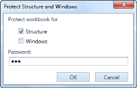
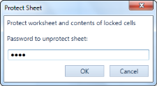
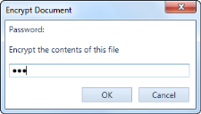
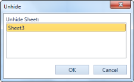
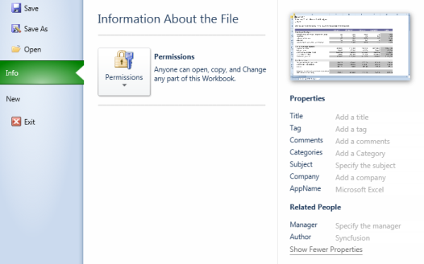

# Documents Settings

## Protect and unprotect workbook

Spreadsheet control provides support to protect and unprotect the workbook with a password. When you protect the workbook the following option will be disabled:

* Insert Worksheet
* Delete Worksheet
* Hide Worksheet
* Unhide Worksheet

Protect workbook

You can protect the workbook using the Protect Structure and Windows dialog box. You can open the Protect Structure and Windows dialog using the ProtectWorkbookCommand_._

{{ '' | markdownify }}
{:.image }

The following code illustrates how to bind the ProtectWorkbookCommand__to a button: 

[XAML]

<Button Command="{Binding Path= ProtectWorkbookCommand}">

</Button>

> _Note: The ProtectWorkbookCommand will open the Unprotect Workbook dialog box if the workbook is already protected._ 

Unprotect workbook

You can unprotect the workbook using the Unprotect Workbook dialog box. You can open the Unprotect Workbook dialog using the ProtectWorkbookCommand_._

{{ '' | markdownify }}
{:.image }

## Protect and unprotect worksheet

Spreadsheet control supports to protect and unprotect a worksheet. You can set the worksheet as read only. There are two methods to protect and unprotect the worksheet. They are: 

* Using method 
* Using command

Protect/Unprotect worksheet using method

Protect

To set a worksheet as password protected, pass the sheet name and the password as String to ProtectSheet method. This prevents unwanted changes to the worksheet. 

Following code illustrates this:

<table>
<tr>
<td>
[C#]spreadControl.ProtectSheet("Sheet1", "asd123");</td></tr>
<tr>
<td>
[VB]spreadControl.ProtectSheet("Sheet1", "asd123")</td></tr>
</table>

UnProtect

To unprotect a worksheet, pass the sheet name and the password as String to the UnProtectSheet method.

<table>
<tr>
<td>
[C#]spreadControl.UnProtectSheet("Sheet1", "asd123");</td></tr>
<tr>
<td>
 [VB]spreadControl.UnProtectSheet("Sheet1", "asd123")</td></tr>
</table>

Protect/Unprotect worksheet using Command

You can protect/unprotect the current worksheet using the Protect Sheet dialog box. You can open the Protect Sheet dialog using the ProtectCurrentSheetCommand_. If the current worksheet is already protected_ Protect Sheet dialog box will unprotect the worksheet after confirming the password.

{{ '' | markdownify }}
{:.image }

The following code illustrates how to bind the ProtectCurrentSheetCommand__to a button: 

[XAML]

<Button Command="{Binding Path= ProtectCurrentSheetCommand}">

</Button>

## Encrypt workbook

Encryption

Encryption is used to protect the workbook data with password. It converts the data into an encrypted format (unreadable). This restricts anonymous users to access the data. You can achieve this by two methods. They are: 

* Using method
* Using command

Method

To encrypt a workbook, pass the password in the EncryptWorkBook method. The following code illustrates this:

<table>
<tr>
<td>
[C#]spreadControl.EncryptWorkBook("asd123");</td></tr>
<tr>
<td>
 [VB]spreadControl.EncryptWorkBook("asd123")</td></tr>
</table>

Encrypt workbook using the Commands 

You can also encrypt the workbook using the Encrypt Document dialog box. You can open the Encrypt Document dialog using the EncryptCommand_._

{{ '' | markdownify }}
{:.image }

The following code illustrates how to bind the EncryptCommand__to a button: 

[XAML]

<Button Command="{Binding Path= EncryptCommand}">

</Button>

Open Encrypted Document

When you open encrypted document Password dialog box will open. Enter password to decrypt the data. 

{{ '' | markdownify }}
{:.image }

## Hide and Unhide Worksheet

This feature enables you to hide/unhide a worksheet. You can achieve this in two methods:

* Using method
* Using command

Hide worksheet using method

To hide a worksheet, pass the sheet name to the HideSheet method:

<table>
<tr>
<td>
[C#]spreadControl.HideSheet("Sheet1");</td></tr>
<tr>
<td>
 [VB]spreadControl.HideSheet("Sheet1")</td></tr>
</table>

Unhide worksheet using method

To unhide a worksheet, pass the sheet name to the UnHideSheet method:

<table>
<tr>
<td>
[C#]spreadControl.UnHideSheet("Sheet1");</td></tr>
<tr>
<td>
 [VB]spreadControl.UnHideSheet("Sheet1")</td></tr>
</table>

Hide worksheet using comment

You can hide the current worksheet by using the HideCurrentSheetCommand. When you execute this command based on the command parameter it will hide or unhide the worksheet. 

The following code illustrates how to bind the HideCurrentSheetCommand__to a button for hide current worksheet:  

[XAML]

<Button Command="{Binding Path= HideCurrentSheetCommand}">

<System:bool>true</System:bool>

</Button>

Unhide worksheet using command

You can unhide the worksheet by using the Unhide dialog box. To open the Unhide dialog box, pass the command parameter as false in the HideCurrentSheetCommand.

{{ '' | markdownify }}
{:.image }

The following code illustrates how to bind the HideCurrentSheetCommand__to a button for unhide worksheet: 

[XAML]

<Button Command="{Binding Path= HideCurrentSheetCommand}">

<System:bool>false</System:bool>

</Button>

##  Add or Remove Worksheet

This feature enables you to add or remove a worksheet from a workbook.

Add a worksheet using method

To add a worksheet, pass the sheet name to the AddSheet method.

<table>
<tr>
<td>
[C#]spreadControl.AddSheet("Sheet4");</td></tr>
<tr>
<td>
 [VB]spreadControl.AddSheet("Sheet4")</td></tr>
</table>

You can also specify the position of the added worksheet by passing the sheet name and position to the AddSheet method. 

<table>
<tr>
<td>
[C#]spreadControl.AddSheet("Sheet4", 3);</td></tr>
<tr>
<td>
 [VB]spreadControl.AddSheet("Sheet4", 3)</td></tr>
</table>

Remove a worksheet using method

To remove a worksheet, pass the sheet name to the RemoveSheet method. 

<table>
<tr>
<td>
[C#]spreadControl.RemoveSheet("Sheet4");</td></tr>
<tr>
<td>
 [VB]spreadControl.RemoveSheet("Sheet4")</td></tr>
</table>

Add a worksheet using command

You can add a worksheet by using the InsertSheetCommand. When you execute this command, it will add a new worksheet at the end of the workbook.

The following code illustrates how to bind the InsertSheetCommandto a button:  

[XAML]

<Button Command="{Binding Path= InsertSheetCommand}">

</Button>

Remove a worksheet using Command

You can delete current worksheet using the DeleteCurrentSheetCommand. When you execute this command, it will delete the current worksheet.

The following code illustrates how to bind the DeleteCurrentSheetCommand button:

[XAML]

<Button Command="{Binding Path= DeleteCurrentSheetCommand}">

</Button>

## Document Settings Options

Document properties are named values that provide information about the document namely author, manager, title, tags, commands, subject, company and AppName. Values for these properties can be changed.

Use Case Scenario

When importing and exporting and the Excel sheet, users can get and set the values of the Excel properties.

{{ '' | markdownify }}
{:.image }

Properties

<table>
<tr>
<td>
Property </td><td>
Description </td><td>
Type </td><td>
Data Type </td></tr>
<tr>
<td>
Author</td><td>
Used to get or set the  author of the Excel</td><td>
Dependency</td><td>
String</td></tr>
<tr>
<td>
ApplicationName</td><td>
Used to get or set the application name of the Excel</td><td>
Dependency</td><td>
String</td></tr>
<tr>
<td>
Category</td><td>
Used to get or set the CategoryName of the Excel</td><td>
Dependency</td><td>
String</td></tr>
<tr>
<td>
Comments</td><td>
Used to get or set the comments of an Excel</td><td>
Dependency</td><td>
String</td></tr>
<tr>
<td>
Company</td><td>
Used to get or set the company name of the Excel</td><td>
</td><td>
</td></tr>
<tr>
<td>
Subject</td><td>
Used to get or setthe subject of the Excel</td><td>
Dependency</td><td>
String</td></tr>
<tr>
<td>
Keywords</td><td>
Used to get or set the keywords of the Excel</td><td>
Dependency</td><td>
String</td></tr>
<tr>
<td>
Manager</td><td>
Used to get or set the Manager’s name</td><td>
Dependency</td><td>
String</td></tr>
<tr>
<td>
Title</td><td>
Used to get  or set the Title</td><td>
Dependency</td><td>
String</td></tr>
</table>

### Setting Values in Document Properties

The following code snippets are used to set values in Document properties:

<table>
<tr>
<td>
[C#]    this.spreadSheetControl.ExcelProperties.Author = "Syncfusion";     this.spreadSheetControl.ExcelProperties.Manager = "Syncfusion Manager";    this.spreadSheetControl.ExcelProperties.Category = "Spreadsheet control";    this.spreadSheetControl.ExcelProperties.Comments = "This document  genera ted by spreadsheet control";                 this.spreadSheetControl.ExcelProperties.Company = "Syncfusion";    this.spreadSheetControl.ExcelProperties.Title = "Spreadsheet control";    this.spreadSheetControl.ExcelProperties.Keywords = "Sync";    this.spreadSheetControl.ExcelProperties.Subject = "Native Excel generator";    this.spreadSheetControl.ExcelProperties.ApplicationName = " Spreadsheet ";</td></tr>
<tr>
<td>
[VB]Me.spreadSheetControl.ExcelProperties.Author = "Syncfusion"Me.spreadSheetControl.ExcelProperties.Manager = "Syncfusion Manager"Me.spreadSheetControl.ExcelProperties.Category = "Spreadsheet control"Me.spreadSheetControl.ExcelProperties.Comments = "This document  genera ted by spreadsheet control"Me.spreadSheetControl.ExcelProperties.Company = "Syncfusion"Me.spreadSheetControl.ExcelProperties.Title = "Spreadsheet control"Me.spreadSheetControl.ExcelProperties.Keywords = "Sync"Me.spreadSheetControl.ExcelProperties.Subject = "Native Excel generator"Me.spreadSheetControl.ExcelProperties.ApplicationName = "Spreadsheet "</td></tr>
</table>

