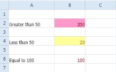

# Formatting

## Conditional Formatting 

Conditional formatting is a feature by which cell styles will be dynamically formatted based on its value and specified condition. It enables you to apply formatting to the cell through a dialog window. 

### Use Case Scenarios 

This feature enables you to categorize the cell for analysis.  For example, you can format a time sheet, to point out the overtime obtained by an employee. You can also use it to track the best sales employees in the company, by setting a quota that makes a cell range particular.

### Defining Condition for Spreadsheet Cells

You can define the condition for formatting the Spreadsheet cells using a conditional formatting dialog box. Specify the conditional value and style format in the dialog box. You can open the conditional formatting dialog using the ConditionalFormatCommand_._ Based on the Command parameter one of the following dialogs will open:

* Greater than

* Less Than

* Between

* Equal to 

The following code illustrates how to bind the ConditionalFormatCommand to a button: 



<Button Command="{Binding Path=ConditionalFormatCommand}">

            <Button.CommandParameter>

                <XlsIO:ExcelComparisonOperator>Greater</XlsIO:ExcelComparisonOperator>

            </Button.CommandParameter>

        </Button>



## Number formatting

Number formatting helps you to control the format of the number in Spreadsheet cells. Number in the cell will be displayed based on the number format applied. 

### Defining number formatting for Spreadsheet Cells

You can define the number formatting using the NumberFormattingCommand. Number formatting will be applied to the Spreadsheet cells based on the command parameter. The following code illustrates this:



<Button Command="{Binding Path=NumberFormatCommand}" Grid.Row="2">

<Button.CommandParameter>

<System:String>0.00%</System:String>

</Button.CommandParameter>

</Button>



## Center Across Selection

### Overview

This feature center aligns the cell value in Spreadsheet, across the range of selected cells. 

### Properties, Methods and Events

### Methods

<table>
<tr>
<th>
{{ '**Method**' | markdownify }}</th><th>
{{ '**Description**' | markdownify }}</th><th>
{{ '**Parameters**' | markdownify }}</th><th>
{{ '**Type**' | markdownify }}</th><th>
{{ '**Return Type**' | markdownify }}</th></tr>
<tr>
<td>
SetCenterAcrossSelection()</td><td>
This method sets the Center Across Selection on the selected cells. It should be explicitly called to set Centre Across Selection.</td><td>
setCenterAcrossSelection() </td><td>
null</td><td>
void </td></tr>
</table>

### Center aligning cell values in Spreadsheet

The following code snippets manually set the center across selection by calling the method: 



SpreadsheetControl.GridProperties.CurrentExcelGridModel.setCenterAcrossSelection();





 
 SpreadsheetControl.GridProperties.CurrentExcelGridModel.setCenterAcrossSelection()

 

The following code snippet manually sets the center across selection by calling the command: 



<Button Content="CentreAcrossSelection" Margin="5" Width="200" Command="{Binding ElementName=spreadSheetControl, Path=CenterAcrossSelectionCommand}"/>



The output displayed is shown in the following screenshot:

