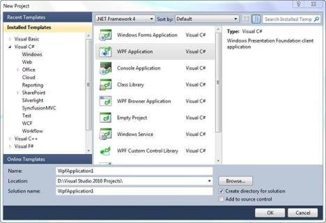
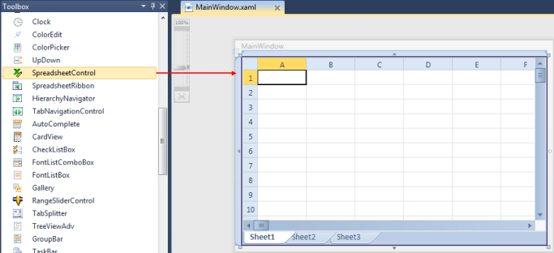
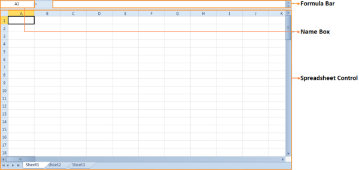
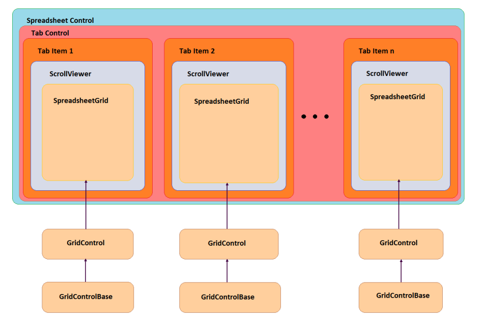

# Getting Started

## Creating a WPF Application

 The following are steps to create a new WPF application in Visual Studio:

1. Open Visual Studio.
2. Click File tab and navigate to New > Project.

{{ '' | markdownify }}
{:.image }

3. In the New Project dialog box, select WPF Application, enter a name for the application in the Name field and click OK.

{{ '' | markdownify }}
{:.image }

4. Now, a new WPF application will be created.

## Adding Spreadsheet Control to WPF Application

### Through Visual Studio 

Following are the steps to add the Spreadsheet control to WPF application using Visual Studio.

1. Create a new WPF application in Visual Studio. 
2. In Visual Studio Toolbox, click Syncfusion WPF Toolbox tab.

{{ '' | markdownify }}
{:.image }

1. Drag SpreadsheetControl to the Designer area.
2. Customize the properties of SpreadsheetControl using Properties window.

> _Note: To add the SpreadsheetRibbon control to your application, drag SpreadsheetRibbon to the Designer area and set the Spreadsheet contol as a DataContext as shown the following code._

[XMAL]

<syncfusion:SpreadsheetRibbon DataContext="{Binding ElementName=spreadsheetControl1}"/>

### Through XAML and C#

You can also add the Spreadsheet control to a WPF application through XAML and C#. The following code example illustrates this. 

<table>
<tr>
<td>
[XMAL]<syncfusion:SpreadsheetControl HorizontalAlignment="Left"  Name="spreadsheetControl1" VerticalAlignment="Top" /></td></tr>
<tr>
<td>
 [C#]SpreadsheetControl Spreadsheet1 = new SpreadsheetControl();LayoutRoot.Children.Add(Spreadsheet1);</td></tr>
<tr>
<td>
[VB]Dim Spreadsheet1 As SpreadsheetControl = New SpreadsheetControl()LayoutRoot.Children.Add(Spreadsheet1)</td></tr>
</table>

## Loading Excel Files in Spreadsheet Control

You can open the Excel document in the Spreadsheet control using _ImportFromExcel_ method. The following code illustrates this.

<table>
<tr>
<td>
[C#]FileStream stream = new FileStream(@"..\..\Data\DefaultSheet.xlsx", FileMode.Open);spreadsheet.ImportFromExcel(stream);</td></tr>
<tr>
<td>
 [VB]Dim stream As FileStream = New FileStream("..\..\Data\DefaultSheet.xlsx", FileMode.Open)spreadsheet.ImportFromExcel(stream)</td></tr>
</table>

> 

> _Note: You can also open the Excel document using ImportFromExcelCommand. When you execute the ImportFromExcelCommand it will display the Open dialog box. Using this Open dialog, you can open the Excel document in the Spreadsheet control._

## Appearance and Structure of the Controls

Structure of the SpreadsheetRibbon Control

{{ '' | markdownify }}
{:.image }

Structure of the Spreadsheet Control

{{ '' | markdownify }}
{:.image }

## Architecture

Architecture

The Spreadsheet control supports ControlTemplate to define its content. By default, its content includes a TabControlExt object that contains number of TabItemExt based on sheet count. The TabItemExt contains a ScrollViewer object that contains a SpreadsheetGrid object.

The following sketch illustrates the Spreadsheet control architecture.

{{ '' | markdownify }}
{:.image }

Accessing the Underlying Grid control

The Spreadsheet control is a control derived class that has its own properties. You can use Grid control derived property namely ActiveSpreadsheetGrid _to_ get its grid-like behavior. To access the underlying Grid control associated with the Spreadsheet control, you can use the SpreadsheetControl.GridProperties.ActiveSpreadsheetGrid property.

