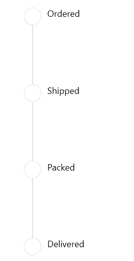

# StepView Item Status Customization
You can customize the status of the StepView item in the following ways.

## SelectedIndex
You can change the index of the last active (selected) item where items before this index will moved to active status. using the [SelectedIndex](https://help.syncfusion.com/cr/wpf/Syncfusion.UI.Xaml.ProgressBar.SfStepProgressBar.html#Syncfusion_UI_Xaml_ProgressBar_SfStepProgressBar_SelectedIndex) property. 



<Grid x:Name="grid">
    <syncfusion:SfStepProgressBar SelectedIndex="3">
        <syncfusion:StepViewItem Content="Ordered" />
        <syncfusion:StepViewItem Content="Shipped" />
        <syncfusion:StepViewItem Content="Packed" />
        <syncfusion:StepViewItem Content="Delivered" />
    </syncfusion:SfStepProgressBar>
</Grid>


SfStepProgressBar stepProgressBar = new SfStepProgressBar();
StepViewItem orderedStepViewItem = new StepViewItem();
StepViewItem shippedStepViewItem = new StepViewItem();
StepViewItem packedStepViewItem = new StepViewItem();
StepViewItem deliveredStepViewItem = new StepViewItem();

orderedStepViewItem.Content = "Ordered";
shippedStepViewItem.Content = "Shipped";
packedStepViewItem.Content = "Packed";
deliveredStepViewItem.Content = "Delivered";

stepProgressBar.Items.Add(orderedStepViewItem);
stepProgressBar.Items.Add(shippedStepViewItem);
stepProgressBar.Items.Add(packedStepViewItem);
stepProgressBar.Items.Add(deliveredStepViewItem);

stepProgressBar.SelectedIndex = 3;

grid.Children.Add(stepProgressBar);



## SelectedItemProgress
You can change the status of step view item using the [SelectedItemProgress](https://help.syncfusion.com/cr/wpf/Syncfusion.UI.Xaml.ProgressBar.SfStepProgressBar.html#Syncfusion_UI_Xaml_ProgressBar_SfStepProgressBar_SelectedItemStatus) property. The default value of this property is `Inactive`.

      
<Grid x:Name="grid">
    <syncfusion:SfStepProgressBar SelectedIndex="2" SelectedItemStatus="Indeterminate">
        <syncfusion:StepViewItem Content="Ordered" />
        <syncfusion:StepViewItem Content="Shipped" />
        <syncfusion:StepViewItem Content="Packed" />
        <syncfusion:StepViewItem Content="Delivered" />
    </syncfusion:SfStepProgressBar>
</Grid>


SfStepProgressBar stepProgressBar = new SfStepProgressBar();
StepViewItem orderedStepViewItem = new StepViewItem();
StepViewItem shippedStepViewItem = new StepViewItem();
StepViewItem packedStepViewItem = new StepViewItem();
StepViewItem deliveredStepViewItem = new StepViewItem();

orderedStepViewItem.Content = "Ordered";
shippedStepViewItem.Content = "Shipped";
packedStepViewItem.Content = "Packed";
deliveredStepViewItem.Content = "Delivered";

stepProgressBar.Items.Add(orderedStepViewItem);
stepProgressBar.Items.Add(shippedStepViewItem);
stepProgressBar.Items.Add(packedStepViewItem);
stepProgressBar.Items.Add(deliveredStepViewItem);

stepProgressBar.SelectedIndex = 2;
stepProgressBar.SelectedItemStatus = StepStatus.Indeterminate;
           
grid.Children.Add(stepProgressBar);            



## SelectedItemProgress
You can change the progress value of the StepViewItem using the [SelectedItemProgress](https://help.syncfusion.com/cr/wpf/Syncfusion.UI.Xaml.ProgressBar.SfStepProgressBar.html#Syncfusion_UI_Xaml_ProgressBar_SfStepProgressBar_SelectedItemProgress) property. The default value of this property is `100`.

      
<Grid x:Name="grid">
    <syncfusion:SfStepProgressBar SelectedIndex="2" 
        SelectedItemProgress="50" SelectedItemStatus="Indeterminate">
            <syncfusion:StepViewItem Content="Ordered" />
            <syncfusion:StepViewItem Content="Shipped" />
            <syncfusion:StepViewItem Content="Packed" />
            <syncfusion:StepViewItem Content="Delivered" />
    </syncfusion:SfStepProgressBar>
</Grid>


SfStepProgressBar stepProgressBar = new SfStepProgressBar();
StepViewItem orderedStepViewItem = new StepViewItem();
StepViewItem shippedStepViewItem = new StepViewItem();
StepViewItem packedStepViewItem = new StepViewItem();
StepViewItem deliveredStepViewItem = new StepViewItem();

orderedStepViewItem.Content = "Ordered";
shippedStepViewItem.Content = "Shipped";
packedStepViewItem.Content = "Packed";
deliveredStepViewItem.Content = "Delivered";

stepProgressBar.Items.Add(orderedStepViewItem);
stepProgressBar.Items.Add(shippedStepViewItem);
stepProgressBar.Items.Add(packedStepViewItem);
stepProgressBar.Items.Add(deliveredStepViewItem);

stepProgressBar.SelectedIndex = 2;
stepProgressBar.SelectedItemStatus = StepStatus.Indeterminate;
stepProgressBar.SelectedItemProgress = 50;
           
grid.Children.Add(stepProgressBar);           



## AnimationDuration
You can change the the duration for completing the animation status of step view item using the [AnimationDuration](https://help.syncfusion.com/cr/wpf/Syncfusion.UI.Xaml.ProgressBar.SfStepProgressBar.html#Syncfusion_UI_Xaml_ProgressBar_SfStepProgressBar_AnimationDurationProperty) property. The default value of this property is `1000ms`.



<Grid x:Name="grid">
    <syncfusion:SfStepProgressBar SelectedIndex="3" AnimationDuration="0:0:1" Orientation="Vertical">
        <syncfusion:StepViewItem Content="Ordered" />
        <syncfusion:StepViewItem Content="Shipped" />
        <syncfusion:StepViewItem Content="Packed" />
        <syncfusion:StepViewItem Content="Delivered" />
    </syncfusion:SfStepProgressBar>
</Grid>


SfStepProgressBar stepProgressBar = new SfStepProgressBar();
StepViewItem orderedStepViewItem = new StepViewItem();
StepViewItem shippedStepViewItem = new StepViewItem();
StepViewItem packedStepViewItem = new StepViewItem();
StepViewItem deliveredStepViewItem = new StepViewItem();

orderedStepViewItem.Content = "Ordered";
shippedStepViewItem.Content = "Shipped";
packedStepViewItem.Content = "Packed";
deliveredStepViewItem.Content = "Delivered";

stepProgressBar.Items.Add(orderedStepViewItem);
stepProgressBar.Items.Add(shippedStepViewItem);
stepProgressBar.Items.Add(packedStepViewItem);
stepProgressBar.Items.Add(deliveredStepViewItem);

stepProgressBar.SelectedIndex = 3;
stepProgressBar.Orientation = Orientation.Vertical;
stepProgressBar.AnimationDuration = new TimeSpan(0, 0, 1);

grid.Children.Add(stepProgressBar);



