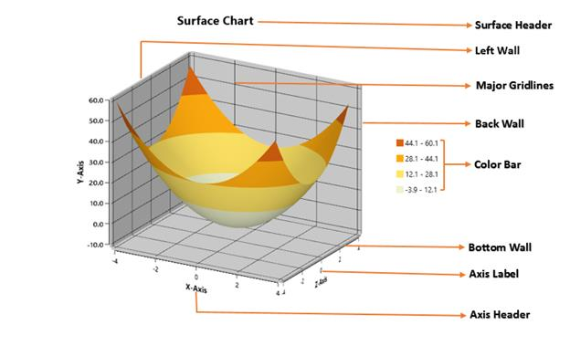
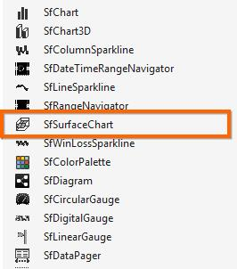
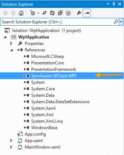
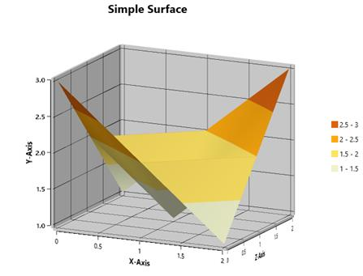

# Getting Started with WPF SfSurfaceChart

This section helps you get started with SfSurfaceChart control.

## Visual Structure

The following image helps you understand various elements in SfSurfaceChart when you use it for the first time.

* Surface Header – Represents the title of surface chart
* Wall – Represents the wall that bounds the surface chart. 
* Major Gridlines- Represents the surface axis gridline for surface chart.
* Color Bar- Displays the value range in color for surface chart. 
* Axis Label- Displays the label for surface axis. 
* Axis Header- Displays the header of Surface axis.

## Create simple surface chart from XAML

This section demonstrates how to create a surface chart using SfSurfaceChart control from XAML. You can add the **SfChart** assembly as a reference to your application to create a surface chart using SfSurfaceChart control from XAML.

### Add Assembly reference

1. Open the Add Reference window from your project.
2. Choose Windows > Extensions > Syncfusion.SfChart.WPF.
3. Add the following namespace in your XAML page.



xmlns:syncfusion="clr-namespace:Syncfusion.UI.Xaml.Charts;assembly=Syncfusion.SfChart.WPF"



N> Adding the extension Syncfusion.SfChart.WPF, adds all the Syncfusion WPF controls. You can also add the SfChart reference alone from the following location. C:\Program Files (x86)\Syncfusion\Essential Studio<version>\Assemblies (4.0/4.5.1/4.6)

### Initialize the surface chart

We need to initialize the surface chart from the following namespace Syncfusion.UI.Xaml.SfChart



<syncfusion:SfSurfaceChart>

 </syncfusion:SfSurfaceChart>
 


## Add Surface chart from Toolbox

Drag and drop the **SfSurfaceChart** control from the Toolbox to the required location, where the surface chart has to be displayed. You can select Toolbox from the View menu, when the toolbox window is not available in the project. Now the Toolbox window appears at the left end of the screen.

The Syncfusion WPF reference is added to the application reference and the xmlns namespace is added to MainPage.xaml.

The following dataset is used to plot the surface chart. 

<table>
<tr>
<th>
X</th><td>
0</td><td>
0</td><td>
0</td><td>
1</td><td>
1</td><td>
1</td><td>
2</td><td>
2</td><td>
2</td></tr>
<tr>
<th>
Y</th><td>
3</td><td>
2</td><td>
1</td><td>
2</td><td>
1</td><td>
2</td><td>
1</td><td>
2</td><td>
3</td></tr>
<tr>
<th>
Z</th><td>
0</td><td>
1</td><td>
2</td><td>
0</td><td>
1</td><td>
2</td><td>
0</td><td>
1</td><td>
2</td></tr>
</table>

Before proceeding with the chart, create data model with the above details as follows.



public class Data
{
	public double X { get; set; }
	public double Y { get; set; }
	public double Z { get; set; }
}



Now, you have a data model property which hold values of each item in the collection.



public ObservableCollection<Data> DataValues { get; set; }
	


Also you have a property for row and column size in the given data. 



public int RowSize { get; set; }

public int ColumnSize { get; set; }



Add the values to the above defined collection property called DataValues, with the values illustrated in the above table.



DataValues.Add(new Data() {X = 0, Y = 3, Z = 0});
DataValues.Add(new Data() {X = 0, Y = 2, Z = 1});
DataValues.Add(new Data() {X = 0, Y = 1, Z = 2});
                            
DataValues.Add(new Data() { X = 1, Y = 2, Z = 0 });
DataValues.Add(new Data() { X = 1, Y = 1, Z = 1 });
DataValues.Add(new Data() { X = 1, Y = 2, Z = 2 });
                            
DataValues.Add(new Data() { X = 2, Y = 1, Z = 0 });
DataValues.Add(new Data() { X = 2, Y = 2, Z = 1 });
DataValues.Add(new Data() { X = 2, Y = 3, Z = 2 });

RowSize = 3;
ColumnSize = 3;


Now you can add the elements required for the above scenario to the Surface instance created.

### Add Data to surface chart

After you populate the data to the chart, you can bind the properties as shown in the following code example.   



<Syncfusion:SfSurfaceChart ItemsSource="{Binding DataValues}"  XBindingPath="X"   
                           
                 YBindingPath="Y" ZBindingPath="Z" 
				 
                 RowSize="{Binding RowSize}" 
				 
                 ColumnSize="{Binding ColumnSize}" >



### Add Header to the surface chart

The header acts as the title of the surface chart created, to identify its purpose. 



<Syncfusion:SfSurfaceChart Header="Simple Surface" FontSize="20" />
	


### Add Axes to surface chart

The following code example illustrates how to add XAxis, YAxis and ZAxis to the Surface chart.



<Syncfusion:SfSurfaceChart>

      <Syncfusion:SfSurfaceChart.XAxis>
	  
             <Syncfusion:SurfaceAxis Header="X-Axis" />
			 
      </Syncfusion:SfSurfaceChart.XAxis>

      <Syncfusion:SfSurfaceChart.YAxis>
	  
             <Syncfusion:SurfaceAxis Header="Y-Axis" LabelFormat="0.0"/>
			 
      </Syncfusion:SfSurfaceChart.YAxis>
      
      <Syncfusion:SfSurfaceChart.ZAxis>
	  
             <Syncfusion:SurfaceAxis Header="Z-Axis"/>
			 
      </Syncfusion:SfSurfaceChart.ZAxis>
	  
 </Syncfusion:SfSurfaceChart>



N> SfSurfaceChart supports default axes, all the axes are generated automatically, even when it has not been defined explicitly.

### Add Surface Type

The following code example illustrates how to add surface type to the surface chart. 



<Syncfusion:SfSurfaceChart Type="Surface" />
	


### Add Color bar to the surface chart

The following code example illustrates how to add color bar to the surface chart



<Syncfusion:SfSurfaceChart.ColorBar>    
      
         <Syncfusion:ChartColorBar  DockPosition="Right"/>
		 
</Syncfusion:SfSurfaceChart.ColorBar>



Now you have created a simple surface chart. The following code example is for XAML. 



<Syncfusion:SfSurfaceChart Type="Surface"  

                           ItemsSource="{Binding DataValues}"  XBindingPath="X"    
						   
                           YBindingPath="Y" ZBindingPath="Z" 
						   
                           RowSize="{Binding RowSize}" 
						   
                           ColumnSize="{Binding ColumnSize}">

    <Syncfusion:SfSurfaceChart.XAxis>
	
            <Syncfusion:SurfaceAxis Header="X-Axis" />
			
    </Syncfusion:SfSurfaceChart.XAxis>
	
    <Syncfusion:SfSurfaceChart.YAxis>
	
             <Syncfusion:SurfaceAxis Header="Y-Axis" LabelFormat="0.0"/>
			 
    </Syncfusion:SfSurfaceChart.YAxis>

    <Syncfusion:SfSurfaceChart.ZAxis>
	
             <Syncfusion:SurfaceAxis Header="Z-Axis"/>
			 
    </Syncfusion:SfSurfaceChart.ZAxis>

    <Syncfusion:SfSurfaceChart.ColorBar>
	
             <Syncfusion:ChartColorBar  DockPosition="Right"/>
			 
    </Syncfusion:SfSurfaceChart.ColorBar>
	
</Syncfusion:SfSurfaceChart>



The following output is displayed as a result of the above code example.

## Create a simple surface chart from Code behind.

This section demonstrates how to create a surface chart using SfSurfaceChart control from code behind. For that, you can add the **SfChart** assembly reference to your application.

### Add Assembly reference

1. Open the Add Reference window from your project.
2. Choose Windows > Extensions >Syncfusion.SfChart.WPF.
3. Add the following namespace in code behind



using Syncfusion.UI.Xaml.Charts;



The following section demonstrates a simple surface chart with the data discussed in the above table.

### Initialize the surface chart



SfSurfaceChart surface = new SfSurfaceChart(); 



### Add Data to surface chart

You can set the surface chart data in code behind, by directly adding data points to the Data property of surface chart using **AddPoints****(****x****,****y****,****z****)** method as shown in the following code example.



SfSurfaceChart surface = new SfSurfaceChart();

//First Row
surface.Data.AddPoints(0, 3, 0);
surface.Data.AddPoints(0, 2, 1);
surface.Data.AddPoints(0, 2, 2);

//Second Row
surface.Data.AddPoints(1, 2, 0);
surface.Data.AddPoints(1, 1, 1);
surface.Data.AddPoints(1, 2, 2);

//Third Row
surface.Data.AddPoints(2, 1, 0);
surface.Data.AddPoints(2, 2, 1);
surface.Data.AddPoints(2, 3, 2);

surface.RowSize = 3;
surface.ColumnSize = 3;



### Add Header to the Surface chart

The header acts as the title of the surface chart created, to identify its purpose. 



surface.Header = "Simple Surface";



### Add Axes to surface chart

The following code example illustrates how to add XAxis, YAxis and ZAxis to the surface chart.



//Add X axis to surface 
SurfaceAxis xAxis = new SurfaceAxis();
xAxis.Header = "X-Axis";
surface.XAxis = xAxis;

//Add Y axis to surface 
SurfaceAxis yAxis = new SurfaceAxis();
yAxis.Header = "Y-Axis";
surface.YAxis = yAxis;

//Add Z axis to surface 
SurfaceAxis zAxis = new SurfaceAxis();
zAxis.Header = "Z-Axis";
surface.ZAxis = zAxis;



N> SfSurfaceChart supports default axes, where all the axes are generated automatically, even when they are not defined explicitly.

### Add Surface Type

The following code example illustrates how to add surface type to the surface chart. 



surface.Type = SurfaceType.Surface;



### Add ColorBar to the surface chart

The following code example illustrates how to add color bar to the surface chart.



surface.ColorBar = new ChartColorBar() {DockPosition = ChartDock.Right};



Now you have created a simple surface chart. The following code example is for code behind.



SfSurfaceChart surface = new SfSurfaceChart();

surface.Header = "Simple Surface";

surface.Type = SurfaceType.Surface;

//First Row
surface.Data.AddPoints(0, 3, 0);
surface.Data.AddPoints(0, 2, 1);
surface.Data.AddPoints(0, 2, 2);

//Second Row
surface.Data.AddPoints(1, 2, 0);
surface.Data.AddPoints(1, 1, 1);
surface.Data.AddPoints(1, 2, 2);

//Third Row
surface.Data.AddPoints(2, 1, 0);
surface.Data.AddPoints(2, 2, 1);
surface.Data.AddPoints(2, 3, 2);

surface.RowSize = 3;
surface.ColumnSize = 3;

//Add X axis to surface 
SurfaceAxis xAxis = new SurfaceAxis();
xAxis.Header = "X-Axis";
surface.XAxis = xAxis;

//Add Y axis to surface 
SurfaceAxis yAxis = new SurfaceAxis();
yAxis.Header = "Y-Axis";
surface.YAxis = yAxis;

//Add Z axis to surface 
SurfaceAxis zAxis = new SurfaceAxis();
zAxis.Header = "Z-Axis";
surface.ZAxis = zAxis;
surface.ColorBar = new ChartColorBar() {DockPosition = ChartDock.Right};



The following output is displayed as a result of the above code example.

