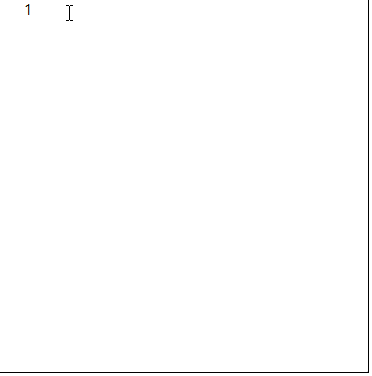
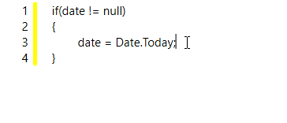

## Editing Text in EditControl WPF

[EditControl](https://help.syncfusion.com/cr/cref_files/wpf/Syncfusion.Edit.Wpf~Syncfusion.Windows.Edit.EditControl_members.html) supports displaying or editing string values with any number of lines. It also supports all basic editing operations such as typing, cut, copy, paste, delete, backspace, undo and redo operations.

[EditControl](https://help.syncfusion.com/cr/cref_files/wpf/Syncfusion.Edit.Wpf~Syncfusion.Windows.Edit.EditControl_members.html) supports performing edit operations through keyboard and mouse. It supports shortcut keys for basic editing operations such as cut, copy, paste, undo and redo operations. EditControl also has a built-in context menu to perform common editing operations such undo, redo, cut, copy, paste, select all operations using mouse. User can enable/ disable the built- in context menu.  For more information refer to [Default Context Menu](https://help.syncfusion.com/wpf/syntax-editor/basic-editing/default-context-menu).

[Text](https://help.syncfusion.com/cr/cref_files/wpf/Syncfusion.Edit.Wpf~Syncfusion.Windows.Edit.EditControl~Text.html) property of the EditControl contains the text available in the EditControl at any point of time. The [Text](https://help.syncfusion.com/cr/cref_files/wpf/Syncfusion.Edit.Wpf~Syncfusion.Windows.Edit.EditControl~Text.html) property of EditControl gets updated when you edit the text in the control by typing, editing the text by cut, paste, delete, undo or redo operations or by setting the Text property exclusively at runtime. The TextChanged event of EditControl gets raised when the Text property gets changed. Refer to [EditControl Events](https://help.syncfusion.com/cr/cref_files/wpf/Syncfusion.Edit.Wpf~Syncfusion.Windows.Edit.EditControl_members.html ) section to know more about TextChanged and other events available in EditControl.

Set a simple string as EditControl’s Text by using the following line of code.





<syncfusion:EditControl x:Name="editControl" Text="This is Syncfusion's EditControl"/>





editControl.Text = "Setting Text property from code behind (C#)";





To set a multi-line string as Text property through **XAML**, String class in **mscorlib**.**dll** can be used with **xml**:**space**=”**preserve**”. The following lines of code can be used to set a multiline text from **XAML**.





<syncfusion:EditControl x:Name="editControl">

<library:String xml:space="preserve" xmlns:library="clr-namespace:System;assembly=mscorlib">Setting multiline

Text using String class in mscorlib.dll.

When preserve is used, XAML considers the indentation spaces as empty spaces.

</library:String>

</syncfusion:EditControl>









editControl.Text = @"Setting multi-line text" + Environment.NewLine + "from C# using" + Environment.NewLine + "Environment.NewLine.";





## Indentation in EditControl

Indentation support helps to format the source code to improve readability. The [IndentingOptions](https://help.syncfusion.com/cr/cref_files/wpf/Syncfusion.Edit.Wpf~Syncfusion.Windows.Edit.EditControl~IndentingOptions.html) property provides advanced text indentation support to suit the requirements of the user. The [IsAutoIndentationEnabled](https://help.syncfusion.com/cr/cref_files/wpf/Syncfusion.Edit.Wpf~Syncfusion.Windows.Edit.EditControl~IsAutoIndentationEnabled.html) property should be enabled whenever Indentation operation is to be preformed in [EditControl](https://help.syncfusion.com/cr/cref_files/wpf/Syncfusion.Edit.Wpf~Syncfusion.Windows.Edit.EditControl_members.html).

The Indentation can be performed using IndentationOption by the following values.

* None
* Smart
* Block

#### IndentationOptions (None)
If Enter is pressed when the [IndentationOptions](https://help.syncfusion.com/cr/cref_files/wpf/Syncfusion.Edit.Wpf~Syncfusion.Windows.Edit.EditControl~IndentingOptions.html) is set to None, the text will not indent.





<sfedit:EditControl Name="Edit1" Background="White" Margin="0" IsAutoIndentationEnabled="True" TabSpaces="10" IndentingOptions="None" Foreground="Black" ShowLineNumber="True" EnableIntellisense="False">
</sfedit:EditControl>





    EditControl editControl = new EditControl() {Height = 200, Width = 200, Background = Brushes.White, Foreground = Brushes.Black };

    editControl.IndentingOptions = IndentingOptions.None;
    editControl.TabSpaces = 10;
    this.Content = editControl;

    
     

#### IndentationOptions (Smart)
When the [IndentationOptions](https://help.syncfusion.com/cr/cref_files/wpf/Syncfusion.Edit.Wpf~Syncfusion.Windows.Edit.EditControl~IndentingOptions.html) is set to Smart, the next line is indented by one tab size from the first column of the previous line on pressing Enter.





<sfedit:EditControl Name="Edit1" Background="White" Margin="0" IsAutoIndentationEnabled="True" TabSpaces="10" IndentingOptions="Smart" Foreground="Black" ShowLineNumber="True" EnableIntellisense="False">
</sfedit:EditControl>





    EditControl editControl = new EditControl() {Height = 200, Width = 200, Background = Brushes.White, Foreground = Brushes.Black };

    editControl.IndentingOptions = IndentingOptions.Smart;
    editControl.TabSpaces = 10;
    this.Content = editControl;

    
      

#### IndentationOptions (Block)
When the [IndentationOptions](https://help.syncfusion.com/cr/cref_files/wpf/Syncfusion.Edit.Wpf~Syncfusion.Windows.Edit.EditControl~IndentingOptions.html) is set to Block, the next line begins at the same column as the previous line on pressing the ENTER key.





<sfedit:EditControl Name="Edit1" Background="White" Margin="0" IsAutoIndentationEnabled="True" TabSpaces="10" IndentingOptions="Block" Foreground="Black" ShowLineNumber="True" EnableIntellisense="False">
</sfedit:EditControl>





    EditControl editControl = new EditControl() {Height = 200, Width = 200, Background = Brushes.White, Foreground = Brushes.Black };

    editControl.IndentingOptions = IndentingOptions.Block;
    editControl.TabSpaces = 10;
    this.Content = editControl;

    
      

### TabSpaces in EditControl

[EditControl](https://help.syncfusion.com/cr/cref_files/wpf/Syncfusion.Edit.Wpf~Syncfusion.Windows.Edit.EditControl_members.html) supports changing the number of spaces to be added in editor when <kbd>TAB</kbd> or <kbd>SPACE</kbd> key is pressed. By pressing any of these keys, the appropriate number of tabs or spaces will be added to the beginning of each line in the selected block.You can also set the tab size to the desired number of spaces by using the [TabSpaces](https://help.syncfusion.com/cr/cref_files/wpf/Syncfusion.Edit.Wpf~Syncfusion.Windows.Edit.EditControl~TabSpaces.html) property in the [EditControl](https://help.syncfusion.com/cr/cref_files/wpf/Syncfusion.Edit.Wpf~Syncfusion.Windows.Edit.EditControl_members.html). By default, the TabSpace property value is set to 4.





<syncfusion:EditControl Name="Edit1" Background="White" Margin="0" IsAutoIndentationEnabled="True" TabSpaces="10" IndentingOptions="Smart" Foreground="Black" ShowLineNumber="True" />





    EditControl editControl = new EditControl() {Height = 200, Width = 200, Background = Brushes.White, Foreground = Brushes.Black };

    editControl.TabSpaces = 10;
    this.Content = editControl;

    
        

