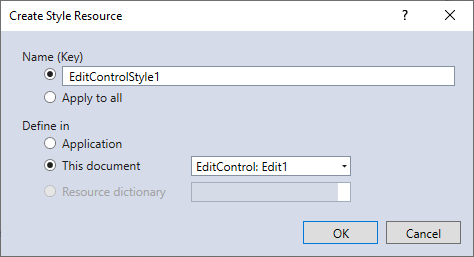
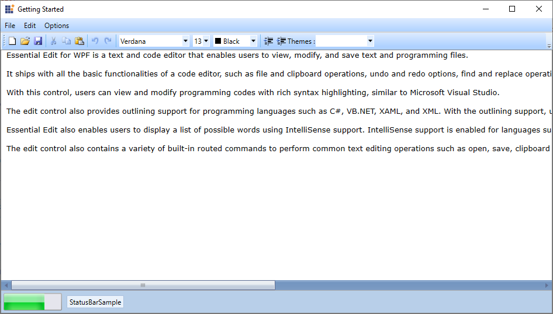

# Status Bar Support

The Essential WPF provides Status Bar support in Edit Control. It is used in Edit Control to show some information about the file path, encoding type, line number and column number. The default visibility for Status Bar is set as false. 

The Status Bar can be enabled/disabled by setting it's visibility and the default properties are displayed in it by enabling the status bar. The Status Bar can be enabled by,





<!--Adding EditControl to application and setting its StatusBarVisiblity to Visible-->

<syncfusion:EditControl Background="White" Name="EditControl1">
   <syncfusion:EditControl.StatusBarSettings >
      <syncfusion:StatusBarSettings Visibility="Visible"/>
   </syncfusion:EditControl.StatusBarSettings>
</syncfusion:EditControl> 





public partial class MainWindow : Window

{

public MainWindow()

{

InitializeComponent();

this.EditControl1.DocumentSource = "../../Source.cs";

this.EditControl1.StatusBarSettings.Visibility = Visibility.Visible;

}

}





public partial class MainWindow : Window

{

public MainWindow()

{

InitializeComponent();

Me.EditControl1.DocumentSource = "../../Source.cs";

Me.EditControl1.StatusBarSettings.Visibility = Visibility.Visible;

}

}





When application executes the following screenshot displays how the Status Bar is added in Edit Control,

**Default Properties in Status Bar**

Status bar shows the file path, encoding type, line number and column number. The visibility of each item in the status bar can be customized by using the below properties.
 
  * **ShowFilePath**: It shows the exact application directory and the file path which was loaded in Edit Control. File Path property can be enabled/disabled by changing it's Visibility property.
  * **ShowLineNumber**: It shows the current line number where the cursor is placed on Edit Control. By changing it's visibility user can enable/disable the line number property.
  * **ShowColumnNumber**: It shows the current column number where the cursor is placed on Edit Control. By changing it's visibility user can enable/disable the Column number property.
  * **ShowEncoding**: It shows the current Encoding type of the loaded file in Edit Control. Encoding property can be enable/disable by changing it's visibility property.

User can also able to handle the default properties by changing it's visibility property and it can be achieved by,





<!--Adding EditControl to application and setting its StatusBarVisiblity to Visible-->

<syncfusion:EditControl Background="White" Name="EditControl1">
   <syncfusion:EditControl.StatusBarSettings >
      <syncfusion:StatusBarSettings Visibility="Visible" ShowFilePath="Visible" ShowLineNumber="Visible" ShowColumnNumber="Visible" ShowEncoding="Visible"/>
   </syncfusion:EditControl.StatusBarSettings>
</syncfusion:EditControl> 





public partial class MainWindow : Window

{

public MainWindow()

{

InitializeComponent();

this.EditControl1.DocumentSource = "../../Source.cs";

this.EditControl1.StatusBarSettings.Visibility = Visibility.Visible;
this.EditControl1.StatusBarSettings.ShowFilePath = Visibility.Visible;
this.EditControl1.StatusBarSettings.ShowLineNumber = Visibility.Visible;
this.EditControl1.StatusBarSettings.ShowColumnNumber = Visibility.Visible;
this.EditControl1.StatusBarSettings.ShowEncoding = Visibility.Visible;

}

}





public partial class MainWindow : Window

{

public MainWindow()

{

InitializeComponent();

Me.EditControl1.DocumentSource = "../../Source.cs";

Me.EditControl1.StatusBarSettings.Visibility = Visibility.Visible;
Me.EditControl1.StatusBarSettings.ShowFilePath = Visibility.Visible;
Me.EditControl1.StatusBarSettings.ShowLineNumber = Visibility.Visible;
Me.EditControl1.StatusBarSettings.ShowColumnNumber = Visibility.Visible;
Me.EditControl1.StatusBarSettings.ShowEncoding = Visibility.Visible;

}

}





User can able to customize the default properties by changing it's Visibility. The following screenshot displays after changing the Show Encoding visibility property changed to Collapsed,

### Status Bar Customization

Status Bar can be customized by enabling the context menu on right clicking the designer XAML file and in that click edit control template then user can append that template to the current edit control class or can able to create a copy on it. In that, user can be able to modify the status bar template according to their needed.

Then user can able to add a Progress Bar or a TextBox as needed to be displayed in that Status Bar by modifying the default template in it.

The following Screenshots shows how the Status Bar in Edit Control template can be modified and displayed. In this, the Progress Bar and TextBox is added by editing the template of Edit Control,

**Status Bar Edit Template**

**Creating a template copy to Edit Control**

**Modifying the codes in XAML**

**Status Bar Customization**

### Styling in Status Bar

Styling for Status Bar can be applied through the Skin Storage set in XAML. This feature supports the following built-in styles,

* Blend

* Default

* Metro

* Office2007Black

* Office2007Blue

* Office2007Silver

* VS2010

The following illustrations shows how the Status Bar is applied with different built-in styles.

**Blend**

**Default**

**Metro**

**Office2007Black**

**Office2007Blue**

**Office2007Silver**

**VS2010**

