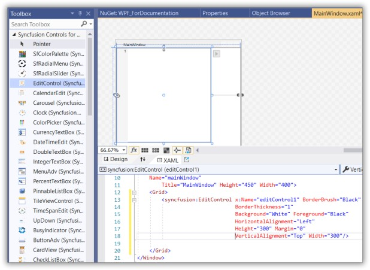

# Getting Started with WPF EditControl

This section explains how to create an interactive code editor application like Microsoft Visual Studio Editor using the [EditControl](https://help.syncfusion.com/cr/wpf/Syncfusion.Edit.Wpf~Syncfusion.Windows.Edit.EditControl.html).

## Assembly deployment

Refer to the [Control Dependencies](https://help.syncfusion.com/wpf/control-dependencies#edit-control) section to get the list of assemblies or NuGet package that needs to be added as a reference to use the control in any application.

Refer to this [documentation](https://help.syncfusion.com/wpf/visual-studio-integration/nuget-packages) to find more details about installing nuget packages in a WPF application.

## Creating simple application with EditControl

You can create Windows Forms application with [EditControl](https://help.syncfusion.com/cr/wpf/Syncfusion.Edit.Wpf~Syncfusion.Windows.Edit.EditControl.html) as follows:

1. [Creating the project](#creating-the-project)
2. [Adding control via Designer](#adding-control-via-designer)
3. [Adding control via XAML](#adding-control-via-XAML)
3. [Adding control via C#](#adding-control-via-C#)
4. [Loading a file into Document](#loading-a-file-into-document)
5. [Syntax Highlighting](#syntax-highlighting)

### Creating the project

Create a new WPF project in Visual Studio to display the EditControl.

## Adding EditControl via designer

The [EditControl](https://help.syncfusion.com/cr/wpf/Syncfusion.Edit.Wpf~Syncfusion.Windows.Edit.EditControl.html) can be added to the application by dragging it from the toolbox and dropping it in the designer view. The following required assembly references will be added automatically:

* Syncfusion.Edit.WPF

* Syncfusion.GridCommon.WPF

* Syncfusion.Shared.WPF

* Syncfusion.Tools.WPF

## Adding WPF EditControl via XAML

To add the [EditControl](https://help.syncfusion.com/cr/wpf/Syncfusion.Edit.Wpf~Syncfusion.Windows.Edit.EditControl.html) manually in XAML, follow these steps:

1) Create a new WPF project in Visual Studio.

2) Add the following required assembly references to the project:

* Syncfusion.Edit.WPF

* Syncfusion.GridCommon.WPF

* Syncfusion.Shared.WPF

* Syncfusion.Tools.WPF

3) Import Syncfusion WPF schema **http://schemas.syncfusion.com/wpf**, and declare the EditControl in XAML page.





<Window
        xmlns="http://schemas.microsoft.com/winfx/2006/xaml/presentation"
        xmlns:x="http://schemas.microsoft.com/winfx/2006/xaml"
        xmlns:d="http://schemas.microsoft.com/expression/blend/2008"
        xmlns:mc="http://schemas.openxmlformats.org/markup-compatibility/2006"
        xmlns:local="clr-namespace:WPF_ForDocumentation"
        xmlns:syncfusion="http://schemas.syncfusion.com/wpf" 
        x:Class="WPF_ForDocumentation.MainWindow"
        mc:Ignorable="d"
         Name="mainWindow"
        Title="MainWindow" Height="450" Width="400">
<Grid>
<syncfusion:EditControl x:Name="editControl1" BorderBrush="Black"
BorderThickness="1"
Background="White" Foreground="Black" 
HorizontalAlignment="Left" 
Height="300" Margin="0" 
VerticalAlignment="Top" Width="300"/>

</Grid>
</Window>





## Adding WPF EditControl via C#

To add the [EditControl](https://help.syncfusion.com/cr/wpf/Syncfusion.Edit.Wpf~Syncfusion.Windows.Edit.EditControl.html) manually in C#, follow these steps:

1) Create a new WPF application via Visual Studio.

2) Add the following required assembly references to the project:

* Syncfusion.Edit.WPF

* Syncfusion.GridCommon.WPF

* Syncfusion.Shared.WPF

* Syncfusion.Tools.WPF

3) Include the required namespace.





using Syncfusion.Windows.Edit;





4) Create an instance of [EditControl](https://help.syncfusion.com/cr/wpf/Syncfusion.Edit.Wpf~Syncfusion.Windows.Edit.EditControl.html), and add it to the window.





        public MainWindow()
        {
            InitializeComponent();

            //Initializing EditControl and setting necessary property values.
            EditControl editControl = new EditControl() {Height = 200, Width = 200, Background = Brushes.White, Foreground = Brushes.Black };
            this.Content = editControl;
        }





## Loading a file into document

This option helps to load a file into the [EditControl](https://help.syncfusion.com/cr/wpf/Syncfusion.Edit.Wpf~Syncfusion.Windows.Edit.EditControl.html).

Essential Edit WPF facilitates users to create, open, modify and save text files and programming language files. EditControl provides built-in support for a variety of text based file formats such as txt, cs, VB, SQL, XAML, and XML. It also enables to specify custom file types in the custom language configurations.

### Opening a file

The [`DocumentSource`](https://help.syncfusion.com/cr/cref_files/wpf/Syncfusion.Edit.Wpf~Syncfusion.Windows.Edit.EditControl~DocumentSource.html) property of EditControl is used to specify the file to be opened with [EditControl](https://help.syncfusion.com/cr/wpf/Syncfusion.Edit.Wpf~Syncfusion.Windows.Edit.EditControl.html). The following code can be used to set the [DocumentSource](https://help.syncfusion.com/cr/cref_files/wpf/Syncfusion.Edit.Wpf~Syncfusion.Windows.Edit.EditControl~DocumentSource.html) property of EditControl is used to specify the file to be opened with EditControl property.





<sfedit:EditControl x:Name="editControl" DocumentSource="C:\Content.txt" ShowLineNumber="False" EnableOutlining="False"/>





editControl.DocumentSource = @"C:\Content.txt";





editControl.DocumentSource = "C:\Content.txt"





Files can also be opened using the [LoadFile](https://help.syncfusion.com/cr/cref_files/wpf/Syncfusion.Edit.Wpf~Syncfusion.Windows.Edit.EditControl~LoadFile.html) method. LoadFile method displays a FileOpenDialog to enable you to choose the file that needs to be opened in the [EditControl](https://help.syncfusion.com/cr/wpf/Syncfusion.Edit.Wpf~Syncfusion.Windows.Edit.EditControl.html).





editControl.LoadFile();





editControl.LoadFile()





### Saving the text in a file

[SaveFile](https://help.syncfusion.com/cr/cref_files/wpf/Syncfusion.Edit.Wpf~Syncfusion.Windows.Edit.EditControl~SaveFile.html) method in the [EditControl](https://help.syncfusion.com/cr/wpf/Syncfusion.Edit.Wpf~Syncfusion.Windows.Edit.EditControl.html) class is used to save the text in EditControl to a file. EditControl does support saving all the built-in languages, file types and custom language file type respectively.





editControl.SaveFile();





editControl.SaveFile()





## Syntax highlighting

The [EditControl](https://help.syncfusion.com/cr/wpf/Syncfusion.Edit.Wpf~Syncfusion.Windows.Edit.EditControl.html) offers mostly used languages like C#, VB, XML, XAML and SQL as built-in languages. It also provides support to configure new custom language.

The [EditControl](https://help.syncfusion.com/cr/wpf/Syncfusion.Edit.Wpf~Syncfusion.Windows.Edit.EditControl.html) has built-in syntax highlighting support for the following languages:

   * C
   * C Sharp
   * Custom
   * Delphi
   * HTML
   * Java
   * J Script
   * PowerShell
   * Text
   * VBScript
   * Visual Basic
   * XML
   * XAML
   * SQL
   
With the language support, [EditControl](https://help.syncfusion.com/cr/wpf/Syncfusion.Edit.Wpf~Syncfusion.Windows.Edit.EditControl.html) enables the users to create, open, modify and save programming codes from different file types. EditControl provides built in Syntax highlighting and outlining support for all supported languages with SQL being exception in outlining support. It also provides built-in IntelliSense support for all procedural languages such as C# and Visual Basic.

The [`DocumentLanguage`](https://help.syncfusion.com/cr/cref_files/wpf/Syncfusion.Edit.Wpf~Syncfusion.Windows.Edit.EditControl~DocumentLanguage.html) property in the EditControl class enables the users to select the language. DocumentLanguage is a Language enum type property with default value as Text. The following lines of code can be used to change the [DocumentLanguage](https://help.syncfusion.com/cr/cref_files/wpf/Syncfusion.Edit.Wpf~Syncfusion.Windows.Edit.EditControl~DocumentLanguage.html) property.





<sfedit:EditControl x:Name="editControl" DocumentLanguage="CSharp" DocumentSource="C:\Source.cs" FontSize="13"/>





editControl.DocumentLanguage = Languages.CSharp;





editControl.DocumentLanguage = Languages.CSharp





