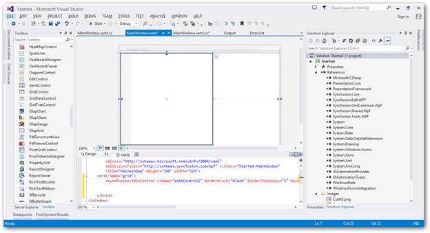

# Getting Started

This section explains how to get started with the EditControl.

## Adding EditControl to an application

The EditControl can be added to an application by using the Visual Studio.

### Creating an EditControl using XAML 

1. Drag and drop the EditControl available in the Visual Studio Toolbox as follows.

N> If the EditControl is not listed in the toolbox, add it manually from the Syncfusion.Edit.Wpf assembly which is to be added to the project references folder.

The EditControl can be created in XAML as follows.




<syncfusion:EditControl x:Name="editControl1" BorderBrush="Black" BorderThickness="1" Background="White" Foreground="Black" HorizontalAlignment="Left" Height="300" Margin="0" VerticalAlignment="Top" Width="300"/>





### Creating an EditControl using C#

The EditControl can be created in C# as follows.





[C#]

EditControl EditControl = new EditControl();





