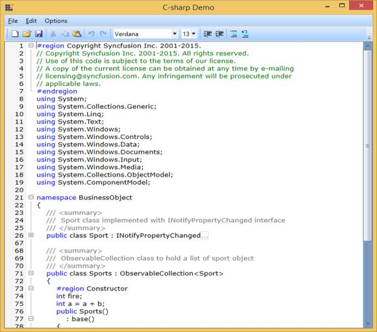

# Supported Languages

Edit for WPF provides built-in support for a procedural and markup languages such as C#, Visual Basic, XAML and XML. It also supports SQL language and facilitates the users to provide custom language configurations.

With the language support, EditControl enables the users to create, open, modify and save programming codes from different file types. EditControl provides built in Syntax highlighting and outlining support for all supported languages with SQL being exception in outlining support. It also provides built-in IntelliSense support for all procedural languages such as C# and Visual Basic.

The `DocumentLanguage` property in the EditControl class enables the users to select the language. DocumentLanguage is a Language enum type property with default value as Text. The following lines of code can be used to change the DocumentLanguage property.





<sfedit:EditControl x:Name="editControl" DocumentLanguage="CSharp" DocumentSource="C:\Source.cs" FontSize="13"/>





editControl.DocumentLanguage = Languages.CSharp;





The following image displays the EditControl displaying contents.

