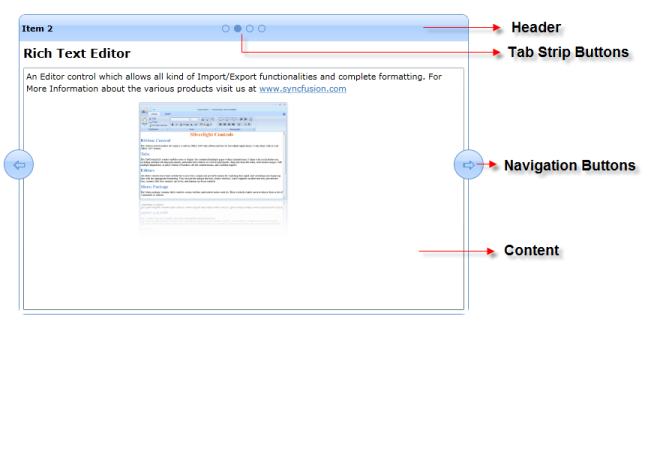

# WPF Tab Navigation Overview

Tab Navigation is a new control for displaying the contents of the control with transition effects. Tab navigation control facilitates the display of pages/items (with transition effects) like an Ad rotator in web applications, thereby enhancing the UI’s look and feel. It supports only .NET Framework version 4.0. 

## Appearance and structure of the control

The following are the key features of this control:

### Items source binding

It helps the control to be applicable to all MVVM based Silverlight applications. It supports the following:

* Observable Collection—any modification done to the collection items will get reflected on the UI of the control.  Such a collection is bound to the control.
* ILIST binding—this list is based on all collections such as List, Queue, Stack and so on, that are bound to the control.
* XML binding—the XML data are bound to the control.

### Item templates

* Data Templates—this is used to display data visually on the UI in a predefined format.
* Template Selectors—this allows you to choose templates for data items that will be displayed on the UI

### Transition effects

This enhances navigation by providing different navigation or transition effects. The following effects are supported:

* Slide
* Fade
* Zoom
* Blur
* Push
* PushIn
* Wipe

### Use case scenario

Tab navigation control helps you to use information as banners in web applications such as Picasa. Therefore, it can be used as website banners. As it has virtualization support, it can also be used as tab control.

