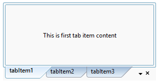
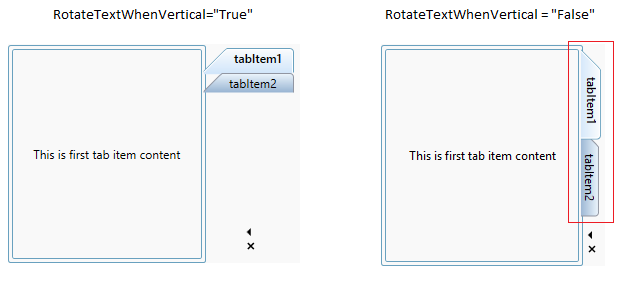
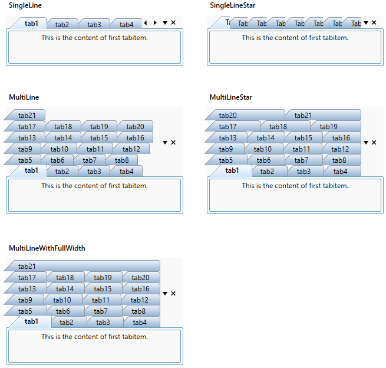

# Arranging tab items in TabControl (TabControlExt)

This section explains how to arrange the tab item and its alignment functionalities in the [TabControl](https://help.syncfusion.com/cr/wpf/Syncfusion.Tools.Wpf~Syncfusion.Windows.Tools.Controls.TabControlExt.html).

## Rearrange position of tab items

If you want to rearrange the tab items position, drag that item and drop to anywhere you want to place it in the tab panel. You can restrict it by setting the [AllowDragDrop](https://help.syncfusion.com/cr/wpf/Syncfusion.Tools.Wpf~Syncfusion.Windows.Tools.Controls.TabControlExt~AllowDragDrop.html) property value as `false`. The default value of `AllowDragDrop` property is `true`. The drag marker will preview the location, where you drop the dragged tab item.

 


<syncfusion:TabControlExt AllowDragDrop="True" >
    <syncfusion:TabItemExt Header="tabItem1" />
    <syncfusion:TabItemExt Header="tabItem2" />
</syncfusion:TabControlExt>




tabControlExt.AllowDragDrop = true;




N> View [Sample]() in GitHub

### change drag marker color

You can change the drag marker color by setting the color value for the [DragMarkerColor](https://help.syncfusion.com/cr/wpf/Syncfusion.Tools.Wpf~Syncfusion.Windows.Tools.Controls.TabControlExt~DragMarkerColor.html) property. The default value of `DragMarkerColor` property is `Black`.




<syncfusion:TabControlExt DragMarkerColor="Red" 
                          AllowDragDrop="True">
    <syncfusion:TabItemExt Header="tabItem1" />
    <syncfusion:TabItemExt Header="tabItem2" />
</syncfusion:TabControlExt>




tabControlExt.DragMarkerColor = Brushes.Red;
tabControlExt.AllowDragDrop = true;




N> View [Sample]() in GitHub

## Tab items alignment

Tab items can be aligned to any side of the `TabControl` by using the [TabStripPlacement](https://help.syncfusion.com/cr/wpf/Syncfusion.Tools.Wpf~Syncfusion.Windows.Tools.Controls.TabControlSettings~TabStripPlacement.html) property. The default value of `TabStripPlacement` property is `Top`.

The following TabStrip placement options are supported by the `TabControl`.

* Top - Tab items are placed at top of the `TabControl`.
* Bottom - Tab items are placed at bottom of the `TabControl`.
* Left - Tab items are placed at left side of the `TabControl`.
* Right - Tab items are placed at right side of the `TabControl`.




<syncfusion:TabControlExt TabStripPlacement="Bottom">
    <syncfusion:TabItemExt Header="tabItem1" />
    <syncfusion:TabItemExt Header="tabItem2" />
</syncfusion:TabControlExt>




tabControlExt.TabStripPlacement = Dock.Bottom;




N> View [Sample]() in GitHub

### Rotating the tab items

Whenever the `TabStripPlacement` is set to `Left` or `Right`, the tab headers are vertically arranged. To improve the user readability, the tab items can be rotated by using the [RotateTextWhenVertical](https://help.syncfusion.com/cr/wpf/Syncfusion.Tools.Wpf~Syncfusion.Windows.Tools.Controls.TabControlExt~RotateTextWhenVertical.html) property as `true`. The default value of `RotateTextWhenVertical` property is `false`.




<syncfusion:TabControlExt RotateTextWhenVertical="True"
                          TabStripPlacement="Right">
    <syncfusion:TabItemExt Header="tabItem1" />
    <syncfusion:TabItemExt Header="tabItem2" />
</syncfusion:TabControlExt>




tabControlExt.RotateTextWhenVertical = true;
tabControlExt.TabStripPlacement = Dock.Right;




N> View [Sample]() in GitHub

## Arrange tab item in multiple line

 If you add more tabs and they exceed the `TabControl` size, then they are in collapsed state and can navigate to that tabs only by using the scroll button. You can show all the tabs in the tab panel by setting the [TabItemLayout](https://help.syncfusion.com/cr/wpf/Syncfusion.Tools.Wpf~Syncfusion.Windows.Tools.Controls.TabControlExt~TabItemLayout.html) property value as `MultiLine` or `MultiLineWithFullWidth`. The default value of `TabItemLayout` property is `Single`.

`TabControl` provides the following layout types.

* SingleLine – Tab items are displayed in single line
* MultiLine – Tab items are shrunk and displayed in multiple lines
* MultiLineWithFillWidth – Tab items are displayed in multiple lines without being shrunk




<syncfusion:TabControlExt TabItemLayout="MultiLine" 
                          Width="300"
                          Name="tabControlExt">
    <syncfusion:TabItemExt Header="tabItem1" />
    <syncfusion:TabItemExt Header="tabItem2" />
</syncfusion:TabControlExt>




tabControlExt.TabItemLayout = TabItemLayoutType.MultiLine;




N> View [Sample]() in GitHub

## Switching between tab items

This section explains how to switching between tab item in the [TabControl](https://help.syncfusion.com/cr/wpf/Syncfusion.Tools.Wpf~Syncfusion.Windows.Tools.Controls.TabControlExt.html).

###  Navigate using mouse and keys interaction

You can navigate from one tab to any other tab by using the mouse click on the tab header. You also use the `Left-Arrow` and `Right-Arrow` key or `F2` key or `Ctrl + F2` key , to navigate the previous tab item or next tab item from the current tab item.

### Navigate using scroll button

If you add more tab items, then some tab headers are collapsed. If you navigate to the collapsed tab items, click the scroll button which is placed in the top-right corner of the tab header panel. You can auto visible or hide the scroll button by using the [TabScrollButtonVisibility](https://help.syncfusion.com/cr/wpf/Syncfusion.Tools.Wpf~Syncfusion.Windows.Tools.Controls.TabControlExt~TabScrollButtonVisibility.html) property value as `Auto` or `Hidden`. You can easily navigate to first or last or next or previous tab items by setting the [TabScrollStyle](https://help.syncfusion.com/cr/wpf/Syncfusion.Tools.Wpf~Syncfusion.Windows.Tools.Controls.TabControlExt~TabScrollStyle.html) property value as `Extended`, then it will show the `First`, `Last`, `Next`, `Previous` button options. The default value of the `TabScrollStyle` property is `Normal`.

The following `TabScrollStyle` supported by the `TabControl` control.

* Extended Mode - Provides the Next, Previous, Last and First navigation options
* Normal Mode – Provides the Next and Previous navigation options only




<syncfusion:TabControlExt TabScrollButtonVisibility="Auto"
                          TabScrollStyle="Extended" 
                          Width="300"
                          Name="tabControlExt">
    <syncfusion:TabItemExt Header="tabItem1" />
    <syncfusion:TabItemExt Header="tabItem2" />
</syncfusion:TabControlExt>




tabControlExt.TabScrollButtonVisibility = TabScrollButtonVisibility.Auto;
tabControlExt.TabScrollStyle = TabScrollStyle.Extended;




N> View [Sample]() in GitHub

### Navigate using tab list menu

You can easily navigate to any tab item by using the tab list menu which is placed in the top-right corner of the tab header panel .The header of all tab item’s are shown as a menu item in the tab list menu. You can hide this tab list menu by using the [ShowTabListContextMenu](https://help.syncfusion.com/cr/wpf/Syncfusion.Tools.Wpf~Syncfusion.Windows.Tools.Controls.TabControlExt~ShowTabListContextMenu.html) property value as `false`.  The default value of `ShowTabListContextMenu` property is `true`.




<syncfusion:TabControlExt ShowTabListContextMenu="True"
                          Name="tabControlExt">
    <syncfusion:TabItemExt Header="tabItem1" />
    <syncfusion:TabItemExt Header="tabItem2" />
</syncfusion:TabControlExt>




tabControlExt.ShowTabListContextMenu = true;




