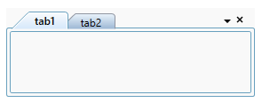

# Data Binding in WPF TabControl

The [TabControl](https://help.syncfusion.com/cr/wpf/Syncfusion.Tools.Wpf~Syncfusion.Windows.Tools.Controls.TabControlExt.html) can bound to an external source to auto create tabs and display the data using `ItemsSource` property.

## Binding ItemsSource

The TabControl auto generates the tabitem based on the data source set to [TabControlExt.ItemsSource](https://docs.microsoft.com/en-us/dotnet/api/system.windows.controls.itemscontrol.itemssource?redirectedfrom=MSDN&view=netframework-4.8#System_Windows_Controls_ItemsControl_ItemsSource).

N> TabControl auto creates the tabitem only if [ItemTemplate](https://docs.microsoft.com/en-us/dotnet/api/system.windows.controls.itemscontrol.itemtemplate?view=netframework-4.8) or `HeaderTemplate` in [ItemContainerStyle](https://docs.microsoft.com/en-us/dotnet/api/system.windows.controls.itemscontrol.itemcontainerstyle?view=netframework-4.8) property is defined.

If the data source implements [INotifyCollectionChanged](https://msdn.microsoft.com/en-us/library/System.Collections.Specialized.INotifyCollectionChanged) interface, then TabControl will automatically refresh the UI when item is added, removed or cleared in the collection. When an item is added or removed in [ObservableCollection](https://docs.microsoft.com/en-us/dotnet/api/system.collections.objectmodel.observablecollection-1?redirectedfrom=MSDN&view=netframework-4.8), TabControl automatically refresh the UI as `ObservableCollection` implements `INotifyCollectionChanged`. But when an item is added or removed in List, TabControl will not refresh the UI automatically.

To bind `ItemsSource` to TabControl, you need to have collection with data object which holds header and content details.

Here, Model class defined with Header and Content properties and ViewModel class has `ItemsSource` property of type `ObservableCollection<Model>`.

N> Download demo application from [GitHub](https://github.com/SyncfusionExamples/wpf-tabcontrol-databinding)

**Model.cs:**





public class Model
{
    private string header;
    public string Header
    {
        get { return header; }
        set
        {
            header = value;
            this.RaisePropertyChanged("Header");
        }
    }
    private string content;
    public string Content
    {
        get { return content; }
        set
        {
            content = value;
            this.RaisePropertyChanged("Content");
        }
    }
    public Model()
    {
    }
}





**ViewModel.cs:**





public class ViewModel : NotificationObject
{
    private ObservableCollection<Model> tabItems;
    public ObservableCollection<Model> TabItems
    {
        get { return tabItems; }
        set 
        { 
            tabItems = value;
            this.RaisePropertyChanged("TabItems"); 
        }
    }
    public ViewModel()
    {
        tabItems = new ObservableCollection<Model>();
        PopulateCollection();
    }
    private void PopulateCollection()
    {
        Model model = new Model() { Header = "tab1", Content="This is the first tabitem's content." };
        Model model1 = new Model() { Header = "tab2", Content="This is the second tabitem's content." };
        tabItems.Add(model);
        tabItems.Add(model1);
    }
}





When you are auto generating tabitem using `ItemsSource`, you need to set [HeaderTemplate](https://docs.microsoft.com/en-us/dotnet/api/system.web.ui.webcontrols.templatefield.headertemplate?view=netframework-4.8) property in [TabControlExt.ItemContainerStyle](https://docs.microsoft.com/en-us/dotnet/api/system.windows.controls.itemscontrol.itemcontainerstyle?view=netframework-4.8) or [ItemTemplate](https://docs.microsoft.com/en-us/dotnet/api/system.windows.controls.itemscontrol.itemtemplate?view=netframework-4.8) to define header and content for tabitem.  

In the below code, `ViewModel` bound to TabControl and `ItemContainerStyle.HeaderTemplate` is defined to populate TabControl with content and header.





<Window.DataContext>
        <local:ViewModel />
</Window.DataContext>
 <Grid>
    <syncfusion:TabControlExt X:Name="tabControl" 
                              Height="100" Width="280" 
                              ItemsSource="{Binding TabItems}" />
        <syncfusion:TabControlExt.ItemContainerStyle>
            
        </syncfusion:TabControlExt.ItemContainerStyle>
        <syncfusion:TabControlExt.ContentTemplate>
            <DataTemplate>
                <TextBlock Text="{Binding Content}" />
            </DataTemplate>
        </syncfusion:TabControlExt.ContentTemplate>
    </syncfusion:TabControlExt>
</Grid>





N> Tab items are populated based on ItemsSource only if `ItemContainerStyle.HeaderTemplate` or `ItemTemplate` is defined.

## TabItem Header

You can define tabitem header using [ItemTemplate](https://docs.microsoft.com/en-us/dotnet/api/system.windows.controls.itemscontrol.itemtemplate?view=netframework-4.8) or `HeaderTemplate` in [ItemContainerStyle](https://docs.microsoft.com/en-us/dotnet/api/system.windows.controls.itemscontrol.itemcontainerstyle?view=netframework-4.8) properties. Otherwise, TabItem header will display the data object class name associated with tabitem.

N> The data object associated with tabitem is the BindingContext for both `ItemContainerStyle.HeaderTemplate` and `ItemTemplate`.

Below code is used to define the tabitem header using `HeaderTemplate` in `ItemContainerStyle` property.





<Window.DataContext>
        <local:ViewModel />
</Window.DataContext>
<Grid>
    <syncfusion:TabControlExt x:Name="tabControl" 
                          Height="100" Width="280" 
                          ItemsSource="{Binding TabItems}">
        <syncfusion:TabControlExt.ItemContainerStyle>
            
        </syncfusion:TabControlExt.ItemContainerStyle>
    </syncfusion:TabControlExt>
</Grid>





Below code is used to define the tabitem header using `ItemTemplate` property.





<Window.DataContext>
        <local:ViewModel />
</Window.DataContext>
<Grid>
    <syncfusion:TabControlExt x:Name="tabControl" 
                          Height="100" Width="280" 
                          ItemsSource="{Binding TabItems}">
        <syncfusion:TabControlExt.ItemTemplate>
            <DataTemplate>
                <TextBlock Text="{Binding Header}"/>
            </DataTemplate>
        </syncfusion:TabControlExt.ItemTemplate>
    </syncfusion:TabControlExt>
</Grid>





## TabItem content

You can define the tabitem content using [TabControlExt.ContentTemplate](https://docs.microsoft.com/en-us/dotnet/api/system.windows.controls.contentcontrol.contenttemplate?view=netframework-4.8) property. Otherwise, TabItem content will display the data object class name which is associated with tabitem.





<Window.DataContext>
        <local:ViewModel />
</Window.DataContext>
<Grid>
    <syncfusion:TabControlExt x:Name="tabControl" 
                          Height="100" Width="280" 
                          ItemsSource="{Binding TabItems}"
                          >
        <syncfusion:TabControlExt.ContentTemplate>
            <DataTemplate>
                <TextBlock Text="{Binding Content}" />
            </DataTemplate>
        </syncfusion:TabControlExt.ContentTemplate>
    </syncfusion:TabControlExt>    
</Grid>





