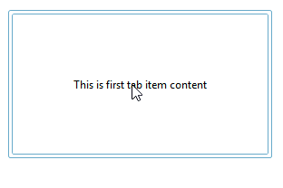
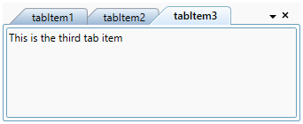
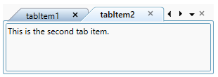
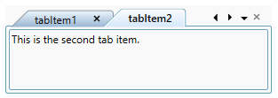
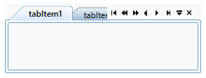

# Getting Started with TabControl

This section explains how to create a WPF [TabControl](https://help.syncfusion.com/cr/wpf/Syncfusion.Tools.Wpf~Syncfusion.Windows.Tools.Controls.TabControlExt.html) and explains about its structure.

## Structure of TabControl

The various elements of `TabControl` are illustrated in the following images.

## Assembly deployment

Refer to the [Control Dependencies](https://help.syncfusion.com/wpf/control-dependencies#tabcontrolext) section to get the list of assemblies or NuGet package that needs to be added as a reference to use the control in any application.

Refer to this [documentation](https://help.syncfusion.com/wpf/visual-studio-integration/nuget-packages) to find more details about installing nuget packages in a WPF application.

## Adding WPF TabControl via designer

N> Download demo application from [GitHub](https://github.com/SyncfusionExamples/getting-started-with-wpf-tabcontrol)

You can add the `TabControl` control to an application by dragging it from the toolbox to a view of the designer. The following dependent assembly will be added automatically.

* Syncfusion.Tools.WPF
* Syncfusion.Shared.WPF

## Adding WPF TabControl via XAML

To add the `TabControl` manually in XAML, follow these steps:

1) Create a new WPF project in Visual Studio.

2) Add the following required assembly references to the project:

    * Syncfusion.Tools.WPF
    * Syncfusion.Shared.WPF

3) Import Syncfusion WPF schema **http://schemas.syncfusion.com/wpf**, and declare the `TabControl` in XAML page.





<Window x:Class="TabControlExt_sample.MainWindow"
        xmlns="http://schemas.microsoft.com/winfx/2006/xaml/presentation"
        xmlns:x="http://schemas.microsoft.com/winfx/2006/xaml"
        xmlns:d="http://schemas.microsoft.com/expression/blend/2008"
        xmlns:mc="http://schemas.openxmlformats.org/markup-compatibility/2006"
        xmlns:local="clr-namespace:TabControlExt_sample"
        xmlns:syncfusion="http://schemas.syncfusion.com/wpf"
        mc:Ignorable="d"
        Title="MainWindow" Height="450" Width="800">

<Grid Name="grid">
    <syncfusion:TabControlExt Name="tabControl" Height="100" Width="280" />
</Grid>





## Adding WPF TabControl via C#

To add the `TabControl` control manually in C#, follow these steps:

1. Create a new WPF application via Visual Studio.

2. Add the  following assembly references to the project,
    * Syncfusion.Shared.WPF

3. Include the required namespace and create an instance of `TabControl` and add it to the window.

4.	Declare the `TabControl` control using C#.




using Syncfusion.Windows.Tools.Controls;

public partial class MainWindow : Window {
    public MainWindow() {
        InitializeComponent();

        // Creating an instance of the TabControl
        TabControlExt tabControlExt = new TabControlExt();

        // Setting height and width to TabControl
        tabControlExt.Height = 100;
        tabControlExt.Width = 280;

        //Adding TabControl as window content
        this.Content = tabControlExt;
    }
}




## Adding TabItem

You can add the tabitem using the `Items` property of `TabControl`. You can set the tabitem name using `TabItemExt` property and add the content to each tabitem by using `TabItemExt.Content` property.




<syncfusion:TabControlExt Name="tabControlExt">
    <syncfusion:TabItemExt Header="tabItem1">
        <TextBlock Name="textBlock" Text="This is the first tab item." />
    </syncfusion:TabItemExt>
    <syncfusion:TabItemExt Header="tabItem2">
        <TextBlock Name="textBlock1" Text="This is the second tab item." />
    </syncfusion:TabItemExt>
    <syncfusion:TabItemExt Header="tabItem3">
        <TextBlock Name="textBlock2" Text="This is the third tab item." />
    </syncfusion:TabItemExt>
</syncfusion:TabControlExt>




// Creating an instances of tabitems and adding header & content
TabItemExt tabItemExt1 = new TabItemExt() 
{
    Header= "tabItem1", 
    Content= new TextBlock() { Text= "This is the first tab item" }  
};

TabItemExt tabItemExt2 = new TabItemExt() 
{
    Header= "tabItem2", 
    Content= new TextBlock() { Text= "This is the second tab item" }  
};

TabItemExt tabItemExt3 = new TabItemExt() 
{
    Header= "tabItem3", 
    Content= new TextBlock() { Text= "This is the third tab item" }  
};

// Creating an instances of TabControl and adding the tabitems into the TabControl
TabControlExt tabControlExt = new TabControlExt();
tabControlExt.Items.Add(tabItemExt1);
tabControlExt.Items.Add(tabItemExt2);
tabControlExt.Items.Add(tabItemExt3);




 

Please refer [this](https://help.syncfusion.com/wpf/tabcontrol/databinding) page to know about how to add a tab item using Data Binding.

## Placement of TabItem

You can place the tabitem header at any of the four sides of TabControl using the [TabStripPlacement](https://help.syncfusion.com/cr/wpf/Syncfusion.Tools.Wpf~Syncfusion.Windows.Tools.Controls.TabControlSettings~TabStripPlacement.html) property.




<syncfusion:TabControlExt TabStripPlacement="Bottom" 
                          Name="tabControlExt">
    <syncfusion:TabItemExt Header="tabItem1" />
    <syncfusion:TabItemExt Header="tabItem2" />
    <syncfusion:TabItemExt Header="tabItem3" />
</syncfusion:TabControlExt>




tabControlExt.TabStripPlacement = Dock.Bottom;




## Display mode of the TabControl

If you want to show tab items without its headers in the `TabControl`, use the [FullScreenMode](https://help.syncfusion.com/cr/wpf/Syncfusion.Tools.Wpf~Syncfusion.Windows.Tools.Controls.TabControlExt~FullScreenMode.html) property. If you set `FullScreenMode` property value as `ControlMode`, then it will auto hide headers and show it only on when hover the mouse on respective tab header placed area. You can also display the `TabControl` in the full window by setting the `FullScreenMode` property value as `WindowMode`. The default value of `FullScreenMode` property is `None`.




<syncfusion:TabControlExt FullScreenMode="ControlMode"
                          TabStripPlacement="Bottom"
                          Name="tabControlExt">
    <syncfusion:TabItemExt Header="tabItem1" />
    <syncfusion:TabItemExt Header="tabItem2" />
    <syncfusion:TabItemExt Header="tabItem3" />
</syncfusion:TabControlExt>




tabControlExt.FullScreenMode = FullScreenMode.ControlMode;
tabControlExt.TabStripPlacement = Dock.Bottom;




## Selecting TabItem

You can select a particular tabitem in `TabControl` by setting the `TabItemExt.IsSelected` property to `true`. You can select only one tab at a time.




<syncfusion:TabControlExt Name="tabControlExt">
    <syncfusion:TabItemExt Header="tabItem1" Name="tabItemExt1"/>
    <syncfusion:TabItemExt Header="tabItem2" Name="tabItemExt2" />
    <syncfusion:TabItemExt Header="tabItem3" Name="tabItemExt3"    
                           IsSelected="True"/>
</syncfusion:TabControlExt>




tabItemExt3.IsSelected = true;




Here, `tabItem3` is selected.

### Tab selection changed notification

The `TabControl` notifies that the selected tabitem is changed by user through the [SelectedItemChangedEvent](https://help.syncfusion.com/cr/wpf/Syncfusion.Tools.Wpf~Syncfusion.Windows.Tools.Controls.TabControlExt~SelectedItemChangedEvent_EV.html) event. You can use the [OldSelectedItem](https://help.syncfusion.com/cr/wpf/Syncfusion.Tools.Wpf~Syncfusion.Windows.Tools.Controls.SelectedItemChangedEventArgs~OldSelectedItem.html) and [NewSelectedItem](https://help.syncfusion.com/cr/wpf/Syncfusion.Tools.Wpf~Syncfusion.Windows.Tools.Controls.SelectedItemChangedEventArgs~NewSelectedItem.html) properties to get the old and new selected tabitem in the `SelectedItemChangedEvent` event.




<syncfusion:TabControlExt SelectedItemChangedEvent="TabControlExt_SelectedItemChangedEvent"
                          Name="tabControlExt" />




TabControlExt tabControlExt = new TabControlExt();
tabControlExt.SelectedItemChangedEvent += TabControlExt_SelectedItemChangedEvent;




You can handle the event as follows:




private void TabControlExt_SelectedItemChangedEvent(object sender, SelectedItemChangedEventArgs e) {
    var newTabItem = e.NewSelectedItem.Header;
    if (e.OldSelectedItem != null) {
        var oldTabItem = e.OldSelectedItem.Header;
    }
    else {
        var oldTabItem = string.Empty;
    }
}




## Working with tab close button

`TabControl` allows end-users to close the tabs using close button. The close button can be displayed in `Tabcontrol` using [TabControlExt.CloseButtonType](https://help.syncfusion.com/cr/wpf/Syncfusion.Tools.Wpf~Syncfusion.Windows.Tools.Controls.TabControlExt~CloseButtonType.html) property. 
The following options are supported to show close the button in `TabControl`.

* **Common** - Only, `TabControl` shows the close button.

* **Individual** - The close button displayed only in the headers of tab items.

* **Both** - `TabControl` and tab items displays the close button.

* **Hide** - The close button is not visible.

* **IndividualOnMouseOver** - The close button displayed only when the mouse is over the tabitem.

* **Extended** - The close button displayed only for the selected tabitem and the remaining tabitem displays close button while mouse is over the tab header.

For example, when you set the `TabControlExt.CloseButtonType` as `Both`, then the close button is displayed in both TabItem and TabControl. 




<syncfusion:TabControlExt Name="tabControlExt" CloseButtonType="Both">
    <syncfusion:TabItemExt Header="tabItem1" />
    <syncfusion:TabItemExt Header="tabItem2" />
</syncfusion:TabControlExt>




//set `Both` option to `CloseButtonType` property.
tabControlExt.CloseButtonType = CloseButtonType.Both;




### Disable particular tab close button

You can disable the users from closing on particular tabitem by setting [TabItemExt.CanClose](https://help.syncfusion.com/cr/wpf/Syncfusion.Tools.Wpf~Syncfusion.Windows.Tools.Controls.TabItemExt~CanClose.html) property as `false`.




<syncfusion:TabControlExt CloseButtonType="Both"
                  Name="tabControlExt" >
    <syncfusion:TabItemExt Header="tabItem1" Name="tabItem1"/>
    <syncfusion:TabItemExt Header="tabItem2" Name="tabItem2"
                           CanClose="False" />
</syncfusion:TabControlExt>




//set `Both` option to `CloseButtonType` property.
tabControlExt.CloseButtonType = CloseButtonType.Both;

//Disable the close button.
tabItem2.CanClose = false;




In the below screenshot, second tabitem `TabItemExt.CanClose` property is `false`. So, close button in tabitem header and `TabControl` is in disabled state for second tabitem.

### Hide particular tab close button

If you want to hide the visibility of close button in particular tabitem, then you can collapse using [TabItemExt.CloseButtonState](https://help.syncfusion.com/cr/wpf/Syncfusion.Tools.Wpf~Syncfusion.Windows.Tools.Controls.TabItemExt~CloseButtonState.html) property value as `Collapsed`.




<syncfusion:TabControlExt CloseButtonType="Both" 
                          Name="tabControlExt" >
    <syncfusion:TabItemExt Header="tabItem1" Name="tabItem1" />         
    <syncfusion:TabItemExt Header="tabItem2" Name="tabItem2"
                           CloseButtonState="Collapsed" 
                           CanClose="False"/>
</syncfusion:TabControlExt>




//set `Both` option to `CloseButtonType` property.
tabControlExt.CloseButtonType = CloseButtonType.Both;

//Disable the close button.
tabItem2.CanClose = false;

//Collapse the close button.
tabItem2.CloseButtonState = Collapsed;




Here, `tabItem2` close button is collapsed.

## Add new TabItem using new button

You can add the new tabitem by clicking the New button. You can show the new tab button by setting the [TabControlExt.IsNewButtonEnabled](https://help.syncfusion.com/cr/wpf/Syncfusion.Tools.Wpf~Syncfusion.Windows.Tools.Controls.TabControlExt~IsNewButtonEnabled.html) property to `true` in `TabControl`. The [NewButtonClick](https://help.syncfusion.com/cr/wpf/Syncfusion.Tools.Wpf~Syncfusion.Windows.Tools.Controls.TabControlExt~NewButtonClick_EV.html) event handles the click action of new tab button to add new tabitem in `TabControl`.




<syncfusion:TabControlExt IsNewButtonEnabled="True" 
                          NewButtonClick="TabControlExt_NewButtonClick" 
                          Name="tabControlExt" >
    <syncfusion:TabItemExt Header="tabItem1" />
    <syncfusion:TabItemExt Header="tabItem2" />
</syncfusion:TabControlExt>




tabControlExt.IsNewButtonEnabled = true;
tabControlExt.NewButtonClick += TabControlExt_NewButtonClick;




private void TabControlExt_NewButtonClick(object sender, EventArgs e) {
    TabItemExt itemExt = new TabItemExt();
    itemExt.Header = "tabItem" + (tabControlExt.Items.Count + 1);

    //Add a new item in a TabControl
    tabControlExt.Items.Add(itemExt);
}




## Show or hide TabList context menu

You can show the tab list context menu by setting the [TabControlExt.ShowTabListContextMenu](https://help.syncfusion.com/cr/wpf/Syncfusion.Tools.Wpf~Syncfusion.Windows.Tools.Controls.TabControlExt~ShowTabListContextMenu.html) property to `true` in `TabControl`.




<syncfusion:TabControlExt ShowTabListContextMenu="True" 
                          Name="tabControlExt" >
    <syncfusion:TabItemExt Header="tabItem1" />
    <syncfusion:TabItemExt Header="tabItem2" />
</syncfusion:TabControlExt>




tabControlExt.ShowTabListContextMenu = true;




## Enable or disable tab navigation bar

You can enable or disable the  the tab navigation bar in `TabControl` by using the [TabScrollButtonVisibility](https://help.syncfusion.com/cr/wpf/Syncfusion.Tools.Wpf~Syncfusion.Windows.Tools.Controls.TabControlExt~TabScrollButtonVisibility.html) property value as `Visible` or `Hidden`. You can show the different tab navigation style in `TabControl` using the [TabScrollStyle](https://help.syncfusion.com/cr/wpf/Syncfusion.Tools.Wpf~Syncfusion.Windows.Tools.Controls.TabControlExt~TabScrollStyle.html) property.




<syncfusion:TabControlExt TabScrollButtonVisibility="Visible"
                          TabScrollStyle="Extended" 
                          Name="tabControlExt" >
    <syncfusion:TabItemExt Header="tabItem1" />
    <syncfusion:TabItemExt Header="tabItem2" />
</syncfusion:TabControlExt>




tabControlExt.TabScrollButtonVisibility = TabScrollButtonVisibility.Visible;
tabControlExt.TabScrollStyle = TabScrollStyle.Extended;




## Show or hide built-in context menu

You can show the built-in context menu of the tabitem by setting the [ShowTabItemContextMenu](https://help.syncfusion.com/cr/wpf/Syncfusion.Tools.Wpf~Syncfusion.Windows.Tools.Controls.TabControlExt~ShowTabItemContextMenu.html) property to `true` in `TabControl`.

The built-in context menu of the tab item has following menu items:

* **Close** - Closes the current or selected tab item.
* **Close All But This** - Closes all the tab items, except the current or selected tab item.
* **Close All** - Closes all the tab items.




<syncfusion:TabControlExt ShowTabItemContextMenu="True"
                          Name="tabControlExt" >
    <syncfusion:TabItemExt Header="tabItem1" />
    <syncfusion:TabItemExt Header="tabItem2" />
</syncfusion:TabControlExt>




//Changing the visibility of context menu
tabControlExt.ShowTabItemContextMenu = true;




You can add custom context menu item using the [TabItemExt.ContextMenuItems](https://help.syncfusion.com/cr/wpf/Syncfusion.Tools.Wpf~Syncfusion.Windows.Tools.Controls.TabItemExt~ContextMenuItems.html) property in `TabControl`. This property is enabled by setting the [IsCustomTabItemContextMenuEnabled](https://help.syncfusion.com/cr/wpf/Syncfusion.Tools.Wpf~Syncfusion.Windows.Tools.Controls.TabControlExt~IsCustomTabItemContextMenuEnabled.html) property to `true`.




<syncfusion:TabControlExt IsCustomTabItemContextMenuEnabled="True" 
                          Name="tabControlExt">
    <syncfusion:TabItemExt Header="tabItem1" Name="tabItem1">
        <syncfusion:TabItemExt.ContextMenuItems>
            <syncfusion:CustomMenuItem Header="Menu1" />
        </syncfusion:TabItemExt.ContextMenuItems>
    </syncfusion:TabItemExt>
    <syncfusion:TabItemExt Header="tabItem2" Name="tabItem2">
        <syncfusion:TabItemExt.ContextMenuItems>
            <syncfusion:CustomMenuItem Header="Menu2" />
        </syncfusion:TabItemExt.ContextMenuItems>
    </syncfusion:TabItemExt>
</syncfusion:TabControlExt>




// Enabling custom tabitem context menu
tabControlExt.IsCustomTabItemContextMenuEnabled = true;

// Adding custom context menu for the first tabitem
CustomMenuItem customMenuItem = new CustomMenuItem() { Header="Menu1" };
tabItem1.ContextMenuItems.Add(customMenuItem);

// Adding custom context menu for the second tabitem
CustomMenuItem customMenuItem1 = new CustomMenuItem() { Header = "Menu1" };
tabItem2.ContextMenuItems.Add(customMenuItem1);




## Localization support

Localization is the process of translating the application resources into different language for the specific cultures. You can localize the `TabControl` control by adding resource file for each language.

Refer the following links to know more about how provide a localization support for the `TabControl`,

* https://help.syncfusion.com/wpf/localization
* https://github.com/syncfusion/wpf-controls-localization-resx-files

