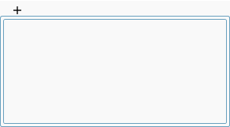
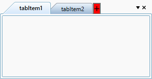

# NewButton Feature in TabControl (TabControlExt)

This section explains how to create new tab items using new button and its UI customization in the [TabControl](https://help.syncfusion.com/cr/wpf/Syncfusion.Tools.Wpf~Syncfusion.Windows.Tools.Controls.TabControlExt.html). 

## Adding New tab button and new tab item

You can add a new tab item at runtime by clicking the new button. You can enable it by using the [IsNewButtonEnabled](https://help.syncfusion.com/cr/wpf/Syncfusion.Tools.Wpf~Syncfusion.Windows.Tools.Controls.TabControlExt~IsNewButtonEnabled.html) property. You should handle the click action of the New Button and add a new tab items to `TabControl` by using the [NewButtonClick](https://help.syncfusion.com/cr/wpf/Syncfusion.Tools.Wpf~Syncfusion.Windows.Tools.Controls.TabControlExt~NewButtonClick_EV.html) event. The new button can be aligned first or last position in the tab item header panel by using the [NewButtonAlignment](https://help.syncfusion.com/cr/wpf/Syncfusion.Tools.Wpf~Syncfusion.Windows.Tools.Controls.TabControlExt~NewButtonAlignment.html) property. The default value of `IsNewButtonEnabled` property is `false` and `NewButtonAlignment` property is `Last`.




<syncfusion:TabControlExt NewButtonClick="tabControlExt_NewButtonClick"
                          IsNewButtonEnabled="True"
                          NewButtonAlignment="Last"
                          Name="tabControlExt">
    <syncfusion:TabItemExt Header="tabItem1" />
    <syncfusion:TabItemExt Header="tabItem2" />
</syncfusion:TabControlExt>




tabControlExt.NewButtonClick += tabControlExt_NewButtonClick;
tabControlExt.IsNewButtonEnabled = true;
tabControlExt.NewButtonAlignment = NewButtonAlignment.Last;




You can handle the event as follows:




private void tabControlExt_NewButtonClick(object sender, EventArgs e) {
    TabItemExt tabItemExt1 = new TabItemExt()
    {
        Header = "tabItem"+ (tabControlExt.Items.Count + 1),
        Content = new TextBlock() { Text = "This is the content area of TabItem" }
    };

    //Adding new tab item into the TabControl.
    tabControlExt.Items.Add(tabItemExt1);
}




N> View [Sample](https://github.com/SyncfusionExamples/syncfusion-wpf-tabcontrolext-examples/tree/master/Samples/NewButton) in GitHub

 ## Auto hide new button when no child tab item

The `TabControl` automatically hides the new button on when no child tab item present in the `TabControl`. If you want to always show the new button, use the [IsNewButtonClosedonNoChild](https://help.syncfusion.com/cr/wpf/Syncfusion.Tools.Wpf~Syncfusion.Windows.Tools.Controls.TabControlExt~IsNewButtonClosedonNoChild.html) property value as `false`. The default value of `IsNewButtonClosedonNoChild` property is `true`.




<syncfusion:TabControlExt IsNewButtonClosedonNoChild="False"
                          Name="tabControlExt">
    <syncfusion:TabItemExt Content="This is the first tab item"
                           Header="tabItem1"/>
</syncfusion:TabControlExt>




tabControlExt.IsNewButtonClosedonNoChild = false;




N> View [Sample](https://github.com/SyncfusionExamples/syncfusion-wpf-tabcontrolext-examples/tree/master/Samples/NewButton) in GitHub

## Custom UI for new button

If you wants to change the UI for the new button, use the [NewButtonTemplate](https://help.syncfusion.com/cr/wpf/Syncfusion.Tools.Wpf~Syncfusion.Windows.Tools.Controls.TabControlExt~NewButtonTemplate.html) or [NewButtonStyle](https://help.syncfusion.com/cr/wpf/Syncfusion.Tools.Wpf~Syncfusion.Windows.Tools.Controls.TabControlExt~NewButtonStyle.html)  properties. 




<syncfusion:TabControlExt IsNewButtonEnabled="True"
                          x:Name="tabControlExt">
    <syncfusion:TabControlExt.NewButtonTemplate>
        <ControlTemplate>
            <Button Background="Red" 
                    Content=" + "></Button>
        </ControlTemplate>
    </syncfusion:TabControlExt.NewButtonTemplate>
    <syncfusion:TabItemExt Header="tabItem1" Name="tabItemExt1"/>
    <syncfusion:TabItemExt Header="tabItem2" Name="tabItemExt2"/>
</syncfusion:TabControlExt>




N> View [Sample](https://github.com/SyncfusionExamples/syncfusion-wpf-tabcontrolext-examples/tree/master/Samples/NewButton) in GitHub

## Change background of new button

If you want to change the background of the new button, use the [NewButtonBackground](https://help.syncfusion.com/cr/wpf/Syncfusion.Tools.Wpf~Syncfusion.Windows.Tools.Controls.TabControlExt~NewButtonBackground.html) property. The default value of `NewButtonBackground` property is `null`.




<syncfusion:TabControlExt NewButtonBackground="Red"
                          Name="tabControlExt">
    <syncfusion:TabItemExt Content="This is the first tab item"
                           Header="tabItem1"/>
</syncfusion:TabControlExt>




tabControlExt.NewButtonBackground = Brushes.Red;




N> View [Sample](https://github.com/SyncfusionExamples/syncfusion-wpf-tabcontrolext-examples/tree/master/Samples/NewButton) in GitHub