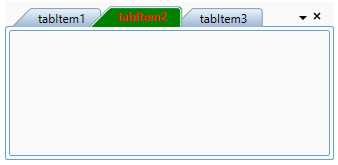

# Selecting a tab item in TabControl (TabControlExt)

This section explains how to select tab item and selection functionalities in the [TabControl](https://help.syncfusion.com/cr/wpf/Syncfusion.Tools.Wpf~Syncfusion.Windows.Tools.Controls.TabControlExt.html).

## Select tab item using mouse and key interaction

You can select a particular tab item by using the mouse click on the tab header. You also use the `Left-Arrow` and `Right-Arrow` key , to select the previous tab item or next tab item of current selected tab item. You can get the selected item by using the `SelectedItem` property. By default, the first tab item is selected.

N> You can select only one tab item at a time.

## Tab selection changed notification

The `TabControl` notifies that the selected tabitem is changed by user through the [SelectedItemChangedEvent](https://help.syncfusion.com/cr/wpf/Syncfusion.Tools.Wpf~Syncfusion.Windows.Tools.Controls.TabControlExt~SelectedItemChangedEvent_EV.html) event. You can use the [OldSelectedItem](https://help.syncfusion.com/cr/wpf/Syncfusion.Tools.Wpf~Syncfusion.Windows.Tools.Controls.SelectedItemChangedEventArgs~OldSelectedItem.html) and [NewSelectedItem](https://help.syncfusion.com/cr/wpf/Syncfusion.Tools.Wpf~Syncfusion.Windows.Tools.Controls.SelectedItemChangedEventArgs~NewSelectedItem.html) properties to get the old and new selected tabitem in the `SelectedItemChangedEvent` event.




<syncfusion:TabControlExt SelectedItemChangedEvent="TabControlExt_SelectedItemChangedEvent"
                          Name="tabControlExt" />




TabControlExt tabControlExt = new TabControlExt();
tabControlExt.SelectedItemChangedEvent += TabControlExt_SelectedItemChangedEvent;




You can handle the event as follows:




private void TabControlExt_SelectedItemChangedEvent(object sender, SelectedItemChangedEventArgs e) {
    var newTabItem = e.NewSelectedItem.Header;
    if (e.OldSelectedItem != null) {
        var oldTabItem = e.OldSelectedItem.Header;
    }
    else {
        var oldTabItem = string.Empty;
    }
}




## Load the previously selected tab item content

If you want to load the previously selected tab item in background after new tab item is selected, use the [IsDisableUnloadTabItemExtContent](https://help.syncfusion.com/cr/wpf/Syncfusion.Tools.Wpf~Syncfusion.Windows.Tools.Controls.TabControlExt~IsDisableUnloadTabItemExtContent.html) property value as `true`. The default value of `IsDisableUnloadTabItemExtContent` property is `false`.




<syncfusion:TabControlExt IsDisableUnloadTabItemExtContent="True"
                          Name="tabControlExt">
    <syncfusion:TabItemExt Header="tab1" Name="tabItemExt1"/>
    <syncfusion:TabItemExt Header="tab2" Name="tabItemExt2"/>
</syncfusion:TabControlExt>




tabControlExt.IsDisableUnloadTabItemExtContent = true;




N> View [Sample](https://github.com/SyncfusionExamples/syncfusion-wpf-tabcontrolext-examples/tree/master/Samples/SelectedItem) in GitHub

## Change selected tab header font weight

If you want to highlight the selected tab header, change the font of tab header from semi bold to extra bold by using the [SelectedItemFontWeight](https://help.syncfusion.com/cr/wpf/Syncfusion.Tools.Wpf~Syncfusion.Windows.Tools.Controls.TabControlExt~SelectedItemFontWeight.html) property. The default value of `SelectedItemFontWeight` property is `SemiBold`.




<syncfusion:TabControlExt SelectedItemFontWeight="ExtraBold"
                          Name="tabControlExt">
    <syncfusion:TabItemExt Header="tabItem1" Name="tabItemExt1"/>
    <syncfusion:TabItemExt Header="tabItem2" Name="tabItemExt2"/>
</syncfusion:TabControlExt>




tabControlExt.SelectedItemFontWeight = FontWeights.ExtraBold;




N> View [Sample](https://github.com/SyncfusionExamples/syncfusion-wpf-tabcontrolext-examples/tree/master/Samples/SelectedItem) in GitHub

## Change selected tab header background and foreground 

You can change the highlighting background and foreground of the selected tab item by using the [TabItemSelectedForeground](https://help.syncfusion.com/cr/wpf/Syncfusion.Tools.Wpf~Syncfusion.Windows.Tools.Controls.TabControlExt~TabItemSelectedForeground.html) and [TabItemSelectedBackground](https://help.syncfusion.com/cr/wpf/Syncfusion.Tools.Wpf~Syncfusion.Windows.Tools.Controls.TabControlExt~.html) properties. The default value of `TabItemSelectedForeground` property is `Black`  and `TabItemSelectedBackground` property is `Lavender`.




<syncfusion:TabControlExt TabItemSelectedForeground="Red" 
                          TabItemSelectedBackground="Green"
                          Name="tabControlExt">
    <syncfusion:TabItemExt Header="tabItem1" Name="tabItemExt1"/>
    <syncfusion:TabItemExt Header="tabItem2" Name="tabItemExt2"/>
</syncfusion:TabControlExt>




tabControlExt.TabItemSelectedForeground = Brushes.Red;
tabControlExt.TabItemSelectedBackground = Brushes.Green;




N> View [Sample](https://github.com/SyncfusionExamples/syncfusion-wpf-tabcontrolext-examples/tree/master/Samples/SelectedItem) in GitHub

