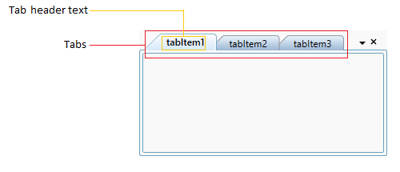
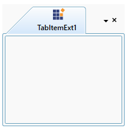
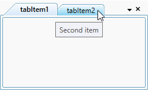
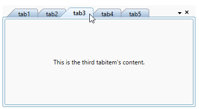
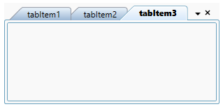
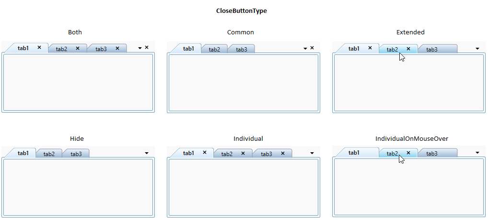
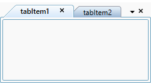
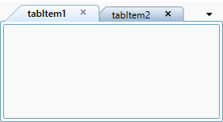
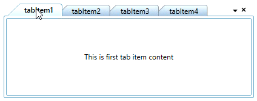

# TabItem Header in WPF TabControl (TabControlExt)

This section explains how to set header text and UI customization of the tab header in the [TabControl](https://help.syncfusion.com/cr/wpf/Syncfusion.Tools.Wpf~Syncfusion.Windows.Tools.Controls.TabControlExt.html).

## Adding tab item header

You can add a text for the each tab headers by using the `TabItemExt.Header` property.




<syncfusion:TabControlExt Name="tabControlExt">
    <syncfusion:TabItemExt Header="tabItem1" Name="tabItemExt1"/>
    <syncfusion:TabItemExt Header="tabItem2" Name="tabItemExt2"/>
    <syncfusion:TabItemExt Header="tabItem3" Name="tabItemExt3"/>
</syncfusion:TabControlExt>




// Creating an instances of tabitems and adding header
TabItemExt tabItemExt1 = new TabItemExt() { Header = "tabItem1" };
TabItemExt tabItemExt2 = new TabItemExt() { Header = "tabItem2" };
TabItemExt tabItemExt3 = new TabItemExt() { Header = "tabItem3" };

// Creating an instances of TabControl and adding the tabitems into the TabControl
TabControlExt tabControlExt = new TabControlExt();
tabControlExt.Items.Add(tabItemExt1);
tabControlExt.Items.Add(tabItemExt2);
tabControlExt.Items.Add(tabItemExt3);




## Edit tab item header at runtime

You can edit the text of the tab header at runtime by double clicking the tab header or selected a tab and pressing `F2` key. You can restrict this editing by using the [EnableLabelEdit](https://help.syncfusion.com/cr/wpf/Syncfusion.Tools.Wpf~Syncfusion.Windows.Tools.Controls.TabControlExt~EnableLabelEdit.html) property value as `false`. The default value of `EnableLabelEdit` property is `true`.




<syncfusion:TabControlExt EnableLabelEdit="True" Name="tabControlExt">       
    <syncfusion:TabItemExt Header="tabItem1"/>
    <syncfusion:TabItemExt Header="tabItem2"/>
</syncfusion:TabControlExt>




tabControlExt.EnableLabelEdit = true;




## Setting size and alignment of tab header

You can set a size of the each tabs by using the `TabItemExt.Width` and `TabItemExt.Height` properties. You can also align the header content horizontally and vertically by using the `TabItemExt.HorizontalContentAlignment` and `TabItemExt.VerticalContentAlignment` properties. The default value of `TabItemExt.HorizontalContentAlignment` and `TabItemExt.VerticalContentAlignment` properties is `Stretch`.




<syncfusion:TabControlExt Name="tabControlExt">
    <syncfusion:TabItemExt Width="200" Height="30"     
                           HorizontalContentAlignment="Left"
                           VerticalContentAlignment="Center" 
                           Header="tabItem1"
                           Name="tabItemExt1"/>
    <syncfusion:TabItemExt Width="100" Height="30"
                           VerticalContentAlignment="Bottom"
                           HorizontalContentAlignment="Right"
                           Header="tabItem2" 
                           Name="tabItemExt2"/>
</syncfusion:TabControlExt>




//Adding size and alignment of tabItemExt1 header
tabItemExt1.Width = 200;
tabItemExt1.Height = 300;
tabItemExt1.HorizontalContentAlignment = HorizontalAlignment.Left;
tabItemExt1.VerticalContentAlignment = VerticalAlignment.Center;

//Adding size and alignment of tabItemExt2 header
tabItemExt1.Width = 100;
tabItemExt1.Height = 30;
tabItemExt1.HorizontalContentAlignment = HorizontalAlignment.Right;
tabItemExt1.VerticalContentAlignment = VerticalAlignment.Bottom;




## Setting image for tab item header

You can add images to the tab item headers by using the [TabItemExt.Image](https://help.syncfusion.com/cr/wpf/Syncfusion.Tools.Wpf~Syncfusion.Windows.Tools.Controls.TabItemExt~Image.html) property. You can change the height and width of the header image by using the [TabItemExt.ImageHeight](https://help.syncfusion.com/cr/wpf/Syncfusion.Tools.Wpf~Syncfusion.Windows.Tools.Controls.TabItemExt~ImageHeight.html) and [TabItemExt.ImageWidth](https://help.syncfusion.com/cr/wpf/Syncfusion.Tools.Wpf~Syncfusion.Windows.Tools.Controls.TabItemExt~ImageWidth.html) properties.




<!-- Adding TabcontrolExt  -->
<syncfusion:TabControlExt Name="tabControlExt">

    <!-- Adding TabItemExt with image  -->
    <syncfusion:TabItemExt Image="sync_icon.ico" 
                           ImageWidth="20"
                           ImageHeight="20"
                           Header="TabItemExt1"
                           Name="tabItemExt1">
    </syncfusion:TabItemExt>
</syncfusion:TabControlExt>




//Adding header image for tabItemExt1
tabItemExt1.Image = new BitmapImage(
    new Uri(@"\sync_icon.ico", UriKind.RelativeOrAbsolute));

//Setting height and width for the tab header image
tabItemExt1.ImageWidth = 20;
tabItemExt1.ImageHeight = 20;  




### Tab header image alignment

You can align the tab item header image by using the [TabItemExt.ImageAlignment](https://help.syncfusion.com/cr/wpf/Syncfusion.Tools.Wpf~Syncfusion.Windows.Tools.Controls.TabItemExt~ImageAlignment.html) property. You can set a margin for the image by using the [TabItemExt.IconMargin](https://help.syncfusion.com/cr/wpf/Syncfusion.Tools.Wpf~Syncfusion.Windows.Tools.Controls.TabItemExt~IconMargin.html) property. The default value of `TabItemExt.ImageAlignment` property is `LeftOfText` and `TabItemExt.IconMargin` property is `0,0,0,4`.  You can align the image to any one of the following positions.

* AboveText - Images are placed above the tab item header text.
* BelowText – Images are placed below the tab item header text.
* LeftOfText – Images are placed to the left of the tab item header text.
* RightOfText – Images are placed to the right of the tab item header text.




<!-- Adding TabcontrolExt  -->
<syncfusion:TabControlExt Name="tabControlExt">

    <!-- Adding TabItemExt with image with alignment  -->
    <syncfusion:TabItemExt Image="sync.png"  
                           ImageAlignment="AboveText"
                           IconMargin= "2"
                           Header="TabItemExt1"
                           Name="tabItemExt1">
    </syncfusion:TabItemExt>
</syncfusion:TabControlExt>




//Setting alignment for the tab header image 
tabItemExt1.ImageAlignment = ImageAlignment.AboveText;
tabItemExt1.IconMargin = new Thickness(2);



## Setting tooltip

ToolTip is used to show the information about the segment, when you mouse over on the segment. You can add a tooltip information for the each tab items by using the [TabItemExt.ItemToolTip](https://help.syncfusion.com/cr/wpf/Syncfusion.Tools.Wpf~Syncfusion.Windows.Tools.Controls.TabItemExt~ItemToolTip.html) property and show it by hovering the mouse on the respective header of the tab item.




<syncfusion:TabControlExt Name="tabControlExt">
    <syncfusion:TabItemExt ItemToolTip="First item" 
                           Header="tabItem1" Name="tabItemExt1"/>
    <syncfusion:TabItemExt ItemToolTip="Second item"  
                           Header="tabItem2" Name="tabItemExt2"/>
</syncfusion:TabControlExt>




tabItemExt1.ItemToolTip = "First item";
tabItemExt2.ItemToolTip = "Second item";




##  Hide tab header when there is single tab item

You can hide the header of tab item only on when single tab item present in the `TabControl`. You can enable it by using the [HideHeaderOnSingleChild](https://help.syncfusion.com/cr/wpf/Syncfusion.Tools.Wpf~Syncfusion.Windows.Tools.Controls.TabControlExt~HideHeaderOnSingleChild.html) property value as `true`. The Default value of `HideHeaderOnSingleChild` property is `false`.




<syncfusion:TabControlExt HideHeaderOnSingleChild="True" 
                          Name="tabControlExt">
    <syncfusion:TabItemExt Content="This is the first tab item"
                           Header="tabItem1"/>
</syncfusion:TabControlExt>




tabControlExt.HideHeaderOnSingleChild = true;




# Selecting a tab item

This section explains how to select tab item and selection functionalities in the [TabControl](https://help.syncfusion.com/cr/wpf/Syncfusion.Tools.Wpf~Syncfusion.Windows.Tools.Controls.TabControlExt.html).

##  Select tab item using mouse and key interaction

You can select a particular tab item by using the mouse click on the tab header. You also use the `Left-Arrow` and `Right-Arrow` key , to select the previous tab item or next tab item of current selected tab item. You can get the selected item by using the `SelectedItem` property. By default, the first tab item is selected.

N> You can select only one tab item at a time.

## Tab selection changed notification

The `TabControl` notifies that the selected tabitem is changed by user through the [SelectedItemChangedEvent](https://help.syncfusion.com/cr/wpf/Syncfusion.Tools.Wpf~Syncfusion.Windows.Tools.Controls.TabControlExt~SelectedItemChangedEvent_EV.html) event. You can use the [OldSelectedItem](https://help.syncfusion.com/cr/wpf/Syncfusion.Tools.Wpf~Syncfusion.Windows.Tools.Controls.SelectedItemChangedEventArgs~OldSelectedItem.html) and [NewSelectedItem](https://help.syncfusion.com/cr/wpf/Syncfusion.Tools.Wpf~Syncfusion.Windows.Tools.Controls.SelectedItemChangedEventArgs~NewSelectedItem.html) properties to get the old and new selected tabitem in the `SelectedItemChangedEvent` event.




<syncfusion:TabControlExt SelectedItemChangedEvent="TabControlExt_SelectedItemChangedEvent"
                          Name="tabControlExt" />




TabControlExt tabControlExt = new TabControlExt();
tabControlExt.SelectedItemChangedEvent += TabControlExt_SelectedItemChangedEvent;




You can handle the event as follows:




private void TabControlExt_SelectedItemChangedEvent(object sender, SelectedItemChangedEventArgs e) {
    var newTabItem = e.NewSelectedItem.Header;
    if (e.OldSelectedItem != null) {
        var oldTabItem = e.OldSelectedItem.Header;
    }
    else {
        var oldTabItem = string.Empty;
    }
}




## Load the previously selected tab item content

By default, the `TabControl` unloads the previously selected tab item content when selected item is changed. You can restrict it by setting the [IsDisableUnloadTabItemExtContent](https://help.syncfusion.com/cr/wpf/Syncfusion.Tools.Wpf~Syncfusion.Windows.Tools.Controls.TabControlExt~IsDisableUnloadTabItemExtContent.html) property value as `true`. The default value of `IsDisableUnloadTabItemExtContent` property is `false`.




<syncfusion:TabControlExt IsCustomTabItemContextMenuEnabled="IsCustomTabItemContextMenuEnabled"
                          Name="tabControlExt">
    <syncfusion:TabItemExt Header="tab1" Name="tabItemExt1"/>
    <syncfusion:TabItemExt Header="tab2" Name="tabItemExt2"/>
</syncfusion:TabControlExt>




tabControlExt.IsCustomTabItemContextMenuEnabled = true;




## Change selected tab header font weight

You can change the selected tab header font weight by using the [SelectedItemFontWeight](https://help.syncfusion.com/cr/wpf/Syncfusion.Tools.Wpf~Syncfusion.Windows.Tools.Controls.TabControlExt~SelectedItemFontWeight.html) property. The default value of `SelectedItemFontWeight` property is `SemiBold`.




<syncfusion:TabControlExt SelectedItemFontWeight="UltraLight"
                          Name="tabControlExt">
    <syncfusion:TabItemExt Header="tabItem1" Name="tabItemExt1"/>
    <syncfusion:TabItemExt Header="tabItem2" Name="tabItemExt2"/>
</syncfusion:TabControlExt>




tabControlExt.SelectedItemFontWeight = FontWeights.UltraLight;




# Closing or Hiding tab item

This section explains how to closing the tab item and its functionalities in the [TabControl](https://help.syncfusion.com/cr/wpf/Syncfusion.Tools.Wpf~Syncfusion.Windows.Tools.Controls.TabControlExt.html).

## Closing tab item 

You can close the selected tab by clicking the close button which is placed top-right corner of the tab panel. You also close any tab by clicking mouse middle button.You can enable it by setting the [CloseTabOnMiddleClick](https://help.syncfusion.com/cr/wpf/Syncfusion.Tools.Wpf~Syncfusion.Windows.Tools.Controls.TabControlExt~CloseTabOnMiddleClick.html) property value as `true`. The default value of `CloseTabOnMiddleClick` property is `false`.




<syncfusion:TabControlExt CloseTabOnMiddleClick="True"
                          Name="tabControlExt">
    <syncfusion:TabItemExt Header="tabItem1" Name="tabItemExt1"/>
    <syncfusion:TabItemExt Header="tabItem2" Name="tabItemExt2"/>
</syncfusion:TabControlExt>




tabControlExt.CloseTabOnMiddleClick = true;




## Show or hide close button

You can show or hide the close button in each tabs and tab panel by using the [CloseButtonType](https://help.syncfusion.com/cr/wpf/Syncfusion.Tools.Wpf~Syncfusion.Windows.Tools.Controls.TabControlExt~CloseButtonType.html) property. 

The following Close button modes are supported by the `TabControl`.

* Common – The single close button is displayed commonly for all tab items in the tab panel.
* Individual – The close button is displayed individually for each tab items in the tab panel.
* Both – The close button is displayed individually for each tab item and also displayed in the tab panel.
* Hide – All close buttons is hidden in the tab panel.
* IndividualOnMouseOver - The close button is displayed when the mouse hovers over the tab item in the tab panel.
* Extended - The Close button is displayed in the selected tab and mousing hovering tab in the tab panel.




<syncfusion:TabControlExt CloseButtonType="Both"
                          Name="tabControlExt">
    <syncfusion:TabItemExt Header="tab1" Name="tabItemExt1"/>
    <syncfusion:TabItemExt Header="tab2" Name="tabItemExt2"/>
</syncfusion:TabControlExt>




tabControlExt.CloseButtonType = CloseButtonType.Both;




### Show or hide close button for specific tab item

You can show or hide close button for particular tab item by using the [TabItemExt.CloseButtonState](https://help.syncfusion.com/cr/wpf/Syncfusion.Tools.Wpf~Syncfusion.Windows.Tools.Controls.TabItemExt~CloseButtonState.html) property. The `TabItemExt.CloseButtonState` is effective only when the `CloseButtonType` property is set to one among `Individual`, `Extended`, or `Both`. 

<table>
<tr>
<td>
<b> CloseButtonState </b>   </td><td>
<b> Description </b>   </td></tr>
<tr>
<td>
Visible  </td><td>
The close button of TabItemExt is visible  </td></tr>
<tr>
<td>
Collapsed  </td><td>
The close button of TabItemExt is collapsed  </td></tr>
</table>




<syncfusion:TabControlExt CloseButtonType="Both"
                          Name="tabControlExt">
    <syncfusion:TabItemExt CloseButtonState="Visible" 
                           Header="tabItem1" Name="tabItemExt1"/>
    <syncfusion:TabItemExt CloseButtonState="Collapsed"
                           Header="tabItem2" Name="tabItemExt2"/>
</syncfusion:TabControlExt>




tabControlExt.CloseButtonType = CloseButtonType.Both;

//Changing the particular item close button visibility
tabItemExt1.CloseButtonState = Visibility.Visible;
tabItemExt2.CloseButtonState = Visibility.Collapsed;




## Restrict or allow closing the tab item

You can restrict or allow the tab item closing by using either property or event. 

## Restrict closing the tab item using property

You can restrict the closing functionality of specific tabitem using the [TabItemExt.CanClose](https://help.syncfusion.com/cr/wpf/Syncfusion.Tools.Wpf~Syncfusion.Windows.Tools.Controls.TabItemExt~CanClose.html) property. When the `TabItemExt.CanClose` property is set to `false`, the corresponding tab item will be non-closable. The default value of `CanClose` property is `true`.



 
<syncfusion:TabControlExt CloseButtonType="Individual"
                          Name="tabControlExt">
    <syncfusion:TabItemExt CanClose="False"
                           Header="tabItem1" Name="tabItemExt1"/>
    <syncfusion:TabItemExt CanClose="True" 
                           Header="tabItem2" Name="tabItemExt2"/>
</syncfusion:TabControlExt>




tabControlExt.CloseButtonType = CloseButtonType.Individual;

//Restrict and allow the particular item close button
tabItemExt1.CanClose = false;
tabItemExt2.CanClose = true;




Here, `tabItem1` cancel button is disabled.

## Restrict closing the tab item using event

The closing of tab item can be restricted by setting `e.Cancel` to `true` in [OnCloseButtonClick](https://help.syncfusion.com/cr/wpf/Syncfusion.Tools.Wpf~Syncfusion.Windows.Tools.Controls.TabControlExt~OnCloseButtonClick_EV.html) event. `e` represents the event argument [CloseTabEventArgs](https://help.syncfusion.com/cr/wpf/Syncfusion.Tools.Wpf~Syncfusion.Windows.Tools.Controls.CloseTabEventArgs.html) for `OnCloseButtonClick` event. The default value of `e.Cancel` is `false`.




<syncfusion:TabControlExt OnCloseButtonClick="TabControlExt_OnCloseButtonClick" >
    <syncfusion:TabItemExt Header="tabItem1" />
    <syncfusion:TabItemExt Header="tabItem2" />
</syncfusion:TabControlExt>




tabControlExt.OnCloseButtonClick += TabControlExt_OnCloseButtonClick;




You can handle the event as follows:




private void TabControlExt_OnCloseButtonClick(object sender, CloseTabEventArgs e) {
    if(e.TargetTabItem.Header.ToString() == "tabItem1") {
        e.Cancel = true;
    }               
}




Here, `tabItem1` cannot be closed.

## Hide or delete item when closing a tab

You can decide whether the tab item can be only hidden from the view or removed from the items collection of `TabControl` by using the [CloseMode](https://help.syncfusion.com/cr/cref_files/wpf/Syncfusion.Tools.Wpf~Syncfusion.Windows.Tools.Controls.TabControlExt~CloseMode.html) property while closing it. If you set `CloseMode` property as `Hide`, the tab item will be hidden and the selection will be moved to previous index while hiding it. Also, if the property `CloseMode` is `Delete`, the tab item will be removed from the items collection and the selection will be retained in the same index while removing it. The default value of the `CloseMode` property is `Hide`.




<syncfusion:TabControlExt CloseMode="Delete"
                          Name="tabControlExt">
    <syncfusion:TabItemExt Header="tabItem1" />
    <syncfusion:TabItemExt Header="tabItem2" />
</syncfusion:TabControlExt>




tabControlExt.CloseMode = CloseMode.Delete;




## Tab item closed notification

When the tab item is closed, it will be notified by using the [TabClosed](https://help.syncfusion.com/cr/wpf/Syncfusion.Tools.Wpf~Syncfusion.Windows.Tools.Controls.TabControlExt~TabClosed_EV.html) event. You can get the details about the closed tab item from [CloseTabEventArgs](https://help.syncfusion.com/cr/wpf/Syncfusion.Tools.Wpf~Syncfusion.Windows.Tools.Controls.CloseTabEventArgs.html).




<syncfusion:TabControlExt TabClosed="TabControlExt_TabClosed" >
    <syncfusion:TabItemExt Header="tabItem1" />
    <syncfusion:TabItemExt Header="tabItem2" />
</syncfusion:TabControlExt>




tabControlExt.TabClosed += TabControlExt_TabClosed;




You can handle the event as follows:




private void TabControlExt_TabClosed(object sender, CloseTabEventArgs e) {
    var deletedItem = e.TargetTabItem;
}




# Arranging tab items

This section explains how to arrange the tab item and its alignment functionalities in the [TabControl](https://help.syncfusion.com/cr/wpf/Syncfusion.Tools.Wpf~Syncfusion.Windows.Tools.Controls.TabControlExt.html).

## Rearrange position of tab items

If you want to rearrange the tab items position, drag that item and drop to anywhere you want to place it in the tab panel. You can restrict it by setting the [AllowDragDrop](https://help.syncfusion.com/cr/wpf/Syncfusion.Tools.Wpf~Syncfusion.Windows.Tools.Controls.TabControlExt~AllowDragDrop.html) property value as `false`. The default value of `AllowDragDrop` property is `true`. The drag marker will preview the location, where you drop the dragged tab item.

 


<syncfusion:TabControlExt AllowDragDrop="True" >
    <syncfusion:TabItemExt Header="tabItem1" />
    <syncfusion:TabItemExt Header="tabItem2" />
</syncfusion:TabControlExt>




tabControlExt.AllowDragDrop = true;




### change drag marker color

You can change the drag marker color by setting the color value for the [DragMarkerColor](https://help.syncfusion.com/cr/wpf/Syncfusion.Tools.Wpf~Syncfusion.Windows.Tools.Controls.TabControlExt~DragMarkerColor.html) property. The default value of `DragMarkerColor` property is `Black`.




<syncfusion:TabControlExt DragMarkerColor="Red" 
                          AllowDragDrop="True">
    <syncfusion:TabItemExt Header="tabItem1" />
    <syncfusion:TabItemExt Header="tabItem2" />
</syncfusion:TabControlExt>




tabControlExt.DragMarkerColor = Brushes.Red;
tabControlExt.AllowDragDrop = true;




## Tab items Alignment

Tab items can be aligned to any side of the `TabControl` by using the [TabStripPlacement](https://help.syncfusion.com/cr/wpf/Syncfusion.Tools.Wpf~Syncfusion.Windows.Tools.Controls.TabControlSettings~TabStripPlacement.html) property. The default value of `TabStripPlacement` property is `Top`.

The following TabStrip placement options are supported by the `TabControl`.

* Top - Tab items are placed at top of the `TabControl`.
* Bottom - Tab items are placed at bottom of the `TabControl`.
* Left - Tab items are placed at left side of the `TabControl`.
* Right - Tab items are placed at right side of the `TabControl`.




<syncfusion:TabControlExt TabStripPlacement="Bottom">
    <syncfusion:TabItemExt Header="tabItem1" />
    <syncfusion:TabItemExt Header="tabItem2" />
</syncfusion:TabControlExt>




tabControlExt.TabStripPlacement = Dock.Bottom;




###  Rotating the Tab items

Whenever the `TabStripPlacement` is set to `Left` or `Right`, the tab headers are vertically arranged. To improve the user readability, the tab items can be rotated by using the [RotateTextWhenVertical](https://help.syncfusion.com/cr/wpf/Syncfusion.Tools.Wpf~Syncfusion.Windows.Tools.Controls.TabControlExt~RotateTextWhenVertical.html) property as `true`. The default value of `RotateTextWhenVertical` property is `false`.




<syncfusion:TabControlExt RotateTextWhenVertical="True"
                          TabStripPlacement="Right">
    <syncfusion:TabItemExt Header="tabItem1" />
    <syncfusion:TabItemExt Header="tabItem2" />
</syncfusion:TabControlExt>




tabControlExt.RotateTextWhenVertical = true;
tabControlExt.TabStripPlacement = Dock.Right;




## Change tab item layout 

 If you add more tabs and they exceed the `TabControl` size, then they are in collapsed state and can navigate to that tabs only by using the scroll button. You can show all the tabs in the tab panel by setting the [TabItemLayout](https://help.syncfusion.com/cr/wpf/Syncfusion.Tools.Wpf~Syncfusion.Windows.Tools.Controls.TabControlExt~TabItemLayout.html) property value as `MultiLine` or `MultiLineWithFullWidth`. The default value of `TabItemLayout` property is `Single`.

`TabControl` provides the following layout types.

* SingleLine – Tab items are displayed in single line
* MultiLine – Tab items are shrunk and displayed in multiple lines
* MultiLineWithFillWidth – Tab items are displayed in multiple lines without being shrunk




<syncfusion:TabControlExt TabItemLayout="MultiLine" 
                          TabItemLayout="MultiLine" 
                          Width="300"
                          Name="tabControlExt">
    <syncfusion:TabItemExt Header="tabItem1" />
    <syncfusion:TabItemExt Header="tabItem2" />
</syncfusion:TabControlExt>




tabControlExt.TabItemLayout = TabItemLayoutType.MultiLine;




