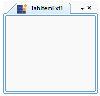
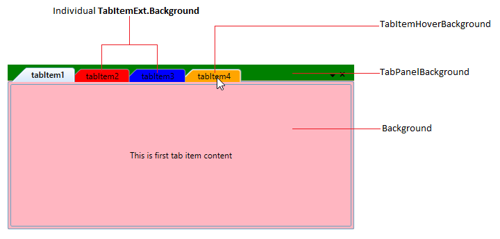

# TabItem Header in WPF TabControl (TabControlExt)

This section explains how to set header text and UI customization of the tab header in the [TabControl](https://help.syncfusion.com/cr/wpf/Syncfusion.Windows.Tools.Controls.TabControlExt.html).

## Setting tab item header

You can add a text for the each tab headers by using the `TabItemExt.Header` property.




<syncfusion:TabControlExt Name="tabControlExt">
    <syncfusion:TabItemExt Header="tabItem1" Name="tabItemExt1"/>
    <syncfusion:TabItemExt Header="tabItem2" Name="tabItemExt2"/>
    <syncfusion:TabItemExt Header="tabItem3" Name="tabItemExt3"/>
</syncfusion:TabControlExt>




// Creating an instances of tabitems and adding header
TabItemExt tabItemExt1 = new TabItemExt() { Header = "tabItem1" };
TabItemExt tabItemExt2 = new TabItemExt() { Header = "tabItem2" };
TabItemExt tabItemExt3 = new TabItemExt() { Header = "tabItem3" };

// Creating an instances of TabControl and adding the tabitems into the TabControl
TabControlExt tabControlExt = new TabControlExt();
tabControlExt.Items.Add(tabItemExt1);
tabControlExt.Items.Add(tabItemExt2);
tabControlExt.Items.Add(tabItemExt3);




## Edit tab item header at runtime

You can edit the text of the tab header at runtime by double clicking the tab header or selected a tab and pressing `Ctrl + F2` key. You can restrict all the tab header editing by using the [EnableLabelEdit](https://help.syncfusion.com/cr/wpf/Syncfusion.Windows.Tools.Controls.TabControlExt.html#Syncfusion_Windows_Tools_Controls_TabControlExt_EnableLabelEdit) property value as `false`. The default value of `EnableLabelEdit` property is `true`.




<syncfusion:TabControlExt EnableLabelEdit="True" 
                          Name="tabControlExt">       
    <syncfusion:TabItemExt Header="tabItem1"/>
    <syncfusion:TabItemExt Header="tabItem2"/>
</syncfusion:TabControlExt>




tabControlExt.EnableLabelEdit = true;




N> View [Sample](https://github.com/SyncfusionExamples/syncfusion-wpf-tabcontrolext-examples/tree/master/Samples/Tab-Header) in GitHub

## Restrict header editing for specific tab item

If you want to restrict header editing for specific tab item, handle the [restrict-header-editing]() and setting the [restrict-header-setting]() property as `true` for that specific tab item.




<syncfusion:TabControlExt BeforeLabelEdit="tabControlExt_BeforeLabelEdit"
                          EnableLabelEdit="True" 
                          Name="tabControlExt">       
    <syncfusion:TabItemExt Header="tabItem1"/>
    <syncfusion:TabItemExt Header="tabItem2"/>
</syncfusion:TabControlExt>




tabControlExt.BeforeLabelEdit += tabControlExt_BeforeLabelEdit;
tabControlExt.EnableLabelEdit = true;




You can restrict the specific tab item as follows,




private void tabControlExt_BeforeLabelEdit(object sender, BeforeLabelEditEventArgs e) {
    //Retrict header editing for tabItem1
    if( e.HeaderBeforeEdit.ToString() == "tabItem1" ) {
        e.Cancel = true;
    }
}




## Custom UI for the edit tab item header

You can customize the editing tab item header appearance for the each tab items by using the [EditHeaderTemplate](https://help.syncfusion.com/cr/wpf/Syncfusion.Windows.Tools.Controls.TabControlExt.html#Syncfusion_Windows_Tools_Controls_TabControlExt_EditHeaderTemplate) property.

Please refer [Editing tab header](https://help.syncfusion.com/wpf/tabcontrol/databinding#editing-tab-header) topic to know more details about `EditHeaderTemplate`.

N> View [Sample](https://github.com/SyncfusionExamples/syncfusion-wpf-tabcontrolext-examples/tree/master/Samples/Databinding) in GitHub

## Setting size and alignment of tab header

You can set a size of the each tabs by using the `TabItemExt.Width` and `TabItemExt.Height` properties. You can also align the header content horizontally and vertically by using the `TabItemExt.HorizontalContentAlignment` and `TabItemExt.VerticalContentAlignment` properties. The default value of `TabItemExt.HorizontalContentAlignment` and `TabItemExt.VerticalContentAlignment` properties is `Stretch`.




<syncfusion:TabControlExt Name="tabControlExt">
    <syncfusion:TabItemExt Width="200" Height="30"     
                           HorizontalContentAlignment="Left"
                           VerticalContentAlignment="Center" 
                           Header="tabItem1"
                           Name="tabItemExt1"/>
    <syncfusion:TabItemExt Width="100" Height="30"
                           VerticalContentAlignment="Bottom"
                           HorizontalContentAlignment="Right"
                           Header="tabItem2" 
                           Name="tabItemExt2"/>
</syncfusion:TabControlExt>




//Adding size and alignment of tabItemExt1 header
tabItemExt1.Width = 200;
tabItemExt1.Height = 300;
tabItemExt1.HorizontalContentAlignment = HorizontalAlignment.Left;
tabItemExt1.VerticalContentAlignment = VerticalAlignment.Center;

//Adding size and alignment of tabItemExt2 header
tabItemExt1.Width = 100;
tabItemExt1.Height = 30;
tabItemExt1.HorizontalContentAlignment = HorizontalAlignment.Right;
tabItemExt1.VerticalContentAlignment = VerticalAlignment.Bottom;




## Setting image for tab item header

You can add images to the tab item headers by using the [TabItemExt.Image](https://help.syncfusion.com/cr/wpf/Syncfusion.Windows.Tools.Controls.TabItemExt.html#Syncfusion_Windows_Tools_Controls_TabItemExt_Image) property. You can change the height and width of the header image by using the [TabItemExt.ImageHeight](https://help.syncfusion.com/cr/wpf/Syncfusion.Windows.Tools.Controls.TabItemExt.html#Syncfusion_Windows_Tools_Controls_TabItemExt_ImageHeight) and [TabItemExt.ImageWidth](https://help.syncfusion.com/cr/wpf/Syncfusion.Windows.Tools.Controls.TabItemExt.html#Syncfusion_Windows_Tools_Controls_TabItemExt_ImageWidth) properties.




<!-- Adding TabcontrolExt  -->
<syncfusion:TabControlExt Name="tabControlExt">

    <!-- Adding TabItemExt with image  -->
    <syncfusion:TabItemExt Image="sync_icon.ico" 
                           ImageWidth="20"
                           ImageHeight="20"
                           Header="TabItemExt1"
                           Name="tabItemExt1">
    </syncfusion:TabItemExt>
</syncfusion:TabControlExt>




//Adding header image for tabItemExt1
tabItemExt1.Image = new BitmapImage(
    new Uri(@"\sync_icon.ico", UriKind.RelativeOrAbsolute));

//Setting height and width for the tab header image
tabItemExt1.ImageWidth = 20;
tabItemExt1.ImageHeight = 20;  




N> View [Sample](https://github.com/SyncfusionExamples/syncfusion-wpf-tabcontrolext-examples/tree/master/Samples/Tab-Header) in GitHub

### Tab header image alignment

You can align the tab item header image by using the [TabItemExt.ImageAlignment](https://help.syncfusion.com/cr/wpf/Syncfusion.Windows.Tools.Controls.TabItemExt.html#Syncfusion_Windows_Tools_Controls_TabItemExt_ImageAlignment) property. You can set a margin for the image by using the [TabItemExt.IconMargin](https://help.syncfusion.com/cr/wpf/Syncfusion.Windows.Tools.Controls.TabItemExt.html#Syncfusion_Windows_Tools_Controls_TabItemExt_IconMargin) property. The default value of `TabItemExt.ImageAlignment` property is `LeftOfText` and `TabItemExt.IconMargin` property is `0,0,0,4`.  You can align the image to any one of the following positions.

* `AboveText` - Images are placed above the tab item header text.
* `BelowText` – Images are placed below the tab item header text.
* `LeftOfText` – Images are placed to the left of the tab item header text.
* `RightOfText` – Images are placed to the right of the tab item header text.




<!-- Adding TabcontrolExt  -->
<syncfusion:TabControlExt Name="tabControlExt">

    <!-- Adding TabItemExt with image with alignment  -->
    <syncfusion:TabItemExt Image="sync.png"  
                           ImageAlignment="AboveText"
                           IconMargin= "2"
                           Header="TabItemExt1"
                           Name="tabItemExt1">
    </syncfusion:TabItemExt>
</syncfusion:TabControlExt>




//Setting alignment for the tab header image 
tabItemExt1.ImageAlignment = ImageAlignment.AboveText;
tabItemExt1.IconMargin = new Thickness(2);



N> View [Sample](https://github.com/SyncfusionExamples/syncfusion-wpf-tabcontrolext-examples/tree/master/Samples/Tab-Header) in GitHub

## Setting tooltip

ToolTip is used to show the information about the segment, when you mouse over on the segment. You can add a tooltip information for the each tab items by using the [TabItemExt.ItemToolTip](https://help.syncfusion.com/cr/wpf/Syncfusion.Windows.Tools.Controls.TabItemExt.html#Syncfusion_Windows_Tools_Controls_TabItemExt_ItemToolTip) property and show it by hovering the mouse on the respective header of the tab item.




<syncfusion:TabControlExt Name="tabControlExt">
    <syncfusion:TabItemExt ItemToolTip="First item" 
                           Header="tabItem1" Name="tabItemExt1"/>
    <syncfusion:TabItemExt ItemToolTip="Second item"  
                           Header="tabItem2" Name="tabItemExt2"/>
</syncfusion:TabControlExt>




tabItemExt1.ItemToolTip = "First item";
tabItemExt2.ItemToolTip = "Second item";




##  Hide tab header when there is single tab item

You can hide the header of tab item only on when single tab item present in the `TabControl`. You can enable it by using the [HideHeaderOnSingleChild](https://help.syncfusion.com/cr/wpf/Syncfusion.Windows.Tools.Controls.TabControlExt.html#Syncfusion_Windows_Tools_Controls_TabControlExt_HideHeaderOnSingleChild) property value as `true`. The Default value of `HideHeaderOnSingleChild` property is `false`.




<syncfusion:TabControlExt HideHeaderOnSingleChild="True" 
                          Name="tabControlExt">
    <syncfusion:TabItemExt Content="This is the first tab item"
                           Header="tabItem1"/>
</syncfusion:TabControlExt>




tabControlExt.HideHeaderOnSingleChild = true;




N> View [Sample](https://github.com/SyncfusionExamples/syncfusion-wpf-tabcontrolext-examples/tree/master/Samples/Tab-Header) in GitHub

## Customize tab item header

You can change the tab item header background and foreground.

## Change tab item background

If you want to change the tab item and its header panel background, use the `Background` and [TabPanelBackground](https://help.syncfusion.com/cr/wpf/Syncfusion.Windows.Tools.Controls.TabControlExt.html#Syncfusion_Windows_Tools_Controls_TabControlExt_TabPanelBackground) properties. You can change the hover background of all tab headers by using the [TabItemHoverBackground](https://help.syncfusion.com/cr/wpf/Syncfusion.Windows.Tools.Controls.TabControlExt.html#Syncfusion_Windows_Tools_Controls_TabControlExt_TabItemHoverBackground) property. You can also change the individual tab item header background and its hover background by using the `TabItemExt.Background` and [TabItemExt.HoverBackground](https://help.syncfusion.com/cr/wpf/Syncfusion.Windows.Tools.Controls.TabItemExt.html#Syncfusion_Windows_Tools_Controls_TabItemExt_HoverBackground) properties. 

N> If you use both `TabItemHoverBackground` and `TabItemExt.HoverBackground` for the tab item, the `TabItemExt.HoverBackground` have higher priority for that tab item.




<syncfusion:TabControlExt Background="LightPink"
                          TabPanelBackground="Green"
                          TabItemHoverBackground="Orange" 
                          Name="tabControlExt">
    <syncfusion:TabItemExt HoverBackground="LightPink" 
                           Background="Red"
                           Header="tabItem1"
                           Name="tabItemExt1"/>
    <syncfusion:TabItemExt HoverBackground="Green" 
                           Background="Blue"
                           Header="tabItem2"
                           Name="tabItemExt2"/>
</syncfusion:TabControlExt>




//Setting the tab items panel, headers and its hover background 
tabControlExt.Background = Brushes.LightPink;
tabControlExt.TabPanelBackground = Brushes.Green;
tabControlExt.TabItemHoverBackground = Brushes.Orange;

//Setting the header and hover background for the particular tab item
tabItemExt1.Background = Brushes.Red;
tabItemExt2.Background = Brushes.Blue;
tabItemExt1.HoverBackground = Brushes.LightPink;
tabItemExt2.HoverBackground = Brushes.Green;




## Change tab item foreground

 You can change the hover foreground of all tab headers by using the [TabItemHoverForeground](https://help.syncfusion.com/cr/wpf/Syncfusion.Windows.Tools.Controls.TabControlExt.html#Syncfusion_Windows_Tools_Controls_TabControlExt_TabItemHoverForeground) property. You can also change the individual tab item header foreground by using the `TabItemExt.Foreground` property. The default value of `TabItemHoverForeground` and `TabItemExt.Foreground`  properties is `Black`. 




<syncfusion:TabControlExt TabItemHoverForeground="Green"
                          Name="tabControlExt">
    <syncfusion:TabItemExt Foreground="Red" 
                           Header="tabItem1"
                           Name="tabItemExt1"/>
    <syncfusion:TabItemExt Foreground="Blue" 
                           Header="tabItem2"
                           Name="tabItemExt2"/>
</syncfusion:TabControlExt>




//Setting the tab items hover foreground 
tabControlExt.TabItemHoverForeground = Brushes.Green;

//Setting the header and item foreground for the particular tab item
tabItemExt1.Foreground = Brushes.Red;
tabItemExt2.Foreground = Brushes.Blue;




