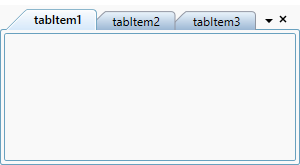
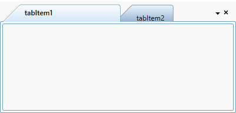
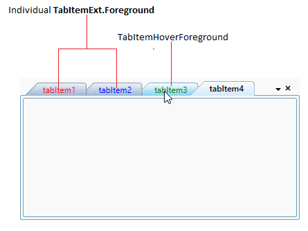
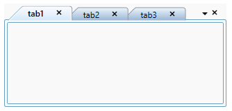
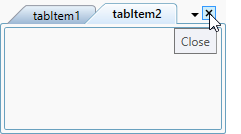
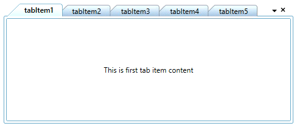
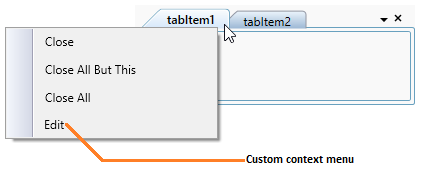
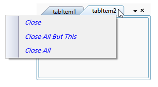
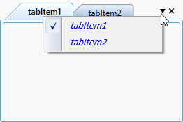
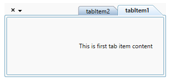

# TabItem Header in WPF TabControl (TabControlExt)

This section explains how to set header text and UI customization of the tab header in the [TabControl](https://help.syncfusion.com/cr/wpf/Syncfusion.Tools.Wpf~Syncfusion.Windows.Tools.Controls.TabControlExt.html).

## Setting tab item header

You can add a text for the each tab headers by using the `TabItemExt.Header` property.




<syncfusion:TabControlExt Name="tabControlExt">
    <syncfusion:TabItemExt Header="tabItem1" Name="tabItemExt1"/>
    <syncfusion:TabItemExt Header="tabItem2" Name="tabItemExt2"/>
    <syncfusion:TabItemExt Header="tabItem3" Name="tabItemExt3"/>
</syncfusion:TabControlExt>




// Creating an instances of tabitems and adding header
TabItemExt tabItemExt1 = new TabItemExt() { Header = "tabItem1" };
TabItemExt tabItemExt2 = new TabItemExt() { Header = "tabItem2" };
TabItemExt tabItemExt3 = new TabItemExt() { Header = "tabItem3" };

// Creating an instances of TabControl and adding the tabitems into the TabControl
TabControlExt tabControlExt = new TabControlExt();
tabControlExt.Items.Add(tabItemExt1);
tabControlExt.Items.Add(tabItemExt2);
tabControlExt.Items.Add(tabItemExt3);




## Edit tab item header at runtime

You can edit the text of the tab header at runtime by double clicking the tab header or selected a tab and pressing `F2` key. You can restrict this editing by using the [EnableLabelEdit](https://help.syncfusion.com/cr/wpf/Syncfusion.Tools.Wpf~Syncfusion.Windows.Tools.Controls.TabControlExt~EnableLabelEdit.html) property value as `false`. The default value of `EnableLabelEdit` property is `true`.




<syncfusion:TabControlExt EnableLabelEdit="True" Name="tabControlExt">       
    <syncfusion:TabItemExt Header="tabItem1"/>
    <syncfusion:TabItemExt Header="tabItem2"/>
</syncfusion:TabControlExt>




tabControlExt.EnableLabelEdit = true;




## Custom UI for the edit tab item header

You can customize the editing tab item header appearance for the each tab items by using the [EditHeaderTemplate](https://help.syncfusion.com/cr/wpf/Syncfusion.Tools.Wpf~Syncfusion.Windows.Tools.Controls.TabControlExt~EditHeaderTemplate.html) property.

Please refer [this] page to know more details about `EditHeaderTemplate`.

## Setting size and alignment of tab header

You can set a size of the each tabs by using the `TabItemExt.Width` and `TabItemExt.Height` properties. You can also align the header content horizontally and vertically by using the `TabItemExt.HorizontalContentAlignment` and `TabItemExt.VerticalContentAlignment` properties. The default value of `TabItemExt.HorizontalContentAlignment` and `TabItemExt.VerticalContentAlignment` properties is `Stretch`.




<syncfusion:TabControlExt Name="tabControlExt">
    <syncfusion:TabItemExt Width="200" Height="30"     
                           HorizontalContentAlignment="Left"
                           VerticalContentAlignment="Center" 
                           Header="tabItem1"
                           Name="tabItemExt1"/>
    <syncfusion:TabItemExt Width="100" Height="30"
                           VerticalContentAlignment="Bottom"
                           HorizontalContentAlignment="Right"
                           Header="tabItem2" 
                           Name="tabItemExt2"/>
</syncfusion:TabControlExt>




//Adding size and alignment of tabItemExt1 header
tabItemExt1.Width = 200;
tabItemExt1.Height = 300;
tabItemExt1.HorizontalContentAlignment = HorizontalAlignment.Left;
tabItemExt1.VerticalContentAlignment = VerticalAlignment.Center;

//Adding size and alignment of tabItemExt2 header
tabItemExt1.Width = 100;
tabItemExt1.Height = 30;
tabItemExt1.HorizontalContentAlignment = HorizontalAlignment.Right;
tabItemExt1.VerticalContentAlignment = VerticalAlignment.Bottom;




## Setting image for tab item header

You can add images to the tab item headers by using the [TabItemExt.Image](https://help.syncfusion.com/cr/wpf/Syncfusion.Tools.Wpf~Syncfusion.Windows.Tools.Controls.TabItemExt~Image.html) property. You can change the height and width of the header image by using the [TabItemExt.ImageHeight](https://help.syncfusion.com/cr/wpf/Syncfusion.Tools.Wpf~Syncfusion.Windows.Tools.Controls.TabItemExt~ImageHeight.html) and [TabItemExt.ImageWidth](https://help.syncfusion.com/cr/wpf/Syncfusion.Tools.Wpf~Syncfusion.Windows.Tools.Controls.TabItemExt~ImageWidth.html) properties.




<!-- Adding TabcontrolExt  -->
<syncfusion:TabControlExt Name="tabControlExt">

    <!-- Adding TabItemExt with image  -->
    <syncfusion:TabItemExt Image="sync_icon.ico" 
                           ImageWidth="20"
                           ImageHeight="20"
                           Header="TabItemExt1"
                           Name="tabItemExt1">
    </syncfusion:TabItemExt>
</syncfusion:TabControlExt>




//Adding header image for tabItemExt1
tabItemExt1.Image = new BitmapImage(
    new Uri(@"\sync_icon.ico", UriKind.RelativeOrAbsolute));

//Setting height and width for the tab header image
tabItemExt1.ImageWidth = 20;
tabItemExt1.ImageHeight = 20;  




### Tab header image alignment

You can align the tab item header image by using the [TabItemExt.ImageAlignment](https://help.syncfusion.com/cr/wpf/Syncfusion.Tools.Wpf~Syncfusion.Windows.Tools.Controls.TabItemExt~ImageAlignment.html) property. You can set a margin for the image by using the [TabItemExt.IconMargin](https://help.syncfusion.com/cr/wpf/Syncfusion.Tools.Wpf~Syncfusion.Windows.Tools.Controls.TabItemExt~IconMargin.html) property. The default value of `TabItemExt.ImageAlignment` property is `LeftOfText` and `TabItemExt.IconMargin` property is `0,0,0,4`.  You can align the image to any one of the following positions.

* AboveText - Images are placed above the tab item header text.
* BelowText – Images are placed below the tab item header text.
* LeftOfText – Images are placed to the left of the tab item header text.
* RightOfText – Images are placed to the right of the tab item header text.




<!-- Adding TabcontrolExt  -->
<syncfusion:TabControlExt Name="tabControlExt">

    <!-- Adding TabItemExt with image with alignment  -->
    <syncfusion:TabItemExt Image="sync.png"  
                           ImageAlignment="AboveText"
                           IconMargin= "2"
                           Header="TabItemExt1"
                           Name="tabItemExt1">
    </syncfusion:TabItemExt>
</syncfusion:TabControlExt>




//Setting alignment for the tab header image 
tabItemExt1.ImageAlignment = ImageAlignment.AboveText;
tabItemExt1.IconMargin = new Thickness(2);



## Setting tooltip

ToolTip is used to show the information about the segment, when you mouse over on the segment. You can add a tooltip information for the each tab items by using the [TabItemExt.ItemToolTip](https://help.syncfusion.com/cr/wpf/Syncfusion.Tools.Wpf~Syncfusion.Windows.Tools.Controls.TabItemExt~ItemToolTip.html) property and show it by hovering the mouse on the respective header of the tab item.




<syncfusion:TabControlExt Name="tabControlExt">
    <syncfusion:TabItemExt ItemToolTip="First item" 
                           Header="tabItem1" Name="tabItemExt1"/>
    <syncfusion:TabItemExt ItemToolTip="Second item"  
                           Header="tabItem2" Name="tabItemExt2"/>
</syncfusion:TabControlExt>




tabItemExt1.ItemToolTip = "First item";
tabItemExt2.ItemToolTip = "Second item";




##  Hide tab header when there is single tab item

You can hide the header of tab item only on when single tab item present in the `TabControl`. You can enable it by using the [HideHeaderOnSingleChild](https://help.syncfusion.com/cr/wpf/Syncfusion.Tools.Wpf~Syncfusion.Windows.Tools.Controls.TabControlExt~HideHeaderOnSingleChild.html) property value as `true`. The Default value of `HideHeaderOnSingleChild` property is `false`.




<syncfusion:TabControlExt HideHeaderOnSingleChild="True" 
                          Name="tabControlExt">
    <syncfusion:TabItemExt Content="This is the first tab item"
                           Header="tabItem1"/>
</syncfusion:TabControlExt>




tabControlExt.HideHeaderOnSingleChild = true;




## Change tab item background

If you want to change the tab item and its header panel background, use the `Background` and [TabPanelBackground](https://help.syncfusion.com/cr/wpf/Syncfusion.Tools.Wpf~Syncfusion.Windows.Tools.Controls.TabControlExt~TabPanelBackground.html) properties. You can change the hover background of all tab headers by using the [TabItemHoverBackground](https://help.syncfusion.com/cr/wpf/Syncfusion.Tools.Wpf~Syncfusion.Windows.Tools.Controls.TabControlExt~TabItemHoverBackground.html) property. You can also change the indivual tab item header background and its hover background by using the `TabItemExt.Background` and [TabItemExt.HoverBackground](https://help.syncfusion.com/cr/wpf/Syncfusion.Tools.Wpf~Syncfusion.Windows.Tools.Controls.TabItemExt~HoverBackground.html) properties. 

N> If you use both `TabItemHoverBackground` and `TabItemExt.HoverBackground` for the tab item, the `TabItemExt.HoverBackground` have higher priority for that tab item.




<syncfusion:TabControlExt Background="LightPink"
                          TabPanelBackground="Green"
                          TabItemHoverBackground="Orange" 
                          Name="tabControlExt">
    <syncfusion:TabItemExt HoverBackground="LightPink" 
                           Background="Red"
                           Header="tabItem1"
                           Name="tabItemExt1"/>
    <syncfusion:TabItemExt HoverBackground="Green" 
                           Background="Blue"
                           Header="tabItem2"
                           Name="tabItemExt2"/>
</syncfusion:TabControlExt>




//Setting the tab items panel, headers and its hover background 
tabControlExt.Background = Brushes.LightPink;
tabControlExt.TabPanelBackground = Brushes.Green;
tabControlExt.TabItemHoverBackground = Brushes.Orange;

//Setting the header and hover background for the particular tab item
tabItemExt1.Background = Brushes.Red;
tabItemExt2.Background = Brushes.Blue;
tabItemExt1.HoverBackground = Brushes.LightPink;
tabItemExt2.HoverBackground = Brushes.Green;




## Change tab item foreground




<syncfusion:TabControlExt TabItemHoverForeground="Green"
                          Name="tabControlExt">
    <syncfusion:TabItemExt Foreground="Red" 
                           Header="tabItem1"
                           Name="tabItemExt1"/>
    <syncfusion:TabItemExt Foreground="Blue" 
                           Header="tabItem2"
                           Name="tabItemExt2"/>
</syncfusion:TabControlExt>




//Setting the tab items hover foreground 
tabControlExt.TabItemHoverForeground = Brushes.Green;

//Setting the header and item foreground for the particular tab item
tabItemExt1.Foreground = Brushes.Red;
tabItemExt2.Foreground = Brushes.Blue;




# Selecting a tab item

This section explains how to select tab item and selection functionalities in the [TabControl](https://help.syncfusion.com/cr/wpf/Syncfusion.Tools.Wpf~Syncfusion.Windows.Tools.Controls.TabControlExt.html).

##  Select tab item using mouse and key interaction

You can select a particular tab item by using the mouse click on the tab header. You also use the `Left-Arrow` and `Right-Arrow` key , to select the previous tab item or next tab item of current selected tab item. You can get the selected item by using the `SelectedItem` property. By default, the first tab item is selected.

N> You can select only one tab item at a time.

## Tab selection changed notification

The `TabControl` notifies that the selected tabitem is changed by user through the [SelectedItemChangedEvent](https://help.syncfusion.com/cr/wpf/Syncfusion.Tools.Wpf~Syncfusion.Windows.Tools.Controls.TabControlExt~SelectedItemChangedEvent_EV.html) event. You can use the [OldSelectedItem](https://help.syncfusion.com/cr/wpf/Syncfusion.Tools.Wpf~Syncfusion.Windows.Tools.Controls.SelectedItemChangedEventArgs~OldSelectedItem.html) and [NewSelectedItem](https://help.syncfusion.com/cr/wpf/Syncfusion.Tools.Wpf~Syncfusion.Windows.Tools.Controls.SelectedItemChangedEventArgs~NewSelectedItem.html) properties to get the old and new selected tabitem in the `SelectedItemChangedEvent` event.




<syncfusion:TabControlExt SelectedItemChangedEvent="TabControlExt_SelectedItemChangedEvent"
                          Name="tabControlExt" />




TabControlExt tabControlExt = new TabControlExt();
tabControlExt.SelectedItemChangedEvent += TabControlExt_SelectedItemChangedEvent;




You can handle the event as follows:




private void TabControlExt_SelectedItemChangedEvent(object sender, SelectedItemChangedEventArgs e) {
    var newTabItem = e.NewSelectedItem.Header;
    if (e.OldSelectedItem != null) {
        var oldTabItem = e.OldSelectedItem.Header;
    }
    else {
        var oldTabItem = string.Empty;
    }
}




## Load the previously selected tab item content

If you want to load the previously selected tab item in background after new tab item is selected, use the [IsDisableUnloadTabItemExtContent](https://help.syncfusion.com/cr/wpf/Syncfusion.Tools.Wpf~Syncfusion.Windows.Tools.Controls.TabControlExt~IsDisableUnloadTabItemExtContent.html) property value as `true`. The default value of `IsDisableUnloadTabItemExtContent` property is `false`.




<syncfusion:TabControlExt IsCustomTabItemContextMenuEnabled="IsCustomTabItemContextMenuEnabled"
                          Name="tabControlExt">
    <syncfusion:TabItemExt Header="tab1" Name="tabItemExt1"/>
    <syncfusion:TabItemExt Header="tab2" Name="tabItemExt2"/>
</syncfusion:TabControlExt>




tabControlExt.IsCustomTabItemContextMenuEnabled = true;




## Change selected tab header font weight

If you want to highlight the selected tab header, change the font of tab header from semi bold to extra bold by using the [SelectedItemFontWeight](https://help.syncfusion.com/cr/wpf/Syncfusion.Tools.Wpf~Syncfusion.Windows.Tools.Controls.TabControlExt~SelectedItemFontWeight.html) property. The default value of `SelectedItemFontWeight` property is `SemiBold`.




<syncfusion:TabControlExt SelectedItemFontWeight="ExtraBold"
                          Name="tabControlExt">
    <syncfusion:TabItemExt Header="tabItem1" Name="tabItemExt1"/>
    <syncfusion:TabItemExt Header="tabItem2" Name="tabItemExt2"/>
</syncfusion:TabControlExt>




tabControlExt.SelectedItemFontWeight = FontWeights.ExtraBold;




## Change selected tab header background and foreground 

You can change the highlighting background and foreground of the selected tab item by using the [TabItemSelectedForeground](https://help.syncfusion.com/cr/wpf/Syncfusion.Tools.Wpf~Syncfusion.Windows.Tools.Controls.TabControlExt~TabItemSelectedForeground.html) and [TabItemSelectedBackground](https://help.syncfusion.com/cr/wpf/Syncfusion.Tools.Wpf~Syncfusion.Windows.Tools.Controls.TabControlExt~.html) properties. The default value of `TabItemSelectedForeground` property is `Black`  and `TabItemSelectedBackground` property is `Lavender`.




<syncfusion:TabControlExt TabItemSelectedForeground="Red" 
                          TabItemSelectedBackground="Green"
                          Name="tabControlExt">
    <syncfusion:TabItemExt Header="tabItem1" Name="tabItemExt1"/>
    <syncfusion:TabItemExt Header="tabItem2" Name="tabItemExt2"/>
</syncfusion:TabControlExt>




tabControlExt.TabItemSelectedForeground = Brushes.Red;
tabControlExt.TabItemSelectedBackground = Brushes.Green;




# Closing or Hiding tab item

This section explains how to closing the tab item and its functionalities in the [TabControl](https://help.syncfusion.com/cr/wpf/Syncfusion.Tools.Wpf~Syncfusion.Windows.Tools.Controls.TabControlExt.html).

## Closing tab item 

You can close the selected tab by clicking the close button which is placed top-right corner of the tab panel. You also close any tab by clicking mouse middle button.You can enable it by setting the [CloseTabOnMiddleClick](https://help.syncfusion.com/cr/wpf/Syncfusion.Tools.Wpf~Syncfusion.Windows.Tools.Controls.TabControlExt~CloseTabOnMiddleClick.html) property value as `true`. The default value of `CloseTabOnMiddleClick` property is `false`.




<syncfusion:TabControlExt CloseTabOnMiddleClick="True"
                          Name="tabControlExt">
    <syncfusion:TabItemExt Header="tabItem1" Name="tabItemExt1"/>
    <syncfusion:TabItemExt Header="tabItem2" Name="tabItemExt2"/>
</syncfusion:TabControlExt>




tabControlExt.CloseTabOnMiddleClick = true;




## Show or hide close button

You can show or hide the close button in each tabs and tab panel by using the [CloseButtonType](https://help.syncfusion.com/cr/wpf/Syncfusion.Tools.Wpf~Syncfusion.Windows.Tools.Controls.TabControlExt~CloseButtonType.html) property. 

The following Close button modes are supported by the `TabControl`.

* Common – The single close button is displayed commonly for all tab items in the tab panel.
* Individual – The close button is displayed individually for each tab items in the tab panel.
* Both – The close button is displayed individually for each tab item and also displayed in the tab panel.
* Hide – All close buttons is hidden in the tab panel.
* IndividualOnMouseOver - The close button is displayed when the mouse hovers over the tab item in the tab panel.
* Extended - The Close button is displayed in the selected tab and mousing hovering tab in the tab panel.




<syncfusion:TabControlExt CloseButtonType="Both"
                          Name="tabControlExt">
    <syncfusion:TabItemExt Header="tab1" Name="tabItemExt1"/>
    <syncfusion:TabItemExt Header="tab2" Name="tabItemExt2"/>
</syncfusion:TabControlExt>




tabControlExt.CloseButtonType = CloseButtonType.Both;




### Show or hide close button for specific tab item

You can show or hide close button for particular tab item by using the [TabItemExt.CloseButtonState](https://help.syncfusion.com/cr/wpf/Syncfusion.Tools.Wpf~Syncfusion.Windows.Tools.Controls.TabItemExt~CloseButtonState.html) property. The `TabItemExt.CloseButtonState` is effective only when the `CloseButtonType` property is set to one among `Individual`, `Extended`, or `Both`. 

<table>
<tr>
<td>
<b> CloseButtonState </b>   </td><td>
<b> Description </b>   </td></tr>
<tr>
<td>
Visible  </td><td>
The close button of TabItemExt is visible  </td></tr>
<tr>
<td>
Collapsed  </td><td>
The close button of TabItemExt is collapsed  </td></tr>
</table>




<syncfusion:TabControlExt CloseButtonType="Both"
                          Name="tabControlExt">
    <syncfusion:TabItemExt CloseButtonState="Visible" 
                           Header="tabItem1" Name="tabItemExt1"/>
    <syncfusion:TabItemExt CloseButtonState="Collapsed"
                           Header="tabItem2" Name="tabItemExt2"/>
</syncfusion:TabControlExt>




tabControlExt.CloseButtonType = CloseButtonType.Both;

//Changing the particular item close button visibility
tabItemExt1.CloseButtonState = Visibility.Visible;
tabItemExt2.CloseButtonState = Visibility.Collapsed;




## Restrict or allow closing the tab item

You can restrict or allow the tab item closing by using either property or event. 

## Restrict closing the tab item using property

You can restrict the closing functionality of specific tabitem using the [TabItemExt.CanClose](https://help.syncfusion.com/cr/wpf/Syncfusion.Tools.Wpf~Syncfusion.Windows.Tools.Controls.TabItemExt~CanClose.html) property. When the `TabItemExt.CanClose` property is set to `false`, the corresponding tab item will be non-closable. The default value of `CanClose` property is `true`.



 
<syncfusion:TabControlExt CloseButtonType="Individual"
                          Name="tabControlExt">
    <syncfusion:TabItemExt CanClose="False"
                           Header="tabItem1" Name="tabItemExt1"/>
    <syncfusion:TabItemExt CanClose="True" 
                           Header="tabItem2" Name="tabItemExt2"/>
</syncfusion:TabControlExt>




tabControlExt.CloseButtonType = CloseButtonType.Individual;

//Restrict and allow the particular item close button
tabItemExt1.CanClose = false;
tabItemExt2.CanClose = true;




Here, `tabItem1` cancel button is disabled.

## Restrict closing the tab item using event

The closing of tab item can be restricted by setting `e.Cancel` to `true` in [OnCloseButtonClick](https://help.syncfusion.com/cr/wpf/Syncfusion.Tools.Wpf~Syncfusion.Windows.Tools.Controls.TabControlExt~OnCloseButtonClick_EV.html) event. `e` represents the event argument [CloseTabEventArgs](https://help.syncfusion.com/cr/wpf/Syncfusion.Tools.Wpf~Syncfusion.Windows.Tools.Controls.CloseTabEventArgs.html) for `OnCloseButtonClick` event. The default value of `e.Cancel` is `false`.




<syncfusion:TabControlExt OnCloseButtonClick="TabControlExt_OnCloseButtonClick" >
    <syncfusion:TabItemExt Header="tabItem1" />
    <syncfusion:TabItemExt Header="tabItem2" />
</syncfusion:TabControlExt>




tabControlExt.OnCloseButtonClick += TabControlExt_OnCloseButtonClick;




You can handle the event as follows:




private void TabControlExt_OnCloseButtonClick(object sender, CloseTabEventArgs e) {
    if(e.TargetTabItem.Header.ToString() == "tabItem1") {
        e.Cancel = true;
    }               
}




Here, `tabItem1` cannot be closed.

## Hide or delete item when closing a tab

You can decide whether the tab item can be only hidden from the view or removed from the items collection of `TabControl` by using the [CloseMode](https://help.syncfusion.com/cr/cref_files/wpf/Syncfusion.Tools.Wpf~Syncfusion.Windows.Tools.Controls.TabControlExt~CloseMode.html) property while closing it. If you set `CloseMode` property as `Hide`, the tab item will be hidden and the selection will be moved to previous index while hiding it. Also, if the property `CloseMode` is `Delete`, the tab item will be removed from the items collection and the selection will be retained in the same index while removing it. The default value of the `CloseMode` property is `Hide`.




<syncfusion:TabControlExt CloseMode="Delete"
                          Name="tabControlExt">
    <syncfusion:TabItemExt Header="tabItem1" />
    <syncfusion:TabItemExt Header="tabItem2" />
</syncfusion:TabControlExt>




tabControlExt.CloseMode = CloseMode.Delete;




## Tab item closed notification

When the tab item is closed, it will be notified by using the [TabClosed](https://help.syncfusion.com/cr/wpf/Syncfusion.Tools.Wpf~Syncfusion.Windows.Tools.Controls.TabControlExt~TabClosed_EV.html) event. You can get the details about the closed tab item from [CloseTabEventArgs](https://help.syncfusion.com/cr/wpf/Syncfusion.Tools.Wpf~Syncfusion.Windows.Tools.Controls.CloseTabEventArgs.html).




<syncfusion:TabControlExt TabClosed="TabControlExt_TabClosed" >
    <syncfusion:TabItemExt Header="tabItem1" />
    <syncfusion:TabItemExt Header="tabItem2" />
</syncfusion:TabControlExt>




tabControlExt.TabClosed += TabControlExt_TabClosed;




You can handle the event as follows:




private void TabControlExt_TabClosed(object sender, CloseTabEventArgs e) {
    var deletedItem = e.TargetTabItem;
}




# Arranging tab items

This section explains how to arrange the tab item and its alignment functionalities in the [TabControl](https://help.syncfusion.com/cr/wpf/Syncfusion.Tools.Wpf~Syncfusion.Windows.Tools.Controls.TabControlExt.html).

## Rearrange position of tab items

If you want to rearrange the tab items position, drag that item and drop to anywhere you want to place it in the tab panel. You can restrict it by setting the [AllowDragDrop](https://help.syncfusion.com/cr/wpf/Syncfusion.Tools.Wpf~Syncfusion.Windows.Tools.Controls.TabControlExt~AllowDragDrop.html) property value as `false`. The default value of `AllowDragDrop` property is `true`. The drag marker will preview the location, where you drop the dragged tab item.

 


<syncfusion:TabControlExt AllowDragDrop="True" >
    <syncfusion:TabItemExt Header="tabItem1" />
    <syncfusion:TabItemExt Header="tabItem2" />
</syncfusion:TabControlExt>




tabControlExt.AllowDragDrop = true;




### change drag marker color

You can change the drag marker color by setting the color value for the [DragMarkerColor](https://help.syncfusion.com/cr/wpf/Syncfusion.Tools.Wpf~Syncfusion.Windows.Tools.Controls.TabControlExt~DragMarkerColor.html) property. The default value of `DragMarkerColor` property is `Black`.




<syncfusion:TabControlExt DragMarkerColor="Red" 
                          AllowDragDrop="True">
    <syncfusion:TabItemExt Header="tabItem1" />
    <syncfusion:TabItemExt Header="tabItem2" />
</syncfusion:TabControlExt>




tabControlExt.DragMarkerColor = Brushes.Red;
tabControlExt.AllowDragDrop = true;




## Tab items Alignment

Tab items can be aligned to any side of the `TabControl` by using the [TabStripPlacement](https://help.syncfusion.com/cr/wpf/Syncfusion.Tools.Wpf~Syncfusion.Windows.Tools.Controls.TabControlSettings~TabStripPlacement.html) property. The default value of `TabStripPlacement` property is `Top`.

The following TabStrip placement options are supported by the `TabControl`.

* Top - Tab items are placed at top of the `TabControl`.
* Bottom - Tab items are placed at bottom of the `TabControl`.
* Left - Tab items are placed at left side of the `TabControl`.
* Right - Tab items are placed at right side of the `TabControl`.




<syncfusion:TabControlExt TabStripPlacement="Bottom">
    <syncfusion:TabItemExt Header="tabItem1" />
    <syncfusion:TabItemExt Header="tabItem2" />
</syncfusion:TabControlExt>




tabControlExt.TabStripPlacement = Dock.Bottom;




### Rotating the tab items

Whenever the `TabStripPlacement` is set to `Left` or `Right`, the tab headers are vertically arranged. To improve the user readability, the tab items can be rotated by using the [RotateTextWhenVertical](https://help.syncfusion.com/cr/wpf/Syncfusion.Tools.Wpf~Syncfusion.Windows.Tools.Controls.TabControlExt~RotateTextWhenVertical.html) property as `true`. The default value of `RotateTextWhenVertical` property is `false`.




<syncfusion:TabControlExt RotateTextWhenVertical="True"
                          TabStripPlacement="Right">
    <syncfusion:TabItemExt Header="tabItem1" />
    <syncfusion:TabItemExt Header="tabItem2" />
</syncfusion:TabControlExt>




tabControlExt.RotateTextWhenVertical = true;
tabControlExt.TabStripPlacement = Dock.Right;




## Arrange tab item in multiple line

 If you add more tabs and they exceed the `TabControl` size, then they are in collapsed state and can navigate to that tabs only by using the scroll button. You can show all the tabs in the tab panel by setting the [TabItemLayout](https://help.syncfusion.com/cr/wpf/Syncfusion.Tools.Wpf~Syncfusion.Windows.Tools.Controls.TabControlExt~TabItemLayout.html) property value as `MultiLine` or `MultiLineWithFullWidth`. The default value of `TabItemLayout` property is `Single`.

`TabControl` provides the following layout types.

* SingleLine – Tab items are displayed in single line
* MultiLine – Tab items are shrunk and displayed in multiple lines
* MultiLineWithFillWidth – Tab items are displayed in multiple lines without being shrunk




<syncfusion:TabControlExt TabItemLayout="MultiLine" 
                          Width="300"
                          Name="tabControlExt">
    <syncfusion:TabItemExt Header="tabItem1" />
    <syncfusion:TabItemExt Header="tabItem2" />
</syncfusion:TabControlExt>




tabControlExt.TabItemLayout = TabItemLayoutType.MultiLine;




# Switching between tab items

This section explains how to switching between tab item in the [TabControl](https://help.syncfusion.com/cr/wpf/Syncfusion.Tools.Wpf~Syncfusion.Windows.Tools.Controls.TabControlExt.html).

##  Navigate using mouse and keys interaction

You can navigate from one tab to any other tab by using the mouse click on the tab header. You also use the `Left-Arrow` and `Right-Arrow` key , to navigate the previous tab item or next tab item from the current tab item.

## Navigate using scroll button

If you add more tab items, then some tab headers are collapsed. If you navigate to the collapsed tab items, click the scroll button which is placed in the top-right corner of the tab header panel. You can auto visible or hide the scroll button by using the [TabScrollButtonVisibility](https://help.syncfusion.com/cr/wpf/Syncfusion.Tools.Wpf~Syncfusion.Windows.Tools.Controls.TabControlExt~TabScrollButtonVisibility.html) property value as `Auto` or `Hidden`. You can easily navigate to first or last or next or previous tab items by setting the [TabScrollStyle](https://help.syncfusion.com/cr/wpf/Syncfusion.Tools.Wpf~Syncfusion.Windows.Tools.Controls.TabControlExt~TabScrollStyle.html) property value as `Extended`, then it will show the `First`, `Last`, `Next`, `Previous` button options. The default value of the `TabScrollStyle` property is `Normal`.

The following `TabScrollStyle` supported by the `TabControl` control.

* Extended Mode - Provides the Next, Previous, Last and First navigation options
* Normal Mode – Provides the Next and Previous navigation options only




<syncfusion:TabControlExt TabScrollButtonVisibility="Auto"
                          TabScrollStyle="Extended" 
                          Width="300"
                          Name="tabControlExt">
    <syncfusion:TabItemExt Header="tabItem1" />
    <syncfusion:TabItemExt Header="tabItem2" />
</syncfusion:TabControlExt>




tabControlExt.TabScrollButtonVisibility = TabScrollButtonVisibility.Auto;
tabControlExt.TabScrollStyle = TabScrollStyle.Extended;




## Navigate using tab list menu

You can easily navigate to any tab item by using the tab list menu which is placed in the top-right corner of the tab header panel .The header of all tab item’s are shown as a menu item in the tab list menu. You can hide this tab list menu by using the [ShowTabListContextMenu](https://help.syncfusion.com/cr/wpf/Syncfusion.Tools.Wpf~Syncfusion.Windows.Tools.Controls.TabControlExt~ShowTabListContextMenu.html) property value as `false`.  The default value of `ShowTabListContextMenu` property is `true`.




<syncfusion:TabControlExt ShowTabListContextMenu="True"
                          Name="tabControlExt">
    <syncfusion:TabItemExt Header="tabItem1" />
    <syncfusion:TabItemExt Header="tabItem2" />
</syncfusion:TabControlExt>




tabControlExt.ShowTabListContextMenu = true;




# Add new tab item using New button

This section explains how to create new tab items using new button and its UI customization in the [TabControl](https://help.syncfusion.com/cr/wpf/Syncfusion.Tools.Wpf~Syncfusion.Windows.Tools.Controls.TabControlExt.html). 

## Adding New tab button and new tab item

You can add a new tab item at runtime by clicking the new button. You can enable it by using the [IsNewButtonEnabled](https://help.syncfusion.com/cr/wpf/Syncfusion.Tools.Wpf~Syncfusion.Windows.Tools.Controls.TabControlExt~IsNewButtonEnabled.html) property. You should handle the click action of the New Button and add a new tab items to `TabControl` by using the [NewButtonClick](https://help.syncfusion.com/cr/wpf/Syncfusion.Tools.Wpf~Syncfusion.Windows.Tools.Controls.TabControlExt~NewButtonClick_EV.html) event. The new button can be aligned first or last position in the tab item header panel by using the [NewButtonAlignment](https://help.syncfusion.com/cr/wpf/Syncfusion.Tools.Wpf~Syncfusion.Windows.Tools.Controls.TabControlExt~NewButtonAlignment.html) property. The default value of `IsNewButtonEnabled` property is `false` and `NewButtonAlignment` property is `Last`.




<syncfusion:TabControlExt IsNewButtonEnabled="True"
                          NewButtonAlignment="Last"
                          Name="tabControlExt">
    <syncfusion:TabItemExt Header="tabItem1" />
    <syncfusion:TabItemExt Header="tabItem2" />
</syncfusion:TabControlExt>




tabControlExt.IsNewButtonEnabled = true;
tabControlExt.NewButtonAlignment = NewButtonAlignment.Last;




You can handle the event as follows:




private void tabControlExt_NewButtonClick(object sender, EventArgs e) {
    TabItemExt tabItemExt1 = new TabItemExt()
    {
        Header = "tabItem"+ (tabControlExt.Items.Count + 1),
        Content = new TextBlock() { Text = "This is the content area of TabItem" }
    };

    //Adding new tab item into the TabControl.
    tabControlExt.Items.Add(tabItemExt1);
}




 ## Auto hide new button when no child tab item

The `TabControl` automatically hides the new button on when no child tab item present in the `TabControl`. If you want to always show the new button, use the [IsNewButtonClosedonNoChild](https://help.syncfusion.com/cr/wpf/Syncfusion.Tools.Wpf~Syncfusion.Windows.Tools.Controls.TabControlExt~IsNewButtonClosedonNoChild.html) property value as `false`. The default value of `HideHeaderOnSingleChild` property is `true`.




<syncfusion:TabControlExt IsNewButtonClosedonNoChild="False"
                          Name="tabControlExt">
    <syncfusion:TabItemExt Content="This is the first tab item"
                           Header="tabItem1"/>
</syncfusion:TabControlExt>




tabControlExt.IsNewButtonClosedonNoChild = false;




## Custom UI for new button

If you wants to change the UI for the new button, use the [NewButtonTemplate](https://help.syncfusion.com/cr/wpf/Syncfusion.Tools.Wpf~Syncfusion.Windows.Tools.Controls.TabControlExt~NewButtonTemplate.html) or [NewButtonStyle](https://help.syncfusion.com/cr/wpf/Syncfusion.Tools.Wpf~Syncfusion.Windows.Tools.Controls.TabControlExt~NewButtonStyle.html)  properties. 




<syncfusion:TabControlExt IsNewButtonEnabled="True"
                          x:Name="tabControlExt">
    <syncfusion:TabControlExt.NewButtonTemplate>
        <ControlTemplate>
            <Button Background="Red" 
                    Content=" + "></Button>
        </ControlTemplate>
    </syncfusion:TabControlExt.NewButtonTemplate>
    <syncfusion:TabItemExt Header="tabItem1" Name="tabItemExt1"/>
    <syncfusion:TabItemExt Header="tabItem2" Name="tabItemExt2"/>
</syncfusion:TabControlExt>




## Change background of new button

If you want to change the background of the new button, use the [NewButtonBackground](https://help.syncfusion.com/cr/wpf/Syncfusion.Tools.Wpf~Syncfusion.Windows.Tools.Controls.TabControlExt~NewButtonBackground.html) property. The defalut value of `NewButtonBackground` property is `null`.




<syncfusion:TabControlExt NewButtonBackground="Red"
                          Name="tabControlExt">
    <syncfusion:TabItemExt Content="This is the first tab item"
                           Header="tabItem1"/>
</syncfusion:TabControlExt>




tabControlExt.NewButtonBackground = Brushes.Red;




# Pin or Unpin the tab items

This section explains the pin and unpin tab items support in [TabControl](https://help.syncfusion.com/cr/wpf/Syncfusion.Tools.Wpf~Syncfusion.Windows.Tools.Controls.TabControlExt.html). 

## Enabling pin and unpin behaviors

If you want to pin or unpin the tab items, use the [TabItemExt.AllowPin](https://help.syncfusion.com/cr/cref_files/wpf/Syncfusion.Tools.Wpf~Syncfusion.Windows.Tools.Controls.TabItemExt~AllowPin.html) property as `true`. When this property is set to `false`, the pin and unpin behaviors of tab item will be disabled. The default value of the `TabItemExt.AllowPin` property is `false`.



 
<syncfusion:TabControlExt  Name="tabControlExt">
    <syncfusion:TabItemExt AllowPin="True"
                           Header="tabItem1" Name="tabItemExt1"/>
    <syncfusion:TabItemExt AllowPin="True" 
                           Header="tabItem2" Name="tabItemExt2"/>
</syncfusion:TabControlExt>




tabItemExt1.AllowPin = true;
tabItemExt2.AllowPin = true;




## Functionality of PinButton

 When the corresponding tab item is pinned, it will be inserted at first position of the tab header panel(if its not have any pinned tab. Otherwise, the pinned tab item will be added next to last pinned item). When the tab item is unpinned, it will be placed after to the pinned tab items.

## Pin and Unpin tab items using PinButton

If you want to pin or unpin the tab item using the pin button, use the [TabItemExt.ShowPin](https://help.syncfusion.com/cr/cref_files/wpf/Syncfusion.Tools.Wpf~Syncfusion.Windows.Tools.Controls.TabItemExt~ShowPin.html) property value as `true` and set the `TabItemExt.AllowPin` property value as `true`. The defalut value of `TabItemExt.ShowPin` property is `false`, so the PinButton is collapsed from header panel of the tab item.




<syncfusion:TabControlExt  Name="tabControlExt">
    <syncfusion:TabItemExt ShowPin="True" 
                           AllowPin="True"
                           Header="tabItem1" Name="tabItemExt1"/>
    <syncfusion:TabItemExt ShowPin="True" 
                           AllowPin="True" 
                           Header="tabItem2" Name="tabItemExt2"/>
</syncfusion:TabControlExt>




//Showing the pin buttons
tabItemExt1.ShowPin = true;
tabItemExt2.ShowPin = true;

//Enabling the pin buttons
tabItemExt1.AllowPin = true;
tabItemExt2.AllowPin = true;




N> If the `ShowPin` property is `true`, and the `AllowPin` property is `false`, the PinButton will be displayed as a disabled button.

## Pin and Unpin the tab items programmatically

You can pin or unpin the tab items programmatically by using the [TabItemExt.IsPinned](https://help.syncfusion.com/cr/cref_files/wpf/Syncfusion.Tools.Wpf~Syncfusion.Windows.Tools.Controls.TabItemExt~IsPinned.html) property. If the `TabItemExt.IsPinned` property is set to `true`, the corresponding item will be pinned. Also, if the `TabItemExt.IsPinned` property is set as `false` and the item is pinned, then it will be unpinned. The default value of `TabItemExt.IsPinned` property is `false`.




<syncfusion:TabControlExt Name="tabControlExt">
    <syncfusion:TabItemExt ShowPin="True" 
                           AllowPin="True"
                           IsPinned="False"
                           Header="tabItem1" Name="tabItemExt1"/>
    <syncfusion:TabItemExt ShowPin="True" 
                           AllowPin="True" 
                           IsPinned="True"
                           Header="tabItem2" Name="tabItemExt2"/>
</syncfusion:TabControlExt>




//Pin or unpin the tab items programmatically
tabItemExt1.IsPinned = false;
tabItemExt2.IsPinned = true;

//Showing the pin buttons
tabItemExt1.ShowPin = true;
tabItemExt2.ShowPin = true;

//Enabling the pin buttons
tabItemExt1.AllowPin = true;
tabItemExt2.AllowPin = true;




## Pin and Unpin tab items using ContextMenu

You can pin or unpin the tab items using the context menu. You can enable it by setting the `TabItemExt.AllowPin` property value as `true`. If the `TabItemExt.AllowPin` property is `true`, and the tab item is not pinned, "Pin Tab" option will be visible. If the tab item is pinned already, "Unpin Tab" option will be visible in the context menu. 

N> If you want to show the pin and unpin buttons , use the `TabItemExt.ShowPin` value as `true`.




<syncfusion:TabControlExt Name="tabControlExt">
    <syncfusion:TabItemExt ShowPin="True" 
                           AllowPin="True"
                           IsPinned="False"
                           Header="tabItem1" Name="tabItemExt1"/>
    <syncfusion:TabItemExt ShowPin="True" 
                           AllowPin="True" 
                           IsPinned="True"
                           Header="tabItem2" Name="tabItemExt2"/>
</syncfusion:TabControlExt>




//Pin or unpin the tab items programmatically
tabItemExt1.IsPinned = false;
tabItemExt2.IsPinned = true;

//Showing the pin buttons
tabItemExt1.ShowPin = true;
tabItemExt2.ShowPin = true;

//Enabling the pin buttons
tabItemExt1.AllowPin = true;
tabItemExt2.AllowPin = true;




## Re-order pinned tabs

You can re-order the pinned item within the pinned items and re-order the un-pinned item within the unpinned, but re-ordering between pinned and unpinned or unpinned and pinned has been restricted. If the pinned tab item is dropped inside the unpinned tab items, the dragged item will be inserted at the last position of pinned tab item and if the unpinned tab item is dropped inside pinned tab items, the dragged item will be inserted after the last pinned item.

# Context menu in WPF TabControl (TabControlExt)

This section explains how to show the tab list and tab item context menu and add custom context menu in [TabControl](https://help.syncfusion.com/cr/wpf/Syncfusion.Tools.Wpf~Syncfusion.Windows.Tools.Controls.TabControlExt.html).

## Default tab item context menu

You can close the one or more tab items by using the context menu. You can enable it by using the  [ShowTabItemContextMenu](https://help.syncfusion.com/cr/wpf/Syncfusion.Tools.Wpf~Syncfusion.Windows.Tools.Controls.TabControlExt~ShowTabItemContextMenu.html) property to `true`. You can open this context menu by right click on tab header. The default value of `ShowTabItemContextMenu` property is `false`.

The built-in tabitem context menu has the following menu items:

* Close - Closes the selected tab item.
* Close All But This - Closes all the tab items, except the selected tab item.
* Close All - Closes all the tab items.

N> The [CloseMode](https://help.syncfusion.com/cr/wpf/Syncfusion.Tools.Wpf~Syncfusion.Windows.Tools.Controls.TabControlExt~CloseMode.html) in `TabControl` is an enum that includes option `Hide` and `Delete`. When you click any default options (Close, Close All and Close All But This) in tabitem context menu and when the `CloseMode` is set to `Hide`, the tabitem moves to the hidden state or when the `CloseMode` is set to `Delete`, the tabitem is completely deleted from `TabControl`.




<syncfusion:TabControlExt ShowTabItemContextMenu="True" 
                          CloseMode="Hide"
                          Name="tabControlExt">
    <syncfusion:TabItemExt Content="This is the first tab item"
                           Header="tabItem1"/>
</syncfusion:TabControlExt>




tabControlExt.ShowTabItemContextMenu = true;
tabControlExt.CloseMode = CloseMode.Hide;




### Tab item context menu events

Closing the tab items using the context menu can be notified by following events.

* `Close` option - [OnCloseButtonClick](https://help.syncfusion.com/cr/wpf/Syncfusion.Tools.Wpf~Syncfusion.Windows.Tools.Controls.TabControlExt~OnCloseButtonClick_EV.html) event
* `Close All But This` option - [OnCloseOtherTabs](https://help.syncfusion.com/cr/wpf/Syncfusion.Tools.Wpf~Syncfusion.Windows.Tools.Controls.TabControlExt~OnCloseOtherTabs_EV.html ) event
* `Close All` option - [OnCloseAllTabs](https://help.syncfusion.com/cr/wpf/Syncfusion.Tools.Wpf~Syncfusion.Windows.Tools.Controls.TabControlExt~OnCloseAllTabs_EV.html) event.

You can use the [CloseTabEventArgs.ClosingTabItems](https://help.syncfusion.com/cr/wpf/Syncfusion.Tools.Wpf~Syncfusion.Windows.Tools.Controls.CloseTabEventArgs~ClosingTabItems.html) property to find out which tabitem is closing from the `OnCloseOtherTabs` and  `OnCloseAllTabs` events and use the [CloseTabEventArgs.TargetTabItem](https://help.syncfusion.com/cr/wpf/Syncfusion.Tools.Wpf~Syncfusion.Windows.Tools.Controls.CloseTabEventArgs~TargetTabItem.html) property to find out which tabitem is closing from the `OnCloseButtonClick` event.




<syncfusion:TabControlExt OnCloseAllTabs="TabControlExt_OnCloseAllTabs"
                          OnCloseButtonClick="TabControlExt_OnCloseButtonClick"
                          OnCloseOtherTabs="TabControlExt_OnCloseAllTabs"
                          Name="tabControlExt">
</syncfusion:TabControlExt>




tabControlExt.OnCloseAllTabs += TabControlExt_OnCloseAllTabs;
tabControlExt.OnCloseButtonClick += TabControlExt_OnCloseButtonClick;
tabControlExt.OnCloseOtherTabs += TabControlExt_OnCloseOtherTabs;




You can hadle this events as follows,




private void TabControlExt_OnCloseAllTabs(object sender, CloseTabEventArgs e) {
    var closingTabItems = e.ClosingTabItems;
}
private void TabControlExt_OnCloseButtonClick(object sender, CloseTabEventArgs e) {
    var closingTabItems = e.ClosingTabItems;
}
private void TabControlExt_OnCloseOtherTabs(object sender, CloseTabEventArgs e) {
    var closingTabItems = e.ClosingTabItems;
}




### Adding custom context menu item for the tab items

You can add the custom context menu item for the tab item using the [TabItemExt.ContextMenuItems](https://help.syncfusion.com/cr/wpf/Syncfusion.Tools.Wpf~Syncfusion.Windows.Tools.Controls.TabItemExt~ContextMenuItems.html) property. You can enable it by setting the [TabControlExt.IsCustomTabItemContextMenuEnabled](https://help.syncfusion.com/cr/wpf/Syncfusion.Tools.Wpf~Syncfusion.Windows.Tools.Controls.TabControlExt~IsCustomTabItemContextMenuEnabled.html) property to `true`. The default value of `TabControlExt.IsCustomTabItemContextMenuEnabled` property is `false`.




<syncfusion:TabControlExt IsCustomTabItemContextMenuEnabled="True"
                  Name="tabControlExt" >
    <syncfusion:TabItemExt Header="tabItem1">
        
        <!--Adding custom context menu items-->
        <syncfusion:TabItemExt.ContextMenuItems>
            <syncfusion:CustomMenuItem Header="Edit" />
        </syncfusion:TabItemExt.ContextMenuItems>
    </syncfusion:TabItemExt>
</syncfusion:TabControlExt>




// Enable custom tabitem context menu
tabControlExt.IsCustomTabItemContextMenuEnabled = true;

// Adding custom context menu for the tabitem
CustomMenuItem customMenuItem = new CustomMenuItem();
customMenuItem.Header = "Edit";
tabItemExt1.ContextMenuItems.Add(customMenuItem);




### Show only custom context menu items

If you want to show only custom context menu items in the default context menu, then you can collapse the default context menu item using [TabControlExt.DefaultContextMenuItemVisibility](https://help.syncfusion.com/cr/wpf/Syncfusion.Tools.Wpf~Syncfusion.Windows.Tools.Controls.TabControlExt~DefaultContextMenuItemVisibility.html) property value as `false`. The default value of `TabControlExt.DefaultContextMenuItemVisibility` property is `true`.




<syncfusion:TabControlExt IsCustomTabItemContextMenuEnabled="True"
                          DefaultContextMenuItemVisibility="Collapsed"
                          Name="tabControlExt" >
    <syncfusion:TabItemExt Header="tabItemExt1">
        <syncfusion:TabItemExt.ContextMenuItems>
            <syncfusion:CustomMenuItem Header="Edit" />
            <syncfusion:CustomMenuItem Header="Copy" />
            <syncfusion:CustomMenuItem Header="Paste" />
        </syncfusion:TabItemExt.ContextMenuItems>
    </syncfusion:TabItemExt>
</syncfusion:TabControlExt>




//Collapse the default contextmenu visibility
tabControlExt.DefaultContextMenuItemVisibility = Visibility.Collapsed;

//Adding custom context menu for the first tabitem
CustomMenuItem customMenuItem1 = new CustomMenuItem() { Header = "Edit"};
CustomMenuItem customMenuItem2 = new CustomMenuItem() { Header = "Copy"};
CustomMenuItem customMenuItem3 = new CustomMenuItem() { Header = "Paste"};

tabItemExt1.ContextMenuItems.Add(customMenuItem1);
tabItemExt1.ContextMenuItems.Add(customMenuItem2);
tabItemExt1.ContextMenuItems.Add(customMenuItem3);




### Custom UI for default tab item context menu

You can customize the default tab item context menu appearance for the each tab items by using the [TabItemExt.TabItemContextMenuItemTemplate](https://help.syncfusion.com/cr/wpf/Syncfusion.Tools.Wpf~Syncfusion.Windows.Tools.Controls.TabItemExt~TabItemContextMenuItemTemplate.html) property.




<Window.Resources>

    <!--Custom data template for the TabItem ContextMenu-->
    <DataTemplate x:Key="TabItemContextMenuItemTemplate"
          DataType="syncfusion:TabItemExt">
        <TextBlock FontFamily="Calibri"
                   Foreground="Blue"
                   FontStyle="Oblique"
                   Text="{Binding}"/>
    </DataTemplate>
</Window.Resources>

<syncfusion:TabControlExt ShowTabItemContextMenu="True" 
                          Name="tabControlExt">
    <syncfusion:TabItemExt TabItemContextMenuItemTemplate="{StaticResource TabItemContextMenuItemTemplate}"
                           Header="tabItem1"/>
    <syncfusion:TabItemExt TabItemContextMenuItemTemplate="{StaticResource TabItemContextMenuItemTemplate}"
                           Header="tabItem2" />
</syncfusion:TabControlExt>




## Tab list menu for switching tabs

You can easily navigate to any tab item by using the tab list menu which is placed in the top-right corner of the tab header panel .The header of all tab item’s are shown as a menu item in the tab list menu. You can hide this tab list menu by using the [ShowTabListContextMenu](https://help.syncfusion.com/cr/wpf/Syncfusion.Tools.Wpf~Syncfusion.Windows.Tools.Controls.TabControlExt~ShowTabListContextMenu.html) property value as `false`.  The default value of `ShowTabListContextMenu` property is `true`.




<syncfusion:TabControlExt ShowTabListContextMenu="True"
                          Name="tabControlExt">
    <syncfusion:TabItemExt Header="tabItem1" />
    <syncfusion:TabItemExt Header="tabItem2" />
</syncfusion:TabControlExt>




tabControlExt.ShowTabListContextMenu = true;




### Custom UI for tab list menu item

You can customize the tab list menu appearance by using the [TabListContextMenuItemTemplate](https://help.syncfusion.com/cr/wpf/Syncfusion.Tools.Wpf~Syncfusion.Windows.Tools.Controls.TabControlExt~TabListContextMenuItemTemplate.html ) property.




<syncfusion:TabControlExt ShowTabListContextMenu="True" 
                          Name="tabControlExt" >
    <syncfusion:TabControlExt.TabListContextMenuItemTemplate>
        <DataTemplate>
            <TextBlock FontFamily="Calibri"
                       Foreground="Blue"
                       FontStyle="Oblique"
                       Text="{Binding}"/>
        </DataTemplate>
    </syncfusion:TabControlExt.TabListContextMenuItemTemplate>
    <syncfusion:TabItemExt Header="tabItem1" />
    <syncfusion:TabItemExt Header="tabItem2" />
</syncfusion:TabControlExt>




# Appearance

This section explains different UI customization, theming options available in [TabControl](https://help.syncfusion.com/cr/wpf/Syncfusion.Tools.Wpf~Syncfusion.Windows.Tools.Controls.TabControlExt.html).

## Change flow direction

You can change the flow direction of the `TabControl` layout from right to left by setting the `FlowDirection` property value as `RightToLeft`. The Default value of `FlowDirection` property is `LeftToRight`.




<syncfusion:TabControlExt FlowDirection="RightToLeft"
                          Name="tabControlExt">
    <syncfusion:TabItemExt Content="This is the first tab item"
                           Header="tabItem1"/>
</syncfusion:TabControlExt>




tabControlExt.FlowDirection = FlowDirection.RightToLeft;




## Theme

You can customize the appearance of the `TabControl` control by using the [SfSkinManager.SetVisualStyle](https://help.syncfusion.com/cr/cref_files/wpf/Syncfusion.SfSkinmanager.Wpf~Syncfusion.SfSkinmanager.SfSkinmanager~SetVisualStyle.html) method and `SfSkinManager.VisualStyle` property . The following are the various built-in visual styles for `TabControl` control.

* Blend
* Default
* Lime
* MaterialDark
* MaterialDarkBlue
* MaterialLight
* MaterialLightBlue
* Metro
* Office2010Black
* Office2010Blue
* Office2010Silver
* Office2013DarkGray
* Office2013LightGray
* Office2013White
* Office2016Colorful
* Office2016DarkGray
* Office2016White
* Office365
* Saffron
* SystemTheme
* VisualStudio2013
* VisualStudio2015

Here, the `Blend` style is applied to the `TabControl`.




<syncfusion:TabControlExt syncfusionskin:SfSkinManager.VisualStyle="Blend" 
                          Name="tabControlExt">
</syncfusion:TabControlExt>




//Namespace for the SfSkinManager.
using Syncfusion.SfSkinManager;

TabControlExt tabControlExt = new TabControlExt();
SfSkinManager.SetVisualStyle(tabControlExt, VisualStyles.Blend);




N> View [Sample]() in GitHub

