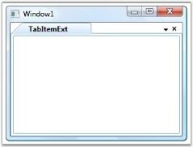

# Adding Tab Item to the TabControlExt

The TabItemExt is added to the TabControlExt by using either XAML or C# coding. Use the following lines of code to add a TabItemExt to the TabControlExt control.


[XAML]

<!-- Adding TabControlExt -->

<syncfusion:TabControlExt Name="tabControlExt">

    <!-- Adding TabItemExt -->

    <syncfusion:TabItemExt Name="tabItemExt1" Header="TabItemExt"/>

</syncfusion:TabControlExt>


[C#]


// Creating instance of the TabControlExt control

TabControlExt tabControlExt = new TabControlExt();

//Creating the instance of StackPanel

StackPanel stackPanel = new StackPanel();

//Creating instance of the TabItemExt 

TabItemExt tabItemExt1 = new TabItemExt();

// Setting header of the TabItemExt

tabItemExt1.Header = "TabItemExt";

//Adding TabItemExt to TabControlExt

tabControlExt.Items.Add(tabItemExt1);

//Adding control to the StackPanel

stackPanel.Children.Add(tabControlExt);



}

### Adding Content to TabItemExt

To add content to the TabItemExt, use the below code snippet.


[XAML]

<!-- Adding TabControlExt with CloseButtonType is Both -->

<syncfusion:TabControlExt Margin="20" Name="tabControlExt" EnableLabelEdit="True">

    <!-- Adding TabItemExt -->

    <syncfusion:TabItemExt Name="tabItemExt1" Header="TabItemExt1">

        <!-- Adding content to TabItemExt -->

        <TextBlock TextWrapping="Wrap">This is TabItemExt2</TextBlock>

    </syncfusion:TabItemExt>

    <!-- Adding TabItemExt -->

    <syncfusion:TabItemExt Name="tabItemExt2" Header="TabItemExt2" IsSelected="False">

        <!-- Adding content to TabItemExt -->

        <TextBlock TextWrapping="Wrap">This is TabItemExt2</TextBlock>

    </syncfusion:TabItemExt>

</syncfusion:TabControlExt>



[C#]

// Creating instance of the TabControlExt control

TabControlExt tabControlExt = new TabControlExt();

//Creating the instance of StackPanel

StackPanel stackPanel = new StackPanel();

//Creating instance of the TabItemExt 

TabItemExt tabItemExt1 = new TabItemExt();

// Setting header of the TabItemExt

tabItemExt1.Header = "TabItemExt1";

// creating instance for text block

TextBlock textblock1 = new TextBlock();

//Adding content to TabItemExt

textblock1.Text = "This is TabItemExt1";

//Adding content to TabItemExt

tabItemExt1.Content = textblock1;

//Adding TabItemExt to TabControlExt

tabControlExt.Items.Add(tabItemExt1);

//Creating instance of the TabItemExt2 

TabItemExt tabItemExt2 = new TabItemExt();

// Setting header of the TabItemExt

tabItemExt2.Header = "TabItemExt2";

// creating instance for text block

TextBlock textblock2 = new TextBlock();

// Setting text for textblock

textblock2.Text = "This is TabItemExt2";

//Adding content to TabItemExt

tabItemExt2.Content = textblock2;

//Adding TabItemExt to TabControlExt

tabControlExt.Items.Add(tabItemExt2);

//Adding control to the Stack Panel

stackPanel.Children.Add(tabControlExt); 


> _Note: To display the TabItemExt, you must already have the TabControlExt in which you are going to add the TabItemExt._

