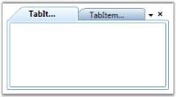

# Resizing the Tab Item

Tab Items are resized by using the TabItemSize property. This property comes with the following resizing modes.

* Normal–the header of the Tab Items are displayed normally
* ShrinkToFit–the header of the Tab Items are shrunk to fit the header area

To set the Tab Item Size mode to "ShrinkToFit", refer the code snippet.


[XAML]

<!-- Adding TabcontrolExt  -->

<syncfusion:TabControlExt Name="tabControlExt" TabItemSize="ShrinkToFit">

    <!-- Adding TabItemExt -->

    <syncfusion:TabItemExt Name="tabItemExt1" Header="TabItemExt1">

    </syncfusion:TabItemExt>

    <!-- Adding TabItemExt -->

    <syncfusion:TabItemExt Name="tabItemExt2" Header="TabItemExt2">

    </syncfusion:TabItemExt>

</syncfusion:TabControlExt>



[C#]

// Creating instance of the TabControlExt control

TabControlExt tabControlExt = new TabControlExt();

//Creating the instance of StackPanel

StackPanel stackPanel = new StackPanel();

//Creating instance of the TabItemExt 

TabItemExt tabItemExt1 = new TabItemExt();

// Setting header of the TabItemExt

tabItemExt1.Header = "TabItemExt1";

//Adding TabItemExt to TabControlExt

tabControlExt.Items.Add(tabItemExt1);

//Creating instance of the TabItemExt2 

TabItemExt tabItemExt2 = new TabItemExt();

// Setting header of the TabItemExt

tabItemExt2.Header = "TabItemExt2";

//Adding TabItemExt to TabControlExt

tabControlExt.Items.Add(tabItemExt2);

// Changing the TabItemSize property

tabControlExt.TabItemSize = TabItemSizeMode.ShrinkToFit;   

//Adding control to the StackPanel

stackPanel.Children.Add(tabControlExt);


See Also

Editing the Tab Item Header at Run Time, Tab Item Header Image, Tab Item Header Image Alignment, Context Menu for the Tab Item

