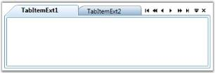

# Setting Scroll Style

TabControlExt control can be implemented with different Tab Scroll styles to give a professional look to your WPF applications. This is achieved by using the TabScrollStyle dependency property, which is used to set the scroll style for navigating the Tab Items. It returns the object of the Tab Item currently in focus. The focus depends upon the click event of the Scroll button.

The following Tab Scroll styles supported by the TabControlExt control.

* Extended Mode-provides the Next, Previous, Last and First navigation options
* Normal Mode–provides the Next and Previous navigation options only

The following code snippet illustrates how to set the Tab Scroll style as "Extended".

[XAML]

&lt;!-- Adding TabControlExt --&gt;

&lt;syncfusion:TabControlExt Margin="20" Name="tabControlExt" TabScrollStyle="Extended"&gt;

    &lt;!-- Adding TabItemExt --&gt;

    &lt;syncfusion:TabItemExt Name="tabItemExt1" Header="TabItemExt1"&gt;

    &lt;/syncfusion:TabItemExt&gt;

    &lt;!-- Adding TabItemExt --&gt;

    &lt;syncfusion:TabItemExt Name="tabItemExt2" Header="TabItemExt2"&gt;

    &lt;/syncfusion:TabItemExt&gt;

    &lt;!-- Adding TabItemExt --&gt;

    &lt;syncfusion:TabItemExt Name="tabItemExt3" Header="TabItemExt3"&gt;

    &lt;/syncfusion:TabItemExt&gt;

&lt;/syncfusion:TabControlExt&gt;

[C#]

// Creating instance of the TabControlExt control

TabControlExt tabControlExt = new TabControlExt();

//Creating the instance of StackPanel

StackPanel stackPanel = new StackPanel();

//Creating instance of the TabItemExt 

TabItemExt tabItemExt1 = new TabItemExt();

// Setting header of the TabItemExt

tabItemExt1.Header = "TabItemExt1";         

//Adding TabItemExt to TabControlExt

tabControlExt.Items.Add(tabItemExt1);

//Setting tab scroll type

tabControlExt.TabScrollStyle = TabScrollStyle.Extended;     

//Adding control to the StackPanel

stackPanel.Children.Add(tabControlExt); 

{  | markdownify }
{:.image }

TabScrollStyleChanged Event

This event is triggered when the TabScrollStyle property is changed.

When the TabControlExt has many Tab Items, it is complicated to scroll the Tab Items in the Normal mode. In such cases, the Tab Scroll style is switched to the Extended mode. The following code illustrates how this is done.

[C#]

/// &lt;summary&gt;

/// Tabs the control ext_ tab scroll style changed.

/// &lt;/summary&gt;

/// <param name="d">The d.&lt;/param&gt;

/// <param name="e">The &lt;see cref="System.Windows.DependencyPropertyChangedEventArgs"/&gt; instance containing the event data.&lt;/param&gt;

private void tabControlExt_TabScrollStyleChanged(DependencyObject d, DependencyPropertyChangedEventArgs e)

{

if (tabControlExt.TabScrollStyle == TabScrollStyle.Extended)

tabControlExt.TabItemSize = TabItemSizeMode.ShrinkToFit;

}

In the above example, the Tab Item Size Mode is set to "ShrinkToFit" when the Tab Scroll style is switched to the Extended mode.

See Also

Tab Scrolling Time, Tab Scroll Button

