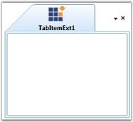

# Tab Item Header

This section illustrates the Tab Item Header of TabControlExt control and contains the following topics:

## Header Image

You can add images to the Tab Item headers by using the Image property of the TabItemExt. This is a dependency property which gets or sets the image for the Tab Item header. 

The following code snippet illustrates how to add images to the tab item header.

[XAML]

<!-- Adding TabcontrolExt  -->

<syncfusion:TabControlExt Name="tabControlExt">

    <!-- Adding TabItemExt with image  -->

    <syncfusion:TabItemExt Name="tabItemExt1" Image="Sync.png" Header="TabItemExt1">

    </syncfusion:TabItemExt>

</syncfusion:TabControlExt>

[C#]

// Creating instance of the TabControlExt control

TabControlExt tabControlExt = new TabControlExt();

//Creating the instance of StackPanel

StackPanel stackPanel = new StackPanel();

//Creating instance of the TabItemExt 

TabItemExt tabItemExt1 = new TabItemExt();

// Setting header of the TabItemExt

tabItemExt1.Header = "TabItemExt1";

// Adding Image to the TabItemExt header

tabItemExt1.Image = new BitmapImage(new Uri("Sync.png", UriKind.RelativeOrAbsolute)); 

//Adding TabItemExt to TabControlExt

tabControlExt.Items.Add(tabItemExt1);    

//Adding control to the stack panel

stackPanel.Children.Add(tabControlExt);

{{ '' | markdownify }}
{:.image }

See Also

Editing the Tab Item Header at Run Time, Tab Item Header Image, Tab Item Header Image Alignment, Context Menu for the Tab Item

## Image Alignment

You can align the Tab Item header image by using the ImageAlignment property of TabItemExt. You can align the image to any one of the following positions.

* AboveText-Images are placed above the tab item header
* BelowText–Images are placed below the tab item header
* LeftOfText–Images are placed to the left of the tab item header
* RightOfText–Images are placed to the right of the tab item header

To set the tab item header image alignment as "AboveText", use the below code.

[XAML]

<!-- Adding TabControlExt  -->

<syncfusion:TabControlExt Name="tabControlExt">

    <!-- Adding TabItemExt -->

    <syncfusion:TabItemExt Name="tabItemExt1" Image="Sync.png" ImageAlignment="AboveText" Header="TabItemExt1">

    </syncfusion:TabItemExt>

</syncfusion:TabControlExt>

[C#]

// Creating instance of the TabControlExt control

TabControlExt tabControlExt = new TabControlExt();

//Creating the instance of StackPanel

StackPanel stackPanel = new StackPanel();

//Creating instance of the TabItemExt 

TabItemExt tabItemExt1 = new TabItemExt();

// Setting header of the TabItemExt

tabItemExt1.Header = "TabItemExt1";

// Adding Image to the TabItemExt header

tabItemExt1.Image = new BitmapImage(new Uri("Sync.png", UriKind.RelativeOrAbsolute)); 

// Aligning the image

tabItemExt1.ImageAlignment = ImageAlignment.AboveText;    

//Adding TabItemExt to TabControlExt

tabControlExt.Items.Add(tabItemExt1);    

//Adding control to the StackPanel

stackPanel.Children.Add(tabControlExt);

{{ '' | markdownify }}
{:.image }

ImageAlignmentChanged Event

This event is triggered when the ImageAlignment property is changed.

The following code snippet illustrates handling the ImageAlignmentChanged event.

[C#]

/// 

/// Tabs the item ext1_ image alignment changed.

/// 

/// <param name="d">The d.</param>

/// <param name="e">The <see cref="System.Windows.DependencyPropertyChangedEventArgs"/> instance containing the event data.</param>

private void tabItemExt1_ImageAlignmentChanged(DependencyObject d, DependencyPropertyChangedEventArgs e)

{

if (tabItemExt1.ImageAlignment == ImageAlignment.LeftOfText)

{

tabControlExt.TabItemSize = TabItemSizeMode.ShrinkToFit;

}

}

In the above example, when the ImageAlignment property is set to LeftOfText, the Tab Item header looks enlarged. To avoid this, the TabItemSize property is set as ShrinkToFit.

See Also

Editing the Tab Item Header at Run Time, Tab Item Header Image, Tab Item Header Image Alignment, Context Menu for the Tab Item

