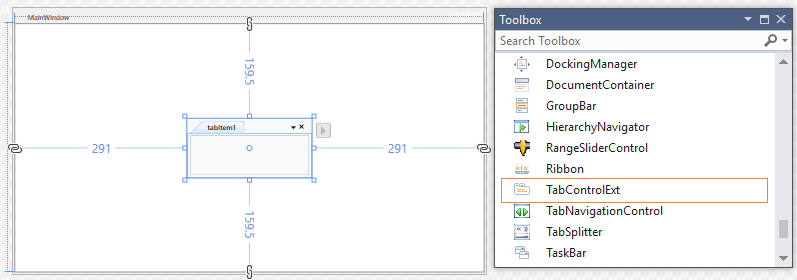
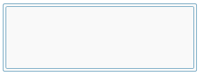
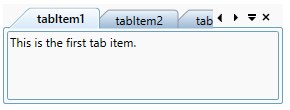
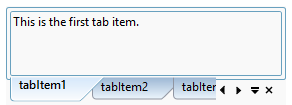
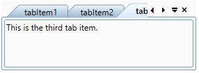

# Getting Started with TabControl

This section explains how to create a WPF TabControl and explains about its structure.

## Structure of TabControl

The various elements of TabControl are illustrated in the following screenshot.

## Assembly deployment

Refer to the [Control Dependencies](https://help.syncfusion.com/wpf/control-dependencies#tabcontrolext) section to get the list of assemblies or NuGet package that needs to be added as a reference to use the control in any application.

Refer to this [documentation](https://help.syncfusion.com/wpf/visual-studio-integration/nuget-packages) to find more details about installing nuget packages in a WPF application.

## Adding WPF TabControl via designer

1) The TabControl can be added to an application by dragging it from the toolbox to a designer view. The following dependent assemblies will be added automatically:

* Syncfusion.Tools.WPF
* Syncfusion.Shared.WPF

2) Set the properties for TabControl in design mode using the SmartTag feature.

## Adding WPF TabControl via XAML

To add the TabControl manually in XAML, follow these steps:

1) Create a new WPF project in Visual Studio.

2) Add the following required assembly references to the project:

* Syncfusion.Tools.WPF
* Syncfusion.Shared.WPF

3) Import Syncfusion WPF schema **http://schemas.syncfusion.com/wpf**, and declare the TabControl in XAML page.





<Window x:Class="TabControlExt_sample.MainWindow"
        xmlns="http://schemas.microsoft.com/winfx/2006/xaml/presentation"
        xmlns:x="http://schemas.microsoft.com/winfx/2006/xaml"
        xmlns:d="http://schemas.microsoft.com/expression/blend/2008"
        xmlns:mc="http://schemas.openxmlformats.org/markup-compatibility/2006"
        xmlns:local="clr-namespace:TabControlExt_sample"
        xmlns:syncfusion="http://schemas.syncfusion.com/wpf"
        mc:Ignorable="d"
        Title="MainWindow" Height="450" Width="800">

<Grid Name="grid">
    <syncfusion:TabControlExt Name="tabControl" Height="100" Width="280" />
</Grid>





## Adding WPF TabControl via C#

To add the TabControl manually in C#, follow these steps:

1) Create a new WPF application via Visual Studio.

2) Add the following required assembly references to the project:

* Syncfusion.Tools.WPF
* Syncfusion.Shared.WPF

3) Include the required namespace.





using Syncfusion.Windows.Tools.Controls;





4) Create an instance of [TabControl](https://help.syncfusion.com/cr/wpf/Syncfusion.Tools.Wpf~Syncfusion.Windows.Tools.Controls.TabControlExt.html), and add it to the window.





// Creating an instance of the TabControl
TabControlExt tabControlExt = new TabControlExt();

// Setting height and width to TabControl
tabControlExt.Height = 100;
tabControlExt.Width = 280;

// Adding control into the main window
grid.Children.Add(tabControlExt); 





## Adding TabItem

You can add the tabitem's using the [TabControlExt.Items](https://docs.microsoft.com/en-us/dotnet/api/system.windows.controls.itemscontrol.items?redirectedfrom=MSDN&view=netframework-4.8#System_Windows_Controls_ItemsControl_Items) property of TabControl. You can set the tabitem name using [TabItemExt.Header](https://docs.microsoft.com/en-us/dotnet/api/system.windows.controls.headeredcontentcontrol.header?redirectedfrom=MSDN&view=netframework-4.8#System_Windows_Controls_HeaderedContentControl_Header) property and add the content to each TabItem by using [TabItemExt.Content](https://docs.microsoft.com/en-us/dotnet/api/system.windows.controls.contentcontrol.content?redirectedfrom=MSDN&view=netframework-4.8#System_Windows_Controls_ContentControl_Content) property.





<syncfusion:TabControlExt Name="tabControl">
    <syncfusion:TabItemExt Header="tabItem1">
        <TextBlock Name="textBlock" Text="This is the first tab item." />
    </syncfusion:TabItemExt>
    <syncfusion:TabItemExt Header="tabItem2">
        <TextBlock Name="textBlock1" Text="This is the second tab item." />
    </syncfusion:TabItemExt>
    <syncfusion:TabItemExt Header="tabItem3">
        <TextBlock Name="textBlock2" Text="This is the third tab item." />
    </syncfusion:TabItemExt>
</syncfusion:TabControlExt>





// Creating an instances of tabitems
TabItemExt tabItemExt1 = new TabItemExt();
TabItemExt tabItemExt2 = new TabItemExt();
TabItemExt tabItemExt3 = new TabItemExt();

// Adding header into tabitems
tabItemExt1.Header = "tabItem1";
tabItemExt2.Header = "tabItem2";
tabItemExt3.Header = "tabItem3";

// Creating an instance of TextBlock
TextBlock textBlock1 = new TextBlock();
TextBlock textBlock2 = new TextBlock();
TextBlock textBlock3 = new TextBlock();

// Adding the text
textBlock1.Text = "This is the first tab item.";
textBlock2.Text = "This is the second tab item.";
textBlock3.Text = "This is the third tab item.";

// Adding the textblock into tabitem
tabItemExt1.Content = textBlock1;
tabItemExt2.Content = textBlock2;
tabItemExt3.Content = textBlock3;

// Adding the tabitems into the tabcontrol
tabControlExt.Items.Add(tabItemExt1);
tabControlExt.Items.Add(tabItemExt2);
tabControlExt.Items.Add(tabItemExt3);





## Placement of TabItem

You can place the tabitem header at any of the four sides of TabControl using the [TabStripPlacement](https://help.syncfusion.com/cr/wpf/Syncfusion.Tools.Wpf~Syncfusion.Windows.Tools.Controls.TabControlSettings~TabStripPlacement.html) property.





<syncfusion:TabControlExt TabStripPlacement="Bottom">
    <syncfusion:TabItemExt Header="tabItem1">
        <TextBlock Name="textBlock" Text="This is the first tab item." />
    </syncfusion:TabItemExt>
    <syncfusion:TabItemExt Header="tabItem2">
        <TextBlock Name="textBlock1" Text="This is the second tab item." />
    </syncfusion:TabItemExt>
    <syncfusion:TabItemExt Header="tabItem3">
        <TextBlock Name="textBlock" Text="This is the third tab item." />
    </syncfusion:TabItemExt>
</syncfusion:TabControlExt>





tabControlExt.TabStripPlacement = Dock.Bottom;





## Selecting TabItem

You can select a particular tabitem in TabControl by setting the [IsSelected](https://docs.microsoft.com/en-us/dotnet/api/system.windows.controls.tabitem.isselected?redirectedfrom=MSDN&view=netframework-4.8#System_Windows_Controls_TabItem_IsSelected) property to `true`.





<syncfusion:TabControlExt Name="tabControl">
    <syncfusion:TabItemExt Header="tabItem1" />
    <syncfusion:TabItemExt Header="tabItem2" />
    <syncfusion:TabItemExt Header="tabItem3" IsSelected="True"/>
</syncfusion:TabControlExt>





tabItemExt3.IsSelected = true;





### Tab Selection event

The TabControl notifies that the selected tabitem is changed by user through the [SelectedChangedEvent](https://help.syncfusion.com/cr/wpf/Syncfusion.Tools.Wpf~Syncfusion.Windows.Tools.Controls.TabControlExt~SelectedItemChangedEvent_EV.html) event. You can use the `OldSelectedItem` and `NewSelectedItem` properties to get the old and new selected tabitem in the `SelectedItemChangedEvent` event.





tabControlExt.SelectedItemChangedEvent += TabControlExt_SelectedItemChangedEvent;

private void TabControlExt_SelectedItemChangedEvent(object sender, SelectedItemChangedEventArgs e)
{
    var newTabItem = e.NewSelectedItem.Header;
    if (e.OldSelectedItem != null)
    {
        var oldTabItem = e.OldSelectedItem.Header;
    }
    else
    {
        var oldTabItem = string.Empty;
    }
}





## Working with tab close button

TabControl allows end-users to close the tabs where close button can be displayed in tab control using [TabControlExt.CloseButtonType](https://help.syncfusion.com/cr/wpf/Syncfusion.Tools.Wpf~Syncfusion.Windows.Tools.Controls.TabControlExt~CloseButtonType.html) property. 
The following modes are supported to close the button in TabControl.

* **Common** - The close button shows only in TabPanel.

* **Individual** - The close button shows only for the individual tabitem.

* **Both** - The close button shows both the TabPanel and individual tabitem.

* **Hide** - The close button is not visible.

* **IndividualOnMouseOver** - The close button shows only when the mouse is over the tabitem.

* **Extended** - The close button shows only the selected tabitem and displays the remaining tabitem's while the mouse is hovering.

For example, When you set the `TabControlExt.CloseButtonType` to `Both` mode, the close button is visible in both TabItem and TapPanel. To first tabitem, if you set `CanClose` property to `false`, both close button of TabItem and TabPanel are disabled and if you set `CloseButtonState` property to `Collapsed`, only the tabitem close button is not visible.





<syncfusion:TabControlExt Name="tabControl" CloseButtonType="Both">
    <syncfusion:TabItemExt Header="tabItem1" CanClose="False" CloseButtonState="Collapsed" />
    <syncfusion:TabItemExt Header="tabItem2" />
</syncfusion:TabControlExt>





//set `Both` mode to `CloseButtonType` property.
tabControlExt.CloseButtonType = CloseButtonType.Both;

//Collapse the close button.
tabItemExt1.CloseButtonState = Collapsed;

//Disable the close button.
tabItemExt1.CanClose = false;





## Show or hide new tab button

The [TabControlExt.IsNewButtonEnabled](https://help.syncfusion.com/cr/wpf/Syncfusion.Tools.Wpf~Syncfusion.Windows.Tools.Controls.TabControlExt~IsNewButtonEnabled.html) property is used to decide whether to enable or disable the new button in TabControl.





<syncfusion:TabControlExt Name="tabControl" IsNewButtonEnabled="True">
            <syncfusion:TabItemExt Header="tabItem1" />
            <syncfusion:TabItemExt Header="tabItem2" />
    </syncfusion:TabItemExt>
</syncfusion:TabControlExt>





tabControlExt.IsNewButtonEnabled = true;





## Show or hide TabList context menu

You can show the tab list context menu by setting the [TabControlExt.ShowTabListContextMenu](https://help.syncfusion.com/cr/wpf/Syncfusion.Tools.Wpf~Syncfusion.Windows.Tools.Controls.TabControlExt~ShowTabListContextMenu.html) property to `true` in TabControl.





<syncfusion:TabControlExt Name="tabControl" ShowTabListContextMenu="True">
            <syncfusion:TabItemExt Header="tabItem1" />
            <syncfusion:TabItemExt Header="tabItem2" />
    </syncfusion:TabItemExt>
</syncfusion:TabControlExt>





tabControlExt.ShowTabListContextMenu = true;





## Enable or disable tab navigation bar

The [TabControlExt.TabScrollButtonVisibility](https://help.syncfusion.com/cr/wpf/Syncfusion.Tools.Wpf~Syncfusion.Windows.Tools.Controls.TabControlExt~TabScrollButtonVisibility.html) property is used to decide whether to enable or disable the tab navigation bar in TabControl. You can show the different tab navigation style in TabControl using the [TabScrollStyle](https://help.syncfusion.com/cr/wpf/Syncfusion.Tools.Wpf~Syncfusion.Windows.Tools.Controls.TabControlExt~TabScrollStyle.html) property.





<syncfusion:TabControlExt Name="tabControl" TabScrollStyle="Extended" TabScrollButtonVisibility="Visible">
    <syncfusion:TabItemExt Name="tabItemExt1" Header="tabItem1" />
    <syncfusion:TabItemExt Name="tabItemExt2" Header="tabItem2" />
</syncfusion:TabControlExt>





tabControlExt.TabScrollStyle = TabScrollStyle.Extended;
tabControlExt.TabScrollButtonVisibility = TabScrollButtonVisibility.Visible;





## Show or hide built-in context menu

You can show the built-in context menu of the tabitem by setting the [TabControlExt.ShowTabItemContextMenu](https://help.syncfusion.com/cr/wpf/Syncfusion.Tools.Wpf~Syncfusion.Windows.Tools.Controls.TabControlExt~ShowTabItemContextMenu.html) property to `true` in TabControl.

The built-in context menu of the tab item has following menu items:

* **Close** - Closes the current or selected tab item.
* **Close All But This** - Closes all the tab items, except the current or selected tab item.
* **Close All** - Closes all the tab items.





<syncfusion:TabControlExt Name="tabControl" ShowTabItemContextMenu="True">
    <syncfusion:TabItemExt Header="tabItem1" />
    <syncfusion:TabItemExt Header="tabItem2" />        
</syncfusion:TabControlExt>





//Changing the visibility of context menu
tabControlExt.ShowTabItemContextMenu = true;





You can add custom context menu item using the [TabItemExt.ContextMenuItems](https://help.syncfusion.com/cr/wpf/Syncfusion.Tools.Wpf~Syncfusion.Windows.Tools.Controls.TabItemExt~ContextMenuItems.html) property in TabControl. This property is enabled by setting the [TabControlExt.IsCustomTabItemContextMenuEnabled](https://help.syncfusion.com/cr/wpf/Syncfusion.Tools.Wpf~Syncfusion.Windows.Tools.Controls.TabControlExt~IsCustomTabItemContextMenuEnabled.html) property to `true`.





<syncfusion:TabControlExt IsCustomTabItemContextMenuEnabled="True">
    <syncfusion:TabItemExt Header="tabItem1">
        <syncfusion:TabItemExt.ContextMenuItems>
            <syncfusion:CustomMenuItem Header="Menu1" />
        </syncfusion:TabItemExt.ContextMenuItems>
    </syncfusion:TabItemExt>
    <syncfusion:TabItemExt Header="tabItem2" IsSelected="True">
        <syncfusion:TabItemExt.ContextMenuItems>
            <syncfusion:CustomMenuItem Header="Menu2" />
        </syncfusion:TabItemExt.ContextMenuItems>
    </syncfusion:TabItemExt>
</syncfusion:TabControlExt>





// Enabling custom tabitem context menu
tabControlExt.IsCustomTabItemContextMenuEnabled = true;

// Adding custom context menu for the first tabitem
CustomMenuItem customMenuItem = new CustomMenuItem();
customMenuItem.Header = "New1";
tabItemExt.ContextMenuItems.Add(customMenuItem);

// Adding custom context menu for the second tabitem
CustomMenuItem customMenuItem1 = new CustomMenuItem();
customMenuItem1.Header = "Menu2";
tabItemExt1.ContextMenuItems.Add(customMenuItem1);





