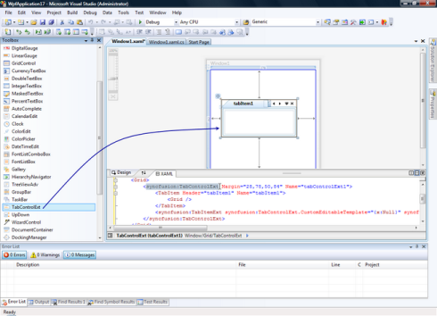
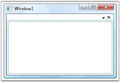

# Getting Started

This section guides you on getting started with TabControlExt control. It covers the following topics:

## Elaborate Structure of the Control

The various elements of a TabControlExt control is illustrated in the below image.

## Creating TabControlExt control

There are two possible ways to create a simple TabControlExt control.

### Adding control via designer

To create the TabControlExt control through designer, follow the below steps.

1. Drag the TabControlExt control from the toolbox onto your WPF application.

2. Set the properties for the TabControlExt in design mode by using the SmartTag feature.

   

### Adding control manually in code

To add control manually in C#, follow the given steps:

1. Add the following required assembly references to the project:

   * Syncfusion.Tools.WPF.dll
   * Syncfusion.Shared.WPF.dll

2. Include the namespaces `Syncfusion.Windows.Tools.Controls`

   

   

   using Syncfusion.Windows.Tools.Controls;

   

   

3. Create `TabControlExt` control instance and add it to the Panel.

   

   

   // Creating instance of the TabControlExt control

   TabControlExt tabControlExt = new TabControlExt();

   //Creating the instance of StackPanel

   StackPanel stackPanel = new StackPanel();          

   //Adding control to the stack panel

   stackPanel.Children.Add(tabControlExt); 

   

   

   

N> To display the TabControlExt using C# code, you must already have a panel in which you are going to add the control. Otherwise, the control cannot be displayed.

