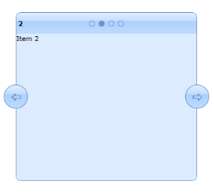

# Adding items through Items Source

Business object collections can be easily bound to the Tab Navigation control using Items Source property. The following types of collections can be bound:

* Observable Collection 
* ILIST binding 
* XML binding 

## Observable Collection 



<syncfusion:TabNavigationControl TransitionEffect="Slide" ItemsSource="{Binding MyCollection}">

</syncfusion:TabNavigationControl>




public partial class MainPage : UserControl

{

public MainPage()

{

InitializeComponent();

MyCollection = new ObservableCollection<TabNavigationItem>();

TabNavigationItem temp;

TextBlock block;

for (int i = 0; i < 10; i++)

{

Temp = new TabNavigationItem();

Block = new TextBlock();

temp.Header = "Item " +i.ToString();

block.Text = "Item " +i.ToString();

temp.Content = block;

MyCollection.Add(temp);

}

this.DataContext = this;

}

public ObservableCollection<TabNavigationItem> MyCollection

{

get { return (ObservableCollection<TabNavigationItem>)GetValue(MyCollectionProperty); }

set { SetValue(MyCollectionProperty, value); 

            }

}

// Using a DependencyProperty as the backing store for MyCollection.  This enables animation, styling, binding and so on

public static readonly DependencyProperty MyCollectionProperty =

DependencyProperty.Register("MyCollection", typeof(ObservableCollection<TabNavigationItem>), typeof(MainPage), new PropertyMetadata(null));

}




Partial Public Class MainPage

        Inherits UserControl

        Public Sub New()

            InitializeComponent()

            MyCollection = New ObservableCollection(Of String)()

            For i As Integer = 0 To 9

                MyCollection.Add("Item " & i.ToString())

            Next

            LayoutRoot.DataContext = Me

        End Sub

        Public Property MyCollection() As ObservableCollection(Of String)

            Get

                Return DirectCast(GetValue(MyCollectionProperty), ObservableCollection(Of String))

            End Get

            Set(ByVal value As ObservableCollection(Of String))

                SetValue(MyCollectionProperty, value)

            End Set

        End Property

        ' Using a DependencyProperty as the backing store for MyCollection.  This enables animation, styling, binding and so on

        Public Shared ReadOnly MyCollectionProperty As DependencyProperty = DependencyProperty.Register("MyCollection", GetType(ObservableCollection(Of String)), GetType(MainPage), New PropertyMetadata(Nothing))

    End Class


## ILIST Binding



<syncfusion:TabNavigationControl TransitionEffect="Slide" 

ItemsSource="{Binding MyCollection}">

</syncfusion:TabNavigationControl>




public partial class MainPage : UserControl

    {

        public MainPage()

        {

            InitializeComponent();

            MyCollection = new IList<string>();

            for (int i = 0; i < 10; i++)

            {

                MyCollection.Add("Item "+i.ToString());

            }

            LayoutRoot.DataContext = this;

        }

        public IList<string> MyCollection

        {

            get { return (IList<string>)GetValue(MyCollectionProperty); }

            set { SetValue(MyCollectionProperty, value); }

        }

        // Using a DependencyProperty as the backing store for MyCollection.  This enables animation, styling, binding and so on

        public static readonly DependencyProperty MyCollectionProperty =

            DependencyProperty.Register("MyCollection", typeof(IList<string>), typeof(MainPage), new PropertyMetadata(null));

    }




Partial Public Class MainPage

        Inherits UserControl

        Public Sub New()

            InitializeComponent()

            MyCollection = New IList(Of String)()

            For i As Integer = 0 To 9

                MyCollection.Add("Item " & i.ToString())

            Next

            LayoutRoot.DataContext = Me

        End Sub

        Public Property MyCollection() As IList(Of String)

            Get

                Return DirectCast(GetValue(MyCollectionProperty), IList(Of String))

            End Get

            Set(ByVal value As IList(Of String))

                SetValue(MyCollectionProperty, value)

            End Set

        End Property

        ' Using a DependencyProperty as the backing store for MyCollection.  This enables animation, styling, binding and so on

        Public Shared ReadOnly MyCollectionProperty As DependencyProperty = DependencyProperty.Register("MyCollection", GetType(IList(Of String)), GetType(MainPage), New PropertyMetadata(Nothing))

    End Class


## XML binding 

To bind XML data to a TabNavigation control, convert the XML data to a collection like Observable collection or ILIST collection, and then bind the collection by using the ItemsSource property of the TabNavigation control.

