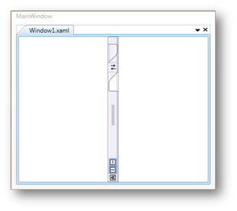

# Orientation

TabSplitter Items are placed horizontally or vertically by using the Orientation property. This is a dependency property which sets the orientation of the TabSplitter Item. It supports the following types of orientation.

* Horizontal: TabSplitter Item in the TabSplitter is placed horizontally
* Vertical: TabSplitter Item in the TabSplitter is placed vertically

Set the orientation using the code given below:



<!-- Adding TabSplitter -->

<syncfusion:TabSplitter Name="tabsplitter">

    <!-- Adding TabSplitterItem -->

    <syncfusion:TabSplitterItem Header="Window1.xml" Orientation="Vertical" Name="tabSplitterItem1">

        <!-- Adding TopPanelItems -->

        <syncfusion:TabSplitterItem.TopPanelItems> 

            <!-- Adding SplitterPage -->

            <syncfusion:SplitterPage Name="splitterPage1" Header="XAML">

            </syncfusion:SplitterPage>

        </syncfusion:TabSplitterItem.TopPanelItems>

        <!-- Adding BottomPanelItems -->

        <syncfusion:TabSplitterItem.BottomPanelItems> 

            <!-- Adding SplitterPage -->

            <syncfusion:SplitterPage Name="splitterPage2" Header="Design">

            </syncfusion:SplitterPage>

        </syncfusion:TabSplitterItem.BottomPanelItems>

    </syncfusion:TabSplitterItem>

</syncfusion:TabSplitter>





// Set the Orientation

tabSplitterItem1.Orientation = Orientation.Vertical;


