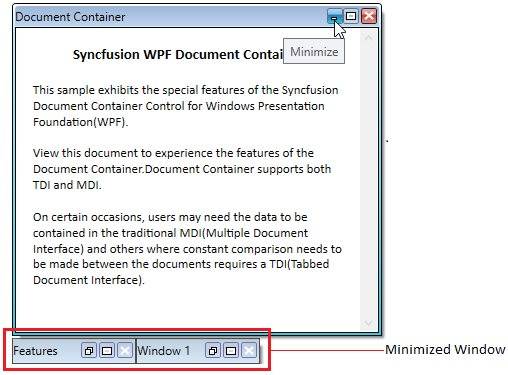
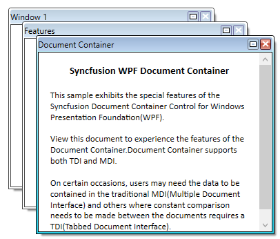

# Minimizing MDI window

You can minimize the `MDI` window by setting the [CanMDIMinimize](https://help.syncfusion.com/cr/wpf/Syncfusion.Tools.Wpf~Syncfusion.Windows.Tools.Controls.DocumentContainer~CanMDIMinimize.html) property as `true`. The default value of `CanMDIMinimize` property is `false`. The minimized  MDI windows are arranged one by one in the bottom-left corner of the window.




<syncfusion:DocumentContainer Name="DocContainer"
                              CanMDIMinimize="True" 
                              Mode="MDI">
    <FlowDocumentScrollViewer syncfusion:DocumentContainer.Header="Features"/>
    <FlowDocumentScrollViewer syncfusion:DocumentContainer.Header="Window1"/>
    <FlowDocumentScrollViewer syncfusion:DocumentContainer.Header="Document Container"/>
</syncfusion:DocumentContainer>




## Restrict Minimizing the MDI window

You can restrict minimizing the `MDI` window by setting the `CanMDIMinimize` property as `false`.




<syncfusion:DocumentContainer Name="DocContainer"
                              CanMDIMinimize="False" 
                              Mode="MDI">
    <FlowDocumentScrollViewer syncfusion:DocumentContainer.Header="Features"/>
    <FlowDocumentScrollViewer syncfusion:DocumentContainer.Header="Window1"/>
    <FlowDocumentScrollViewer syncfusion:DocumentContainer.Header="Document Container"/>
</syncfusion:DocumentContainer>




