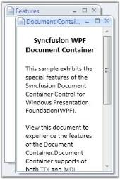

# Setting MDIBounds in WPF Tabbed MDI Form (DocumentContainer)

This property helps the Document Container control in properly placing its elements within the container.

The general syntax of the MDI bound property is given below.

Syncfusion:DocumentContainer.MDIBounds="a,b,c,d"

where, 

* The first two values (a and b) stands for X and Y co-ordinates for the MDI bounds. 
* The second two values(c and d) stands for width and height of the element in a Document Container.

To set the MDI Bounds, use the following code snippet.



<!-- Adding Document Container -->

<syncfusion:DocumentContainer Name="DocContainer"  Mode="MDI">

<FlowDocumentScrollViewer Syncfusion:DocumentContainer.MDIBounds="0,0,200,300">

</FlowDocumentScrollViewer>

…....

…....

</syncfusion:DocumentContainer>



