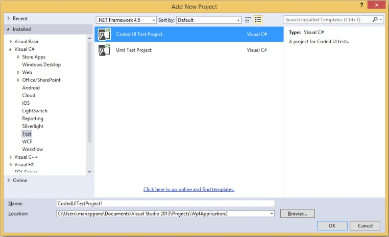
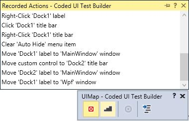

# Getting Started with Coded UI Testing

CUIT contains the Coded UI test project. When application does not contain the CUIT project, create a new project. In the Solutions Explorer, on the shortcut menu of the solution, choose Add, New Project, and then select either Visual Basic or Visual C#. Next, choose Test, Coded UI Test.

Coded UI test project does not appear on Visual Studio, if Visual Studio Enterprise edition not installed in the system. To create CUIT, install Visual Studio Enterprise edition in system.

## Adding Coded UI Test file

The CUIT file is automatically generated, when create the Coded UI test project. To add another test file, right-click to the test project choose Add, and then select Coded UI Test.

1.Generate Code for Coded UI Test dialog box is shown after select the Coded UI test file. Choose the Record option shown in the following image, to record the test actions.

2.After choose the Record Actions, right-click the body of the Coded UI Test file. 

Then choose the Coded UI Test Builder (UI Map), shown at the bottom right side of the window.

3.Start the recording option from UI Map to record the test actions. 

### Click to Start the Recording.

Recording option can be paused while testing the project.

### Click to Stop the Recording.

4.The Recorded steps are shown by UI Map or by pressing Alt+ S key.

5.To delete actions that recorded by mistake, choose Edit Actions.

6.To generate code that replicates the action, choose the Generate Code icon and type a name and description for CUIT method.

7.After the completion of test process, click the Generate Code option from UI Map to generate the test code for project, as it replicates test actions.

### Generate Test Code 

8.Choose the required Method of Description for code generation then click to Add and Generate.

## Testing application with the Generated Coded UI Tests.

Application can be tested with the generated CUIT method.

1.Add a test method called CodedUITestProject1.





public void CodedUITestMethod1()

{
// Generates code for this test. Select "Generate Code for Coded UI Test" from the shortcut menu and select one of the menu items.
    this.UIMap.RecordedMethod2();
}





Public Sub CodedUITestMethod1()

' Generates code for this test. Select "Generate Code for Coded UI Test" from the shortcut menu and select one of the menu items.
	Me.UIMap.RecordedMethod2()
End Sub 





2.Build and run the application that has already been configured. CUIT builder can be opened with the following steps.

3.Right-click the body of the `CodedUITestMethod` and then select `Generate Code for Coded UI Test` -> Use CUIT builder as shown in the following screenshot:

## Supported controls

The following controls are featured in Coded UI Testing Support:

<table>
<tr>
<th>
Supported Controls  </th>
<th>
Level  </th></tr>
<tr>
<td>
AutoComplete  </td><td>
3 Level  </td></tr>
<tr>
<td>
CellGrid  </td><td>
3 Level  </td></tr>
<tr>
<td>
DataGrid  </td><td>
3 Level  </td></tr>
<tr>
<td>
DockingManager  </td><td>
2 Level  </td></tr>
<tr>
<td>
DocumentContainer  </td><td>
2 Level  </td></tr>
<tr>
<td>
GridData  </td><td>
2 Level  </td></tr>
<tr>
<td>
GridControl  </td><td>
3 Level  </td></tr>
<tr>
<td>
GridTree  </td><td>
2 Level  </td></tr>
<tr>
<td>
PivotGrid  </td><td>
2 Level  </td></tr>
<tr>
<td>
PropertyGrid  </td><td>
2 Level  </td></tr>
<tr>
<td>
Ribbon  </td><td>
2 Level  </td></tr>
<tr>
<td>
SfCalculator  </td><td>
2 Level  </td></tr>
<tr>
<td>
SfChart  </td><td>
2 Level  </td></tr>
<tr>
<td>
SfDataGrid  </td><td>
3 Level  </td></tr>
<tr>
<td>
SfDataPager  </td><td>
3 Level  </td></tr>
<tr>
<td>
SfMultiColumnDropDown  </td><td>
2 Level  </td></tr>
<tr>
<td>
TabControlExt  </td><td>
2 Level  </td></tr>
<tr>
<td>
TileView  </td><td>
2 Level  </td></tr>
</table>

