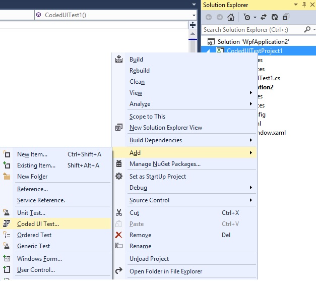
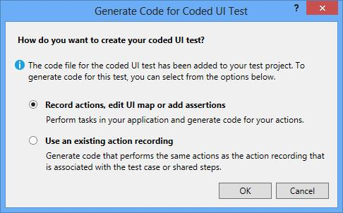
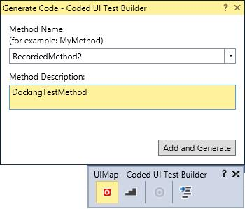
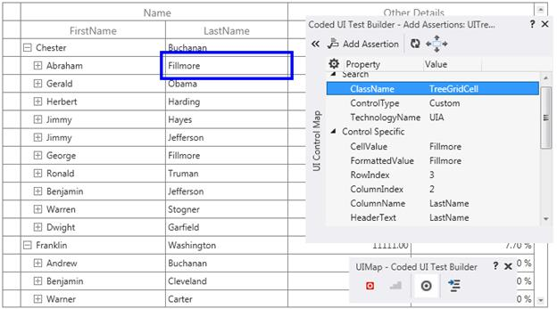
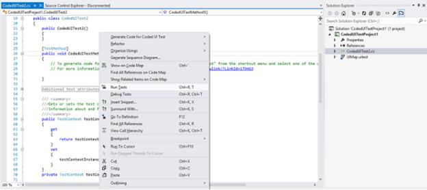

# Getting Started with Coded UI Testing

CUIT contains the Coded UI test project. When application does not contain the CUIT project, create a new project. In the Solutions Explorer, on the shortcut menu of the solution, choose Add, New Project, and then select either Visual Basic or Visual C#. Next, choose Test, Coded UI Test.

Coded UI test project does not appear on Visual Studio, if Visual Studio Enterprise edition not installed in the system. To create CUIT, install Visual Studio Enterprise edition in system.

## Adding Coded UI Test file

The CUIT file is automatically generated, when create the Coded UI test project. To add another test file, right-click to the test project choose Add, and then select Coded UI Test.

1.Generate Code for Coded UI Test dialog box is shown after select the Coded UI test file. Choose the Record option shown in the following image, to record the test actions.

2.After choose the Record Actions, right-click the body of the Coded UI Test file. 

Then choose the Coded UI Test Builder (UI Map), shown at the bottom right side of the window.

3.Start the recording option from UI Map to record the test actions. 

### Click to Start the Recording.

Recording option can be paused while testing the project.

### Click to Stop the Recording.

4.The Recorded steps are shown by UI Map or by pressing Alt+ S key.

5.To delete actions that recorded by mistake, choose Edit Actions.

6.To generate code that replicates the action, choose the Generate Code icon and type a name and description for CUIT method.

7.After the completion of test process, click the Generate Code option from UI Map to generate the test code for project, as it replicates test actions.

### Generate Test Code 

8.Choose the required Method of Description for code generation then click to Add and Generate.

## Testing application with the Generated Coded UI Tests.

Application can be tested with the generated CUIT method.

1.Add a test method called CodedUITestProject1.





public void CodedUITestMethod1()

{
// Generates code for this test. Select "Generate Code for Coded UI Test" from the shortcut menu and select one of the menu items.
    this.UIMap.RecordedMethod2();
}





Public Sub CodedUITestMethod1()

' Generates code for this test. Select "Generate Code for Coded UI Test" from the shortcut menu and select one of the menu items.
	Me.UIMap.RecordedMethod2()
End Sub 





2.Build and run the application that has already been configured. CUIT builder can be opened with the following steps.

3.Right-click the body of the `CodedUITestMethod` and then select `Generate Code for Coded UI Test` -> Use CUIT builder as shown in the following screenshot:

## Supported controls

The following controls are featured in Coded UI Testing Support:

<table>
<tr>
<th>
Supported Controls  </th>
<th>
Level  </th></tr>
<tr>
<td>
AutoComplete  </td><td>
3 Level  </td></tr>
<tr>
<td>
CellGrid  </td><td>
3 Level  </td></tr>
<tr>
<td>
ComboBoxAdv  </td><td>
2 Level  </td></tr>
<tr>
<td>
DataGrid  </td><td>
3 Level  </td></tr>
<tr>
<td>
DockingManager  </td><td>
2 Level  </td></tr>
<tr>
<td>
DocumentContainer  </td><td>
2 Level  </td></tr>
<tr>
<td>
GridData  </td><td>
2 Level  </td></tr>
<tr>
<td>
GridControl  </td><td>
3 Level  </td></tr>
<tr>
<td>
GridTree  </td><td>
2 Level  </td></tr>
<tr>
<td>
PivotGrid  </td><td>
2 Level  </td></tr>
<tr>
<td>
PropertyGrid  </td><td>
2 Level  </td></tr>
<tr>
<td>
Ribbon  </td><td>
2 Level  </td></tr>
<tr>
<td>
SfCalculator  </td><td>
2 Level  </td></tr>
<tr>
<td>
SfChart  </td><td>
2 Level  </td></tr>
<tr>
<td>
SfDataGrid  </td><td>
3 Level  </td></tr>
<tr>
<td>
SfDataPager  </td><td>
3 Level  </td></tr>
<tr>
<td>
SfMultiColumnDropDown  </td><td>
2 Level  </td></tr>
<tr>
<td>
TabControlExt  </td><td>
2 Level  </td></tr>
<tr>
<td>
TileView  </td><td>
2 Level  </td></tr>
<tr>
<td>
TreeGrid  </td><td>
3 Level  </td></tr>
<tr>
<td>
TreeView  </td><td>
2 Level  </td></tr>
</table>

## SfDataGrid

### Requirement and Configuration

To test SfDataGrid control with CUITs, build the Extension Project and place it in the mentioned location. You can get the Extension Project from the below locations.

<table>
<tr>
<td>
SfDataGrid
</td>
<td>
{{'[http://www.syncfusion.com/downloads/support/directtrac/general/ze/Src-229533545.zip](http://www.syncfusion.com/downloads/support/directtrac/general/ze/Src-229533545.zip)'| markdownify }}
</td>
</tr>
</table>
1. Open the Extension Project and build it.
2. You can get the below tabulated assembly from bin folder.
<table>
<tr>
<td>
SfGrid.WPF 
</td>
<td>
Syncfusion.VisualStudio.TestTools.UITest.SfGridExtension.dll
</td>
</tr>
</table>
**SfGridExtension** assembly must be placed into the following directory based on your Visual Studio version.
<table>
<tr>
<td>
{{'**Visual Studio Version**'| markdownify }}
</td>
<td>
{{'**Relative Path**'| markdownify }}
</td>
</tr>
<tr>
<td>
2010
</td>
<td>
C:\Program Files (x86)\Common Files\Microsoft Shared\VSTT\10.0\UITestExtensionPackages
</td>
</tr>
<tr>
<td>
2012
</td>
<td>
C:\Program Files (x86)\Common Files\Microsoft Shared\VSTT\11.0\UITestExtensionPackages
</td>
</tr>
<tr>
<td>
2013
</td>
<td>
C:\Program Files (x86)\Common Files\Microsoft Shared\VSTT\13.0\UITestExtensionPackages
</td>
</tr>
<tr>
<td>
2015
</td>
<td>
C:\Program Files (x86)\Common Files\Microsoft Shared\VSTT\14.0\UITestExtensionPackages
</td>
</tr>
<tr>
<td>
2017
</td>
<td>
C:\Program Files (x86)\Common Files\Microsoft Shared\VSTT\15.0\UITestExtensionPackages
</td>
</tr>
</table>

**NOTE**: **Syncfusion.VisualStudio.TestTools.UITest.SfGridExtension.dll**need to be installed in GAC location. Please refer the MSDN link for [GAC](https://msdn.microsoft.com/en-us/library/ex0ss12c(v=vs.80).aspx) installation.

### Steps to working with Coded UI

This topic shows you how to create a **CodedUITest** project and test the SfDataGrid application.

1. Create a new WPF application or open an existing WPF application with SfDataGrid and enable Coded UI Test in SfDataGrid. To enable CUITs, you need to set **AutomationPeerHelper.EnableCodedUI** as **True and access the AutomationPeerHelper class from Syncfusion.UI.Xaml.Grid** namespace as shown in the following code example,



using Syncfusion.UI.Xaml.Grid;
public MainWindow()
{
 InitializeComponent();
 AutomationPeerHelper.EnableCodedUI = true;
}



2. Build the application and launch the .exe file from the bin folder.

3. Create a CodedUITest project, refer [here](https://help.syncfusion.com/wpf/testing/coded-ui).

4. Now you can drag the Crosshairs on to the UI elements of your WPF SfDataGrid application and it shows the available properties of the inner UI elements in SfDataGrid.

5. You can record the actions made on UI elements by clicking Record button on the CodedUITest builder. For example, you can record the action of changing the cell value in SfDataGrid. Click the Pause button to finish the record.

6. Once the record is completed, click the GenerateCode icon in CodedUITestBuilder for generate a test method. Then close the CodedUITestBuilder and you can see the generated code for cell value changed action as follows.



public void RecordedMethod1()
{
   #region Variable Declarations
   WpfText uIMEREPText = this.UIWpfWindow.UISfDataGridCustom.UIGridCellCustom4.UIMEREPText;
   WpfEdit uIGridCellEdit = this.UIWpfWindow.UISfDataGridCustom.UIGridCellEdit;
   WpfSfGridCell uIGridCellCustom11 = this.UIWpfWindow.UISfDataGridCustom.UIGridCellCustom11;
   WpfSfGridCell uIGridCellCustom12 = this.UIWpfWindow.UISfDataGridCustom.UIGridCellCustom12;
   #endregion
}



7. You can also create an assertion to check the modified cell value. Drag the crosshair to the modified cell, and the Assertion window appears. The properties for control (Cell) is now listed in the Assertion dialog box. You can add assertion by clicking the Generate Code button in CodedUITestBuilder.

8. After all tests and assertion are created, right-click on the Test method and click Run Tests to run the test as follows.

### Properties

The following properties are for each of the UI elements in SfDataGrid.

<table>
<tr>
<td>
{{'**UI Elements**'| markdownify }}
</td>
<td>
{{'**Properties**'| markdownify }}
</td>
</tr>
<tr>
<td>
DataGrid
</td>
<td>
RowCount,
ColumnCount,
SelectionMode,
SelectionUnit,
SelectedIndex,
SelectedItemCount,
</td>
</tr>
<tr>
<td>
GridCell
</td>
<td>
CellValue,
FormattedValue,
RowIndex,
ColumnIndex,
ColumnName
</td>
</tr>
<tr>
<td>
GridHeaderCellControl
</td>
<td>
MappingName,
IsFilterApplied,
FilterIconVisibility,
SortDirection,
SortNumberVisibility
</td>
</tr>
<tr>
<td>
GridRowHeaderCell
</td>
<td>
RowErrorMessage,
RowIndexState
</td>
</tr>
<tr>
<td>
GroupDropArea
</td>
<td>
IsExpanded,
GroupDropAreaText
</td>
</tr>
<tr>
<td>
DetailsViewDataGrid
</td>
<td>
RowCount,
ColumnCount,
SelectionMode,
SelectionUnit,
SelectedIndex,
SelectedItemCount
</td>
</tr>
<tr>
<td>
GroupDropAreaItem
</td>
<td>
GroupNameSortDirection
</td>
</tr>
<tr>
<td>
GridStackedHeaderCellControl
</td>
<td>
Default Properties
</td>
</tr>
<tr>
<td>
GridTableSummaryCell
</td>
<td>
Default Properties
</td>
</tr>
<tr>
<td>
GridGroupSummaryCell
</td>
<td>
Default Properties
</td>
</tr>
<tr>
<td>
GridCaptionSummaryCell
</td>
<td>
Default Properties
</td>
</tr>
<tr>
<td>
GridDetailsViewExpanderCellControl
</td>
<td>
Default Properties
</td>
</tr>
<tr>
<td>
GridIndentCell
</td>
<td>
Default Properties
</td>
</tr>
</table>

### How to Enable Coded UI Test in SfDataGrid

To enable CUITs, you need to set **AutomationPeerHelper.EnableCodedUI**as **True** and access the **AutomationPeerHelper** class from **Syncfusion.UI.Xaml.Grid**namespace as shown in the following code example,



using Syncfusion.UI.Xaml.Grid;
public MainWindow()
{
  InitializeComponent();
  AutomationPeerHelper.EnableCodedUI = true;
}



### Hand Code for CUIT operation

#### HandCode for changing the cell Value 



//Change Cell Value
[TestMethod]
public void CodedUITestMethod1()
{
    //this.UIMap.AssertMethod1();
    var cell = this.UIMap.UIMainWindowWindow.UISfDataGridCustom.UIVirtualizingCellsConCustom.UIGridCellCustom;
    cell.DrawHighlight();
    Mouse.DoubleClick(cell);
    Keyboard.SendKeys("Raj");
    Keyboard.SendKeys("{Enter}");
    Task.Delay(10);
    cell.DrawHighlight();
}



#### HandCode for find GridCell 



[TestMethod]
public void FindGridCell()
{
    WpfSfDataGrid dataGrid = this.UIMap.UIMainWindowWindow.UISfDataGridCustom;
    WpfSfGridCell cell = new WpfSfGridCell(dataGrid);
    cell.SearchProperties[WpfSfGridCell.PropertyNames.RowIndex] = "1";
    cell.SearchProperties[WpfSfGridCell.PropertyNames.ColumnIndex] = "1";
    Assert.IsTrue(cell.TryFind());
} 



**Note:** In above code snippet we must provide at least two unique properties of GridCell (Row index and Column index / Row index and Cell value / Column index and cell value) to search in SfDataGrid.

#### HandCode for Sort click operation



[TestMethod]
public void Mouse_Click_on_GridHeaderCell()
{
    WpfSfDataGrid dataGrid = this.UIMap.UIMainWindowWindow.UISfDataGridCustom;
    WpfSfHeaderCellControl cell = new WpfSfHeaderCellControl(dataGrid);
    cell.SearchProperties[WpfSfHeaderCellControl.PropertyNames.ColumnName] = "OrderID";
    if (cell.TryFind())
    {
        cell.DrawHighlight();
        Mouse.DoubleClick(cell);
    }
}




## SfTreeGrid

### Requirements and Configuration

To test SfTreeGrid control with CUITs, build the Extension Project and place it in the mentioned location. You can get the extension project from the below location.

<table>
<tr>
<td>
SfTreeGrid
</td>
<td>
{{'[http://www.syncfusion.com/downloads/support/directtrac/general/ze/CodedUI-1271691562.zip](http://www.syncfusion.com/downloads/support/directtrac/general/ze/CodedUI-1271691562.zip)'| markdownify }}
</td>
</tr>
</table>

1. Open the extension project and build it.
2. You can get the below tabulated assembly from bin folder.
<table>
<tr>
<td>
SfGrid.WPF 
</td>
<td>
Syncfusion.VisualStudio.TestTools.UITest.SfGridExtension.dll
</td>
</tr>
</table>
**SfGridExtension** assembly must be placed into the following directory based on your visual studio version.
<table>
<tr>
<td>
{{'**Visual Studio Version**'| markdownify }}
</td>
<td>
{{'**Relative Path**'| markdownify }}
</td>
</tr>
<tr>
<td>
2010
</td>
<td>
C:\Program Files (x86)\Common Files\Microsoft Shared\VSTT\10.0\UITestExtensionPackages
</td>
</tr>
<tr>
<td>
2012
</td>
<td>
C:\Program Files (x86)\Common Files\Microsoft Shared\VSTT\11.0\UITestExtensionPackages
</td>
</tr>
<tr>
<td>
2013
</td>
<td>
C:\Program Files (x86)\Common Files\Microsoft Shared\VSTT\13.0\UITestExtensionPackages
</td>
</tr>
<tr>
<td>
2015
</td>
<td>
C:\Program Files (x86)\Common Files\Microsoft Shared\VSTT\14.0\UITestExtensionPackages
</td>
</tr>
<tr>
<td>
2017
</td>
<td>
C:\Program Files (x86)\Common Files\Microsoft Shared\VSTT\15.0\UITestExtensionPackages
</td>
</tr>
</table>

**NOTE**: **Syncfusion.VisualStudio.TestTools.UITest.SfGridExtension.dll**need to be installed in GAC location. Please refer the MSDN link for [GAC](https://msdn.microsoft.com/en-us/library/ex0ss12c(v=vs.80).aspx) installation.

### Steps to working with Coded UI

This topic shows you how to create a **CodedUITest** project and test the tree grid application.

1. Create a new WPF application or open an existing WPF application with tree grid and enable Coded UI Test in tree grid. To enable CUITs, you need to set **AutomationPeerHelper.EnableCodedUI**as **True and access the AutomationPeerHelper class from Syncfusion.UI.Xaml.Grid** namespace as shown in the following code example,



using Syncfusion.UI.Xaml.Grid;
public MainWindow()
{
 InitializeComponent();
 AutomationPeerHelper.EnableCodedUI = true;
}



2. Build the application and launch the .exe file from the bin folder.
3. Create a CodedUITest Project, refer [here](https://help.syncfusion.com/wpf/testing/coded-ui).
4. Now you can drag the Crosshairs on to the UI elements of your WPF SfTreeGrid application and it shows the available properties of the inner UI elements in SfTreeGrid.
5. You can record the actions made on UI elements by clicking Record button on the CodedUITest builder. For example, you can record the action of changing the cell value in tree grid. Click the Pause button to finish the record.

6. Once the record is completed, click the GenerateCode icon in CodedUITestBuilder for generate a test method. Then close the CodedUITestBuilder and you can see the generated code for cell value changed action as follows.


  public void RecordedMethod2()
   {
    #region Variable Declarations
    WpfText uIHardingText = this.UIWpfWindow.UITreeGridRowControlCustom.UITreeGridCellCustom.UIHardingText;
    WpfEdit uIItemEdit = this.UIWpfWindow.UITreeGridRowControlCustom.UITreeGridCellCustom.UIItemEdit;
    WpfText uIJeffedarsonText = this.UIWpfWindow.UITreeGridRowControlCustom1.UITreeGridCellCustom.UIJeffersonText;
   #endregion
    // Double-Click 'Harding' label
    Mouse.DoubleClick(uIHardingText, new Point(75, 5));
    // Type 'sync' in text box
    uIItemEdit.Text = this.RecordedMethod2Params.UIItemEditText;
    // Click 'Jefferson' label
    Mouse.Click(uIJeffersonText, new Point(140, 6));
}




7. You can also create an assertion to check the modified cell value. Drag the crosshair to the modified cell, and the Assertion window appears. The properties for control (cell) is now listed in the Assertion dialog box. You can add assertion by clicking the Generate Code button in CodedUITestBuilder.

8. After all tests and assertion are created, right-click on the Test method and click Run Tests to run the test as follows.

Properties

The following properties are for each of the UI elements in SfTreeGrid.

<table>
<tr>
<td>
{{'**UI Elements**'| markdownify }}
</td>
<td>
{{'**Properties**'| markdownify }}
</td>
</tr>
<tr>
<td>
TreeGrid
</td>
<td>
RowCount,
ColumnCount,
SelectionMode,
SelectionUnit,
SelectionIndex,
SelectedItemCount
</td>
</tr>
<tr>
<td>
TreeGridCell
</td>
<td>
CellValue,
FormattedValue,
RowIndex,
ColumnIndex,
ColumnName

</td>
</tr>
<tr>
<td>
TreeGridHeaderCell
</td>
<td>
MappingName,
SortDirection,
SortNumberVisibility

</td>
</tr>
<tr>
<td>
TreeGridRowHeaderCell
</td>
<td>
RowErrorMessage,
RowIndex,
State

</td>
</tr>
<tr>
<td>
TreeGridStackedHeaderCell
</td>
<td>
Default Properties  
</td>
</tr>
<tr>
<td>
TreeGridExpanderCell
</td>
<td>
Default Properties  
</td>
</tr>
</table>

Code generation of control list is given below,

<table>
<tr>
<td>
{{'**Automation peer class name**'| markdownify }}
</td>
<td>
{{'**Control name in code generation**'| markdownify }}
</td>
<td>
{{'**Property provider class name**'| markdownify }}
</td>
</tr>
<tr>
<td>
SfTreeGridAutomationPeer
</td>
<td>
WpfSfTreeGrid
</td>
<td>
SfTreeGridPropertyProvider
</td>
</tr>
<tr>
<td>
TreeGridCellAutomationPeer
</td>
<td>
WpfSfTreeGridCell
</td>
<td>
SfTreeGridCellPropertyProvider
</td>
</tr>
<tr>
<td>
TreeGridHeaderCellAutomationPeer
</td>
<td>
WpfSfTreeGridHeaderCell
</td>
<td>
SfTreeGridHeaderCellPropertyProvider
</td>
</tr>
<tr>
<td>
TreeGridRowHeaderCellAutomationPeer
</td>
<td>
WpfSfTreeGridRowHeaderCell
</td>
<td>
SfTreeGridRowHeaderCellPropertyProvider
</td>
</tr>
<tr>
<td>
TreeGridStackedHeaderCellAutomationPeer
</td>
<td>
WpfSfTreeGridStackedHeaderCell
</td>
<td>
SfTreeGridStackedHeaderCellPropertyProvider
</td>
</tr>
<tr>
<td>
TreeGridExpanderCellAutomationPeer
</td>
<td>
WpfTreeGridExpanderCell
</td>
<td>
SfTreeGridExpanderCellPropertyProvider
</td>
</tr>
</table>

## ComboBoxAdv

You can refer and proceed the steps to create the CodedUiTest project was mentioned in below link.

[https://help.syncfusion.com/wpf/testing/coded-ui](https://help.syncfusion.com/wpf/testing/coded-ui)

Following are the properties for ComboBoxAdv control,

<table>
<tr>
<td>
{{'**UI Elements**'| markdownify }}
</td>
<td>
{{'**Properties**'| markdownify }}
</td>
</tr>
<tr>
<td>
ComboBoxAdv
</td>
<td>
Default Properties
</td>
</tr>
<tr>
<td>
ComboBoxItemAdv
</td>
<td>
Default Properties
</td>
</tr>
</table>

## TreeViewAdv

You can refer and proceed the steps to create the CodedUITest project was mentioned in below link.

[https://help.syncfusion.com/wpf/testing/coded-ui](https://help.syncfusion.com/wpf/testing/coded-ui)

Following are the properties for TreeViewAdv control,

<table>
<tr>
<td>
{{'**UI Elements**'| markdownify }}
</td>
<td>
{{'**Properties**'| markdownify }}
</td>
</tr>
<tr>
<td>
TreeViewAdv
</td>
<td>
Default Properties
</td>
</tr>
<tr>
<td>
TreeViewItemAdv
</td>
<td>
Default Properties
</td>
</tr>
</table>

## PropertyGrid

You can refer and proceed the steps to create the CodedUITest project was mentioned in below link.

[https://help.syncfusion.com/wpf/testing/coded-ui](https://help.syncfusion.com/wpf/testing/coded-ui)

Following are the properties for PropertyGrid control,

<table>
<tr>
<td>
{{'**UI Element**'| markdownify }}
</td>
<td>
{{'**Properties**'| markdownify }}
</td>
</tr>
<tr>
<td>
PropertyGrid
</td>
<td>
Default Properties
</td>
</tr>
<tr>
<td>
ClearButton
</td>
<td>
Default Properties
</td>
</tr>
<tr>
<td>
DescriptionBorder
</td>
<td>
Default Properties
</td>
</tr>
<tr>
<td>
DescriptionDetailsTextBlock
</td>
<td>
Default Properties
</td>
</tr>
<tr>
<td>
DescriptionNameTextBlock
</td>
<td>
Default Properties
</td>
</tr>
<tr>
<td>
PropertyCategoryViewItem
</td>
<td>
Default Properties
</td>
</tr>
<tr>
<td>
PropertyGridScrollViewer
</td>
<td>
Default Properties
</td>
</tr>
<tr>
<td>
PropertyGridSplitter
</td>
<td>
Default Properties
</td>
</tr>
<tr>
<td>
PropertyItemTextBlock
</td>
<td>
Default Properties
</td>
</tr>
<tr>
<td>
PropertyView
</td>
<td>
Default Properties
</td>
</tr>
<tr>
<td>
PropertyViewItem
</td>
<td>
Default Properties
</td>
</tr>
<tr>
<td>
SearchTextBox
</td>
<td>
Default Properties
</td>
</tr>
<tr>
<td>
ToggleSortButton
</td>
<td>
Default Properties
</td>
</tr>
<tr>
<td>
ToggleGroupButton
</td>
<td>
Default Properties
</td>
</tr>
</table>

## Ribbon

You can refer and proceed the steps to create the CodedUITest project was mentioned below link,

[https://help.syncfusion.com/wpf/testing/coded-ui](https://help.syncfusion.com/wpf/testing/coded-ui)

Following are the properties for Ribbon control.

<table>
<tr>
<td>
{{'**UI Element**'| markdownify }}
</td>
<td>
{{'**Properties**'| markdownify }}
</td>
</tr>
<tr>
<td>
Ribbon
</td>
<td>
Default Properties
</td>
</tr>
<tr>
<td>
RibbonTab
</td>
<td>
Default Properties 
</td>
</tr>
<tr>
<td>
RibbonBar
</td>
<td>
Default Properties
</td>
</tr>
<tr>
<td>
RibbonButton
</td>
<td>
Default Properties
</td>
</tr>
<tr>
<td>
RibbonCheckBox
</td>
<td>
Default Properties
</td>
</tr>
<tr>
<td>
RibbonComboBox
</td>
<td>
Default Properties
</td>
</tr>
<tr>
<td>
RibbonComboBoxItem
</td>
<td>
Default Properties
</td>
</tr>
<tr>
<td>
RibbonGallery
</td>
<td>
Default Properties
</td>
</tr>
<tr>
<td>
RibbonGalleryPopup
</td>
<td>
Default Properties
</td>
</tr>
<tr>
<td>
RibbonGalleryItem
</td>
<td>
Default Properties
</td>
</tr>
<tr>
<td>
RibbonMenuGroup
</td>
<td>
Default Properties
</td>
</tr>
<tr>
<td>
RibbonMenuGroupItem
</td>
<td>
Default Properties
</td>
</tr>
<tr>
<td>
RibbonMenuItem
</td>
<td>
Default Properties
</td>
</tr>
<tr>
<td>
DropDownButton
</td>
<td>
Default Properties
</td>
</tr>
<tr>
<td>
SplitButton
</td>
<td>
Default Properties
</td>
</tr>
<tr>
<td>
ApplicationMenu
</td>
<td>
Default Properties
</td>
</tr>
<tr>
<td>
MenuButton
</td>
<td>
Default Properties
</td>
</tr>
<tr>
<td>
SimpleMenuButton
</td>
<td>
Default Properties
</td>
</tr>
<tr>
<td>
SplitMenuButton
</td>
<td>
Default Properties
</td>
</tr>
<tr>
<td>
BackStage
</td>
<td>
Default Properties
</td>
</tr>
<tr>
<td>
BackStageCommandButton
</td>
<td>
Default Properties
</td>
</tr>
<tr>
<td>
BackStageTabItem
</td>
<td>
Default Properties
</td>
</tr>
<tr>
<td>
RibbonToggleButton
</td>
<td>
Default Properties
</td>
</tr>
<tr>
<td>
QATListBox
</td>
<td>
Default Properties
</td>
</tr>
<tr>
<td>
QuickAccessToolBar
</td>
<td>
Default Properties
</td>
</tr>
<tr>
<td>
QuickAccessToolBarDropDown
</td>
<td>
Default Properties
</td>
</tr>
</table>

## SfMultiColumnDropDown

You can refer and proceed the steps to create the CodedUITest project was mentioned below link,

[https://help.syncfusion.com/wpf/testing/coded-ui](https://help.syncfusion.com/wpf/testing/coded-ui)

Following are the properties for SfMultiColumnDropDown control,

<table>
<tr>
<td>
{{'**UI Elements**'| markdownify }}
</td>
<td>
{{'**Properties**'| markdownify }}
</td>
</tr>
<tr>
<td colspan="1" rowspan="9">
SfMultiColumnDropDownControl
</td>
<td>
AllowAutoComplete
</td>
</tr>
<tr>
<td>
AllowNullInput
</td>
</tr>
<tr>
<td>
AllowImmediatePopup
</td>
</tr>
<tr>
<td>
AllowIncrementalFiltering
</td>
</tr>
<tr>
<td>
AllowCaseSensitiveFiltering
</td>
</tr>
<tr>
<td>
AllowSpinOnMouseWheel
</td>
</tr>
<tr>
<td>
DisplayMember
</td>
</tr>
<tr>
<td>
IsDropDownOpenSelectedIndex
</td>
</tr>
<tr>
<td>
ValueMember
</td>
</tr>
</table>

## SfDataPager

You can refer and proceed the steps to create the CodedUITest project was mentioned below link,

[https://help.syncfusion.com/wpf/testing/coded-ui](https://help.syncfusion.com/wpf/testing/coded-ui)

Following are the properties for SfDataPager control,

<table>
<tr>
<td>
{{'**UI Elements**'| markdownify }}
</td>
<td>
{{'**Properties**'| markdownify }}
</td>
</tr>
<tr>
<td colspan="1" rowspan="11">
SfDataPager
</td>
<td>
AccentBackground
</td>
</tr>
<tr>
<td>
AccentForeground
</td>
</tr>
<tr>
<td>
AutoEllipsisMode
</td>
</tr>
<tr>
<td>
AutoEllipsisText
</td>
</tr>
<tr>
<td>
DisplayMode
</td>
</tr>
<tr>
<td>
EnableGridPaging
</td>
</tr>
<tr>
<td>
NumericButtonCount
</td>
</tr>
<tr>
<td>
Orientation
</td>
</tr>
<tr>
<td>
PageCount
</td>
</tr>
<tr>
<td>
PageSize
</td>
</tr>
<tr>
<td>
UseOnDemandPaging
</td>
</tr>
</table>

## GridControl

To test Gridcontrol with CUITs, build the Extension Project and place it in the mentioned location. You can get the Extension Project from the below locations.

<table>
<tr>
<td>
{{'**GridControl**'| markdownify }}
</td>
<td>
{{'[http://www.syncfusion.com/downloads/support/directtrac/186216/ze/GridExtension837392922](http://www.syncfusion.com/downloads/support/directtrac/186216/ze/GridExtension837392922)'| markdownify }}
</td>
</tr>
</table>

1. Open the Extension Project and build it.
2. You can get the below tabulated assemblies from bin folder.

<table>
<tr>
<td>
Grid.WPF
</td>
<td>
Syncfusion.VisualStudio.TestTools.UITest.GridExtension.dll
</td>
</tr>
</table>
**SfGridExtension** assembly must be placed into the following directory based on your Visual Studio version.
<table>
<tr>
<td>
{{'**Visual Studio Version**'| markdownify }}
</td>
<td>
{{'**Relative Path**'| markdownify }}
</td>
</tr>
<tr>
<td>
2010
</td>
<td>
C:\Program Files (x86)\Common Files\Microsoft Shared\VSTT\10.0\UITestExtensionPackages
</td>
</tr>
<tr>
<td>
2012
</td>
<td>
C:\Program Files (x86)\Common Files\Microsoft Shared\VSTT\11.0\UITestExtensionPackages
</td>
</tr>
<tr>
<td>
2013
</td>
<td>
C:\Program Files (x86)\Common Files\Microsoft Shared\VSTT\12.0\UITestExtensionPackages
</td>
</tr>
<tr>
<td>
2015
</td>
<td>
C:\Program Files (x86)\Common Files\Microsoft Shared\VSTT\14.0\UITestExtensionPackages
</td>
</tr>
<tr>
<td>
2017
</td>
<td>
C:\Program Files (x86)\Common Files\Microsoft Shared\VSTT\15.0\UITestExtensionPackages
</td>
</tr>
</table>

### Preparing the Grid Application

1. **Syncfusion.VisualStudio.TestTools.UITest.GridExtensions.dll**contains implementation to easily change an existing application to the test application that the plugin would require. Add a reference to this assembly. 
2. Open **App.xaml**file. 



<Application x:Class="WpfApplication3.App"
              xmlns="http://schemas.microsoft.com/winfx/2006/xaml/presentation"
              xmlns:x="http://schemas.microsoft.com/winfx/2006/xaml"
              StartupUri="Window1.xaml">
     <Application.Resources>
	 
     </Application.Resources>
</Application>



3. Change Application to **Syncfusion:GridControlTestApplication** as follows.



<syncfusion:GridControlTestApplication x:Class="WpfApplication3.App"
	xmlns="http://schemas.microsoft.com/winfx/2006/xaml/presentation" 
	xmlns:syncfusion="http://schemas.syncfusion.com/wpf" 
	xmlns:x="http://schemas.microsoft.com/winfx/2006/xaml" 
	StartupUri="Window1.xaml"> 
	<syncfusion:GridControlTestApplication.Resources> 
	
	</syncfusion:GridControlTestApplication.Resources> 
</syncfusion:GridControlTestApplication>



4. For the code behind file (**App.xaml.cs**), make sure to inherit from 
**GridControlTestApplication**.



namespace WpfApplication3 
{ 
	/// 

	/// Interaction logic for App.xaml 
	/// 

	public partial class App : GridControlTestApplication 
	{
	 
	} 
} 



5. Build the application to make it ready for testing.  
  * Add the **Syncfusion.VisualStudio.TestTools.UITest.GridCommunication.dll**and  **Syncfusion.VisualStudio.TestTools.UITest.GridExtension.dll**in your sample. 
  * Run the sample with CodedUITestBuilder. 
  * To create a CodedUITest Project, refer [here](https://help.syncfusion.com/wpf/testing/coded-ui).

Following are the properties for Gridcontrol,

<table>
<tr>
<td>
{{'**UI Element**'| markdownify }}
</td>
<td>
{{'**Properties**'| markdownify }}
</td>
</tr>
<tr>
<td colspan="1" rowspan="9">
GridCell
</td>
<td>
Text
</td>
</tr>
<tr>
<td>
CellValue
</td>
</tr>
<tr>
<td>
ColumnHeader
</td>
</tr>
<tr>
<td>
Format
</td>
</tr>
<tr>
<td>
Description
</td>
</tr>
<tr>
<td>
FormulaTag
</td>
</tr>
<tr>
<td>
CellWidth
</td>
</tr>
<tr>
<td>
CellHeight
</td>
</tr>
<tr>
<td>
FormattedText
</td>
</tr>
<tr>
<td colspan="1" rowspan="4">
Grid
</td>
<td>
SelectedRanges
</td>
</tr>
<tr>
<td>
GridName
</td>
</tr>
<tr>
<td>
RowCount
</td>
</tr>
<tr>
<td>
ColumnCount
</td>
</tr>
</table>

### Hand Code for CUIT operation

This session demonstrates the example codes for how to perform the operation with the HandCode.

#### Handcode for Find GridCell



[TestMethod]
public void FindGridCell()
{
    var datagrid = this.UIMap.UISyncfusionGridDataCoWindow.UISyncfusionGridDataCoWindow1;
    UITestControl cell = new UITestControl(datagrid);
    cell.SearchProperties["ControlType"] = "Cell";
    cell.SearchProperties["RowIndex"] = "16";
    cell.SearchProperties["ColumnIndex"] = "3";
    Assert.IsTrue(cell.TryFind());
}




#### HandCode for changing the cell value



[TestMethod]
public void CodedUITestMethod1()
{
    var datagrid = this.UIMap.UISyncfusionGridDataCoWindow.UISyncfusionGridDataCoWindow1;
    var cell = this.UIMap.UISyncfusionGridDataCoWindow.UISyncfusionGridDataCoWindow1.UIItem24Grid1Cell;
    cell.DrawHighlight();
    var rowindex = Convert.ToInt16(cell.GetProperty("RowIndex").ToString());
    var columnIndex = Convert.ToInt32(cell.GetProperty("ColumnIndex").ToString());
    Playback.Wait(100);
    GridCellInfo cellinfo = new GridCellInfo(rowindex, columnIndex, "Grid1");
    Point point = GetCellPoint(cellinfo, datagrid.WindowHandle);
    Playback.Wait(50);
    //click the cell for enter into edit mode.
    Mouse.DoubleClick(point);
    Playback.Wait(50);
    Keyboard.SendKeys("^(A)"); //select all the text
    Playback.Wait(150);
    Keyboard.SendKeys("{DELETE}"); //Delete the previous value
    Playback.Wait(150);
    Keyboard.SendKeys("23"); //insert new value
    Playback.Wait(50);
    Keyboard.SendKeys("{TAB}"); //Commit value using tab key navigation
    Playback.Wait(50);
    var value = cell.GetProperty("CellValue");
    Playback.Wait(200);
    if (value.ToString() == "23")
    {
        Assert.IsTrue(true);
    }
    else
        Assert.IsFalse(true);
 
}
 
 
//this is the helper method to get the mid point of the givin GridCell
public Point GetCellPoint(GridCellInfo CellInfo, IntPtr WindowHandle)
{
    int left, top, width, height;
    left = top = width = height = -1;
 
    Utilities.RECT windowRect;
    if (Utilities.GetWindowRect(WindowHandle, out windowRect))
    {
        var cellRect = GridCommunicator.Instance.GetCellBoundingRect(CellInfo);
        left = (int)cellRect.Left;
        top = (int)cellRect.Top;
        width = (int)cellRect.Width;
        height = (int)cellRect.Height;
    }
    return new Point((left + (int)(0.5 * width)), (top + (int)(0.5 * height)));
}


