# Overview
UFT (formerly known as HP Quick Test Professional - QTP) is an automated testing software designed for testing various software applications and environments. Syncfusion provides QTP add-in that contains custom libraries, that help UFT or QTP to recognize Syncfusion controls. These custom libraries are built with the help of .NET add-in extensibility.

## Prerequisites and Compatibility

### Prerequisites
The prerequisites are tabulated in the following table.
<table>
<tr>
<td>
Testing Environments
</td>
<td>
QuickTest Professional of version 9.5 and above or UFT
QuickTest Professional .NET add-in or UFT
</td>
</tr>
<tr>
<td>
.NET Framework
</td>
<td>
.NET Framework of version 3.5 , 4.0,  4.5 , 4.5.1 or 4.6
</td>
</tr>
<tr>
<td>
Other Requirement
</td>
<td>
Essential Studio (User Interface edition – WPF) of the same version as the Essential QTP Add-on.
</td>
</tr>
</table>

### Compatibility
<table>
<tr>
<td>
Operating Systems
</td>
<td>
Microsoft Windows XP
Microsoft Windows Vista
Microsoft Windows 7
Microsoft Windows 8.1
Microsoft Windows 10
</td>
</tr>
</table>

## Installation
You can download the QTP Essential Test Studio and install using the below steps,

1.Double-click the Syncfusion Essential Test Studio Setup file.

N>
Setup - Syncfusion Essential QuickTest Professional dialog box opens.

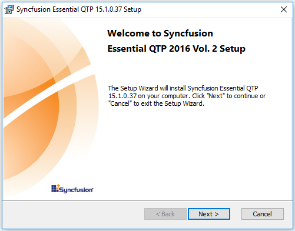

2.Click Next. The User Information dialog box opens.

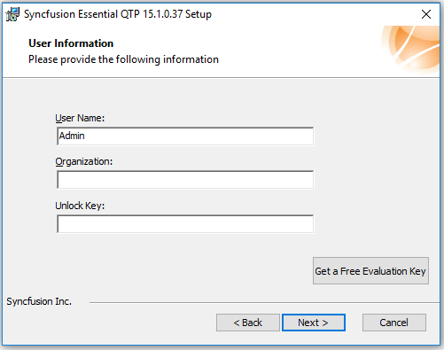

3.Enter the User Name, Organization and Unlock Key in the corresponding text boxes provided.
4.Click Next.

N>
The unlock key is validated.

5.Select the installation folder dialog box opens.

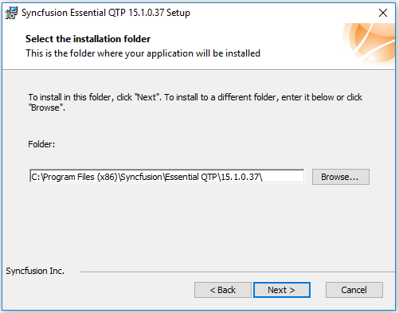

6.To install in the default location, click Next.

N>
You can also browse to choose a location by clicking Browse.

7.Installation type dialog box opens.

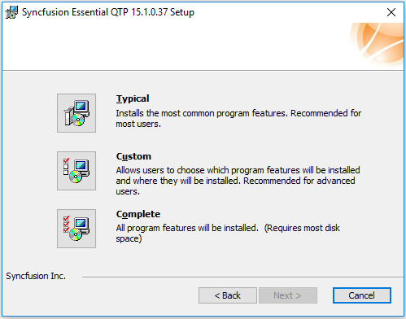

8.Choose from the options listed. For example, to install the complete setup, click Complete.
9.Click Next. The Ready to Install dialog box opens.

10.Click Install to continue with the installation.

## Enabling add-on support in UFT
You have to installed WPF Add-in while installing UFT by choosing below option.

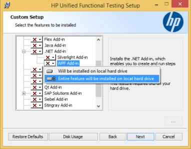

UFT - WPF Add-in installation

## Configuring add-in assemblies for different .Net framework version

You need to configure Syncfusion add-in assemblies based on the framework version of the application that you are trying to automate. 
For example, below are the steps to configure the custom add-in assemblies of syncfusion for SfDataGrid.

1. You need to ensure that **Syncfusion.CNG**and **SyncfusionTestObjects.XML**files are in the following location,
C:\Program Files\HP\QuickTestProfessional\dat\Extensibility\WPF\Syncfusion
C:\Program Files\HP\QuickTestProfessional\dat\Extensibility\WPF\

2. Also, ensure that**Syncfusion.SfGridQTP.WPF.dll and Syncfusion.GridExt.WPF.dll**are in the following location,
C:\Program Files\HP\QuickTest Professional\dat\Extensibility\WPF\Syncfusion

3. When your system does not contain **Syncfusion.CNG , SyncfusionTestObjects.XML and**
**Syncfusion.SfGridQTP.WPF.dll**files in the above mentioned location, you have to copy the files from the below location based on the framework version of the application you are trying to automate,
C:\Program Files\Syncfusion\Essential QTP\{{ site.releaseversion }}\WPF\bin\

### Configuring add-in based on your application framework version

By Default, Syncfusion QTP or UFT add-in configured based on the higher Framework version installed in your machine. if you have developed your application is lower framework version, you to configure the right version assemblies as below,

1. Copy the custom add-in assemblies of Syncfusion from the below installed location based on the framework version of application you are trying to automate,
C:\Program Files\Syncfusion\Essential QTP\{{ site.releaseversion }}\WPF\bin\ &lt;Version&gt;

2. Paste the copied assemblies to below location, 
C:\ProgramFiles\HP\QuickTestProfessional\data\Extensibility\WPF\Syncfusion\

## Create, Record and Run the tests

### Creating a new Test
1.Open QTP by double-clicking the QuickTest Professional icon.

N>
The QuickTest Professional – Add-in Manager window is displayed.

2.Select the WPF check box under the Add-in header. This ensures that WPF add-in is installed. Also, you need to check the Syncfusion add-in to detect the Syncfusion Controls. When it is not selected, you cannot access the Syncfusion controls.

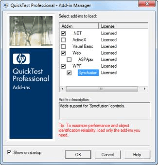

3.Click OK.

N>
The QuickTest Professional – [Start Page] window opens. There are two tabs namely Start Page and Test in the main pane of the window. The content under the Start Page tab is displayed by default.

4.Click the New Test icon in the Start Page.

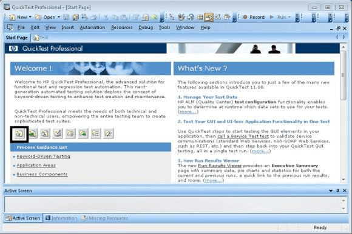

5.A new test is created. You can also create a new test by selecting the Test tab in the main pane of the window or Test sub-menu under the New menu in the menu bar.
6.Click Record in the toolbar to start the recording.

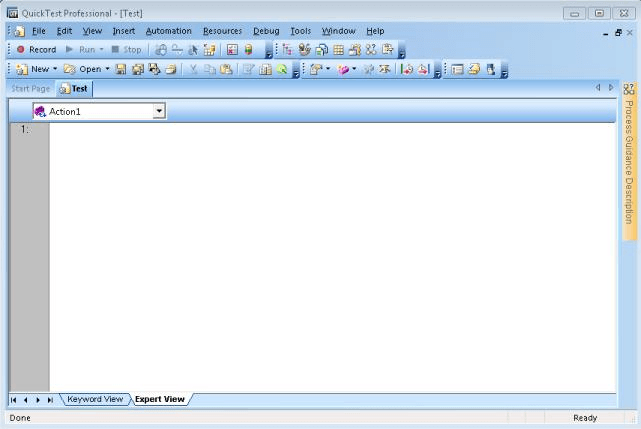

N>
Record and Run Settings dialog box opens.

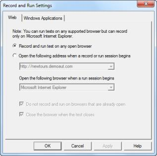

7.Select the Windows Application tab.

N>
The content under the tab is displayed.

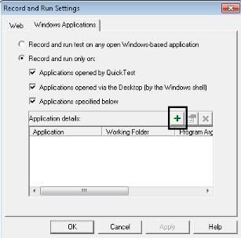

N>
The Record and run only option is selected by default.

8.Select the following checkbox to ensure that only the applications opened by QuickTest and added applications are tested.

      1. Applications opened by Quick Test
      2. Applications opened via the Desktop (by the Window shell)
      3. Applications specified below
      
9.To add an application for testing, click the + button in the Application details.

N>
The Application Details dialog box opens.

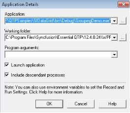

10.For Application field, browse and select the path of the application that has to be tested by clicking 
button.
11.For working folder field, browse and select the path of the working folder by clicking 
button.
12.Select the Launch application check box, to launch the application immediately after clicking OK.
13.Select Include descendant processes check box, to include all the processes that are descendant to the current process.

N>
Both Launch application and Include descendant processes check boxes are selected by default

14.Click OK.

N>
The path of the application and working folder are displayed in the Application details frame as     shown in the following screenshot.

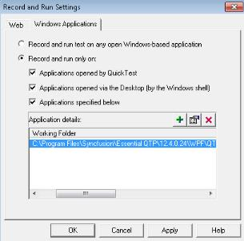

15.Click OK.

N>
The recording starts. The application in the given path is opened as shown in the following screenshot.

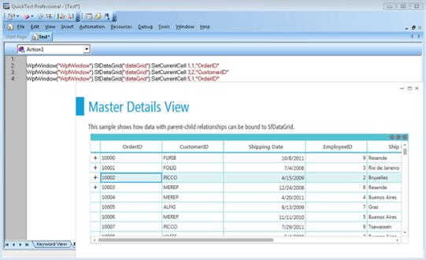

### Running a Test
On recording, all the user actions performed in the control are just noted with the corresponding method names of the Syncfusion namespace. The errors can be checked while running a test. To run a test:

1.Click Run in the toolbar. The Run dialog box opens. The Results Location tab is selected by default.

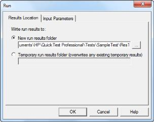

### Editing a Test
The editing of a test can be done either in the Keyword view or in the Expert view. You can switch between these views by selecting the required tab at the bottom left of the QTP screen.

### Editing in Expert View
This view is especially provided for the experts in VB Script. In the Expert view, the VB scripts are generated while recording. You can also manually write scripts to the existing scripts in this view. So, this view can be used as a tool for managing the testing process in a more controlled manner. You can add scripts to trigger events manually.

The following image shows adding a script line to the Expert View pane.

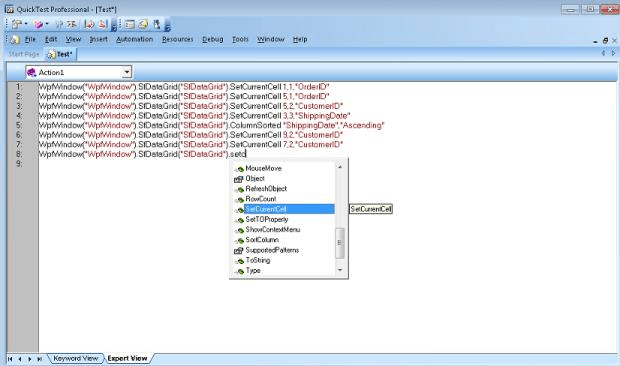

### Editing in Keyboard View
The keyword view is meant for people with no expertise in VB scripts. Keyword view contains the controls used, the user-actions or operations performed, values involved in the operation and the documentation summary in a table format. The controls used are listed under the Item header in a tree-view format as shown in the following screenshot:

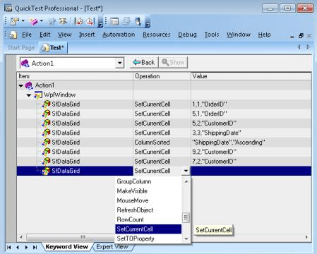

### Saving a Test
Saving a test is as simple as saving any other document or picture. To save a test:

1.Click the Save button in the toolbar. The Save Test dialog box opens.

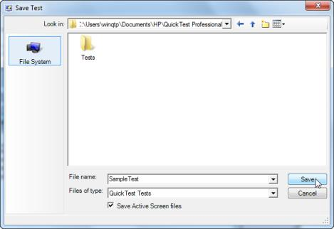

2.Select the location, to save the file from the Look in drop-down list. 
3.Type the name of the file to be saved in the File name text box. 
4.Click Save. 
5.The test is saved.

### Running a Saved Test
The tests that have been saved can be replayed later. For running such tests:
1.Click Open on the toolbar.

N> The Open Test dialog box opens with a list of saved tests.

2.Select the required test. 
3.Click Open.

N>
The saved test is opened with its name and the complete path as the name of the window. By default, Expert View of the Test is opened.

## Supported Controls
The following controls are supported for UFT/QTP tesing 

## SfDataGrid
<table>
<tr>
<td>
{{'**Method**'| markdownify }}
</td>
<td>
{{'**Description**'| markdownify }}
</td>
<td>
{{'**Parameters**'| markdownify }}
</td>
<td>
{{'**Parameter Explanation**'| markdownify }}
</td>
<td>
{{'**Return Type**'| markdownify }}
</td>
</tr>
<tr>
<td>
void SetCurrentCell(int row,int col);
</td>
<td>
To Set the CurrentCell.
</td>
<td>
int row, int col
</td>
<td>
Passing current row and column index to  the SetCurentCell method
</td>
<td>
Void
</td>
</tr>
<tr>
<td>
void GroupColumn(string columnName);
</td>
<td>
To Group the Column
</td>
<td>
String columnName
</td>
<td>
Passing MappingName for a column
</td>
<td>
Void
</td>
</tr>
<tr>
<td>
void UnGroupColumn(string columnName);
</td>
<td>
To Un Group the column
</td>
<td>
String columnName
</td>
<td>
Passing MappingName for a column
</td>
<td>
Void
</td>
</tr>
<tr>
<td>
void SortColumn(string columnName,string state);
</td>
<td>
To Sort the column
</td>
<td>
string columnName, string state
</td>
<td>
Passing MappingName for a column, passing sorting state whether Ascending / Descending
</td>
<td>
Void
</td>
</tr>
<tr>
<td>
void BeginEdit(int row,int col);
</td>
<td>
To Enter the Edit mode for particular cell
</td>
<td>
int row,int col
</td>
<td>
Passing current row and column index to  the BeginEdit method
</td>
<td>
Void
</td>
</tr>
<tr>
<td>
void EndEdit();
</td>
<td>
To EndEdit the current cell
</td>
<td>
NA
</td>
<td>
-
</td>
<td>
Void
</td>
</tr>
</table>
<table>
<tr>
<td>
{{'**Properties**'| markdownify }}
</td>
<td>
{{'**Description**'| markdownify }}
</td>
<td>
{{'**Type**'| markdownify }}
</td>
<td>
{{'**Data Type**'| markdownify }}
</td>
</tr>
<tr>
<td>
Int RowCount
</td>
<td>
Gets the RowCount of the SfDataGrid
</td>
<td>
N/A
</td>
<td>
Int
</td>
</tr>
<tr>
<td>
Int ColumnCount
</td>
<td>
Gets the ColumnCount of the SfDataGrid
</td>
<td>
N/A
</td>
<td>
Int
</td>
</tr>
</table>

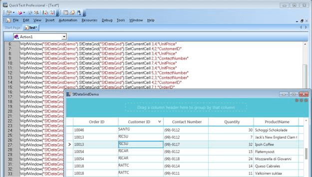

## SfMulticolumnDropDownControl
<table>
<tr>
<td>
{{'**Method**'| markdownify }}
</td>
<td>
{{'**Description**'| markdownify }}
</td>
<td>
{{'**Parameters**'| markdownify }}
</td>
<td>
{{'**Parameter Explanation**'| markdownify }}
</td>
<td>
{{'**Return Type**'| markdownify }}
</td>
</tr>
<tr>
<td>
void SetSelectedIndex(int index);
</td>
<td>
To set the SelectedIndex from the Popup
</td>
<td>
Int index
</td>
<td>
Passing columnindex to the SetSelectedIndex method
</td>
<td>
Void
</td>
</tr>
<tr>
<td>
void ShowPopup();
</td>
<td>
To open the Popup
</td>
<td>
NA
</td>
<td>
-
</td>
<td>
Void
</td>
</tr>
<tr>
<td>
void HidePopup();
</td>
<td>
To Close the Popup
</td>
<td>
NA
</td>
<td>
-
</td>
<td>
Void
</td>
</tr>
</table>

## SfDataPager
<table>
<tr>
<td>
{{'**Method**'| markdownify }}
</td>
<td>
{{'**Description**'| markdownify }}
</td>
<td>
{{'**Parameters**'| markdownify }}
</td>
<td>
{{'**Parameter Explanation**'| markdownify }}
</td>
<td>
{{'**Return Type**'| markdownify }}
</td>
</tr>
<tr>
<td>
void SetCurrentPage(int pageIndex
</td>
<td>
To set the current page in SfDataPager
</td>
<td>
Int pageIndex
</td>
<td>
Passing currentpage index to the SetCurrentPage method.
</td>
<td>
Void
</td>
</tr>
</table>

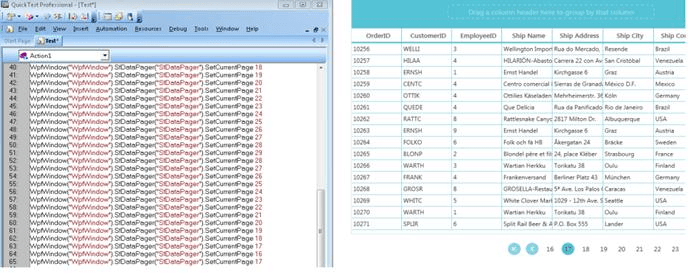

## GridDataControl
<table>
<tr>
<td>
{{'**Method**'| markdownify }}
</td>
<td>
{{'**Description**'| markdownify }}
</td>
<td>
{{'**Parameters**'| markdownify }}
</td>
<td>
{{'**Parameter Explanation**'| markdownify }}
</td>
<td>
{{'**Return Type**'| markdownify }}
</td>
</tr>
<tr>
<td>
bool IsColSorted(string colName);
</td>
<td>
Identify whether the column is sorted or not.
</td>
<td>
String colName
</td>
<td>
Passing the MappingName of the column
</td>
<td>
Bool
</td>
</tr>
<tr>
<td>
bool HasMappingName(string mappingName);
</td>
<td>
Identify whether the given MappingName is present for the Grid.
</td>
<td>
String MappingName
</td>
<td>
Passing MappingName for a column
</td>
<td>
Bool
</td>
</tr>
<tr>
<td>
bool IsGroupsExpanded();
</td>
<td>
Check whether the Groups are expanded or not
</td>
<td>
NA
</td>
<td>
-
</td>
<td>
Bool
</td>
</tr>
<tr>
<td>
bool IsRecord(int recordIndex);
</td>
<td>
Check the record based on the record index
</td>
<td>
int recordIndex
</td>
<td>
Passing record index
</td>
<td>
Bool
</td>
</tr>
<tr>
<td>
bool IsRecordExpanded(int recordIndex);
</td>
<td>
Check whether  the record is Expanded
</td>
<td>
int recordIndex
</td>
<td>
Passing record index
</td>
<td>
Bool
</td>
</tr>
<tr>
<td>
bool IsGroupRow(int rowIndex);
</td>
<td>
Check whether the row is GroupRow
</td>
<td>
int rowIndex
</td>
<td>
Passing row index
</td>
<td>
Bool
</td>
</tr>
<tr>
<td>
Int GetChildCount()
</td>
<td>
Gets the Groups count
</td>
<td>
NA
</td>
<td>
-
</td>
<td>
Int
</td>
</tr>
<tr>
<td>
Void ScrollToRowIint row)
</td>
<td>
Move the cursor to specified row index
</td>
<td>
int row
</td>
<td>
Passing the row index
</td>
<td>
Void
</td>
</tr>
<tr>
<td>
ScrollToCol(int col)
</td>
<td>
Move the cursor to specified column index
</td>
<td>
int col
</td>
<td>
Passing the column index
</td>
<td>
Void
</td>
</tr>
<tr>
<td>
Void MoveTo(int row)
</td>
<td>
Move the currentcell to particular row index
</td>
<td>
int row
</td>
<td>
Passing the row index
</td>
<td>
Void
</td>
</tr>
<tr>
<td>
Void SortColumn(string colName,string sortOrder)
</td>
<td>
Sorting the column
</td>
<td>
String colName, string sortOrder
</td>
<td>
Passing the column MappingName and sort direction
</td>
<td>
Void
</td>
</tr>
<tr>
<td>
Void GroupBy(string colName)
</td>
<td>
Grouping the column
</td>
<td>
Sting colName
</td>
<td>
Passing the column MappingName 
</td>
<td>
Void
</td>
</tr>
<tr>
<td>
Void ExpandAllGroups()
</td>
<td>
To expanding the all groups
</td>
<td>
NA
</td>
<td>
-
</td>
<td>
Void
</td>
</tr>
<tr>
<td>
Void CollapseAllGroups()
</td>
<td>
To collapsing the all groups
</td>
<td>
NA
</td>
<td>
-
</td>
<td>
Void
</td>
</tr>
<tr>
<td>
Void ExpandGroup(int recordIndex)
</td>
<td>
To expand the group based on the record index.
</td>
<td>
int recordIndex
</td>
<td>
Passing the record index.
</td>
<td>
Void
</td>
</tr>
<tr>
<td>
Void CollapseGroup(int recordIndex)
</td>
<td>
To collapse the group based on the record index.
</td>
<td>
int recordIndex
</td>
<td>
Passing the record index.
</td>
<td>
Void
</td>
</tr>
<tr>
<td>
Void ExpandAllRecords()
</td>
<td>
To Expand all nested records.
</td>
<td>
NA
</td>
<td>
-
</td>
<td>
Void
</td>
</tr>
<tr>
<td>
Void CollapseAllRecords()
</td>
<td>
To Collapse all records
</td>
<td>
NA
</td>
<td>
-
</td>
<td>
Void
</td>
</tr>
<tr>
<td>
Void ExpandRecord(int recordIndex)
</td>
<td>
To Expand the particular record based on the record index.
</td>
<td>
int recordIndex
</td>
<td>
Passing the record index
</td>
<td>
Void
</td>
</tr>
<tr>
<td>
Void CollapseRecord(int recordIndex)
</td>
<td>
To collapse the particular record based on the record index.
</td>
<td>
int recordIndex
</td>
<td>
Passing the record index
</td>
<td>
Void
</td>
</tr>
<tr>
<td>
Void AddVisibleColumn(string MappingName, string HeaderText)
</td>
<td>
To add the new visiblecolumn
</td>
<td>
String MappingName, String HeaderText
</td>
<td>
Passing the MappingName and HeaderText for the column.
</td>
<td>
Void
</td>
</tr>
<tr>
<td>
Void InsertVisibleColumn(int insertAt, string MappingName, string headerText)
</td>
<td>
To insert the visible column for particular index.
</td>
<td>
int insertAt,string MappingName, string headerText
</td>
<td>
Passing the column index, MappingName and HeaderText for the column
</td>
<td>
Void
</td>
</tr>
<tr>
<td>
Void RemoveVisibleColumn(string colName)
</td>
<td>
To remove the visiblecolumn
</td>
<td>
String colName
</td>
<td>
Passing the MappingName for a column
</td>
<td>
Void
</td>
</tr>
<tr>
<td>
Void GetColSortOrder(string colName)
</td>
<td>
To get the column sorting order
</td>
<td>
String colName
</td>
<td>
Passing the MappingName for a column
</td>
<td>
Void
</td>
</tr>
<tr>
<td>
Void MoveCurentCellTo(int rowIndex, int columnIndex)
</td>
<td>
To move the current cell to particular row and column index.
</td>
<td>
int rowIndex, int columnIndex
</td>
<td>
Passing the row and column index
</td>
<td>
Void
</td>
</tr>
<tr>
<td>
Void MoveCurentCellTo(int rowIndex)
</td>
<td>
To move the current cell to particular row index.
</td>
<td>
int rowIndex
</td>
<td>
Passing the row index
</td>
<td>
Void
</td>
</tr>
<tr>
<td>
Void MoveTo(Object o)
</td>
<td>
To move the current cell to particular row and column index.
</td>
<td>
Object o
</td>
<td>
Passing the underlying object
</td>
<td>
Void
</td>
</tr>
<tr>
<td>
Bool isRecordAvailable(Object o)
</td>
<td>
To check whether the record is available or not
</td>
<td>
Object o
</td>
<td>
Passing the underlying object
</td>
<td>
Bool
</td>
</tr>
<tr>
<td>
Bool IsReadOnly(int row, int col)
</td>
<td>
To check whether the cell is readonly or not
</td>
<td>
int row, int col
</td>
<td>
Passing the row and column index
</td>
<td>
Bool
</td>
</tr>
<tr>
<td>
Void CellClick(int row, int col)
</td>
<td>
To move the focus to the particular cell
</td>
<td>
int row, int col
</td>
<td>
Passing row and column index
</td>
<td>
Void
</td>
</tr>
<tr>
<td>
Void ResizeColumns(int fromColumn, int to, double width)
</td>
<td>
To resize the column
</td>
<td>
int fromColumn, int to, double width
</td>
<td>
Passing the from column index, to column index and width of the column
</td>
<td>
Void
</td>
</tr>
<tr>
<td>
Void ResizeRows(int fromRow, int to, int height)
</td>
<td>
To resize the row
</td>
<td>
int fromRow, int to, double height
</td>
<td>
Passing the from row index, to row index and height of the row
</td>
<td>
Void
</td>
</tr>
<tr>
<td>
Void GetCellValue(int row, int col)
</td>
<td>
To get the particular cell value
</td>
<td>
int row, int col
</td>
<td>
Passing the row and column index
</td>
<td>
Void
</td>
</tr>
<tr>
<td>
Void GetCellType(int row, int col)
</td>
<td>
To get the particular cell type
</td>
<td>
int row, int col
</td>
<td>
Passing the row and column index
</td>
<td>
Void
</td>
</tr>
<tr>
<td>
Double GetCellProperty(int row, int col, string value) 
</td>
<td>
To get the x/y/height/width for particular cell
</td>
<td>
int row, int col
</td>
<td>
Passing the row and column, string value
</td>
<td>
Double
</td>
</tr>
<tr>
<td>
Void SetCurrentCell(int row, int col)
</td>
<td>
To set the currentcell to particular row and column index
</td>
<td>
int row, int col
</td>
<td>
Passing the row and column index
</td>
<td>
Void
</td>
</tr>
</table>

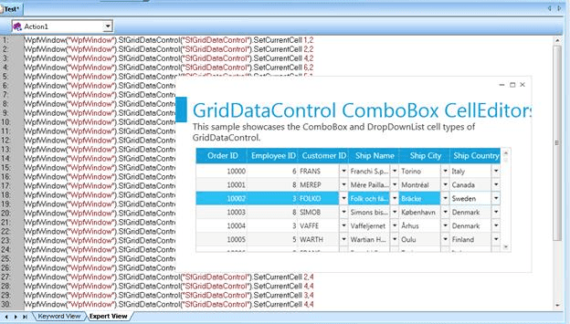

## GridTreeControl
<table>
<tr>
<td>
{{'**Method**'| markdownify }}
</td>
<td>
{{'**Description**'| markdownify }}
</td>
<td>
{{'**Parameters**'| markdownify }}
</td>
<td>
{{'**Parameter Explanation**'| markdownify }}
</td>
<td>
{{'**Return Type**'| markdownify }}
</td>
</tr>
<tr>
<td>
Void ExpandAllNodes()
</td>
<td>
To expand all nodes in GridTreeControl
</td>
<td>
-
</td>
<td>
-

</td>
<td>
Void
</td>
</tr>
<tr>
<td>
Void ExpandNode(int rowIndex)
</td>
<td>
To expand the particular code
</td>
<td>
int rowindex
</td>
<td>
Passing the row index
</td>
<td>
Void
</td>
</tr>
<tr>
<td>
Void CollapseAllNodes()
</td>
<td>
To collapse the all nodes
</td>
<td>
-
</td>
<td>
  -
</td>
<td>
Void
</td>
</tr>
<tr>
<td>
Void CollapseNode(int rowIndex)
</td>
<td>
To collapse the particular node
</td>
<td>
Int rowindex
</td>
<td>
Passing the row index
</td>
<td>
Void
</td>
</tr>
</table>

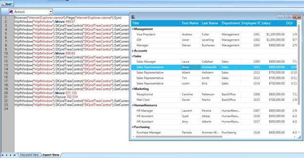

## Grid Control
<table>
<tr>
<td>
{{'**Method**'| markdownify }}
</td>
<td>
{{'**Description**'| markdownify }}
</td>
<td>
{{'**Parameters**'| markdownify }}
</td>
<td>
{{'**Return Type**'| markdownify }}
</td>
</tr>
<tr>
<td>
bool SetCurrentCell(int row, int col)
</td>
<td>
Sets the CurrentCell based on Row and Column parameters.
</td>
<td>
int row, int col
</td>
<td>
bool
</td>
</tr>
<tr>
<td>
bool SetChkBoxCell(int row, int col, bool val)
</td>
<td>
Sets the CheckBoxCell value by using Row, Column and Value parameters.
</td>
<td>
int row, int col, bool val
</td>
<td>
bool
</td>
</tr>
<tr>
<td>
bool IsFormulaCell(int row, int col)
</td>
<td>
Finds whether the cell is a formula cell.
</td>
<td>
int row, int col
</td>
<td>
bool
</td>
</tr>
<tr>
<td>
int GetSelectedRowIndex()
</td>
<td>
Gets the selected row from Grid.
</td>
<td>
NA
</td>
<td>
int
</td>
</tr>
<tr>
<td>
int GetSelectedColIndex()
</td>
<td>
Gets the selected Column from Grid.
</td>
<td>
NA
</td>
<td>
int
</td>
</tr>
<tr>
<td>
void SetCellData(int row, int col, string val)
</td>
<td>
Sets the cell data by using Row, Column and Value parameters.
</td>
<td>
int row, int col, string val
</td>
<td>
void
</td>
</tr>
<tr>
<td>
void InsertColumns(int col, int count)
</td>
<td>
Inserts the column by using Count and Target parameters.
</td>
<td>
int col, int count
</td>
<td>
void
</td>
</tr>
<tr>
<td>
void InsertRows(int row, int count)
</td>
<td>
Inserts the row by using Count and Target parameters.
</td>
<td>
int row, int count
</td>
<td>
void
</td>
</tr>
<tr>
<td>
void RemoveColumns(int col, int count)
</td>
<td>
Removes the columns by using Row parameter.
</td>
<td>
int col, int count
</td>
<td>
void
</td>
</tr>
<tr>
<td>
void RemoveRows(int row, int count)
</td>
<td>
Removes the Rows by using Row parameter.
</td>
<td>
int row, int count
</td>
<td>
void
</td>
</tr>
<tr>
<td>
void MoveRows(int removeAtRowIndex, int count, int insertAtRowIndex)
</td>
<td>
Moves the row by using From and Target parameters.
</td>
<td>
int removeAtRowIndex, int count, int insertAtRowIndex
</td>
<td>
void
</td>
</tr>
<tr>
<td>
void MoveColumns(int removeAtColIndex, int count, int insertAtColIndex)
</td>
<td>
Moves the column by using From and Target parameters.
</td>
<td>
int removeAtColIndex, int count, int insertAtColIndex
</td>
<td>
void
</td>
</tr>
<tr>
<td>
void CellClick(int row, int col)
</td>
<td>
Performs a click action to the cell by using row and column parameters.
</td>
<td>
int row, int col
</td>
<td>
void
</td>
</tr>
<tr>
<td>
void ResizeColumns(int fromColumn, int to, int width)
</td>
<td>
Resizes the column by using column parameter.
</td>
<td>
int fromColumn, int to, int width
</td>
<td>
void
</td>
</tr>
<tr>
<td>
void ResizeRows(int fromRow, int to, int height)
</td>
<td>
Resizes the row by using row parameter.
</td>
<td>
int fromRow, int to, int height
</td>
<td>
voi
</td>
</tr>
<tr>
<td>
void SetScrollPosition( int vScrollPosition, int hScrollPosition)
</td>
<td>
Sets the scroll position based on vScrollPosition and hScrollPosition parameters.
</td>
<td>
int vScrollPosition, int hScrollPosition
</td>
<td>
void
</td>
</tr>
<tr>
<td>
void SelectRange(int topRow, int leftCol, int bottomRow, int rightCol)
</td>
<td>
SelectRange by using Top,Left,Right and Bottom parameters.
</td>
<td>
int topRow, int leftCol, int bottomRow, int rightCol
</td>
<td>
void
</td>
</tr>
<tr>
<td>
void ScrollInToView(int row, int col)
</td>
<td>
Scrolls the cell into view, based on Row and Column parameters.
</td>
<td>
int row, int col
</td>
<td>
void
</td>
</tr>
<tr>
<td>
void HideRows(int fromRow, int to)
</td>
<td>
Hides rows based on Row parameter.
</td>
<td>
int fromRow, int to
</td>
<td>
void
</td>
</tr>
<tr>
<td>
void HideCols(int fromCol, int to)
</td>
<td>
Hides columns based on Column parameter.
</td>
<td>
int fromCol, int to
</td>
<td>
void
</td>
</tr>
<tr>
<td>
void ShowHiddenRows(int fromRow, int to)
</td>
<td>
Shows the hidden Rows in Grid.
</td>
<td>
int fromRow, int to
</td>
<td>
void
</td>
</tr>
<tr>
<td>
void ShowHiddenCols(int fromCol, int to)
</td>
<td>
Shows the hidden Columns in Grid.
</td>
<td>
int fromCol, int to
</td>
<td>
void
</td>
</tr>
<tr>
<td>
string GetCellType(int row, int col)
</td>
<td>
Gets the CellType as a string value based on Row and Column parameters.
</td>
<td>
int row, int col
</td>
<td>
string
</td>
</tr>
<tr>
<td>
string GetCellBackground(int row, int col)
</td>
<td>
Gets the background color as string value based on Row and Column parameter.
</td>
<td>
int row, int col
</td>
<td>
string
</td>
</tr>
<tr>
<td>
string GetCellForeground(int row, int col)
</td>
<td>
Gets the foreground color as string value, based on Row and Column parameters.
</td>
<td>
int row, int col
</td>
<td>
string
</td>
</tr>
<tr>
<td>
string GetFromattedText(int row, int col)
</td>
<td>
Gets the formatted text as string value based on Row and Column parameters.
</td>
<td>
int row, int col
</td>
<td>
string
</td>
</tr>
</table>
<table>
<tr>
<td>
{{'**Properties**'| markdownify }}
</td>
<td>
{{'**Description**'| markdownify }}
</td>
<td>
{{'**Type**'| markdownify }}
</td>
<td>
{{'**Data Type**'| markdownify }}
</td>
</tr>
<tr>
<td>
Int RowCount
</td>
<td>
Gets the RowCount of the SfDataGrid
</td>
<td>
N/A
</td>
<td>
Int
</td>
</tr>
<tr>
<td>
Int ColumnCount
</td>
<td>
Gets the ColumnCount of the SfDataGrid
</td>
<td>
N/A
</td>
<td>
Int
</td>
</tr>
</table>

## Chart
<table>
<tr>
<td>
{{'**Method**'| markdownify }}
</td>
<td>
{{'**Description**'| markdownify }}
</td>
<td>
{{'**Parameters**'| markdownify }}
</td>
<td>
{{'**Type**'| markdownify }}
</td>
<td>
{{'**Return Type**'| markdownify }}
</td>
<td>
{{'**Refresh links**'| markdownify }}
</td>
</tr>
<tr>
<td>
SetScrollPosition
</td>
<td>
To record the scrolling of Chart Area.
</td>
<td>
(int area, int axis, double zoomposition)
</td>
<td>
NA
</td>
<td>
Void
</td>
<td>
NA
</td>
</tr>
<tr>
<td>
ChartSegmentDragging
</td>
<td>
Denotes the Segment that is dragged.
</td>
<td>
(int series, int segment)
</td>
<td>
NA
</td>
<td>
Void
</td>
<td>
NA
</td>
</tr>
<tr>
<td>
ChartZoomedIn
</td>
<td>
To record the Zoom in of Chart Area
</td>
<td>
(int areaindex, double xzoomFactor, double yzoomFactor)
</td>
<td>
NA
</td>
<td>
Void
</td>
<td>
NA
</td>
</tr>
<tr>
<td>
ChartZoomedOut
</td>
<td>
To record the zoom out Chart Area.
</td>
<td>
(int areaindex, double xzoomFactor, double yzoomFactor)
</td>
<td>
NA
</td>
<td>
Void
</td>
<td>
NA
</td>
</tr>
<tr>
<td>
ChartZoomReset
</td>
<td>
To record the Chart Area reset.
</td>
<td>
(int areaindex, double xzoomFactor, double yzoomFactor)
</td>
<td>
NA
</td>
<td>
Void
</td>
<td>
NA
</td>
</tr>
<tr>
<td>
ChartPanning
</td>
<td>
To record the panning of Chart Area.
</td>
<td>
(int area, double zoomXPosition, double zoomYPosition)
</td>
<td>
NA
</td>
<td>
Void
</td>
<td>
NA
</td>
</tr>
<tr>
<td>
LegendLocationChanged
</td>
<td>
To record the change in location of Legend.
</td>
<td>
(double dockX, double dockY)
</td>
<td>
NA
</td>
<td>
Void
</td>
<td>
NA
</td>
</tr>
<tr>
<td>
ContextMenuOpening
</td>
<td>
To record the ContextMenu support.
</td>
<td>
(double isOpen)
</td>
<td>
NA
</td>
<td>
Void
</td>
<td>
NA
</td>
</tr>
<tr>
<td>
InteractiveCursorLocationChanged
</td>
<td>
To record the Interactive Cursor.
</td>
<td>
(double offsetX, double offsetY, int areaindex)
</td>
<td>
NA
</td>
<td>
Void
</td>
<td>
NA
</td>
</tr>
</table>

## SfChart
<table>
<tr>
<td>
{{'**Method**'| markdownify }}
</td>
<td>
{{'**Description**'| markdownify }}
</td>
<td>
{{'**Parameters**'| markdownify }}
</td>
<td>
{{'**Return Type**'| markdownify }}
</td>
</tr>
<tr>
<td>
void SelectionChanged(int selectedIndex, int seriesIndex)
</td>
<td>
To record select the segment /series by using selected index and series index parameter
</td>
<td>
int selectedIndex, int seriesIndex
</td>
<td>
void
</td>
</tr>
<tr>
<td>
void ZoomChanged(double zoomFactor, double zoomPosition, int axisIndex);
</td>
<td>
To set the zoom factor and zoom position to the chart axis in order to zoom-in/ zoom-out chart.
</td>
<td>
double zoomFactor, double zoomPosition, int axisIndex
</td>
<td>
void
</td>
</tr>
<tr>
<td>
void PanChanged(double zoomPosition, int axisIndex)
</td>
<td>
To set the zoom position to the chart axis in order to pan the chart.
</td>
<td>
double zoomPosition, int axisIndex
</td>
<td>
void
</td>
</tr>
<tr>
<td>
void ResetZoom(int axisIndex);
</td>
<td>
To reset the zoom position and zoom factor value to the chart axis.
</td>
<td>
int axisIndex
</td>
<td>
void
</td>
</tr>
<tr>
<td>
void DraggingAnnotation(double x1, double x2, double y1, double y2, int index)
</td>
<td>
To set the selected annotation position by X1, X2, Y1 and Y2 parameters.
</td>
<td>
double x1, double x2, double y1, double y2, int index
</td>
<td>
Void
</td>
</tr>
</table>

## PivotGrid
<table>
<tr>
<td>
{{'**Method**'| markdownify }}
</td>
<td>
{{'**Description**'| markdownify }}
</td>
<td>
{{'**Parameters**'| markdownify }}
</td>
<td>
{{'**Return Type**'| markdownify }}
</td>
</tr>
<tr>
<td>
void ShowGroupingBar()  </td>
<td>
Sets the GroupingBar properties of PivotGrid when ShowGroupingBar value is true.  </td>
<td>
N/A  </td>
<td>
void  </td>
</tr>
<tr>
<td>
void ResizeColumns(int left, int right, double width);  </td>
<td>
Resizes the column of internal Grid for desired width.  </td>
<td>
int left, int right, double width  </td>
<td>
void  </td>
</tr>
<tr>
<td>
void ResizeRows(int top, int bottom, double height);  </td>
<td>
Resizes the row of internal Grid for desired height.  </td>
<td>
int top, int bottom, double height  </td>
<td>
void  </td>
</tr>
<tr>
<td>
bool LoadInBackgroundCompleted()  </td>
<td>
Returns the value as true once the LoadInBackground action has been completed.  </td>
<td>
N/A  </td>
<td>
bool  </td>
</tr>
<tr>
<td>
bool AllowSelection()  </td>
<td>
Returns the value when selecting the cells of internal Grid.  </td>
<td>
N/A  </td>
<td>
bool  </td>
</tr>
<tr>
<td>
bool AllowSelectionWithHeaders();  </td>
<td>
Return the value when selecting the value cells along with headers of PivotGrid.  </td>
<td>
N/A  </td>
<td>
bool  </td>
</tr>
<tr>
<td>
void CellClick(int rowIndex, int colIndex);  </td>
<td>
Performs the click action to the cell of internal Grid by using specific row, column.  </td>
<td>
int rowIndex, int colIndex  </td>
<td>
void  </td>
</tr>
<tr>
<td>
void ExpandAll()  </td>
<td>
Expands all the rows or columns of PivotGrid.  </td>
<td>
N/A  </td>
<td>
void  </td>
</tr>
<tr>
<td>
void CollapseAll()  </td>
<td>
Collapses all the rows or columns of PivotGrid.  </td>
<td>
N/A  </td>
<td>
void  </td>
</tr>
<tr>
<td>
bool SortBegin()  </td>
<td>
Indicates whether the sorting operation has been started when sorting the values of PivotGrid.  </td>
<td>
N/A  </td>
<td>
bool  </td>
</tr>
<tr>
<td>
bool SortCompleted()  </td>
<td>
Indicates whether the sorting operation has been completed when the values of PivotGrid have sorted.  </td>
<td>
N/A  </td>
<td>
bool  </td>
</tr>
<tr>
<td>
bool CanDrop()  </td>
<td>
Returns the value when the PivotItem has been dropped between GroupingBar fields.  </td>
<td>
N/A  </td>
<td>
bool  </td>
</tr>
<tr>
<td>
bool ContextMenuOpening()  </td>
<td>
Returns the value when opening the context menu of PivotItem.  </td>
<td>
N/A  </td>
<td>
bool  </td>
</tr>
<tr>
<td>
bool FilterPopupOpened()
</td>
<td>
Returns the value when clicking the filter popup of any PivotItem to filter the values.
</td>
<td>
N/A
</td>
<td>
bool
</td>
</tr>
<tr>
<td>
bool FilterActionCompleted()
</td>
<td>
Indicates whether the filtering action has been completed if the values are added in filters of PivotGrid.
</td>
<td>
N/A
</td>
<td>
bool
</td>
</tr>
</table>
