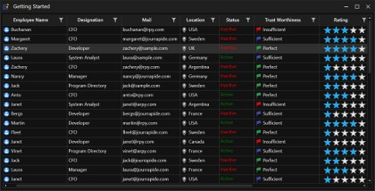
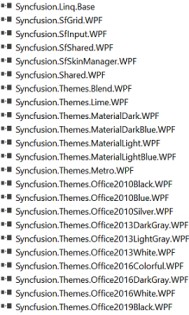

# Getting started with SkinManager themes

The [SfSkinManager](https://help.syncfusion.com/cr/wpf/Syncfusion.SfSkinManager.WPF~Syncfusion.SfSkinManager.SfSkinManager.html) helps to apply the built-in themes for both the WPF syncfusion and framework controls. There are 22 built-in themes that can be applied using `SfSkinManager` for rich user interface experience. Some of the built-in themes can be color customized in the [ThemeStudio](https://help.syncfusion.com/wpf/themes/theme-studio). Refer to the following built in themes and its available assemblies below.

N> Built-in themes in current ThemeStudio has improved consistency and uniqueness among various controls compared to old themes.

<table>
<tr>
<th>
Styles</th><th>
Assemblies</th><th>
Supported in ThemeStudio</th><th>
Alternative themes in ThemeStudio</th></tr>
<tr>
<td>
MaterialLight</td><td>
Syncfusion.Themes.MaterialLight.Wpf.dll</td><td>
Yes</td><td>
NA</td></tr>
<tr>
<td>
MaterialDark</td><td>
Syncfusion.Themes.MaterialDark.Wpf.dll</td><td>
Yes</td><td>
NA</td></tr>
<tr>
<td>
MaterialLightBlue</td><td>
Syncfusion.Themes.MaterialLightBlue.Wpf.dll</td><td>
Yes</td><td>
NA</td></tr>
<tr>
<td>
MaterialDarkBlue</td><td>
Syncfusion.Themes.MaterialDarkBlue.Wpf.dll</td><td>
Yes</td><td>
NA</td></tr>
<tr>
<td>
Office2019Colorful</td><td>
Syncfusion.Themes.Office2019Colorful.Wpf.dll</td><td>
Yes</td><td>
NA</td></tr>
<tr>
<td>
Office2019Black</td><td>
Syncfusion.Themes.Office2019Black.Wpf.dll</td><td>
Yes</td><td>
NA</td></tr>
<tr>
<td>
Metro</td><td>
Syncfusion.Themes.Metro.Wpf.dll</td><td>
No</td><td>
No</td></tr>
<tr>
<td>
Lime</td><td>
Syncfusion.Themes.Lime.Wpf.dll</td><td>
No</td><td>
No</td></tr>
<tr>
<td>
Saffron</td><td>
Syncfusion.Themes.Saffron.Wpf.dll</td><td>
No</td><td>
No</td></tr>
<tr>
<td>
Blend</td><td>
Syncfusion.Themes.Blend.Wpf.dll</td><td>
No</td><td>
MaterialDark, Office2019Black</td></tr>
<tr>
<td>
Office2013White</td><td>
Syncfusion.Themes.Office2013White.Wpf.dll</td><td>
No</td><td>
No</td></tr>
<tr>
<td>
Office2013LightGray</td><td>
Syncfusion.Themes.Office2013LightGray.Wpf.dll</td><td>
No</td><td>
No</td></tr>
<tr>
<td>
Office2013DarkGray</td><td>
Syncfusion.Themes.Office2013DarkGray.Wpf.dll</td><td>
No</td><td>
No</td></tr>
<tr>
<td>
VisualStudio2013</td><td>
Syncfusion.Themes.VisualStudio2013.Wpf.dll</td><td>
No</td><td>
No</td></tr>
<tr>
<td>
Office2010Black</td><td>
Syncfusion.Themes.Office2010Black.Wpf.dll</td><td>
No</td><td>
No</td></tr>
<tr>
<td>
Office2010Blue</td><td>
Syncfusion.Themes.Office2010Blue.Wpf.dll</td><td>
No</td><td>
No</td></tr>
<tr>
<td>
Office2010Silver</td><td>
Syncfusion.Themes.Office2010Silver.Wpf.dll</td><td>
No</td><td>
No</td></tr>
<tr>
<td>
Office365</td><td>
Syncfusion.Themes.Office365.Wpf.dll</td><td>
No</td><td>
No</td></tr>
<tr>
<td>
Office2016Colorful</td><td>
Syncfusion.Themes.Office2016Colorful.Wpf.dll</td><td>
No</td><td>
Office2019Colorful</td></tr>
<tr>
<td>
Office2016White</td><td>
Syncfusion.Themes.Office2016White.Wpf.dll</td><td>
No</td><td>
No</td></tr>
<tr>
<td>
Office2016DarkGray</td><td>
Syncfusion.Themes.Office2016DarkGray.Wpf.dll</td><td>
No</td><td>
No</td></tr>
<tr>
<td>
VisualStudio2015</td><td>
Syncfusion.Themes.VisualStudio2015.Wpf.dll</td><td>
No</td><td>
No</td></tr>
</table>

## Apply a theme to a control

### Add SkinManager reference

There are several ways to add the Syncfusion [SfSkinManager](https://help.syncfusion.com/cr/wpf/Syncfusion.SfSkinManager.WPF~Syncfusion.SfSkinManager.SfSkinManager.html) reference in Visual Studio WPF project. The following steps will help to add through `XAML` Code,

1) Create a WPF project in Visual Studio and add the `Syncfusion.SfSkinManager.WPF` assembly or nuget package [reference](https://help.syncfusion.com/wpf/control-dependencies#skinmanager) to the project.
2) Import Syncfusion WPF schema `http://schemas.syncfusion.com/wpf` or the assembly namespace `Syncfusion.SfSkinManager` in XAML page.





<Window
    xmlns="http://schemas.microsoft.com/winfx/2006/xaml/presentation"
    xmlns:x="http://schemas.microsoft.com/winfx/2006/xaml"
    xmlns:syncfusionskin ="clr-namespace:Syncfusion.SfSkinManager;assembly=Syncfusion.SfSkinManager.WPF"
    xmlns:syncfusion="http://schemas.syncfusion.com/wpf" />





### Add theme assembly reference

The [SfSkinManager](https://help.syncfusion.com/cr/wpf/Syncfusion.SfSkinManager.WPF~Syncfusion.SfSkinManager.SfSkinManager.html) supports various built-in themes mentioned above. The corresponding style resources are included with the specific theme assemblies. For example, to apply `MaterialDark` theme, attach `Syncfusion.Themes.MaterialDark.Wpf` assembly reference to the project. Similarly, refer the required theme assemblies or nuget packages [reference](https://help.syncfusion.com/wpf/control-dependencies#sfskinmanager-dependencies) with the project when needed.

### Set visual style

Any built-in themes can applied to both syncfusion controls and framework controls by using [VisualStyle](https://help.syncfusion.com/cr/cref_files/wpf/Syncfusion.SfSkinManager.WPF~Syncfusion.SfSkinManager.SfSkinManager~VisualStyleProperty.html) attached property of the [SfSkinManager](https://help.syncfusion.com/cr/wpf/Syncfusion.SfSkinManager.WPF~Syncfusion.SfSkinManager.SfSkinManager.html). All built-in assemblies have style resources for controls, so whenever an application get its style through `SfSkinManager`, the corresponding control style merges with the applied controls resource dictionary. For example, apply the value as `MaterialDark` to the `VisualStyle` property of the `SfSkinManager` for the [ChromelessWindow](https://help.syncfusion.com/wpf/chromeless-window/getting-started) control containing [DataGrid](https://help.syncfusion.com/wpf/datagrid/getting-started).





<syncfusion:ChromelessWindow x:Class="DataGrid_Themes.MainWindow"
                             xmlns="http://schemas.microsoft.com/winfx/2006/xaml/presentation"
                             xmlns:x="http://schemas.microsoft.com/winfx/2006/xaml"
                             xmlns:local="clr-namespace:DataGrid_Themes"
                             xmlns:syncfusion="http://schemas.syncfusion.com/wpf"
							 xmlns:syncfusionskin ="clr-namespace:Syncfusion.SfSkinManager;assembly=Syncfusion.SfSkinManager.WPF"
							 syncfusionskin:SfSkinManager.VisualStyle="MaterialDark"
                             Icon="App.ico"
                             Title="Getting Started"
                             WindowStartupLocation="CenterScreen">

    <syncfusion:ChromelessWindow.Resources>
        <local:ViewModel x:Key="viewmodel" />
        <local:SelectedImageConverter x:Key="selectedImageConverter"/>
        <local:StatusConverter        x:Key="statusConverter"/>
        <local:TrustImageConverter    x:Key="trustImageConverter"/>
         
        
    </syncfusion:ChromelessWindow.Resources>

    <Grid DataContext="{StaticResource viewmodel}">
        <syncfusion:SfDataGrid Name="sfgrid" Margin="5"
                                       AutoGenerateColumns="False"
                                       AllowDraggingColumns="True"
                                       AllowEditing="True"
                                       LiveDataUpdateMode="AllowDataShaping"
                                       AllowFiltering="True"
                                       HeaderRowHeight="26"
                                       SelectionMode="Extended"
                                       ColumnSizer="Auto"
                                       ItemsSource="{Binding EmployeeDetails}">
            <syncfusion:SfDataGrid.Columns>
                <syncfusion:GridCheckBoxSelectorColumn  MappingName="Selected" AllowFiltering="False" Width="30"
                                                                AllowSorting="False"   AllowCheckBoxOnHeader="True"/>
                <syncfusion:GridTemplateColumn  MappingName="EmployeeName" Padding="2"
                                                        HeaderText="Employee Name">
                    <syncfusion:GridTemplateColumn.CellTemplate>
                        <DataTemplate>
                            <Grid Margin="3">
                                <Grid.ColumnDefinitions>
                                    <ColumnDefinition  Width="15"/>
                                    <ColumnDefinition/>
                                </Grid.ColumnDefinitions>
                                <Image Source="{Binding Gender,
                                                                Converter={StaticResource selectedImageConverter}}" 
                                               Height="15"      Width="15"       Grid.Column="0"/>
                                <TextBlock Text="{Binding EmployeeName}" Padding="4" 
                                                   VerticalAlignment="Center"    Grid.Column="1"/>
                            </Grid>
                        </DataTemplate>
                    </syncfusion:GridTemplateColumn.CellTemplate>
                </syncfusion:GridTemplateColumn>
                <syncfusion:GridTextColumn  MappingName="Designation" HeaderText="Designation"/>
                <syncfusion:GridTextColumn  MappingName="Mail"        HeaderText="Mail"/>
                <syncfusion:GridTemplateColumn MappingName="Location" Width="100"
                                                       HeaderText="Location">
                    <syncfusion:GridTemplateColumn.CellTemplate>
                        <DataTemplate>
                            <Grid Margin="3">
                                <Grid.ColumnDefinitions>
                                    <ColumnDefinition  Width="15"/>
                                    <ColumnDefinition/>
                                </Grid.ColumnDefinitions>
                                <Image Source="Images/location.png"   Height="15"
                                               Grid.Column="0"                Width="15"/>
                                <TextBlock Text="{Binding Location}"  Padding="4" 
                                                   VerticalAlignment="Center" Grid.Column="1"/>
                            </Grid>
                        </DataTemplate>
                    </syncfusion:GridTemplateColumn.CellTemplate>
                </syncfusion:GridTemplateColumn>
                <syncfusion:GridTemplateColumn MappingName="Status" Width="90" HeaderText="Status">
                    <syncfusion:GridTemplateColumn.CellTemplate>
                        <DataTemplate>
                            <TextBlock  Foreground="{Binding Status,
                                                                     Converter={StaticResource statusConverter}}"
                                                Padding="3"          Text="{Binding Status}"/>
                        </DataTemplate>
                    </syncfusion:GridTemplateColumn.CellTemplate>
                    <syncfusion:GridTemplateColumn.EditTemplate>
                        <DataTemplate>
                            <syncfusion:ComboBoxAdv SelectedValue="{Binding Status}" ItemsSource="{Binding Status, Source={StaticResource viewmodel}}"/>
                        </DataTemplate>
                    </syncfusion:GridTemplateColumn.EditTemplate>
                </syncfusion:GridTemplateColumn>
                <syncfusion:GridTemplateColumn MappingName="Trustworthiness" HeaderText="Trust Worthiness">
                    <syncfusion:GridTemplateColumn.CellTemplate>
                        <DataTemplate>
                            <Grid Margin="3">
                                <Grid.ColumnDefinitions>
                                    <ColumnDefinition  Width="15"/>
                                    <ColumnDefinition/>
                                </Grid.ColumnDefinitions>
                                <Image Source="{Binding Trustworthiness,
                                                                Converter={StaticResource trustImageConverter}}"
                                               Height="15"      Width="15"          Grid.Column="0"/>
                                <TextBlock Text="{Binding Trustworthiness}" Padding="4" 
                                                   VerticalAlignment="Center"       Grid.Column="1"/>
                            </Grid>
                        </DataTemplate>
                    </syncfusion:GridTemplateColumn.CellTemplate>
                    <syncfusion:GridTemplateColumn.EditTemplate>
                        <DataTemplate>
                            <syncfusion:ComboBoxAdv SelectedValue="{Binding Trustworthiness}"  ItemsSource="{Binding Trustworthiness, Source={StaticResource viewmodel}}"/>
                        </DataTemplate>
                    </syncfusion:GridTemplateColumn.EditTemplate>
                </syncfusion:GridTemplateColumn>
                <syncfusion:GridTemplateColumn MappingName="Rating" Width="130">
                    <syncfusion:GridTemplateColumn.CellTemplate>
                        <DataTemplate>
                            <syncfusion:SfRating VerticalAlignment="Center" ItemsCount="5" ShowToolTip="False"
                                                         Value="{Binding Rating, Mode=TwoWay}"/>
                        </DataTemplate>
                    </syncfusion:GridTemplateColumn.CellTemplate>
                </syncfusion:GridTemplateColumn>
                <syncfusion:GridTextColumn  Width="90" DisplayBinding="{Binding Path=Salary,
                                                                             StringFormat='{}{0:C}'}"   
                                                    TextAlignment="Right"    HeaderText="Salary"/>
                <syncfusion:GridTextColumn MappingName="Address" HeaderText="Address"/>
                <syncfusion:GridPercentColumn HeaderText="Software Proficiency" AllowEditing="False"
                                                      MappingName="SoftwareProficiency">
                    <syncfusion:GridPercentColumn.CellTemplate>
                        <DataTemplate>
                            <Grid>
                                <ProgressBar Background="Transparent" BorderThickness="0" Maximum=".99"
                                                     Value="{Binding SoftwareProficiency,StringFormat=P}"/>
                                <TextBlock   HorizontalAlignment="Center" VerticalAlignment="Center"
                                                     Text="{Binding SoftwareProficiency, StringFormat=P}"/>
                            </Grid>
                        </DataTemplate>
                    </syncfusion:GridPercentColumn.CellTemplate>
                </syncfusion:GridPercentColumn>
            </syncfusion:SfDataGrid.Columns>
        </syncfusion:SfDataGrid>
    </Grid>
</syncfusion:ChromelessWindow>





SfSkinManager.SetVisualStyle(this, "MaterialDark");





N> View [sample](https://github.com/SyncfusionExamples/set-visualstyle-using-skinmanager) in GitHub.

## Apply a theme globally in the application

By default, [SfSkinManager](https://help.syncfusion.com/cr/wpf/Syncfusion.SfSkinManager.WPF~Syncfusion.SfSkinManager.SfSkinManager.html) merges the required resource files from the theme assembly to the applied control. To apply a theme globally in an application, set the `ApplyStylesOnApplication` property to `True`. It merges all the resource files to the application’s resource dictionary.

N> The value of the `ApplyStylesOnApplication` property should be set before the initialization and should not be set dynamically.





SfSkinManager.ApplyStylesOnApplication = true;





## Apply style to custom controls

To apply the built-in themes to derived control using `SfSkinManager`, call the [SetResourceReference](https://docs.microsoft.com/en-us/dotnet/api/system.windows.frameworkelement.setresourcereference) method and pass the `StyleProperty` and derived control type as parameters. 





 <local:SfDataGridExt x:Name="grid"
                             AllowGrouping="True"
                             AutoGenerateColumns="False"
                             ItemsSource="{Binding EmployeeDetails}"
                             ShowGroupDropArea="True">
            <local:SfDataGridExt.Resources>
                <ResourceDictionary>
                    <ResourceDictionary.MergedDictionaries>
                        <ResourceDictionary Source="/Syncfusion.SfGrid.WPF;component/Styles/Styles.xaml" />
                    </ResourceDictionary.MergedDictionaries>
                </ResourceDictionary>
            </local:SfDataGridExt.Resources>
            <local:SfDataGridExt.Columns>
                <syncfusion:GridNumericColumn MappingName="EmployeeAge" />
                <syncfusion:GridTextColumn MappingName="EmployeeName" />
                <syncfusion:GridTextColumn MappingName="EmployeeGender" />
                <syncfusion:GridTextColumn AllowEditing="True" MappingName="Country" />
                <syncfusion:GridNumericColumn MappingName="EmployeeSalary" />
            </local:SfDataGridExt.Columns>
</local:SfDataGridExt>









 public class SfDataGridExt : SfDataGrid
    {
        public SfDataGridExt()
        {
            SetResourceReference(StyleProperty, typeof(SfDataGrid));
        }
    }





## Clearing SkinManager instance in an application

The `SfSkinManager` will hold some instance to use it further while applying theme. But this can be cleared using the function named `Dispose(object)` that needs to be called when you need to clear the theme applied from `SfSkinManager` as like below code. Here **object** refers to the element whose instance needs to be cleared.





private void Window_Closed(object sender, EventArgs e) 
{ 
   SfSkinManager.Dispose(this); 
} 





## How To

### Change visual style at runtime

The built-in themes can be changed at runtime using the `VisualStyle` property. The various controls can be used to switch built-in themes at run time. Please refer to the below snippet for changing the visual style at runtime and their corresponding built-in themes added as a reference to the project.





syncfusion:ChromelessWindow x:Class="DataGrid_Themes.MainWindow"
                             xmlns="http://schemas.microsoft.com/winfx/2006/xaml/presentation"
                             xmlns:x="http://schemas.microsoft.com/winfx/2006/xaml"
                             xmlns:local="clr-namespace:DataGrid_Themes"
                             xmlns:system="clr-namespace:System;assembly=mscorlib"
                             xmlns:syncfusion="http://schemas.syncfusion.com/wpf"
							 xmlns:syncfusionskin ="clr-namespace:Syncfusion.SfSkinManager;assembly=Syncfusion.SfSkinManager.WPF"
							 syncfusionskin:SfSkinManager.VisualStyle="{Binding ElementName=comboVisualStyle, Path=SelectedValue, Mode=OneWay, UpdateSourceTrigger=PropertyChanged}"
                             Icon="App.ico"
                             Title="Getting Started"
                             WindowStartupLocation="CenterScreen">

    <syncfusion:ChromelessWindow.Resources>
        <local:ViewModel x:Key="viewmodel" />
        <local:SelectedImageConverter x:Key="selectedImageConverter"/>
        <local:StatusConverter        x:Key="statusConverter"/>
        <local:TrustImageConverter    x:Key="trustImageConverter"/>
         
        
        <ObjectDataProvider
            x:Key="Themes"
            MethodName="GetValues"
            ObjectType="{x:Type system:Enum}">
            <ObjectDataProvider.MethodParameters>
                <x:Type TypeName="syncfusionskin:VisualStyles" />
            </ObjectDataProvider.MethodParameters>
        </ObjectDataProvider>
    </syncfusion:ChromelessWindow.Resources>

    <Grid>
        <Grid.RowDefinitions>
            <RowDefinition Height="40"/>
            <RowDefinition Height="*"/>
        </Grid.RowDefinitions>
        <ComboBox
                x:Name="comboVisualStyle"
                Grid.Row="0"
                Width="250"
                Margin="5"
                ItemsSource="{Binding Source={StaticResource Themes}}"
                SelectedIndex="18" />
        <Grid Grid.Row="1" DataContext="{StaticResource viewmodel}">
            <syncfusion:SfDataGrid Name="sfgrid" Margin="5"
                                       AutoGenerateColumns="False"
                                       AllowDraggingColumns="True"
                                       AllowEditing="True"
                                       LiveDataUpdateMode="AllowDataShaping"
                                       AllowFiltering="True"
                                       HeaderRowHeight="26"
                                       SelectionMode="Extended"
                                       ColumnSizer="Auto"
                                       ItemsSource="{Binding EmployeeDetails}">
                <syncfusion:SfDataGrid.Columns>
                    <syncfusion:GridCheckBoxSelectorColumn  MappingName="Selected" AllowFiltering="False" Width="30"
                                                                AllowSorting="False"   AllowCheckBoxOnHeader="True"/>
                    <syncfusion:GridTemplateColumn  MappingName="EmployeeName" Padding="2"
                                                        HeaderText="Employee Name">
                        <syncfusion:GridTemplateColumn.CellTemplate>
                            <DataTemplate>
                                <Grid Margin="3">
                                    <Grid.ColumnDefinitions>
                                        <ColumnDefinition  Width="15"/>
                                        <ColumnDefinition/>
                                    </Grid.ColumnDefinitions>
                                    <Image Source="{Binding Gender,
                                                                Converter={StaticResource selectedImageConverter}}" 
                                               Height="15"      Width="15"       Grid.Column="0"/>
                                    <TextBlock Text="{Binding EmployeeName}" Padding="4" 
                                                   VerticalAlignment="Center"    Grid.Column="1"/>
                                </Grid>
                            </DataTemplate>
                        </syncfusion:GridTemplateColumn.CellTemplate>
                    </syncfusion:GridTemplateColumn>
                    <syncfusion:GridTextColumn  MappingName="Designation" HeaderText="Designation"/>
                    <syncfusion:GridTextColumn  MappingName="Mail"        HeaderText="Mail"/>
                    <syncfusion:GridTemplateColumn MappingName="Location" Width="100"
                                                       HeaderText="Location">
                        <syncfusion:GridTemplateColumn.CellTemplate>
                            <DataTemplate>
                                <Grid Margin="3">
                                    <Grid.ColumnDefinitions>
                                        <ColumnDefinition  Width="15"/>
                                        <ColumnDefinition/>
                                    </Grid.ColumnDefinitions>
                                    <Image Source="Images/location.png"   Height="15"
                                               Grid.Column="0"                Width="15"/>
                                    <TextBlock Text="{Binding Location}"  Padding="4" 
                                                   VerticalAlignment="Center" Grid.Column="1"/>
                                </Grid>
                            </DataTemplate>
                        </syncfusion:GridTemplateColumn.CellTemplate>
                    </syncfusion:GridTemplateColumn>
                    <syncfusion:GridTemplateColumn MappingName="Status" Width="90" HeaderText="Status">
                        <syncfusion:GridTemplateColumn.CellTemplate>
                            <DataTemplate>
                                <TextBlock  Foreground="{Binding Status,
                                                                     Converter={StaticResource statusConverter}}"
                                                Padding="3"          Text="{Binding Status}"/>
                            </DataTemplate>
                        </syncfusion:GridTemplateColumn.CellTemplate>
                        <syncfusion:GridTemplateColumn.EditTemplate>
                            <DataTemplate>
                                <syncfusion:ComboBoxAdv SelectedValue="{Binding Status}" ItemsSource="{Binding Status, Source={StaticResource viewmodel}}"/>
                            </DataTemplate>
                        </syncfusion:GridTemplateColumn.EditTemplate>
                    </syncfusion:GridTemplateColumn>
                    <syncfusion:GridTemplateColumn MappingName="Trustworthiness" HeaderText="Trust Worthiness">
                        <syncfusion:GridTemplateColumn.CellTemplate>
                            <DataTemplate>
                                <Grid Margin="3">
                                    <Grid.ColumnDefinitions>
                                        <ColumnDefinition  Width="15"/>
                                        <ColumnDefinition/>
                                    </Grid.ColumnDefinitions>
                                    <Image Source="{Binding Trustworthiness,
                                                                Converter={StaticResource trustImageConverter}}"
                                               Height="15"      Width="15"          Grid.Column="0"/>
                                    <TextBlock Text="{Binding Trustworthiness}" Padding="4" 
                                                   VerticalAlignment="Center"       Grid.Column="1"/>
                                </Grid>
                            </DataTemplate>
                        </syncfusion:GridTemplateColumn.CellTemplate>
                        <syncfusion:GridTemplateColumn.EditTemplate>
                            <DataTemplate>
                                <syncfusion:ComboBoxAdv SelectedValue="{Binding Trustworthiness}"  ItemsSource="{Binding Trustworthiness, Source={StaticResource viewmodel}}"/>
                            </DataTemplate>
                        </syncfusion:GridTemplateColumn.EditTemplate>
                    </syncfusion:GridTemplateColumn>
                    <syncfusion:GridTemplateColumn MappingName="Rating" Width="130">
                        <syncfusion:GridTemplateColumn.CellTemplate>
                            <DataTemplate>
                                <syncfusion:SfRating VerticalAlignment="Center" ItemsCount="5" ShowToolTip="False"
                                                         Value="{Binding Rating, Mode=TwoWay}"/>
                            </DataTemplate>
                        </syncfusion:GridTemplateColumn.CellTemplate>
                    </syncfusion:GridTemplateColumn>
                    <syncfusion:GridTextColumn  Width="90" DisplayBinding="{Binding Path=Salary,
                                                                             StringFormat='{}{0:C}'}"   
                                                    TextAlignment="Right"    HeaderText="Salary"/>
                    <syncfusion:GridTextColumn MappingName="Address" HeaderText="Address"/>
                    <syncfusion:GridPercentColumn HeaderText="Software Proficiency" AllowEditing="False"
                                                      MappingName="SoftwareProficiency">
                        <syncfusion:GridPercentColumn.CellTemplate>
                            <DataTemplate>
                                <Grid>
                                    <ProgressBar Background="Transparent" BorderThickness="0" Maximum=".99"
                                                     Value="{Binding SoftwareProficiency,StringFormat=P}"/>
                                    <TextBlock   HorizontalAlignment="Center" VerticalAlignment="Center"
                                                     Text="{Binding SoftwareProficiency, StringFormat=P}"/>
                                </Grid>
                            </DataTemplate>
                        </syncfusion:GridPercentColumn.CellTemplate>
                    </syncfusion:GridPercentColumn>
                </syncfusion:SfDataGrid.Columns>
            </syncfusion:SfDataGrid>
        </Grid>
    </Grid>
</syncfusion:ChromelessWindow>





N> View [sample](https://github.com/SyncfusionExamples/change-themes-at-runtime-using-skinmanager) in GitHub.