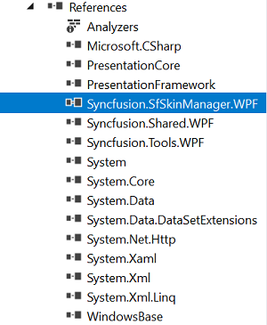
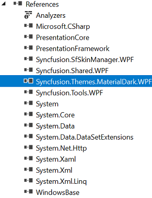

# Themes getting started with SkinManager

The `SfSkinManager` control helps to apply the built-in themes to the Syncfusion UI controls for WPF. There are 22 built-in themes that can be applied using `SfSkinManager` for rich user interface experience. Some of the built-in themes can be color customized in the [ThemeStudio](https://help.syncfusion.com/wpf/themes/theme-studio). Refer to the following built in themes and its available assemblies below.

N> Built-in themes in current ThemeStudio has good consistency and uniqueness among various controls compared to old themes.

<table>
<tr>
<th>
Styles</th><th>
Assemblies</th><th>
Supported in ThemeStudio</th><th>
Alternative themes in ThemeStudio</th></tr>
<tr>
<td>
MaterialLight</td><td>
Syncfusion.Themes.MaterialLight.Wpf.dll</td><td>
Yes</td><td>
NA</td></tr>
<tr>
<td>
MaterialDark</td><td>
Syncfusion.Themes.MaterialDark.Wpf.dll</td><td>
Yes</td><td>
NA</td></tr>
<tr>
<td>
MaterialLightBlue</td><td>
Syncfusion.Themes.MaterialLightBlue.Wpf.dll</td><td>
Yes</td><td>
NA</td></tr>
<tr>
<td>
MaterialDarkBlue</td><td>
Syncfusion.Themes.MaterialDarkBlue.Wpf.dll</td><td>
Yes</td><td>
NA</td></tr>
<tr>
<td>
Office2019Colorful</td><td>
Syncfusion.Themes.Office2019Colorful.Wpf.dll</td><td>
Yes</td><td>
NA</td></tr>
<tr>
<td>
Office2019Black</td><td>
Syncfusion.Themes.Office2019Black.Wpf.dll</td><td>
Yes</td><td>
NA</td></tr>
<tr>
<td>
Metro</td><td>
Syncfusion.Themes.Metro.Wpf.dll</td><td>
No</td><td>
No</td></tr>
<tr>
<td>
Lime</td><td>
Syncfusion.Themes.Lime.Wpf.dll</td><td>
No</td><td>
No</td></tr>
<tr>
<td>
Saffron</td><td>
Syncfusion.Themes.Saffron.Wpf.dll</td><td>
No</td><td>
No</td></tr>
<tr>
<td>
Blend</td><td>
Syncfusion.Themes.Blend.Wpf.dll</td><td>
No</td><td>
MaterialDark, Office2019Black</td></tr>
<tr>
<td>
Office2013White</td><td>
Syncfusion.Themes.Office2013White.Wpf.dll</td><td>
No</td><td>
No</td></tr>
<tr>
<td>
Office2013LightGray</td><td>
Syncfusion.Themes.Office2013LightGray.Wpf.dll</td><td>
No</td><td>
No</td></tr>
<tr>
<td>
Office2013DarkGray</td><td>
Syncfusion.Themes.Office2013DarkGray.Wpf.dll</td><td>
No</td><td>
No</td></tr>
<tr>
<td>
VisualStudio2013</td><td>
Syncfusion.Themes.VisualStudio2013.Wpf.dll</td><td>
No</td><td>
No</td></tr>
<tr>
<td>
Office2010Black</td><td>
Syncfusion.Themes.Office2010Black.Wpf.dll</td><td>
No</td><td>
No</td></tr>
<tr>
<td>
Office2010Blue</td><td>
Syncfusion.Themes.Office2010Blue.Wpf.dll</td><td>
No</td><td>
No</td></tr>
<tr>
<td>
Office2010Silver</td><td>
Syncfusion.Themes.Office2010Silver.Wpf.dll</td><td>
No</td><td>
No</td></tr>
<tr>
<td>
Office365</td><td>
Syncfusion.Themes.Office365.Wpf.dll</td><td>
No</td><td>
No</td></tr>
<tr>
<td>
Office2016Colorful</td><td>
Syncfusion.Themes.Office2016Colorful.Wpf.dll</td><td>
No</td><td>
Office2019Colorful</td></tr>
<tr>
<td>
Office2016White</td><td>
Syncfusion.Themes.Office2016White.Wpf.dll</td><td>
No</td><td>
No</td></tr>
<tr>
<td>
Office2016DarkGray</td><td>
Syncfusion.Themes.Office2016DarkGray.Wpf.dll</td><td>
No</td><td>
No</td></tr>
<tr>
<td>
VisualStudio2015</td><td>
Syncfusion.Themes.VisualStudio2015.Wpf.dll</td><td>
No</td><td>
No</td></tr>
</table>

## Apply a theme to a control

This section covers how to apply themes for controls using `SfSkinManager`.

### Add SfSkinManager Reference

There are several ways to add the Syncfusion `SfSkinManager` reference in Visual Studio WPF project. The following steps help to add through `XAML` Code,

1) Create a WPF project in Visual Studio and add the `Syncfusion.SfSkinManager.WPF` assembly reference to the project.
2) Import Syncfusion WPF schema `http://schemas.syncfusion.com/wpf` or the assembly namespace `Syncfusion.SfSkinManager` in XAML page.





<Window
    xmlns="http://schemas.microsoft.com/winfx/2006/xaml/presentation"
    xmlns:x="http://schemas.microsoft.com/winfx/2006/xaml"
    xmlns:syncfusionskin ="clr-namespace:Syncfusion.SfSkinManager;assembly=Syncfusion.SfSkinManager.WPF"
    xmlns:syncfusion="http://schemas.syncfusion.com/wpf" />





### Add theme assembly reference

The `SfSkinManager` supports various built-in themes mentioned above. The corresponding style resources are included with the specific theme assemblies. For example, to apply `MaterialDark` theme, attach `Syncfusion.Themes.MaterialDark.Wpf` assembly reference to the project. Similarly, refer the required theme assemblies with the project when needed.

### Set visual style

Any built-in themes can applied to the both Syncfusion controls and MS controls by `VisualStyle` attached property of the SfSkinManager. All built-in assemblies have style resources for controls, so whenever an application get its style through SfSkinManager, the corresponding control style merges with the applied controls resource dictionary. Now, apply the value as `MaterialDark` to the `VisualStyle` property of the SfSkinManager for the Docking Manager control.




    <syncfusion:DockingManager x:Name="SyncDockingManager" UseDocumentContainer="True"
    PersistState="True" syncfusionskin:SfSkinManager.VisualStyle="MaterialDark">
                           
    <ContentControl x:Name="SolutionExplorer" syncfusion:DockingManager.Header="Solution Explorer"
    syncfusion:DockingManager.SideInDockedMode="Right"/>

    <ContentControl x:Name="ToolBox" syncfusion:DockingManager.Header="Toolbox"
    syncfusion:DockingManager.State="AutoHidden" />
    
    <ContentControl x:Name="Output" syncfusion:DockingManager.Header="Output"
    syncfusion:DockingManager.SideInDockedMode="Tabbed"
	syncfusion:DockingManager.TargetNameInDockedMode="SolutionExplorer"/>

    <ContentControl x:Name="StartPage" syncfusion:DockingManager.Header="Start Page"
     syncfusion:DockingManager.State="Document" >
       <TextBlock Text="Any built-in themes can applied to the required control by VisualStyle attached property of the SfSkinManager." />                           
    </ContentControl>
    </syncfusion:DockingManager>




## Apply a theme globally in the application

By Default, `SfSkinManager` merges the required resource files from the theme assembly to the applied control. To apply a theme globally in an application, set the `ApplyStylesOnApplication` property to `True`. It merges all the resource files to the Application’s Resource Dictionary.

N> The `ApplyStylesOnApplication` property value changed dynamically is not supported.





SfSkinManager.ApplyStylesOnApplication = true;





SfSkinManager.ApplyStylesOnApplication = True





## Apply Style to custom controls

To apply the built-in themes to derived control using `SfSkinManager`, set the `SetResourceReference` for `StyleProperty` in the derived control. 





<local:DockingAdv x:Name="SyncDockingManager" UseDocumentContainer="True" PersistState="True" >
    <ContentControl x:Name="SolutionExplorer"
                local:DockingAdv.Header="Solution Explorer" local:DockingAdv.SideInDockedMode="Right"/>
    <ContentControl x:Name="ToolBox" local:DockingAdv.Header="Toolbox" local:DockingAdv.State="AutoHidden"/>
    <ContentControl x:Name="Properties" local:DockingAdv.Header="Properties" local:DockingAdv.State="Float"/>
    <ContentControl x:Name="Output" local:DockingAdv.Header="Output"
                local:DockingAdv.SideInDockedMode="Tabbed" local:DockingAdv.TargetNameInDockedMode="SolutionExplorer"/>
    <ContentControl x:Name="StartPage" local:DockingAdv.Header="Start Page" local:DockingAdv.State="Document"/>
</local:DockingAdv>









public class DockingAdv : DockingManager
{
    public DockingAdv()
	{
		SetResourceReference(StyleProperty, typeof(DockingManager));
	}
}





Public Class DockingAdv
	Inherits DockingManager
	Public Sub New()
		SetResourceReference(StyleProperty, GetType(DockingManager))
	End Sub
End Class 





## Clearing SkinManager instance in an application

`SfSkinManager` will hold some instance to use it further while applying theme. But this can be cleared using the function named `Dispose(object)` that needs to be called when you need to clear the theme applied from `SfSkinManager` as like below code. Here **object** refers to the element whose instance needs to be cleared.





private void Window_Closed(object sender, EventArgs e) 
{ 
   SfSkinManager.Dispose(this); 
} 





Private Sub Window_Closed(sender As Object, e As EventArgs)
    SfSkinManager.Dispose(Me)
End Sub



