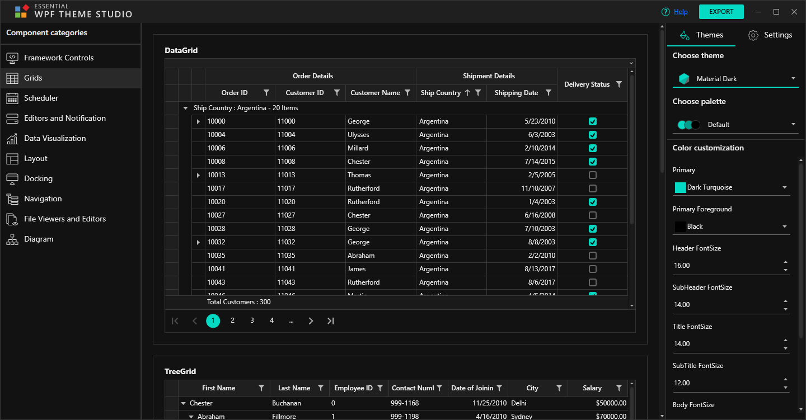
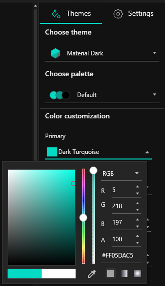
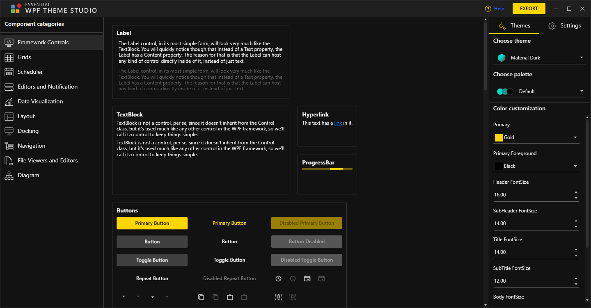
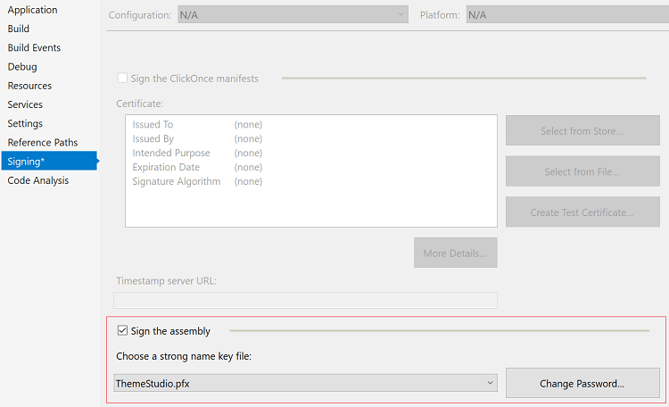
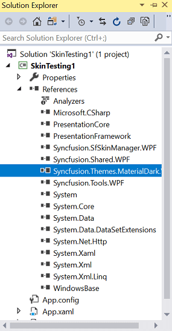

# WPF Theme Studio Overview

The WPF Theme Studio helps users transform their visual presentation into a new theme in minutes. End users can select an appropriate base theme, change its primary color, preview and export it as a theme project, and utilize it in their applications for a rich user interface experience.

## Supported themes

The WPF Theme Studio comes with the following set of themes,

* Material Light
* Material Dark
* Material Light Blue
* Material Dark Blue

## Creating custom theme

### Customizing theme color from theme studio

In theme studio utility, each theme has a unique common variable list. When user changes the common variable color code value, it will be reflected in all the Syncfusion WPF controls. All Syncfusion WPF control styles are derived from these theme-based common variables. This common variable list is handled inside the theme studio application for customizing theme-based colors. 

Let us now see the step-by-step procedure to launch and work with the theme studio utility below.

**Step 1:**

On installing the `Syncfusion WPF` suite, launch and select `Theme Studio` from the start-up panel.

**Step 2:**

The theme studio application has been divided into two sections: the controls preview section on the right, and the theme customization section on the left.

**Step 3:**

To apply predefined themes, we need to select the appropriate themes from Themes List Dropdown available in the top left corner. 

**Step 4:**

Use the built-in **color picker** in the theme customization section to select the desired solid or gradient color.

**Step 5:**

The Syncfusion WPF controls will be rendered with the newly selected colors in the preview section, after selecting the desired color. 

N> The WPF Theme Studio groups both Syncfusion and framework controls under different tabs for a quick preview of the UI on color change.

### Exporting theme project
 
Let us see the step-by-step procedure for exporting theme project from theme studio.

**Step 1:**

Click the `Export` button in the top right corner below the exit of the theme studio application. 

**Step 2:**

Now the export dialog appears with the option to select either the entire controls or just the desired control(s). This option is useful only for selective list of Syncfusion WPF controls in the application. The theme studio will filter only the selected controls and customize the final output for those controls alone. 

**Step 3:**

Select the required folder for Theme Export to be selected. When exporting, the download theme will come as a theme project that contains color codes for the selected Syncfusion WPF controls.

### Ensuring version and generating theme assembly

Let us see the step by step procedure for ensuring version and generating theme assembly for exported theme project.

**Step 1:**

The following exported theme project should be attached for corresponding target frameworks used in the WPF application.

<table>
<tr>
<th>
Target Framework</th><th>
Solution Project</th></tr>
<tr>
<td>
.Net Framework 4.6</td><td>
Syncfusion.Themes.MaterialDark.WPF_2015.csproj</td></tr>
<tr>
<td>
.Net Framework 4.5.1</td><td>
Syncfusion.Themes.MaterialDark.WPF_2013.csproj</td></tr>
<tr>
<td>
.Net Framework 4.5 </td><td>
Syncfusion.Themes.MaterialDark.WPF_2012.csproj</td></tr>
<tr>
<td>
.Net Framework 4.0</td><td>
Syncfusion.Themes.MaterialDark.WPF_2010.csproj</td></tr>
<tr>
<td>
.Net Core 3</td><td>
Syncfusion.Themes.MaterialDark.WPF_NETCore.csproj</td><tr>
</table>

**Step 2:**

Ensure the version of the exported theme project with the Syncfusion assembly(.dll) version by checking the version in the AssemblyInfo.cs file. For example, exported theme project `Syncfusion.Themes.MaterialDark.WPF_2013.csproj` is attached to the existing application with the target framework `.NET Framework 4.5.1` and version is modified in the AssemblyInfo.cs similar to the Syncfusion assembly version used in the application.

Ensure that `sf.snk` path is commented out which is located below the assembly version in AssemblyInfo.cs, since the end user's private key (.snk) should be used to generate theme assembly from exported project.

**Step 3:**

To generate theme assembly, use the private key pair if it is already created by referring it to the exported theme project in signing tab inside the application properties or [Create a new key pair](https://docs.microsoft.com/en-us/dotnet/standard/assembly/create-public-private-key-pair) through Visual Studio if the private key pair is not created. 

Click the `Sign the assembly` checkbox to use the private key pair for generating theme assembly. Ensure that exported theme project should be rebuild through `Release` mode for generating theme assembly.

### Integrating custom theme to application

The [SfSkinManager](https://help.syncfusion.com/cr/cref_files/wpf/Syncfusion.SfSkinManager.WPF~Syncfusion.SfSkinManager.SfSkinManager.html) control helps to apply the built-in themes to the Syncfusion UI controls for WPF.

Let us see the step by step procedure for adding exported theme project as assembly(.dll) and witness the custom theme set for Docking Manager.  

**Step 1:**

Now add the exported theme project as an assembly (.dll) from the `Release` folder of the export theme project into the WPF application.

**Step 2:**

Add reference of **Syncfusion.SfSkinManager.Wpf.dll** to the WPF application and import **SfSkinManager** namespace in Main window.




    <Window
    xmlns="http://schemas.microsoft.com/winfx/2006/xaml/presentation"
    xmlns:x="http://schemas.microsoft.com/winfx/2006/xaml"
    xmlns:syncfusionskin="clr-namespace:Syncfusion.SfSkinManager;assembly=Syncfusion.SfSkinManager.WPF"
    xmlns:syncfusion="http://schemas.syncfusion.com/wpf"/>




**Step 3:**

The appearance of any Syncfusion UI controls for WPF can be customized by using [VisualStyle](https://help.syncfusion.com/cr/cref_files/wpf/Syncfusion.SfSkinManager.WPF~Syncfusion.SfSkinManager.VisualStyles.html) attached property of the [SfSkinManager](https://help.syncfusion.com/cr/cref_files/wpf/Syncfusion.SfSkinManager.WPF~Syncfusion.SfSkinManager.SfSkinManager.html). 

Now, set the `SfSkinManager` attached property `VisualStyle` as `MaterialDark` for the Docking Manager control since we have generated MaterialDark (`Syncfusion.Themes.MaterialDark.WPF`) assembly from exported theme project for demonstration purpose.




    <syncfusion:DockingManager x:Name="SyncDockingManager" UseDocumentContainer="True"
    PersistState="True" syncfusionskin:SfSkinManager.VisualStyle="MaterialDark">
                           
    <ContentControl x:Name="SolutionExplorer" syncfusion:DockingManager.Header="Solution Explorer"
    syncfusion:DockingManager.SideInDockedMode="Right"/>

    <ContentControl x:Name="ToolBox" syncfusion:DockingManager.Header="Toolbox"
    syncfusion:DockingManager.State="AutoHidden" />
    
    <ContentControl x:Name="Output" syncfusion:DockingManager.Header="Output"
    syncfusion:DockingManager.SideInDockedMode="Tabbed"
	syncfusion:DockingManager.TargetNameInDockedMode="SolutionExplorer"/>

    <ContentControl x:Name="StartPage" syncfusion:DockingManager.Header="Start Page"
     syncfusion:DockingManager.State="Document" >
       <TextBlock Text="Any built-in themes can applied to the required control by VisualStyle attached property of the SfSkinManager." />                           
    </ContentControl>
    </syncfusion:DockingManager>




**Step 4:**

Compile and run the WPF application and witness the custom theme being applied to Docking Manager control at run-time. 

