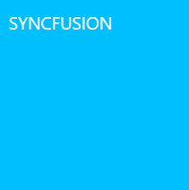

# WPF Pulsing Tile control

The Pulsing Tile control (extended from [HubTileBase](https://help.syncfusion.com/cr/cref_files/wpf/Syncfusion.SfHubTile.Wpf~Syncfusion.Windows.Controls.Notification.HubTileBase.html) class) allows to create a tile similar to music and video tiles in Windows Phone. The content zooms in/out randomly with random movement along the X-axis and Y-axis. This section explains about the supporting features of Pulsing Tile control.

## Setting header content

Header can act as the name of the tile, that is placed at the bottom explaining its purpose. The content of the header can be an image, a text or a control, etc. The header can be set to the tile by using the [Header](https://help.syncfusion.com/cr/wpf/Syncfusion.SfShared.Wpf~Syncfusion.Windows.Primitives.HeaderedContentControl~Header.html) property.




<Grid x:Name=grid>
<!--For setting header as text use this code.-->
<syncfusion:SfPulsingTile x:Name="pulsingTile" Foreground="White" Header="Music"/>

<!--For setting header as an image use this code.-->
<syncfusion:SfPulsingTile x:Name="pulsingTile" >
    <syncfusion:SfPulsingTile.Header>
        <Image Source="/Assets/syncfusion.png" Stretch="None" />
    </syncfusion:SfPulsingTile.Header>
</syncfusion:SfPulsingTile>

<!--For setting header as control use this code.-->
<syncfusion:SfPulsingTile x:Name="pulsingTile" >
    <syncfusion:SfPulsingTile.Header>
        <TextBlock Text="SYNCFUSION" Foreground="White" FontSize="13" />
    </syncfusion:SfPulsingTile.Header>
</syncfusion:SfPulsingTile>
</Grid>




    //For setting header on as text use this code.
    SfPulsingTile pulsingTile = new SfPulsingTile();
    pulsingTile.Header = "Music";
    pulsingTile.Foreground = Brushes.White;

    //For setting header as image use this code.
    SfPulsingTile pulsingTile = new SfPulsingTile();
    Image image = new Image(){Source = new BitmapImage(new Uri(@"/Assets/syncfusion.png",UriKind.RelativeOrAbsolute))};
    pulsingTile.Header = image;

    //For setting header as control use this code.
    SfPulsingTile pulsingTile = new SfPulsingTile();
    TextBlock textblock = new TextBlock(){Text = "SYNCFUSION", Foreground = Brushes.White, FontSize = 13} ;
    pulsingTile.Header = textblock;
    grid.Children.Add(pulsingTile);
    



## Setting title content

Title can be used to display updates and notifications in a tile. The content can be an image, a text or a control, etc. The title can be set to the tile by using the [Title](https://help.syncfusion.com/cr/wpf/Syncfusion.SfHubTile.Wpf~Syncfusion.Windows.Controls.Notification.HubTileBase~Title.html) property.




<Grid x:Name="grid">
<!--For setting title as text use this code.-->
<syncfusion:SfPulsingTile x:Name="pulsingTile" Title="Now Playing - Song Name" Foreground="White"/>

<!--For setting title as an image use this code.-->
<syncfusion:SfPulsingTile x:Name="pulsingTile">
    <syncfusion:SfPulsingTile.Title>
        <Image Source="/Assets/syncfusion.png" Stretch="None" HorizontalAlignment="Left"/>
    </syncfusion:SfPulsingTile.Title>
</syncfusion:SfPulsingTile>

 <!--For setting title as a control use this code.--> 
<syncfusion:SfPulsingTile x:Name="pulsingTile">
    <syncfusion:SfPulsingTile.Title>
        <TextBlock Text="SYNCFUSION" Foreground="White" />
    </syncfusion:SfPulsingTile.Title>
</syncfusion:SfPulsingTile>
</Grid>




    //Setting title for Pulsing Tile.
    SfPulsingTile pulsingTile = new SfPulsingTile();
    pulsingTile.Title = "Now Playing - Song Name";
    pulsingTile.Foreground = Brushes.White;

    //For setting title as image use this code.
    SfPulsingTile pulsingTile = new SfPulsingTile();
    Image image = new Image(){Source = new BitmapImage(new Uri(@"/Assets/syncfusion.png",UriKind.RelativeOrAbsolute)),Stretch=Stretch.None,HorizontalAlignment=HorizontalAlignment.Left};
    pulsingTile.Title = image; 

    // For setting title as control use this code.
    SfPulsingTile pulsingTile = new SfPulsingTile();
    Textblock textblock = new TextBlock(){Text = "SYNCFUSION", Foreground = Brushes.White, FontSize = 13} ; 
    pulsingTile.Title = textblock;
    grid.Children.Add(pulsingTile);




## Setting image

The image acts as a pictorial representation of the purpose of tile control. The image can be set to the tile by setting image path to the [ImageSource](https://help.syncfusion.com/cr/wpf/Syncfusion.SfHubTile.Wpf~Syncfusion.Windows.Controls.Notification.HubTileBase~ImageSource.html) property.




<Grid x:Name="grid">
<!--SfPulsingTile-->
<syncfusion:SfPulsingTile x:Name="pulsingtile" ImageSource="/Assets/PulsingTile.jpg"/>
</Grid>




    //Setting image for Pulsing Tile
    SfPulsingTile pulsingTile = new SfPulsingTile();
    pulsingTile.ImageSource = new BitmapImage(new Uri(@"/Assets/PulsingTile.jpg",UriKind.RelativeOrAbsolute));
    grid.Children.Add(pulsingTile);
        



## Animations

### Scaling animation

Scaling animation causes the content of the tile to zoom in/out and it is achieved by setting the [PulseScale](https://help.syncfusion.com/cr/wpf/Syncfusion.SfHubTile.Wpf~Syncfusion.Windows.Controls.Notification.SfPulsingTile~PulseScale.html) property. The property specifies the translation range in the x-axis and y-axis while scaling the content.




<!-- SfPulsingTile-->
<Grid x:Name="grid">
<syncfusion:SfPulsingTile x:Name="pulsingTile" Width="200" Height="200" PulseScale="2" Header="Music"  Title="This is title area." Foreground="White">
    <Image Source="/Assets/PulsingTile.jpg" Stretch="None" VerticalAlignment="Center" HorizontalAlignment="Center"  />
</syncfusion:SfPulsingTile>
</Grid>



    
    SfPulsingTile pulsingTile = new SfPulsingTile();  
    pulsingTile.Header = "Music";
    pulsingTile.Title = "This is title area.";
    Image image = new Image(){Source = new BitmapImage(new Uri(@"/Assets/PulsingTile.jpg",UriKind.RelativeOrAbsolute))};
    pulsingTile.Content = image; 

    // Setting pulse scale
    pulsingTile.PulseScale = 2;
    grid.Children.Add(pulsingTile);




The time required to complete a single scaling animation is achieved by setting the [PulseDuration](https://help.syncfusion.com/cr/wpf/Syncfusion.SfHubTile.Wpf~Syncfusion.Windows.Controls.Notification.SfPulsingTile~PulseDuration.html) property.  




<Grid x:Name="grid">
<!-- SfPulsingTile -->
<syncfusion:SfPulsingTile x:Name="pulsingTile"  PulseDuration="00:00:03" Header="Music"  Title="This is title area." Foreground="White" >
    <Image Source="/Assets/PulsingTile.jpg" Stretch="None" VerticalAlignment="Center" HorizontalAlignment="Center" />
</syncfusion:SfPulsingTile>
</Grid>




    SfPulsingTile pulsingTile = new SfPulsingTile();
    pulsingTile.Header = "Music";
    pulsingTile.Title = "This is title area.";
    Image image = new Image(){Source = new BitmapImage(new Uri(@"/Assets/PulsingTile.jpg",UriKind.RelativeOrAbsolute))};
    pulsingTile.Content = image; 

    //Setting pulse duration
    pulsingTile.PulseDuration = TimeSpan.FromSeconds(3.0);
    grid.Children.Add(pulsingTile);




Before applying pulse scale to the Pulsing Tile:

After applying pulse scale to the Pulsing Tile :

### Press animation

The tile press animation takes place when the center of the tile is pressed. The tile press animation causes the entire tile to be zoomed in/out at specified interval. The tile press animation can be set by using properties such as [ScaleDepth](https://help.syncfusion.com/cr/wpf/Syncfusion.SfHubTile.Wpf~Syncfusion.Windows.Controls.Notification.HubTileBase~ScaleDepth.html) and [TilePressDuration](https://help.syncfusion.com/cr/wpf/Syncfusion.SfHubTile.Wpf~Syncfusion.Windows.Controls.Notification.HubTileBase~TilePressDuration.html). The [ScaleDepth](https://help.syncfusion.com/cr/wpf/Syncfusion.SfHubTile.Wpf~Syncfusion.Windows.Controls.Notification.HubTileBase~ScaleDepth.htm) is used to customize the depth of scaling effect while pressing the center of the tile. The [TilePressDuration](https://help.syncfusion.com/cr/wpf/Syncfusion.SfHubTile.Wpf~Syncfusion.Windows.Controls.Notification.HubTileBase~TilePressDuration.html) is used to determine the time taken for the single tile press animation.



<Grid x:Name="grid">
<syncfusion:SfPulsingTile Header="Music" Title="This is title area." Foreground="White" PulseScale="3" PulseDuration="00:00:03" TilePressDuration="00:00:03" ScaleDepth="2">
    <Image Source="/Assets/PulsingTile.jpg" Stretch="None"/>
</syncfusion:SfPulsingTile>
</Grid>



    SfPulsingTile pulsingTile = new SfPulsingTile();
    pulsingTile.Header = "Music";
    pulsingTile.Title = "This is title area.";
    pulsingTile.PulseScale = 3;
    pulsingTile.PulseDuration = TimeSpan.FromSeconds(3.0);

    //setting tile press duration and scale depth
    pulsingTile.TilePressDuration = TimeSpan.FromSeconds(3.0);
    pulsingTile.ScaleDepth = 2;      
    grid.Children.Add(pulsingTile);




N> The tile press animation occurs only if the [OverrideDefaultStates](https://help.syncfusion.com/cr/wpf/Syncfusion.SfHubTile.Wpf~Syncfusion.Windows.Controls.Notification.HubTileBase~OverrideDefaultStates.html) property is said to be **false**.

## Translations

### Horizontal translation

Horizontal translation allows the content of the tile to move from left to right along x-axis. The Pulsing Tile provides support for horizontal translation by using [RadiusX](https://help.syncfusion.com/cr/wpf/Syncfusion.SfHubTile.Wpf~Syncfusion.Windows.Controls.Notification.SfPulsingTile~RadiusX.html) property. The property specifies the translation range of the content along the x-axis.



<Grid x:Name="grid">
<!-- SfPulsingTile -->
<syncfusion:SfPulsingTile x:Name="pulsingTile" RadiusX="100" Header="Music" Title="This is title area." Foreground="White">
	<Image Source="/Assets/PulsingTile.jpg" VerticalAlignment="Center" HorizontalAlignment="Center" />
</syncfusion:SfPulsingTile>
</Grid>


    
    SfPulsingTile pulsingTile = new SfPulsingTile();
    pulsingTile.Header = "Music";
    pulsingTile.Title = "This is title area.";
    Image image = new Image(){Source = new BitmapImage(new Uri(@"/Assets/PulsingTile.jpg",UriKind.RelativeOrAbsolute))};
    pulsingTile.Content = image; 

    //Setting radiusX
    pulsingTile.RadiusX = 100;
    grid.Children.Add(pulsingTile);




### Vertical translation
 
Vertical translation allows the content of the tile to move up and down along the y-axis. The Pulsing Tile provides support for vertical translation by using [RadiusY](https://help.syncfusion.com/cr/wpf/Syncfusion.SfHubTile.Wpf~Syncfusion.Windows.Controls.Notification.SfPulsingTile~RadiusY.html) property. The property specifies the translation range of the content along the y-axis.




<Grid x:Name="grid">
<!-- SfPulsingTile  -->
<syncfusion:SfPulsingTile x:Name="pulsingTile"  RadiusY="100" Header="Music" Title="This is title area." Foreground="White">
	<Image Source="/Assets/PulsingTile.jpg" VerticalAlignment="Center" HorizontalAlignment="Center" />
</syncfusion:SfPulsingTile>
</Grid>




    SfPulsingTile pulsingTile = new SfPulsingTile();
    pulsingTile.Header = "Music";
    pulsingTile.Title = "This is title area.";
    Image image = new Image(){Source = new BitmapImage(new Uri(@"/Assets/PulsingTile.jpg",UriKind.RelativeOrAbsolute))};
    pulsingTile.Content = image; 

    //Setting radiusY
    pulsingTile.RadiusY = 100;
    grid.Children.Add(pulsingTile); 




### Duration of horizontal and vertical translation

The time taken for translating the content along the x-axis and y-axis is achieved by setting the [TranslateDuration](https://help.syncfusion.com/cr/wpf/Syncfusion.SfHubTile.Wpf~Syncfusion.Windows.Controls.Notification.SfPulsingTile~TranslateDuration.html) property.




<Grid x:Name="grid">
<syncfusion:SfPulsingTile x:Name="pulsingTile" RadiusX=100 Title="This is title area." Foreground="White"  RadiusY=100 TranslateDuration="00:00:03" Header="Music">
    <Image Source="/Assets/PulsingTile.jpg" Stretch="UniformToFill" HorizontalAlignment="Center" VerticalAlignment="Center"/>
</syncfusion:SfPulsingTile> 
</Grid>



	
    SfPulsingTile pulsingTile = new SfPulsingTile();
    pulsingTile.Header = "Music";
    pulsingTile.Title = "This is title area.";
    pulsingTile.Foreground = Brushes.White;
    Image image = new Image(){Source = new BitmapImage(new Uri(@"/Assets/PulsingTile.jpg",UriKind.RelativeOrAbsolute))};
    pulsingTile.Content = image; 

    //Setting translate duration
    pulsingTile.TranslateDuration = TimeSpan.FromSeconds(3.0);
    grid.Children.Add(pulsingTile); 




## Grouping

Several tiles can be grouped using the [GroupName](https://help.syncfusion.com/cr/wpf/Syncfusion.SfHubTile.Wpf~Syncfusion.Windows.Controls.Notification.HubTileBase~GroupName.html) property of pulsing tile control. The group name will be used when the entire group of tiles needs to be freeze/unfreeze.




<Grid x:Name="grid">
<WrapPanel Orientation="Horizontal">
<!-- SfPulsingTile 1-->
<syncfusion:SfPulsingTile x:Name="pulsingTileOne" Title="This is title area." Foreground="White" GroupName="Applications" Header="Music" PulseScale="3" PulseDuration="00:00:03" >   
    <Image Source="/Assets/PulsingTile.jpg" HorizontalAlignment="Center" VerticalAlignment="Center"/> 
</syncfusion:SfPulsingTile>

<!-- SfPulsingTile 2-->
<syncfusion:SfPulsingTile x:Name="pulsingTileTwo" Title="This is title area." Foreground="White" GroupName="Applications" Margin="10" PulseScale="3" PulseDuration="00:00:03" Header="Music">
    <Image Source="/Assets/PulsingTile.jpg"  HorizontalAlignment="Center" VerticalAlignment="Center"/> 
</syncfusion:SfPulsingTile>

<!-- SfPulsingTile 3-->
<syncfusion:SfPulsingTile x:Name="pulsingTileThree" Title="This is title area." Foreground="White" GroupName="Applications"  PulseScale="3" PulseDuration="00:00:03" Header="Music">
    <Image Source="/Assets/PulsingTile.jpg"  HorizontalAlignment="Center" VerticalAlignment="Center"/> 
</syncfusion:SfPulsingTile>
</WrapPanel>
</Grid>



     
    WrapPanel wrapPanel = new WrapPanel();
    wrapPanel.Orientation = Orientation.Horizontal;
    grid.Children.Add(wrapPanel);

    //SfPulsingTile 1
    SfPulsingTile pulsingTileOne = new SfPulsingTile();
    pulsingTileOne.Header = "Music";
    pulsingTileOne.Title = "This is title area.";
    pulsingTileOne.Foreground = Brushes.White;
    Image image = new Image(){Source = new BitmapImage(new Uri(@"/Assets/PulsingTile.jpg",UriKind.RelativeOrAbsolute))};
    pulsingTileOne.Content = image;
    pulsingTileOne.PulseScale = 3;
    pulsingTileOne.PulseDuration = TimeSpan.FromSeconds(3.0);

    //SfPulsingTile 2
    SfPulsingTile pulsingTileTwo = new SfPulsingTile();
    pulsingTileTwo.Header = "Music";
    pulsingTileTwo.Title = "This is title area.";
    pulsingTileTwo.Foreground = Brushes.White;
    Image image = new Image(){Source = new BitmapImage(new Uri(@"/Assets/PulsingTile.jpg",UriKind.RelativeOrAbsolute))};
    pulsingTileTwo.Content = image;
    pulsingTileTwo.PulseScale = 3;
    pulsingTileTwo.PulseDuration = TimeSpan.FromSeconds(3.0);
    Thickness margin = pulsingTileTwo.Margin;
    margin.Left = 10;
    pulsingTileTwo.Margin = margin;

    //SfPulsingTile 3
    SfPulsingTile pulsingTileThree = new SfPulsingTile();
    pulsingTileThree.Header = "Music";
    pulsingTileThree.Title = "This is title area.";
    pulsingTileThree.Foreground = Brushes.White;
    Image image = new Image(){Source = new BitmapImage(new Uri(@"/Assets/PulsingTile.jpg",UriKind.RelativeOrAbsolute))};
    pulsingTileThree.Content = image;
    pulsingTileThree.PulseScale = 3;
    pulsingTileThree.PulseDuration = TimeSpan.FromSeconds(3.0);

    //Setting group name
    pulsingTileOne.GroupName = "Applications";
    pulsingTileTwo.GroupName = "Applications";
    pulsingTileThree.GroupName = "Applications";
    wrapPanel.Children.Add(pulsingTileOne);
    wrapPanel.Children.Add(pulsingTileTwo);
    wrapPanel.Children.Add(pulsingTileThree);
        



## Freezing/Unfreezing

Freezing provides support to stop animating the tile contents. Unfreezing provides support to keep the tile content animated. By the following two ways freezing/unfreezing can be set to the Pulsing Tile:                                                            
### Freezing/unfreezing via property

The tile can be frozen by setting [IsFrozen](https://help.syncfusion.com/cr/wpf/Syncfusion.SfHubTile.Wpf~Syncfusion.Windows.Controls.Notification.HubTileBase~IsFrozen.html) property to be **true**.




<Grid x:Name="grid">
<!-- SfPulsingTile -->
<syncfusion:SfPulsingTile x:Name="pulsingTile" Header="Music" IsFrozen="True" Foreground="White" Title="This is title area." PulseScale="3" PulseDuration="00:00:03" >
    <Image Source="/Assets/PulsingTile.jpg"
	HorizontalAlignment="Center" VerticalAlignment="Center"/> 
</syncfusion:SfPulsingTile>
</Grid>




    SfPulsingTile pulsingTile = new SfPulsingTile();
    pulsingTile.Header = "Music";
    pulsingTile.Title = "This is title area.";
    Image image = new Image(){Source = new BitmapImage(new Uri(@"/Assets/PulsingTile.jpg",UriKind.RelativeOrAbsolute))};
    pulsingTile.Content = image;   
    pulsingTile.PulseScale = 3;

    //Setting freeze property
    pulsingTile.IsFrozen = true;
    grid.Children.Add(pulsingTile);



 

The tile can be unfrozen by setting [IsFrozen](https://help.syncfusion.com/cr/wpf/Syncfusion.SfHubTile.Wpf~Syncfusion.Windows.Controls.Notification.HubTileBase~IsFrozen.html) property to **false**.




<Grid x:Name="grid">
<!-- SfPulsingTile -->
<syncfusion:SfPulsingTile x:Name="pulsingTile" Header="Music" Foreground="white" IsFrozen="False" Title="This is title area."  PulseScale="3" PulseDuration="00:00:03"  >
    <Image Source="/Assets/PulsingTile.jpg" HorizontalAlignment="Center" VerticalAlignment="Center"/> 
</syncfusion:SfPulsingTile>
</Grid>




    SfPulsingTile pulsingTile = new SfPulsingTile();
    pulsingTile.Header = "Music";
    pulsingTile.Title = "This is title area.";
    Image image = new Image(){Source = new BitmapImage(new Uri(@"/Assets/PulsingTile.jpg",UriKind.RelativeOrAbsolute))};
    pulsingTile.Content = image; 
    pulsingTile.PulseScale = 3;

    //Setting unfreeze property
    pulsingTile.IsFrozen = false;
    grid.Children.Add(pulsingTile);




### Freezing/unfreezing via methods

The [HubTileService](https://help.syncfusion.com/cr/wpf/Syncfusion.SfHubTile.Wpf~Syncfusion.Windows.Controls.Notification.HubTileService.html) class provides helper methods such as [Freeze](https://help.syncfusion.com/cr/wpf/Syncfusion.SfHubTile.Wpf~Syncfusion.Windows.Controls.Notification.HubTileService~Freeze.html) and [UnFreeze](https://help.syncfusion.com/cr/wpf/Syncfusion.SfHubTile.Wpf~Syncfusion.Windows.Controls.Notification.HubTileService~UnFreeze.html) to freeze and unfreeze the animation by passing a Pulsing Tile instance or [GroupName](https://help.syncfusion.com/cr/wpf/Syncfusion.SfHubTile.Wpf~Syncfusion.Windows.Controls.Notification.HubTileBase~GroupName.html) as an argument. 
* Add required **System.Windows.Interactivity** assembly reference in application. 
* Import schema for interactivity **http://schemas.microsoft.com/expression/2010/interactivity** in XAML or **using System.Windows.Interactivity** namespace in C#.

N> The [HubTileService](https://help.syncfusion.com/cr/wpf/Syncfusion.SfHubTile.Wpf~Syncfusion.Windows.Controls.Notification.HubTileService.html) class allows to set the freeze/unfreeze state of the tile after the tiles are loaded.

A single tile or a group of tiles can be frozen by using [Freeze](https://help.syncfusion.com/cr/wpf/Syncfusion.SfHubTile.Wpf~Syncfusion.Windows.Controls.Notification.HubTileService~Freeze.html) method.




<Window x:Class="PulsingTile_Grouping.MainWindow"
        xmlns="http://schemas.microsoft.com/winfx/2006/xaml/presentation"
        xmlns:x="http://schemas.microsoft.com/winfx/2006/xaml"
        xmlns:d="http://schemas.microsoft.com/expression/blend/2008"
        xmlns:mc="http://schemas.openxmlformats.org/markup-compatibility/2006"
        xmlns:local="clr-namespace:PulsingTile_Grouping"
        xmlns:syncfusion="http://schemas.syncfusion.com/wpf"
        xmlns:shared="clr-namespace:Syncfusion.Windows.Controls;assembly=Syncfusion.SfShared.Wpf"
        xmlns:i="http://schemas.microsoft.com/expression/2010/interactivity"
        mc:Ignorable="d"
        Title="MainWindow" Height="450" Width="800">
<Grid>
<WrapPanel>
<!--SfPulsingTile 1-->
<syncfusion:SfPulsingTile x:Name="pulsingTileOne" Foregroudn="White" GroupName="Applications" Header="Music" PulseScale="3" Title="This is title area." PulseDuration="00:00:03" >
    <Image Source="/Assets/PulsingTile.jpg" HorizontalAlignment="Center" VerticalAlignment="Center"/> 
</syncfusion:SfPulsingTile>

<!-- SfPulsingTile 2-->
<syncfusion:SfPulsingTile x:Name="pulsingTileTwo" Foreground="White" GroupName="Applications" Margin="10" PulseScale="3" Title="This is title area." PulseDuration="00:00:03" Header="Music">
    <Image Source="/Assets/PulsingTile.jpg" HorizontalAlignment="Center" VerticalAlignment="Center"/> 
</syncfusion:SfPulsingTile>

<!-- SfPulsingTile 3-->
<syncfusion:SfPulsingTile x:Name="pulsingTileThree" Foreground=White" GroupName="Applications"  PulseScale="3" PulseDuration="00:00:03" Title="This is title area." Header="Music">
    <Image Source="/Assets/PulsingTile.jpg" HorizontalAlignment="Center" VerticalAlignment="Center"/>
    <i:Interaction.Triggers>
	    <i:EventTrigger EventName="Loaded">
	        <local:FreezeTiles/>
        </i:EventTriggers>
	</i:Interaction.Trigger> 
</syncfusion:SfPulsingTile>
</WrapPanel>
</Grid>
</Window>




    using Syncfusion.Windows.Controls.Notification;
    using Syncfusion.Windows.Shared;
    using System.Windows.Interactivity;
    namespace PulsingTile_Grouping
    {
       public class FreezeTiles : TargetedTriggerAction<SfPulsingTile>
       {
          protected override void Invoke(object parameter)
          {
            var pulsingTile = this.AssociatedObject as SfPulsingTile;
            MainWindow window = VisualUtils.FindAncestor(pulsingTile, typeof(MainWindow)) as MainWindow;
            if (window != null && pulsingTile != null)
            { 
               //For a single tile use this code.
               HubTileService.Freeze(window.pulsingTileOne);   
               //For Group of Tiles use this code.
               HubTileService.Freeze("Applications");
            }
          }
       }
    }



Single tile:

Group of tiles:

A single tile or a group of tiles can be unfrozen by using [UnFreeze](https://help.syncfusion.com/cr/wpf/Syncfusion.SfHubTile.Wpf~Syncfusion.Windows.Controls.Notification.HubTileService~UnFreeze.html) method.




<Window x:Class="PulsingTile_Grouping.MainWindow"
        xmlns="http://schemas.microsoft.com/winfx/2006/xaml/presentation"
        xmlns:x="http://schemas.microsoft.com/winfx/2006/xaml"
        xmlns:d="http://schemas.microsoft.com/expression/blend/2008"
        xmlns:mc="http://schemas.openxmlformats.org/markup-compatibility/2006"
        xmlns:local="clr-namespace:PulsingTile_Grouping"
        xmlns:syncfusion="http://schemas.syncfusion.com/wpf"
        xmlns:shared="clr-namespace:Syncfusion.Windows.Controls;assembly=Syncfusion.SfShared.Wpf"
        xmlns:i="http://schemas.microsoft.com/expression/2010/interactivity"
        mc:Ignorable="d"
        Title="MainWindow" Height="450" Width="800">
<Grid>
<WrapPanel>
  <!--SfPulsingTile1-->      
<syncfusion:SfPulsingTile x:Name="pulsingTileOne" GroupName="Applications" Header="Music" Foreground="White" PulseScale="3" Title="This is title area." PulseDuration="00:00:03" >
    <Image Source="/Assets/PulsingTile.jpg" HorizontalAlignment="Center" VerticalAlignment="Center"/> 
</syncfusion:SfPulsingTile>

<!-- SfPulsingTile 2-->
<syncfusion:SfPulsingTile x:Name="pulsingTileTwo" GroupName="Applications" Margin="10" Foreground="White" PulseScale="3" Title="This is title area." PulseDuration="00:00:03" Header="Music">
    <Image Source="/Assets/PulsingTile.jpg" HorizontalAlignment="Center" VerticalAlignment="Center"/> 
</syncfusion:SfPulsingTile>

<!-- SfPulsingTile 3-->
<syncfusion:SfPulsingTile x:Name="pulsingTileThree" GroupName="Applications" Foreground="White" PulseScale="3" PulseDuration="00:00:03" Title="This is title area." Header="Music">
    <Image Source="/Assets/PulsingTile.jpg" HorizontalAlignment="Center" VerticalAlignment="Center"/> 
    <i:Interaction.Triggers>
	    <i:EventTrigger EventName="Loaded">
	        <local:UnfreezeTiles/>
        </i:EventTrigger>
    </i:Interaction.Triggers>
</syncfusion:SfPulsingTile>
</WrapPanel>
</Grid>
</Window>




    using Syncfusion.Windows.Controls.Notification;
    using Syncfusion.Windows.Shared;
    using System.Windows.Interactivity;

    namespace PulsingTile_Grouping
    {
       public class UnfreezeTiles : TargetedTriggerAction<SfPulsingTile>
       {
         protected override void Invoke(object parameter)
         {
            var pulsingTile = this.AssociatedObject as SfPulsingTile;
            MainWindow window = VisualUtils.FindAncestor(pulsingTile, typeof(MainWindow)) as MainWindow;
            if (window != null && pulsingTile != null)
            { 
               //For a single tile use this code.
               HubTileService.UnFreeze(window.pulsingTileOne); 
               //For group of tiles use this code.
               HubTileService.UnFreeze("Applications");
            }
         }
       }
    }



Single tile
{:.caption}

Group of tiles
{:.caption}

## Notifications
Once the tile is pressed, it is notified by the click event and the command property of the Pulsing Tile. 

### Event

The [Click](https://help.syncfusion.com/cr/wpf/Syncfusion.SfHubTile.Wpf~Syncfusion.Windows.Controls.Notification.HubTileBase~Click_EV.html) event rises whenever the tile is pressed.


 
<syncfusion:SfPulsingTile Header="Music" Foreground="White" Title="This is title area." PulseScale="3" PulseDuration="00:00:03" >
    <Image Source="/Assets/PulsingTile.jpg"/>
    <i:Interaction.Triggers>
        <i:EventTrigger EventName="Click">
            <local:ClickEvent />
        </i:EventTrigger>
    </i:Interaction.Triggers>
</syncfusion:SfPulsingTile>


      
    public class ClickEvent : TargetedTriggerAction<SfPulsingTile>
    {
       protected override void Invoke(object parameter)
       {
         var pulsingTile = this.AssociatedObject as SfPulsingTile;
         MainWindow window = VisualUtils.FindAncestor(pulsingTile, typeof(MainWindow)) as MainWindow;
         if ((window != null) && (pulsingTile != null))
         {
            MessageBox.Show("Pulsing Tile has been Clicked");
         }
       }
    }


 

### Command binding

Command specifies the operation to be performed when the tile is pressed. [Command](https://help.syncfusion.com/cr/wpf/Syncfusion.SfHubTile.Wpf~Syncfusion.Windows.Controls.Notification.HubTileBase~Command.html) and [CommandParameter](https://help.syncfusion.com/cr/wpf/Syncfusion.SfHubTile.Wpf~Syncfusion.Windows.Controls.Notification.HubTileBase~CommandParameter.html) are used instead of click event in MVVM pattern.


 

<Window x:Class="Pulsingtile.MainWindow"
        xmlns="http://schemas.microsoft.com/winfx/2006/xaml/presentation"
        xmlns:x="http://schemas.microsoft.com/winfx/2006/xaml"
        xmlns:d="http://schemas.microsoft.com/expression/blend/2008"
        xmlns:mc="http://schemas.openxmlformats.org/markup-compatibility/2006"
        xmlns:local="clr-namespace:Pulsingtile"
        xmlns:syncfusion="http://schemas.syncfusion.com/wpf"       
        xmlns:shared="clr-namespace:Syncfusion.Windows.Controls;assembly=Syncfusion.SfShared.Wpf"
        mc:Ignorable="d"
        Title="MainWindow" Height="450" Width="800">
<Window.DataContext>
    <local:Viewmodel/>
</Window.DataContext>
<Grid x:Name="grid">
<syncfusion:SfPulsingTile Header="Music" Title="This is title area." PulseScale="3" PulseDuration="00:00:03" Command="{Binding PulsingTileCommand}" CommandParameter="{Binding ElementName=pulsingtile}">
    <Image Source="/Assets/PulsingTile.jpg" Stretch="None"/>
</syncfusion:SfPulsingTile>
</Grid>
</Window>



           
	public class Viewmodel
    {
       private ICommand  pulsingTileCommand;
       public ICommand PulsingTileCommand
       {
        get
        { 
          return pulsingTileCommand ?? (pulsingTileCommand = new Command(true, ()=>MyAction("PulsingTileCommand")));
        }
       }
       private void MyAction(string parameter)
       {
        if (parameter.Equals("PulsingTileCommand"))
        {
           string message = string.Format("Pulsing Tile Command executed");
           MessageBox.Show(message);
        }
       }
    }
	public class Command : ICommand
    {
       private bool _canExecute;
       private Action _execute;
       public Command(bool CanExecute, Action Execute)
       {
          _canExecute = CanExecute;
          _execute = Execute;
       }
       public event EventHandler CanExecuteChanged;
       public bool CanExecute(object parameter)
       {
          return _canExecute;
       }
       public void Execute(object parameter)
       {
          _execute();
       }
    }

   


## Appearance and styling

### Customizing header

Header of the tile can be customized either through [HeaderStyle](https://help.syncfusion.com/cr/wpf/Syncfusion.SfShared.Wpf~Syncfusion.Windows.Primitives.HeaderedContentControl~HeaderStyle.html) or [HeaderTemplate](https://help.syncfusion.com/cr/wpf/Syncfusion.SfShared.Wpf~Syncfusion.Windows.Primitives.HeaderedContentControl~HeaderTemplate.html) as shown below. [HeaderStyle](https://help.syncfusion.com/cr/wpf/Syncfusion.SfShared.Wpf~Syncfusion.Windows.Primitives.HeaderedContentControl~HeaderStyle.html) is used to customize the header of the tile by setting its appropriate properties. [HeaderTemplate](https://help.syncfusion.com/cr/wpf/Syncfusion.SfShared.Wpf~Syncfusion.Windows.Primitives.HeaderedContentControl~HeaderTemplate.html) is used to customize the visual appearance of the header by adding user-defined template.



<syncfusion:SfPulsingTile x:Name="pulsingtile" Foreground="White" Title="This is title area." Header="Music">
<Image Source="/Assets/PulsingTile.jpg" Margin="-1"/>

    <!--For setting header style-->
    <syncfuison:SfPulsingTile.HeaderStyle>
        
    </syncfusion:SfPulsingTile.HeaderStyle>
</syncfusion:SfPulsingTile>  





   
<syncfusion:SfPulsingTile x:Name="pulsingTile" Foreground="White" Title="This is a title area." Header="Music">
    <Image Source="/Assets/PulsingTile.png" Stretch="None"/>

    <!--For setting header template-->
    <syncfusion:SfPulsingTile.HeaderTemplate>
        <DataTemplate>
        <Grid>
            <Grid.ColumnDefinitions>
                <ColumnDefinition Width="Auto"/>
                <ColumnDefinition Width="Auto"/>
            </Grid.ColumnDefinitions>
            <Image Source="/Assets/syncfusion.png" HorizontalAlignment="Left" Stretch="None"/>  
            <TextBlock Text="SYNCFUSION" Foreground="White" Grid.Column="1" FontSize="17"  />
        </Grid>
        </DataTemplate>
   </syncfusion:SfPulsingTile.HeaderTemplate>
</syncfusion:SfPulsingTile>



### Customizing  title

The [TitleStyle](https://help.syncfusion.com/cr/wpf/Syncfusion.SfHubTile.Wpf~Syncfusion.Windows.Controls.Notification.HubTileBase~TitleStyle.html) property is used to customize the title of the tile by setting its appropriate properties.



<!--SfPulsingTile-->
<syncfusion:SfPulsingTile x:Name="pulsingtile" Foreground="White" Title="Title" Header="Music">
    <Image Source="/Assets/PulsingTile.jpg" HorizontalAlignment="Center" VerticalAlignment="Center"/>

    <!-- For setting title style -->
	<syncfusion:SfPulsingTile.TitleStyle>
        
    </syncfusion:SfPulsingTile.TitleStyle>
</syncfusion:SfPulsingTile>



