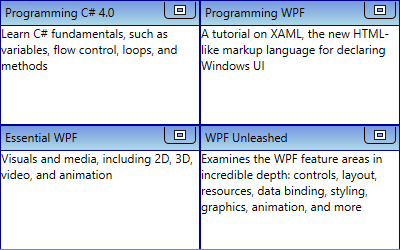

# Data Binding of TileViewControl

The topics under this section explain the data binding support for the [TileViewControl](https://help.syncfusion.com/cr/cref_files/wpf/Syncfusion.Shared.Wpf~Syncfusion.Windows.Shared.TileViewControl_members.html).

## Data-Binding to Objects

The [TileViewControl](https://help.syncfusion.com/cr/cref_files/wpf/Syncfusion.Shared.Wpf~Syncfusion.Windows.Shared.TileViewControl_members.html) supports data binding to objects.

1. Create a class that act as a model for [TileViewItem](https://help.syncfusion.com/cr/cref_files/wpf/Syncfusion.Shared.Wpf~Syncfusion.Windows.Shared.TileViewItem.html).





public class Model
{
  public string Header { get; set; }
  public string Content { get; set; }
}





2. Create a ViewModel class and initialize the items.





public class ViewModel
{
  public ObservableCollection<Model> TileItems { get; set; }
  public ViewModel()
  {
    TileItems = new ObservableCollection<Model>();
    PopulateData();
  }

  private void PopulateData()
  {
     Model model1 = new Model() { Header = "Item1", Content = "TileViewItem1" };
     Model model2 = new Model() { Header = "Item2", Content = "TileViewItem2" };
     Model model3 = new Model() { Header = "Item3", Content = "TileViewItem3" };
     Model model4 = new Model() { Header = "Item4", Content = "TileViewItem4" };           

     TileItems.Add(model1);
     TileItems.Add(model2);
     TileItems.Add(model3);
     TileItems.Add(model4);
  }
}
 



  
3. Create a _ViewModel_ instance and use it as _DataContext_ for the root window.





<Window.DataContext>
  <local:ViewModel/>
</Window.DataContext>
  



  
4. Configure the [ItemSource](https://help.syncfusion.com/cr/cref_files/wpf/Syncfusion.Tools.Wpf~Syncfusion.Windows.Tools.Controls.WizardControl_members.html#) and _ItemContainerStyle_ of the TileViewControl.





<syncfusion:TileViewControl HorizontalAlignment="Stretch" VerticalAlignment="Stretch" ItemsSource="{Binding TileItems}">
  <syncfusion:TileViewControl.ItemContainerStyle>
      
  </syncfusion:TileViewControl.ItemContainerStyle>
</syncfusion:TileViewControl>
  




## Data-Binding with XML

An XML file can also be used as [ItemSource](https://help.syncfusion.com/cr/cref_files/wpf/Syncfusion.Tools.Wpf~Syncfusion.Windows.Tools.Controls.WizardControl_members.html#) for the [TileViewControl](https://help.syncfusion.com/cr/cref_files/wpf/Syncfusion.Shared.Wpf~Syncfusion.Windows.Shared.TileViewControl_members.html).

1. Create an XML file with the following details and name it as Data.xml.





<?xml version="1.0" encoding="utf-8" ?>
<Books>
  <Book Name="Programming C# 4.0" Description="Learn C# fundamentals, such as variables, flow control, loops, and methods"/>
  <Book Name="Programming WPF" Description="A tutorial on XAML, the new HTML-like markup language for declaring Windows UI"/>
  <Book Name="Essential WPF" Description="Visuals and media, including 2D, 3D, video, and animation"/>
  <Book Name="WPF Unleashed" Description="Examines the WPF feature areas in incredible depth: controls, layout, resources, data binding, styling, graphics, animation, and more"/>
</Books>




   
2. Add _XmlDataProvider_ for the above XML document.
   




<Window.Resources>
  <XmlDataProvider Source="Data.xml" x:Key="xmlSource" XPath="Books"/>
</Window.Resources>  





3. Set _ItemsSource_ property for the [TileViewControl](https://help.syncfusion.com/cr/cref_files/wpf/Syncfusion.Shared.Wpf~Syncfusion.Windows.Shared.TileViewControl_members.html).
   




<syncfusion:TileViewControl ItemsSource="{Binding Source={StaticResource xmlSource}, XPath=Book}"   >
  <syncfusion:TileViewControl.ItemContainerStyle>
    
  </syncfusion:TileViewControl.ItemContainerStyle>
</syncfusion:TileViewControl>
 




N> [View sample in GitHub ](https://github.com/SyncfusionExamples/How-to-populate-tileview-control-by-data-binding-in-wpf)

