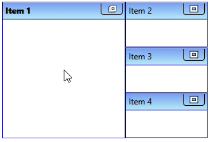
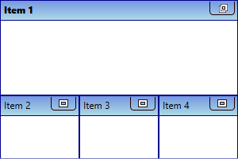
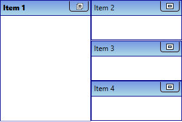
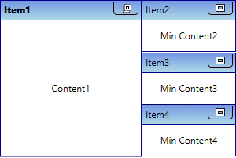
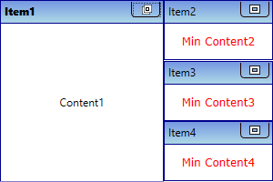

# Minimizing TileViewItem

You can minimize the [TileViewItem](https://help.syncfusion.com/cr/cref_files/wpf/Syncfusion.Shared.Wpf~Syncfusion.Windows.Shared.TileViewItem.html) and change its appearance in the [TileViewControl](https://help.syncfusion.com/cr/cref_files/wpf/Syncfusion.Shared.Wpf~Syncfusion.Windows.Shared.TileViewControl.html).

## Minimize the TileViewItem

You can minimize the maximized `TileViewItem` by click on the minimize button.




<syncfusion:TileViewControl Name="tileViewControl" >
    <syncfusion:TileViewItem Header="Item 1" />
    <syncfusion:TileViewItem Header="Item 2" />
    <syncfusion:TileViewItem Header="Item 3" />
    <syncfusion:TileViewItem Header="Item 4" />
</syncfusion:TileViewControl>




TileViewControl tileViewControl = new TileViewControl();
tileViewControl.Items.Add(new TileViewItem() { Header = "Item 1" });
tileViewControl.Items.Add(new TileViewItem() { Header = "Item 2" });
tileViewControl.Items.Add(new TileViewItem() { Header = "Item 3" });
tileViewControl.Items.Add(new TileViewItem() { Header = "Item 4" });




N> [View Sample in GitHub](https://github.com/SyncfusionExamples/syncfusion-wpf-tileview-control-examples/blob/master/Samples/MinMax-TileItem)

## Direction for minimized items 

If you want to change direction of placing the minimized items, use the [MinimizedItemsOrientation](https://help.syncfusion.com/cr/cref_files/wpf/Syncfusion.Shared.Wpf~Syncfusion.Windows.Shared.TileViewControl~MinimizedItemsOrientation.html) property. The default value of `MinimizedItemsOrientation` property is `Right`.




<syncfusion:TileViewControl MinimizedItemsOrientation="Bottom"
                            Name="tileViewControl" >
    <syncfusion:TileViewItem Header="Item 1" />
    <syncfusion:TileViewItem Header="Item 2" />
    <syncfusion:TileViewItem Header="Item 3" />
    <syncfusion:TileViewItem Header="Item 4" />
</syncfusion:TileViewControl>




tileViewControl.MinimizedItemsOrientation = MinimizedItemsOrientation.Bottom;




N> [View Sample in GitHub](https://github.com/SyncfusionExamples/syncfusion-wpf-tileview-control-examples/blob/master/Samples/MinMax-TileItem)

## Allocate size for minimized TileViewItem

If you want to allocate a certain percentage of the total size to the minimized items, use the [MinimizedItemsPercentage](https://help.syncfusion.com/cr/cref_files/wpf/Syncfusion.Shared.Wpf~Syncfusion.Windows.Shared.TileViewControl~MinimizedItemsPercentage.html) property. The default value of `MinimizedItemsPercentage` property is `20`.




<syncfusion:TileViewControl MinimizedItemsPercentage="50"
                            Name="tileViewControl" >
    <syncfusion:TileViewItem Header="Item 1" />
    <syncfusion:TileViewItem Header="Item 2" />
    <syncfusion:TileViewItem Header="Item 3" />
    <syncfusion:TileViewItem Header="Item 4" />
</syncfusion:TileViewControl>




tileViewControl.MinimizedItemsPercentage = 50;




N> [View Sample in GitHub](https://github.com/SyncfusionExamples/syncfusion-wpf-tileview-control-examples/blob/master/Samples/MinMax-TileItem)

## Change minimized TileViewItem content

By default, `TileViewItem.Content` property values displayed as `TileViewItem` content on minimized state. If you want to change the content of the `TileViewItem` on minimized state, use the [MinimizedItemContent](https://help.syncfusion.com/cr/cref_files/wpf/Syncfusion.Shared.Wpf~Syncfusion.Windows.Shared.TileViewItem~MinimizedItemContent.html) property. The default value of `MinimizedItemContent` property is `null`.




<syncfusion:TileViewControl  Name="tileViewControl">
    <syncfusion:TileViewItem Header="Item1" Content="Content1"
                             MinimizedItemContent="Min Content1" />
    <syncfusion:TileViewItem Header="Item2" Content="Content2"
                             MinimizedItemContent="Min Content2" />
    <syncfusion:TileViewItem Header="Item3" Content="Content3"
                             MinimizedItemContent="Min Content3" />
    <syncfusion:TileViewItem Header="Item4" Content="Content4"
                             MinimizedItemContent="Min Content4" />
</syncfusion:TileViewControl>




TileViewControl tileViewControl = new TileViewControl();
tileViewControl.Items.Add(new TileViewItem() { Header = "Item 1", 
    Content = "Content1", MinimizedItemContent = "Min Content1" });
tileViewControl.Items.Add(new TileViewItem() { Header = "Item 2",
    Content = "Content2", MinimizedItemContent = "Min Content2" });
tileViewControl.Items.Add(new TileViewItem() { Header = "Item 3",
    Content = "Content3", MinimizedItemContent = "Min Content3" });
tileViewControl.Items.Add(new TileViewItem() { Header = "Item 4",
    Content = "Content4", MinimizedItemContent = "Min Content4" });




N> [View Sample in GitHub](https://github.com/SyncfusionExamples/syncfusion-wpf-tileview-control-examples/blob/master/Samples/MinMax-TileItem)

## Custom UI of minimized TileViewItem content

You can customize the appearance of minimized `TileViewItem` content by using the [MinimizedItemTemplate](https://help.syncfusion.com/cr/cref_files/wpf/Syncfusion.Shared.Wpf~Syncfusion.Windows.Shared.TileViewControl~MinimizedItemTemplate.html) property. The `DataContext` of the `MinimizedItemTemplate` property is `TileViewItem.MinimizedItemContent`.




<syncfusion:TileViewControl Name="tileViewControl">
    <syncfusion:TileViewItem Header="Item1" Content="Content1"
                             MinimizedItemContent="Min Content1" />
    <syncfusion:TileViewItem Header="Item2" Content="Content2"
                             MinimizedItemContent="Min Content2" />
    <syncfusion:TileViewItem Header="Item3" Content="Content3"
                             MinimizedItemContent="Min Content3" />
    <syncfusion:TileViewItem Header="Item4" Content="Content4"
                             MinimizedItemContent="Min Content4" />
    <syncfusion:TileViewControl.MinimizedItemTemplate>
        <DataTemplate x:Name="MinTemplate">
            <Grid>
                <TextBlock HorizontalAlignment="Center"
                           Text="{Binding}" 
                           FontFamily="Verdana"
                           Foreground="Red"/>
            </Grid>
        </DataTemplate>
    </syncfusion:TileViewControl.MinimizedItemTemplate>
</syncfusion:TileViewControl>




N> [View Sample in GitHub](https://github.com/SyncfusionExamples/syncfusion-wpf-tileview-control-examples/blob/master/Samples/CustomUI-MinMaxTileItem)

## Change minimized TileViewItem header

If you want to change the header of the `TileViewItem` on minimized state, use the [MinimizedHeader](https://help.syncfusion.com/cr/cref_files/wpf/Syncfusion.Shared.Wpf~Syncfusion.Windows.Shared.TileViewItem~MinimizedHeader.html) property. The default value of `MinimizedHeader` property is `null`.

N> Please refer [Minimized TileViewItem header](https://help.syncfusion.com/wpf/tile-view/tileviewitem-header#change-minimized-and-maximized-header) topic to know more details about minimized `TileViewItem` header and its customization available in the `TileViewControl`.

## Minimized state changed notification

The `TileViewControl` notifies that the minimized state changed in the `TileViewItem` by using [Minimized](https://help.syncfusion.com/cr/cref_files/wpf/Syncfusion.Shared.Wpf~Syncfusion.Windows.Shared.TileViewControl~Minimized_EV.html) event. You can get the minimized items by using the [Source](https://help.syncfusion.com/cr/cref_files/wpf/Syncfusion.Shared.Wpf~Syncfusion.Windows.Shared.TileViewEventArgs~Source.html) property. You can also use the [OldState](https://help.syncfusion.com/cr/cref_files/wpf/Syncfusion.Shared.Wpf~Syncfusion.Windows.Shared.TileViewEventArgs~OldState.html) and [NewState](https://help.syncfusion.com/cr/cref_files/wpf/Syncfusion.Shared.Wpf~Syncfusion.Windows.Shared.TileViewEventArgs~NewState.html) properties to get the old and new state of `TileViewItem`.




<syncfusion:TileViewControl Minimized="TileViewControl_Minimized"
                            Name="tileViewControl" />




 tileViewControl.Minimized += TileViewControl_Minimized;




You can handle the event as follows:




private void TileViewControl_Minimized(object sender, TileViewEventArgs args) {
    var minimizedItem = args.Source;
    var oldState = args.OldState;
    var newState = args.NewState;
}




