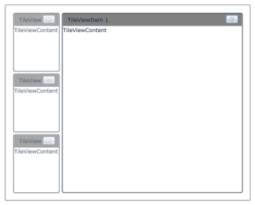

# Setting Orientation for Minimizing Items.

You can change the orientation of the minimized items by setting the [MinimizedItemsOrientation](https://help.syncfusion.com/cr/wpf/Syncfusion.Shared.Wpf~Syncfusion.Windows.Shared.TileViewControl~MinimizedItemsOrientation.html) property to a required value. The available minimized orientations are Left, Top, Right and Bottom. When the maximize button of an item is clicked, the other items of the TileViewControl are minimized in the required positions. 

For Example: When the MinimizedOrientation property is set to _Left_, the minimized items are placed on the left side of the maximized item and so on.

## Adding Orientation for Minimizing Items to an Application 

The orientation for minimizing items can be added to an application by using either XAML or C# code.

## Adding through XAML

The following code example illustrates how to add the Orientation for Minimizing Items to an application through XAML.



<syncfusion:TileViewControl x:Name="TileView1" Background="White" 

                            MinimizedItemsOrientation="Left">

    <syncfusion:TileViewItem BorderThickness="2" Header="TileViewItem 1"                                         

                             Content="TileViewContent" Margin="2"  

                             HeaderBackground="Gray" CornerRadius="3"/>

    <syncfusion:TileViewItem BorderThickness="2" Header="TileViewItem 2"                                          

                             Content="TileViewContent" Margin="2"

                             HeaderBackground="Gray" CornerRadius="3"/>

    <syncfusion:TileViewItem BorderThickness="2" Header="TileViewItem 3" 

                             Content="TileViewContent" Margin="2"

                             HeaderBackground="Gray" CornerRadius="3"/>

    <syncfusion:TileViewItem BorderThickness="2" Header="TileViewItem 4" 

                             Content="TileViewContent" Margin="2"

                             HeaderBackground="Gray" CornerRadius="3"/>

</syncfusion:TileViewControl>



## Adding through C#

The following code example illustrates how to add the Orientation for Minimizing Items to an application through C#.



   TileViewControl Tile = new TileViewControl();

   Tile.MinimizedItemsOrientation = MinimizedItemsOrientation.Left;

   Tile.Background = new SolidColorBrush(Colors.White);

   for (int i = 1; i <= 4; i++)

   {

         TileViewItem item1 = new TileViewItem();

         item1.HeaderBackground = new SolidColorBrush(Colors.Gray);

         item1.Margin = new Thickness(2d);

         item1.Content = "TileViewContent";

         item1.Header = "TileViewItem - " + i;

         Tile.Items.Add(item1);

   }

   this.LayoutRoot.Children.Add(Tile);



## Events

* [MinimizedItemsOrientationChanged](https://help.syncfusion.com/cr/wpf/Syncfusion.Shared.Wpf~Syncfusion.Windows.Shared.TileViewControl~MinimizedItemsOrientationChanged_EV.html)

## Sample Link

To view samples: 

1. Select Start -> Programs -> Syncfusion -> Essential Studio x.x.xx -> Dashboard.
2. Select   Run Locally Installed Samples in WPF Button.
3. Now expand the DragAndDropManagerDemo tree-view item in the Sample Browser.
4. Choose any one of the samples listed under it to launch. 

