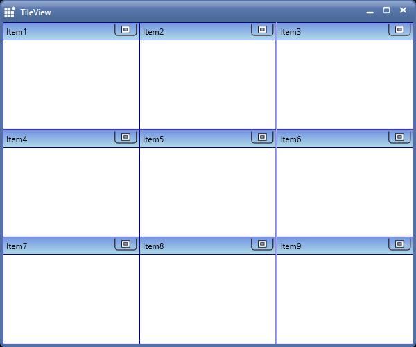
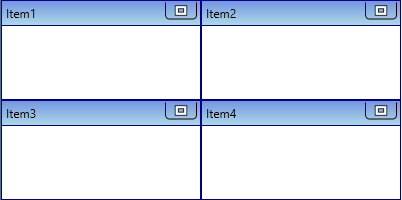
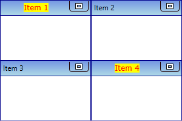
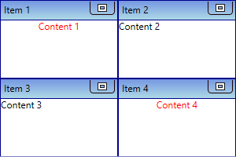

# Working with TileView

## Row count and column count

You can change the number of tileview items displayed in view by setting [RowCount](https://help.syncfusion.com/cr/wpf/Syncfusion.Shared.Wpf~Syncfusion.Windows.Shared.TileViewControl~RowCount.html) and [ColumnCount](https://help.syncfusion.com/cr/wpf/Syncfusion.Shared.Wpf~Syncfusion.Windows.Shared.TileViewControl~ColumnCount.html) properties.



<!-- TileViewControl -->
<syncfusion:TileViewControl x:Name="tileView"  RowCount="3" ColumnCount="3">
    <syncfusion:TileViewItem Header="Item1"/>
    <syncfusion:TileViewItem Header="Item2"/>
    <syncfusion:TileViewItem Header="Item3" />
    <syncfusion:TileViewItem Header="Item4"/>			
    <syncfusion:TileViewItem Header="Item5"/>
    <syncfusion:TileViewItem Header="Item6"/>
    <syncfusion:TileViewItem Header="Item7" />
    <syncfusion:TileViewItem Header="Item8"/>
    <syncfusion:TileViewItem Header="Item9"/>					
 </syncfusion:TileViewControl>


// Set Row count
tileView.RowCount = 3;
// Set Column count
tileView.ColumnCount = 3;



## Setting the TileViewItem Size in Normal State

You can change TileViewItem size in normal state by setting [RowHeight](https://help.syncfusion.com/cr/wpf/Syncfusion.Shared.Wpf~Syncfusion.Windows.Shared.TileViewControl~RowHeight.html) and [ColumnWidth](https://help.syncfusion.com/cr/wpf/Syncfusion.Shared.Wpf~Syncfusion.Windows.Shared.TileViewControl~ColumnWidth.html) properties.



<!-- TileViewControl -->
<syncfusion:TileViewControl x:Name="tileView" RowHeight="100" ColumnWidth="150">
    <syncfusion:TileViewItem Header="Item1"/>
    <syncfusion:TileViewItem Header="Item2"/>
    <syncfusion:TileViewItem Header="Item3" />
    <syncfusion:TileViewItem Header="Item4"/>
</syncfusion:TileViewControl>


//Set the height 
tileView.RowHeight = new GridLength(100);
//Set the width
tileView.ColumnWidth = new GridLength(150);



## Setting the Size of TileViewItem in Minimized State

You can change TileViewItem size in minimized state by setting [OnMinimizedHeight](https://help.syncfusion.com/cr/wpf/Syncfusion.Shared.Wpf~Syncfusion.Windows.Shared.TileViewItem~OnMinimizedHeight.html) and [OnMinimizedWidth](https://help.syncfusion.com/cr/wpf/Syncfusion.Shared.Wpf~Syncfusion.Windows.Shared.TileViewItem~OnMinimizedWidth.html) properties.



<syncfusion:TileViewControl x:Name="tileView"  RowHeight="200" ColumnWidth="200" MinimizedItemsOrientation="Top" >
    <syncfusion:TileViewItem Header="Item1" Content="Content" OnMinimizedHeight="150" OnMinimizedWidth="300"/>
    <syncfusion:TileViewItem Header="Item2" Content="Content" OnMinimizedHeight="150" OnMinimizedWidth="300"/>
    <syncfusion:TileViewItem Header="Item3" Content="Content" OnMinimizedHeight="150" OnMinimizedWidth="300" />
    <syncfusion:TileViewItem Header="Item4" Content="Content" OnMinimizedHeight="150" OnMinimizedWidth="300"/>
</syncfusion:TileViewControl>


TileViewItem tileItem1 = new TileViewItem();
//Set height
tileItem1.OnMinimizedHeight = new GridLength(150);
//Set width
tileItem1.OnMinimizedWidth = new GridLength(300);



## Custom UI of TileViewItem header

You can customize the appearance of `TileViewItem` headers by using the [HeaderTemplate](https://help.syncfusion.com/cr/cref_files/wpf/Syncfusion.Shared.Wpf~Syncfusion.Windows.Shared.TileViewControl~HeaderTemplate.html) property. The `DataContext` of the `HeaderTemplate` property is `TileViewItem.Header`.




<syncfusion:TileViewControl  Name="tileViewControl">
    <syncfusion:TileViewItem Header="Item 1" />
    <syncfusion:TileViewItem Header="Item 2" />
    <syncfusion:TileViewItem Header="Item 3" />
    <syncfusion:TileViewItem Header="Item 4" />
    <syncfusion:TileViewControl.HeaderTemplate>
        <DataTemplate x:Name="headerTemplate">
            <Grid>
                <TextBlock HorizontalAlignment="Center"
                           Text="{Binding}" 
                           FontFamily="Verdana"
                           Background="Yellow"
                           Foreground="Red"/>
            </Grid>
        </DataTemplate>
    </syncfusion:TileViewControl.HeaderTemplate>
</syncfusion:TileViewControl>




### Custom UI of specfic TileViewItem header

You can customize the appearance of specific `TileViewItem` headers by using the [TileViewItem.HeaderTemplate](https://help.syncfusion.com/cr/cref_files/wpf/Syncfusion.Shared.Wpf~Syncfusion.Windows.Shared.TileViewItem~HeaderTemplate.html) property. The `DataContext` of the `TileViewItem.HeaderTemplate` property is `TileViewItem.Header`.




<Window.Resources>
    <DataTemplate x:Key="headerTemplate">
        <Grid>
            <TextBlock HorizontalAlignment="Center"
                       Text="{Binding}" 
                       FontFamily="Verdana"
                       Background="Yellow"
                       Foreground="Red"/>
        </Grid>
    </DataTemplate>
</Window.Resources>
<Grid>
    <syncfusion:TileViewControl  Name="tileViewControl">
        <syncfusion:TileViewItem Header="Item 1" 
                                 HeaderTemplate="{StaticResource headerTemplate }" />
        <syncfusion:TileViewItem Header="Item 2" />
        <syncfusion:TileViewItem Header="Item 3" />
        <syncfusion:TileViewItem Header="Item 4" 
                                 HeaderTemplate="{StaticResource headerTemplate }" />
    </syncfusion:TileViewControl>
</Grid>



## Custom UI of TileViewItem content

You can customize the appearance of `TileViewItem` content by using the [ItemTemplate](https://help.syncfusion.com/cr/cref_files/wpf/Syncfusion.Shared.Wpf~Syncfusion.Windows.Shared.TileViewControl~ItemTemplate.html) property. The `DataContext` of the `ItemTemplate` property is `TileViewItem.Content`.




<Window.Resources>
    <DataTemplate x:Key="contentTemplate">
        <Grid>
            <TextBlock HorizontalAlignment="Center"
                       Text="{Binding}"
                       Foreground="Red"/>
        </Grid>
    </DataTemplate>
</Window.Resources>

<Grid>
    <syncfusion:TileViewControl ItemTemplate="{StaticResource contentTemplate}"
                                Name="tileViewControl">
        <syncfusion:TileViewItem Content="Content 1" Header="Item 1" />
        <syncfusion:TileViewItem Content="Content 2" Header="Item 2" />
        <syncfusion:TileViewItem Content="Content 3" Header="Item 3" />
        <syncfusion:TileViewItem Content="Content 4" Header="Item 4" />
    </syncfusion:TileViewControl>
</Grid>




### Custom UI of specfic TileViewItem content

You can customize the appearance of specific `TileViewItem` content by using the [TileViewItem.ContentTemplate](https://help.syncfusion.com/cr/cref_files/wpf/Syncfusion.Shared.Wpf~Syncfusion.Windows.Shared.TileViewItem~ContentTemplate.html) property. The `DataContext` of the `TileViewItem.ContentTemplate` property is `TileViewItem.Content`.




<Window.Resources>
    <DataTemplate x:Key="contentTemplate">
        <Grid>
            <TextBlock HorizontalAlignment="Center"
                       Text="{Binding}"
                       Foreground="Red"/>
        </Grid>
    </DataTemplate>
</Window.Resources>

<Grid>
    <syncfusion:TileViewControl Name="tileViewControl">
        <syncfusion:TileViewItem ContentTemplate="{StaticResource contentTemplate}"
                                 Content="Content 1" Header="Item 1" />
        <syncfusion:TileViewItem Content="Content 2" Header="Item 2" />
        <syncfusion:TileViewItem Content="Content 3" Header="Item 3" />
        <syncfusion:TileViewItem ContentTemplate="{StaticResource contentTemplate}"
                                 Content="Content 4" Header="Item 4" />
    </syncfusion:TileViewControl>
</Grid>




