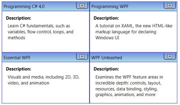

# Customizing Data Templates

Data template can be customized for items and headers of the control. This section illustrates how to customize the data templates.

## Item Template 

You can customize how a business object is displayed as TileView using the [ItemTemplate](https://docs.microsoft.com/en-us/dotnet/api/system.windows.controls.itemscontrol.itemtemplate?view=netframework-4.7.2) of TileViewControl. The following code example shows the usage of ItemTemplate.



   <syncfusion:TileViewControl ItemsSource="{Binding Source={StaticResource xmlSource}, XPath=Book}"   >

            <syncfusion:TileViewControl.ItemContainerStyle>

                

            </syncfusion:TileViewControl.ItemContainerStyle>

            <syncfusion:TileViewControl.ItemTemplate>

                <DataTemplate>

                    <Grid Margin="10">

                        <Grid.RowDefinitions>

                            <RowDefinition Height="Auto"/>

                            <RowDefinition Height="Auto"/>

                        </Grid.RowDefinitions>

                        <TextBlock Text="Description: " FontWeight="Bold"/>

                        <TextBlock Text="{Binding XPath=@Description}" TextWrapping="Wrap" Margin="5,5,0,0" Grid.Row="1"/>

                    </Grid>

                </DataTemplate>

            </syncfusion:TileViewControl.ItemTemplate>

        </syncfusion:TileViewControl>



Implementing the above code will generate the following TileViewControl.

## Item Template Selector

Using _ItemTemplateSelector_ feature, you can use different templates for the items depending on specific constraints. The following example illustrates this.

1. Create a template selector in the code.

   ~~~ cs
     

     public class TileViewItemTemplateSelector : DataTemplateSelector

    {

        public override DataTemplate SelectTemplate(object item, DependencyObject container)

        {

            Window window = Application.Current.MainWindow;

            string bookname = (item as System.Xml.XmlElement).GetAttribute("Name").ToString().ToLower();

            if (bookname.Contains("wpf"))

            {

                return ((DataTemplate)window.Resources["WpfBookTemplate"]);

            }

            else 

            {

                return ((DataTemplate)window.Resources["CsBookTemplate"]);

            }

        }

     }

   ~~~
   

2. Define data templates in the Window’s resources.

 
   ~~~ xml
     

     <DataTemplate x:Key="CsBookTemplate">

            <Grid Margin="10">

                <Grid.RowDefinitions>

                    <RowDefinition Height="Auto"/>

                    <RowDefinition Height="Auto"/>

                </Grid.RowDefinitions>

                <TextBlock Text="Description: " FontWeight="Bold"/>

                <TextBlock Text="{Binding XPath=@Description}" TextWrapping="Wrap" FontFamily="Courier New" Foreground="Green" Margin="5,5,0,0" Grid.Row="1"/>

            </Grid>

        </DataTemplate>

        <DataTemplate x:Key="WpfBookTemplate">

            <Grid Margin="10">

                <Grid.RowDefinitions>

                    <RowDefinition Height="Auto"/>

                    <RowDefinition Height="Auto"/>

                </Grid.RowDefinitions>

                <TextBlock Text="Description: " FontWeight="Bold"/>

                <TextBlock Text="{Binding XPath=@Description}" FontFamily="Verdana" TextWrapping="Wrap" Margin="5,5,0,0" Foreground="Blue" Grid.Row="1"/>

            </Grid>

        </DataTemplate>
   ~~~
   

3.  Create the instance for the template selector in the Window’s resources.

    ~~~ xml
     

     <local:TileViewItemTemplateSelector x:Key="tileViewItemTemplateSelector"/>
    ~~~
    {:.prettyprint}

4. Use this template selector to choose a template for the TileViewControl.

   ~~~ xml
     

     <syncfusion:TileViewControl ItemTemplateSelector="{StaticResource tileViewItemTemplateSelector}" ItemsSource="{Binding Source={StaticResource xmlSource}, XPath=Book}"  Margin="20" >

            <syncfusion:TileViewControl.ItemContainerStyle>

                

            </syncfusion:TileViewControl.ItemContainerStyle>

        </syncfusion:TileViewControl>
   ~~~
   

This will generate the TileViewControl as follows.

## Header Template

You can customize the header of the TileViewItem using the [HeaderTemplate](https://help.syncfusion.com/cr/wpf/Syncfusion.Shared.Wpf~Syncfusion.Windows.Shared.TileViewItem~HeaderTemplate.html). The following code example explains this.

1. Define _DataTemplate_ for _HeaderTemplate_.

   ~~~ xml 
     

     <DataTemplate x:Key="headerTemplate">

            <Grid >

                <Grid.ColumnDefinitions>

                    <ColumnDefinition Width="Auto"/>

                    <ColumnDefinition Width="Auto"/>

                </Grid.ColumnDefinitions>

                <Image Source="bookicon.png" Stretch="Fill" Width="15" Height="15" Margin="0,0,5,0"/>

                <TextBlock Text="{Binding XPath=@Name}" Grid.Column="1" FontFamily="Verdana" FontWeight="Bold" Foreground="White"/>

            </Grid>

        </DataTemplate>
   ~~~
   

2. Set the [HeaderTemplate](https://help.syncfusion.com/cr/wpf/Syncfusion.Shared.Wpf~Syncfusion.Windows.Shared.TileViewItem~HeaderTemplate.html) for the _TileViewControl_ to the above template.

   ~~~ xml
     

     <syncfusion:TileViewControl  HeaderTemplate="{StaticResource headerTemplate}" ItemTemplate="{StaticResource itemTemplate}" ItemsSource="{Binding Source={StaticResource xmlSource}, XPath=Book}"   >

        </syncfusion:TileViewControl>

   ~~~
   

This will generate the following TileViewControl.

