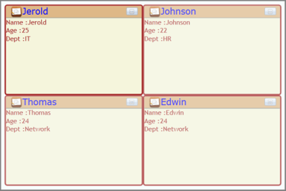

# Data Binding Support

Data Binding is the process of establishing a connection between the application UI and business logic. To bind the business object collection, ItemSource and ItemTemplate properties are used. You can bind the data object to any control and show them in the TileViewItem.

## Adding Data Binding to an Application 

Data Binding can be added to an application by using either XAML or C# code.

The following code example illustrates how to add the Data Binding to an application through XAML and C#.





<DataTemplate x:Name="header">

     <StackPanel Orientation="Horizontal">

         <Image Source="Images/messages.png"/>

         <TextBlock Text="{Binding Name}" FontFamily="Verdana" 

                    FontSize="18" Foreground="Blue"/>                      

     </StackPanel>

</DataTemplate>

<syncfusion:TileViewControl x:Name="TileView1" 

            ItemsSource="{Binding TileViewItemData, ElementName=Cont}"

            Width="600" Height="400"                          

            HeaderTemplate="{Binding Source={StaticResource header}}">        

            <syncfusion:TileViewControl.ItemTemplate>                

                <DataTemplate>            

                    <StackPanel Orientation="Vertical">

                      <StackPanel Orientation="Horizontal">

                        <TextBlock Text="Name :" FontFamily="Trebuchet MS" 

                                    Foreground="Brown" FontSize="14"/>

                        <TextBlock Text="{Binding Name}"/>

                      </StackPanel>

                      <StackPanel Orientation="Horizontal">

                        <TextBlock Text="Age :" FontFamily="Trebuchet MS" 

                                    Foreground="Brown" FontSize="14"/>

                        <TextBlock Text="{Binding Age}"/>

                      </StackPanel>

                      <StackPanel Orientation="Horizontal">

                        <TextBlock Text="Dept :" FontFamily="Trebuchet MS" 

                                   Foreground="Brown" FontSize="14"/>

                        <TextBlock Text="{Binding Dept}" />

                      </StackPanel>

                    </StackPanel>

                </DataTemplate>

            </syncfusion:TileViewControl.ItemTemplate>

        </syncfusion:TileViewControl>





public ObservableCollection<object> TileViewItemData

        {  get;  set;  }

TileViewItemData = new ObservableCollection<object>();

TileViewItemData.Add(new Data(){Name="Jerold", Age=25 , Dept="IT"});

TileViewItemData.Add(new Data(){Name = "Johnson", Age = 22,Dept = "HR" });

TileViewItemData.Add(new Data(){Name = "Thomas", Age = 24,Dept="Network"});

TileViewItemData.Add(new Data(){Name = "Edwin", Age = 24,Dept="Network"});

public class Data

{       

        public Data(){ }                

        public string Name { get; set; }

        public int Age  { get;  set; }

        public string Dept {  get; set; }       

}





## Sample Link

To view samples: 

1. Select Start -> Programs -> Syncfusion -> Essential Studio x.x.xx -> Dashboard.
2. Select Run Locally Installed Samples in WPF Button.
3. Now expand the DragAndDropManagerDemo tree-view item in the Sample Browser.
4. Choose any one of the samples listed under it to launch. 

