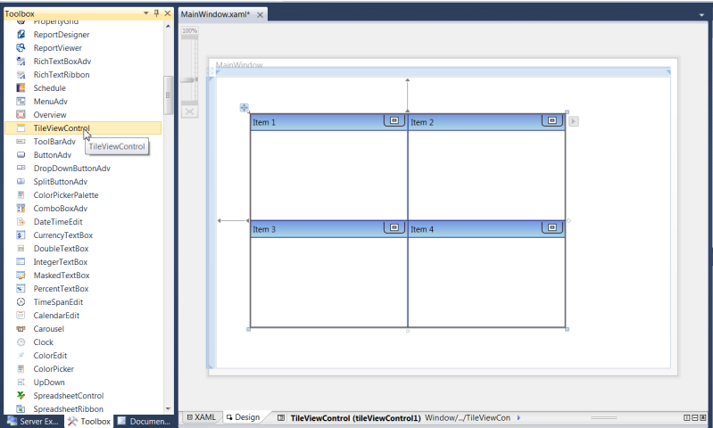
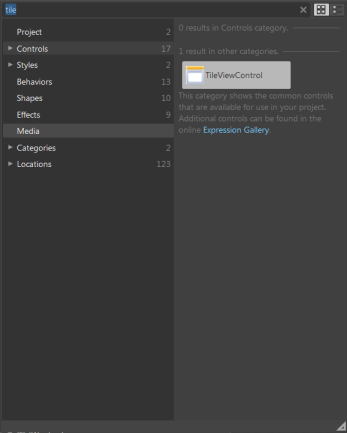
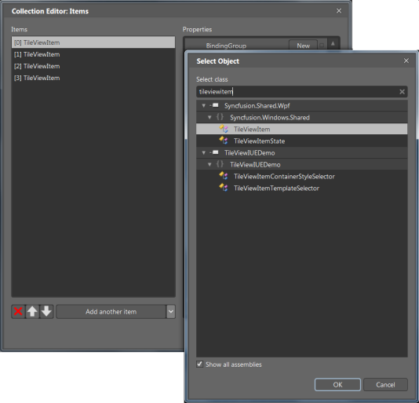

# Getting Started

This section describes how to design a `TileViewControl` control in a WPF application and overview of its basic functionalities.

## Structure of the TileViewControl

# Creating simple application with TileViewControl

The TileViewControl control can be added to an application using Visual Studio and Blend.

You can create the WPF application with TileViewControl control as follows:

1. [Creating project](#creating-the-project)
2. [Adding control via designer](#adding-control-via-designer)
3. [Adding control manually in code](#adding-control-manually-in-code)

Create a WPF project in Visual Studio and refer to the following assemblies.

## Creating the project

The steps to create a TileViewControl control using Visual Studio in C# are as follows:

1.	Open Visual Studio.

2.	On the File menu, select New -> Project. This opens the New Project Dialog box.

## Adding control via designer

TileViewControl control can be added to the application by dragging it from the toolbox and dropping it in a designer view. The following required assembly **Syncfusion.Shared.WPF** references will be added automatically.

### Through Visual Studio

The following are the steps to create the TileViewControl using Visual Studio.

1. Drag TileViewControl from the Toolbox and drop it in the Designer area. It will generate the TileViewControl. 

     

2. To add items to the TileViewControl using the Collection Editor, select the TileViewControl and look at its properties.
3. Click the button in the Items property. This will open the Collection Editor.

     

4.  Using the Collection Editor, add the GroupBarItems and configure their properties.

### Through Expression Blend

The TileViewControl can also be created and configured using Expression Blend. The following are the steps to do so.

1. Create a WPF project in Expression Blend and reference the following assemblies.
i. Syncfusion.Shared.Wpf
ii. Syncfusion.Core
2. Search for TileViewControl in the Toolbox.

     

3. Drag the TileViewControl to the designer. This will generate the control as follows.

     

4. To add items to the TileViewControl using the Collection Editor, select TileViewControl and go to Properties.
5. Click Items (Collection) under Common Properties.

     

6. Once the Collection Editor window opens, click Add another item. The Select Object window will open. 
7. Select TileViewItem by typing _TileViewItem_ in the search box, and then click OK.

     

8. Configure the TileViewItem using the properties in the Collection Editor.

N> You can customize the appearance of the TileViewControl and its Item using the template-editing feature available in the Expression Blend.

### Through XAML

The TileViewControl can also be created through XAML. The following code example illustrates this.





<syncfusion:TileViewControl Name="tileViewControl1" >

     <syncfusion:TileViewItem Header="Item 1" />

     <syncfusion:TileViewItem Header="Item 2" />

     <syncfusion:TileViewItem Header="Item 3" />

     <syncfusion:TileViewItem Header="Item 4" />

 </syncfusion:TileViewControl>





## Adding control manually in code

To create the TileViewControl through C#, include the following namespace to the directives list.





using Syncfusion.Windows.Shared;





Imports Syncfusion.Windows.Shared





Next, create the TileViewControl as follows.





TileViewControl tvControl = new TileViewControl();

TileViewItem tvitem1 = new TileViewItem() { Header = "Item 1" };

TileViewItem tvitem2 = new TileViewItem() { Header = "Item 2" };

TileViewItem tvitem3 = new TileViewItem() { Header = "Item 3" };

TileViewItem tvitem4 = new TileViewItem() { Header = "Item 4" };

tvControl.Items.Add(tvitem1);

tvControl.Items.Add(tvitem2);

tvControl.Items.Add(tvitem3);

tvControl.Items.Add(tvitem4);





Dim tvControl As TileViewControl = New TileViewControl
Dim tvitem1 As TileViewItem = New TileViewItem
Dim tvitem2 As TileViewItem = New TileViewItem
Dim tvitem3 As TileViewItem = New TileViewItem
Dim tvitem4 As TileViewItem = New TileViewItem
tvControl.Items.Add(tvitem1)
tvControl.Items.Add(tvitem2)
tvControl.Items.Add(tvitem3)
tvControl.Items.Add(tvitem4)





This will generate the following TileViewControl.

### Adding IsSelected to an Application 

`IsSelected` can be added to an application by using either XAML or C# code.

The following code example illustrates how to add the `IsSelected` to an application.





<syncfusion:TileViewControl x:Name="TileView" Height="600" Width="800">

      <syncfusion:TileViewItem x:Name="Tile1" Header="TileViewItem 1" />

      <syncfusion:TileViewItem x:Name="Tile2" Header="TileViewItem 2" />

      <syncfusion:TileViewItem x:Name="Tile3" Header="TileViewItem 3" />

      <syncfusion:TileViewItem x:Name="Tile4" Header="TileViewItem 4" 

                               IsSelected="True" /> 

</syncfusion:TileViewControl>





TileViewControl Tile = new TileViewControl();

TileViewItem item1 = new TileViewItem();

item1.IsSelected = true;





Dim Tile As TileViewControl = New TileViewControl
Dim item1 As TileViewItem = New TileViewItem
item1.IsSelected = true





### Click Header to Maximize

The TileViewItem moves to maximized state from Normal or minimized state when you click on the header of the TileViewItem. You can enable or disable this feature by using the `ClickHeaderToMaximized` property in the TileViewControl. If you click on the header of the TileViewItem in maximized state, then no action will take place, the TileViewItem’s state will remain same.

## Adding Click Header to Maximize to an Application

Click Header to Maximize can be added to an application by using either XAML or C# code.

The following code example illustrates how to add the Click Header to Maximize to an application.





<syncfusion:TileViewControl x:Name="TileView" Height="600" Width="800" 

      ClickHeaderToMaximize ="True" >

      <syncfusion:TileViewItem x:Name="Tile1" Header="TileViewItem 1" />

      <syncfusion:TileViewItem x:Name="Tile2" Header="TileViewItem 2" />

      <syncfusion:TileViewItem x:Name="Tile3" Header="TileViewItem 3" />

      <syncfusion:TileViewItem x:Name="Tile4" Header="TileViewItem 4" /> 

</syncfusion:TileViewControl>





      TileViewControl Tile = new TileViewControl();

      Tile.ClickHeaderToMaximize = true;      




