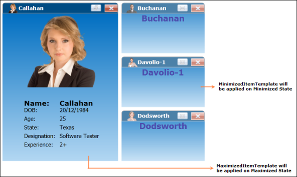

# MinimizedItemTemplate and MaximizedItemTemplate

The [MinimizedItemTemplate](https://help.syncfusion.com/cr/wpf/Syncfusion.Shared.Wpf~Syncfusion.Windows.Shared.TileViewControl~MinimizedItemTemplate.html) and [MaximizedItemTemplate](https://help.syncfusion.com/cr/wpf/Syncfusion.Shared.Wpf~Syncfusion.Windows.Shared.TileViewControl~MaximizedItemTemplate.html) feature in the TileViewControl enables you to set the different DataTemplate in theTileViewItem maximized state and the TileViewItem minimized state. The ItemTemplate property will be displayed in the TileViewItem normal state. If you set the [MinimizedItemTemplate](https://help.syncfusion.com/cr/wpf/Syncfusion.Shared.Wpf~Syncfusion.Windows.Shared.TileViewControl~MinimizedItemTemplate.html), then the value in the ItemTemplate property will be displayed in the maximized state and vice versa.

## Use Case Scenarios

This feature will be very useful when you want to show the two different DataTemplates in minimized state and maximized state.

## Adding MinimizedItemTemplate / MaximizedItemTemplate to an Application 

The [MinimizedItemTemplate](https://help.syncfusion.com/cr/wpf/Syncfusion.Shared.Wpf~Syncfusion.Windows.Shared.TileViewControl~MinimizedItemTemplate.html) and [MaximizedItemTemplate](https://help.syncfusion.com/cr/wpf/Syncfusion.Shared.Wpf~Syncfusion.Windows.Shared.TileViewControl~MaximizedItemTemplate.html) can be added to an application by using either XAML or C# code.

The following code example illustrates how to add the [MinimizedItemTemplate](https://help.syncfusion.com/cr/wpf/Syncfusion.Shared.Wpf~Syncfusion.Windows.Shared.TileViewControl~MinimizedItemTemplate.html) and [MaximizedItemTemplate](https://help.syncfusion.com/cr/wpf/Syncfusion.Shared.Wpf~Syncfusion.Windows.Shared.TileViewControl~MaximizedItemTemplate.html) to an application through XAML.



<DataTemplate x:Name="MinTemplate">

    <Grid>         

      <TextBlock Grid.Row="0" HorizontalAlignment="Center" FontSize="18" 

                 Text="{Binding MinTextContent}" FontFamily="Verdana" 

                 FontWeight="ExtraBold" Foreground="DarkBlue"/>

    </Grid>

</DataTemplate>

<DataTemplate x:Name="MaxTemplate">

<Grid Background="{StaticResource background}">

   <Grid.RowDefinitions>

            <RowDefinition Height="*"/>

            <RowDefinition Height="*"/>                        

   </Grid.RowDefinitions>

   <Image Grid.Row="0" Source="{Binding MinImageSource}"/>                    

   <StackPanel Orientation="Vertical" Grid.Row="1" Margin="50,25,0,0">

      <TextBlock Text="Name:" HorizontalAlignment="Left" 

                 FontFamily="Tahoma"/>

      <TextBlock Text="DOB:" HorizontalAlignment="Left" 

                 FontFamily="Tahoma"/>

      <TextBlock Text="Age:" HorizontalAlignment="Left" 

                 FontFamily="Tahoma"/>

      <TextBlock Text="State:" HorizontalAlignment="Left" 

                 FontFamily="Tahoma"/>

      <TextBlock Text="Designation:" HorizontalAlignment="Left" 

                 FontFamily="Tahoma"/>

      <TextBlock Text="Experience:" HorizontalAlignment="Left" 

                 FontFamily="Tahoma"/>

      <TextBlock Text="{Binding Name}" HorizontalAlignment="Left"/>

      <TextBlock Text="{Binding DOB}" HorizontalAlignment="Left"/>

      <TextBlock Text="{Binding Age}" HorizontalAlignment="Left"/>

      <TextBlock Text="{Binding State}" HorizontalAlignment="Left"/>

      <TextBlock Text="{Binding Designation}" HorizontalAlignment="Left"/>

      <TextBlock Text="{Binding Experience}" HorizontalAlignment="Left"/>

   </StackPanel>

</Grid>

</DataTemplate>

<syncfusion:TileViewControl Background="White" Width="500" Height="400"

     ItemsSource="{Binding TileData, ElementName=Tileview}" 

     ItemTemplate="{Binding Source={StaticResource NormalTemplate}}" 

     MinimizedItemTemplate="{Binding Source={StaticResource MinTemplate}}" 

     MaximizedItemTemplate="{Binding Source={StaticResource MaxTemplate}}" /> 



## Sample Link

To view samples: 

1. Select Start -> Programs -> Syncfusion -> Essential Studio XX.X.X.XX -> Dashboard.
2. Select Run Locally Installed Samples in WPF Button.
3. Now expand the DragAndDropManagerDemo tree-view item in the Sample Browser.
4. Choose any one of the samples listed under it to launch. 

